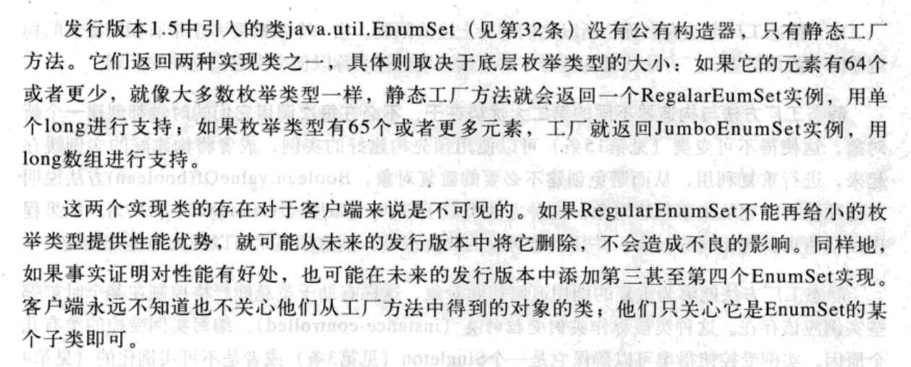
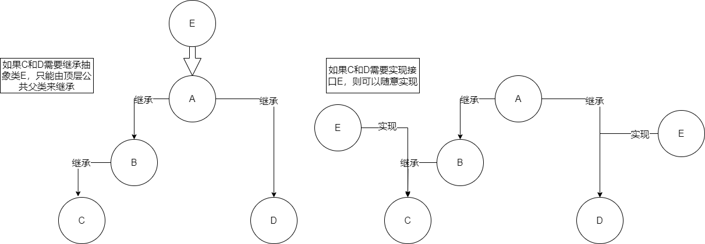

# 序

仅仅编写出能够有效地工作并且能够被别人理解地代码往往是不够的，我们还必须把代码组织成易于修改地形式。

>  It’s typically not enough to produce code that operates effectively and is readily understood by other persons; one must also organize the code so that it is easy to modify. 

本书解决了你的第三种需求：习惯和高效地用法。

本书中大多数规则都源于少数几条基本地原则。清晰性和简洁性最为重要：模块（module，是指任何可重用的软件组件，从单个方法，到包含多个包的复杂系统，都可以是一个模块）的用户永远不应该被模块的行为所迷惑；模块要尽可能小，但又不能太小。代码应该被重用，而不是被拷贝。模块之间的依赖性应该尽可能降到最小。错误应该尽早被检测出来，最好是在编译时刻。

你不应该盲目地遵从这些规则，但是，你应该只在偶尔的情况下，有了充分理由之后去打破这些规则。

本书大部分内容都不是讨论性能的，而是关系如何编写出清晰、正确、可用、健壮、灵活和可维护的程序来。如果能够做到这一点的画，那么要获得所需要的性能往往就相对比较简单了。

# 创建和销毁对象

## 1. 考虑用静态工厂方法代替构造器

> 静态工厂方法并不直接对应于设计模式中的工厂方法
>
> 我理解这里的静态工厂方法是指某个类内部的只能用于生成该类实例的工厂方法，设计模式里的工厂方法类似于spring里面的可以用于生成各种必要的类的实例的工厂方法。

- 静态工厂方法与构造器不同的第一大优势在于，**它们有名称**。

构造器的参数本身没有确切地描述正被返回的对象，那么具有适当名称的静态工厂会更容易使用，产生的客户端代码也更易于阅读。

用户永远也记不住该用哪个构造器，结果常常会调用错误的构造器。

**当一个类需要多个带有相同签名的构造器时，就用静态工厂方法代替构造器，并且慎重地选择名称以便突出它们之间地区别。**

- 静态工厂方法与构造器不同的第二大优势在于，不必在每次调用它们的时候都创建一个新对象。

不可变类可以使用预先构建好的实例，或者将构建好的实例缓存起来，进行重复利用，从而避免创建不必要的重复对象。

> 它还使得不可变的类可以确保不会存在两个相同的实例（a.equals(b) if and only if a\=\=b）如果类保证了这一点，它的客户端就可以使用\=\=操作符来代替equals方法，这样可以提升性能。

- 静态工厂方法与构造器不同的第三大优势在于，它们可以返回原返回类型的任何子类型的对象。

以这种方式隐藏实现类会使API变得非常简洁。

 This technique lends itself to *interface-based frameworks*, where interfaces provide natural return types for static factory methods

但是接口不能有静态方法，因此按照惯例，接口Types的静态工厂方法被放在一个名为Types的不可能实例化的类中，比如java.util.Collections用来实例化各种集合。

Collections静态工厂方法比直接使用32个类的方法要小得多，每种工厂方法实现都对应一个类，这不仅仅使指API数量上的减少，也是概念意义上的减少…使用这种静态工厂方法时要求客户端通过接口来引用被返回的对象，而不是引用实现类，这是一种良好的习惯。



```java
// Service provider framework sketch
// Service interface
public interface Service {
	... // Service-specific methods go here
}
// Service provider interface
public interface Provider {
	Service newService();
}
// Noninstantiable class for service registration and access
public class Services {
    private Services() { } // Prevents instantiation (Item 4)
    // Maps service names to services
    private static final Map<String, Provider> providers = new ConcurrentHashMap<String, Provider>();
    public static final String DEFAULT_PROVIDER_NAME = "<def>";
    // Provider registration API
    public static void registerDefaultProvider(Provider p) {
    	registerProvider(DEFAULT_PROVIDER_NAME, p);
    }
    public static void registerProvider(String name, Provider p){
    	providers.put(name, p);
    }
    // Service access API
    public static Service newInstance() {
    	return newInstance(DEFAULT_PROVIDER_NAME);
    }
    public static Service newInstance(String name) {
        Provider p = providers.get(name);
        if (p == null)
        	throw new IllegalArgumentException(
        		"No provider registered with name: " + name);
        return p.newService();
    }
}
```

- 静态工厂方法与构造器不同的第四大优势在于，在创建参数化类型的实例的时候，它们使代码变得更加简洁
- 静态工厂方法的主要缺点在于，类如果不含公有的或者受保护的构造器，就不能被子类化。
- 静态工厂方法的第二个缺点在于，它们与其他的静态方法实际上没有任何区别。

在API文档中，它们没有像构造器那样在API文档中明确标识出来。可以通过在类或者接口注释中关注静态工厂，并遵守标准的命名习惯，也可以弥补这一劣势，下面是静态工厂方法的一些惯用名称：

> valueOf、of、getInstance、newInstance、getType、newType

切记第一反应就是提供公有的构造器，而不是先考虑静态工厂。

## 2.遇到多个构造器参数时要考虑用构建器

In short, **the telescoping constructor pattern works, but it is hard to write client code when there are many parameters, and harder still to read it.** 

> 多个构造器也行，但是当有许多参数的时候，客户端代码就会很难编写，并且仍然难以阅读。

还有第二种方法，即javabeans模式，在这种模式下调用一个午餐构造器来创建对象，然后调用setter方法来设置每个必要的参数。

但javabean模式自身有着很严重的缺点，因为构造过程被分到了几个调用中，在构造过程中javabean可能处于不一致的状态。

> 还有有时候因为获取属性的逻辑较复杂，导致有的人会把setter分散在代码里的每个角落，非常不适合分析。

与此相关的另一点不足在于，javabean模式组织了把类做成了不可变的可能，这就需要程序员付出额外的努力来确保它的线程安全。

> 在对象构造完成之前，应该不允许实用

幸运的是，还有第三种替代方法，既能保证像重叠构造器模式那样的安全性，也能保证像javabean模式那么好的可读性。这就是builder模式的一种形式。

> lombok提供了@builder注解

```java
// Builder Pattern
public class NutritionFacts {
    private final int servingSize;
    private final int servings;
    private final int calories;
    private final int fat;
    private final int sodium;
    private final int carbohydrate;
    public static class Builder {
        // Required parameters
        private final int servingSize;
        private final int servings;
        // Optional parameters - initialized to default values
        private int calories = 0;
        private int fat = 0;
        private int carbohydrate = 0;
        private int sodium = 0;
        public Builder(int servingSize, int servings) {
            this.servingSize = servingSize;
            this.servings = servings;
        }
        public Builder calories(int val){ calories = val; return this; }
        public Builder fat(int val){ fat = val; return this; }
        public Builder carbohydrate(int val){ carbohydrate = val; return this; }
        public Builder sodium(int val){ sodium = val; return this; }
        public NutritionFacts build() {return new NutritionFacts(this);}
    }
    private NutritionFacts(Builder builder) {
        servingSize = builder.servingSize;
        servings = builder.servings;
        calories = builder.calories;
        fat = builder.fat;
        sodium = builder.sodium;
        carbohydrate = builder.carbohydrate;
    }
}
```

下面就是客户端代码：

```java
NutritionFacts cocaCola = new NutritionFacts.Builder(240, 8).calories(100).sodium(35).carbohydrate(27).build();
```

builder模式可以对其参数强加约束条件，build方法可以检验这些约束条件，在对象域而不是builder域中对它们进行检验，这一点很重要。如果违反了任何约束条件，build方法就应该抛出IllegalStateException，异常的详细信息应该显示出违反了哪个约束条件。

builder利用单独的方法来设置每个参数，你想要多少个可变参数，它们就可以有多少个…

builder模式十分灵活，可以利用单个builder构建多个参数，builder的参数可以在创建对象期间进行调整，也可以随着不同的对象而改变，builder可以自动填充某些域，例如每次创建对象时自动增加序列号。

简而言之，如果类的构造器或者静态工厂中具有多个参数，设计这种类时，builder模式就是种不错的选择，特别是当大多数参数都是可选的时候。

## 3. 用私有构造器或者枚举类型强化singleton属性

从Java1.5起，实现singleton还有第三种方法，只需编写一个包含单个元素的枚举类型：

```java
// Enum singleton - the preferred approach
public enum Elvis {
    INSTANCE;
    public void leaveTheBuilding() { ... }
}
```

这种方法在功能上与公有域方法相近，但是它更加简洁，无偿地提供了序列化机制，绝对防止多次实例化，即使是在面对复杂地序列化或者反射攻击地时候，虽然这种方法还没有广泛采用，但是单元素地枚举类型已经成为实现singleton的最佳方法。

## 4. 通过私有构造器强化不可实例化的能力

比如Math或者Arrays的方式把基本类型的值和数组类型上的相关方法组织起来，或者通过Collections的方式把实现特定接口的对象上的静态方法组织起来，这样的工具类不希望被实例化，实例化对它没有任何意义。

有一些简单的习惯用法可以确保类不可被实例化。由于只有当类不包含显式的构造器时，编译器才会生成缺省的构造器，因此我们只要让这个类包含私有构造器，它就不能被实例化了：

```java
// Noninstantiable utility class
public class UtilityClass {
    // Suppress default constructor for noninstantiability
    private UtilityClass() {
    	throw new AssertionError();
    }
    ... // Remainder omitted
}
```

由于显式的构造器是私有的，所以不可以在该类的外部访问它，AssertionError不是必需的，但是它可以避免不小心在类的内部调用构造器。它保证该类在任何情况下都不会被实例化，这种习惯用法有点违背直觉，好像构造器就是专门设计成不能被调用一样，因此，明智的做法就是在代码种增加一条注释，如上所示。

## 5. 避免创建不必要的对象

…

构造器在每次被调用的时候都会创造一个新的对象，而静态工厂方法则从来不要求这样做，实际上也不会这样做。

在java1.5种有一种创建多余对象的新方法，称作自动装箱，它允许程序员将基本类型和装箱基本类型混用，按需要自动装箱和拆箱。它们在语义上还有这微妙的差别，在性能上也有着比较明显的差别。

> 结论很明显：要优先使用基本类型而不是装箱基本类型，要当心无意识的自动装箱。

小对象的构造器只做很少量的显示工作，所以，小对象的创建和回收动作是非常廉价的，特别是在现代的JVM实现上更是如此，通过创建附加的对象，提升程序的清晰性，间接性和功能性，这通常是件好事。

反之，通过维护自己的对象池来避免创建对象并不是一种好的做法，除非池中的对象是非常重量级的。真正正确使用对象池的典型对象示例就是数据库连接池，建立数据库连接的代价是非常昂贵的，因此重用这些对象非常有意义。

## 6. 消除过期的对象引用

清空对象引用应该是一种例外而不是一种规范行为。消除过期引用最好的方法就是让包含该引用的变量结束其生命周期。

一般而言，只要类是自己管理内存，程序员就应该警惕内存泄漏问题，一旦元素被释放掉，则该元素中包含的任何对象引用都应该被清空。

==内存泄漏的另一个常见来源是缓存==。更为常见的情形则是，“缓存项的生命周期是否有意义”并不是很容易确定，随着时间的推移，其中的项会变得越来越没有价值。在这种情况下，缓存应该时不时地清除掉没用的项，这项清除工作可以由一个后台线程来完成，或者也可以在给缓存添加新条目的时候顺便进行清理。

> 提到了一个WeakHashMap，可以研究一下

由于内存泄漏通常不会表现出明显的失败，所以它们可以在一个系统中存在很多年，往往只有通过仔细检查代码，或者借助于Heap剖析工具才能发现内存泄漏问题。

## 7. 避免使用终结方法

# 对于所有对象都通用的方法

Object所有的非final方法（equals、hashCode、toString、clone和finalize）都有明确的通用约定，因为它们被设计成是要被覆盖的。

## 8. 覆盖equals时请遵守通用规定

许多覆盖equals方法会导致错误，并且后果非常严重，最容易避免这类问题的办法就是不覆盖equals方法。在这种情况下，类的每个实例都只与它自身相等。如果满足以下任意一个条件，这就是所期望的结果。

- 类的每个实例本质上都是唯一的，代表的是活动实体而不是值。
- 不关心类是否提供了”逻辑相等“的测试功能。
- 父类已经覆盖了equals，从父类集成过来的行为对于子类也是合适的
- 类是私有的或是包级私有的，可以确定它的equals方法永远不会被调用

如果类具有自己特有的”逻辑相等“概念（不同于对象等同的概念），而且超类还没有覆盖equals以实现期望的行为，这时我们就需要覆盖equals方法。这通常属于”值类“的情形，值类仅仅是一个表示值的类。

用实例受控的方法（工厂方法返回的类）确保”每个类至多只存在一个对象“的类，枚举类型就属于这种类，对于这样的类而言，逻辑相同与对象等同是一回事，因此Object的equals方法等同于逻辑意义上的equals方法。

在覆盖equals时必须遵守它的通用约定：

- 自反性：非null的引用值x，x.equals(x)必须返回true
- 对称性：非null的引用值x、y，当且仅当y.equals(x)返回true时，x.equals(y)必须返回true
- 传递性：非null的引用值x、y、z，如果x.equals(y)返回true，并且y.equals(z)也返回true，那么x.equals(z)也必须返回true
- 一致性：对于任何非null的引用值x和y，只要equals的比较操作在对象中所用的信息没有被修改，多次调用x.equals(y)就会一致地返回true或false
- 对于任何非null的引用值x，x.equals(null)必须返回false.

有许多类，报错所有的集合类在内，都依赖于传递给他们地对象是否遵守了equals约定。

```java
//对称性问题
// Broken - violates symmetry!
public final class CaseInsensitiveString {
    private final String s;
    public CaseInsensitiveString(String s) {
        if (s == null)
        	throw new NullPointerException();
        this.s = s;
    }
    // Broken - violates symmetry!
    @Override public boolean equals(Object o) {
        if (o instanceof CaseInsensitiveString)
            return s.equalsIgnoreCase(((CaseInsensitiveString) o).s);
        if (o instanceof String) // One-way interoperability!
        	return s.equalsIgnoreCase((String) o);
        return false;
    }
    ... // Remainder omitted
}

    CaseInsensitiveString cis = new CaseInsensitiveString("Polish");
    String s = "polish";
    cis.equals(s)//返回true
    List<CaseInsensitiveString> list = new ArrayList<CaseInsensitiveString>();
    list.add(cis);
 	list.contains(s)//有可能返回false
```

```java
//传递性问题
public class Point {
    private final int x;
    private final int y;
    public Point(int x, int y) {
        this.x = x;
        this.y = y;
    }
    @Override public boolean equals(Object o) {
        if (!(o instanceof Point))
        	return false;
        Point p = (Point)o;
        return p.x == x && p.y == y;
    }
    ... // Remainder omitted
}

public class ColorPoint extends Point {
    private final Color color;
    public ColorPoint(int x, int y, Color color) {
        super(x, y);
        this.color = color;
    }
    ... // Remainder omitted
        // Broken - violates symmetry!
    @Override 
    public boolean equals(Object o) {
        if (!(o instanceof ColorPoint))
        	return false;
        return super.equals(o) && ((ColorPoint) o).color == color;
    }
}

    Point p = new Point(1, 2);
    ColorPoint cp = new ColorPoint(1, 2, Color.RED);
	//p.equals(cp) returns true, while cp.equals(p) returns false.
	
```

```java
//修改后，违反传递性
// Broken - violates transitivity!
@Override 
public boolean equals(Object o) {
    if (!(o instanceof Point))
    	return false;
    // If o is a normal Point, do a color-blind comparison
    if (!(o instanceof ColorPoint))
    	return o.equals(this);
    // o is a ColorPoint; do a full comparison
    return super.equals(o) && ((ColorPoint)o).color == color;
}

    ColorPoint p1 = new ColorPoint(1, 2, Color.RED);
    Point p2 = new Point(1, 2);
    ColorPoint p3 = new ColorPoint(1, 2, Color.BLUE);
```

事实上，这是面向对象语言中关于等价关系地一个基本问题，==我们无法在扩展可实例化的类的同时，即增加新的值组件，同时又保留equals约定，除非愿意放弃面向对象的抽象所带来的优势==。

虽然没有一种令人满意的办法可以即扩展不可实例化的类，又增加值组件，但还是有一种不错的权宜之计：（第16条）复合优先于集成，我们不再让ColorPoint扩展Point，而是在ColorPoint中加入一个私有的Point域，以及一个公有的视图方法，此方法返回一个与该有色点处在相同位置的普通Point对象：

```java
// Adds a value component without violating the equals contract
public class ColorPoint {
    private final Point point;
    private final Color color;
    public ColorPoint(int x, int y, Color color) {
        if (color == null)
        	throw new NullPointerException();
        point = new Point(x, y);
        this.color = color;
    }
    /**
    * Returns the point-view of this color point.
    */
    public Point asPoint() {
    	return point;
    }
    @Override 
    public boolean equals(Object o) {
        if (!(o instanceof ColorPoint))
            return false;
        ColorPoint cp = (ColorPoint) o;
        return cp.point.equals(point) && cp.color.equals(color);
    }
    ... // Remainder omitted
}
```

注意，你可以在一个抽象类的子类中增加新的值组件，而不会违反equals约定…不懂

 For example, you could have an abstract class Shape with novalue components, a subclass Circle that adds a radius field, and a subclass Rectangle that adds length and width fields. Problems of the sort shown above won’t occur so long as it is impossible to create a superclass instance directly。

无论类是否是不可变的，都不要使equals方法依赖于不可靠的资源。

如果instanceof的第一个操作数为null，那么不管第二个操作数是哪种类型，instanceif操作符否指定应该返回false，所以不需要单独的null检查。

结合所有这些要求，得出了以下实现高质量equals方法的诀窍：

1. 使用==操作符检查”是否为这个对象的引用“，如果是则返回true，这是一种性能优化，如果比较操作很重就值得这么做
2. 使用instanceof操作符检查”参数是否为正确的类型“。
3. 把参数转换为正确的类型
4. 对于该类重的每个”关键“域，检查参数中的域是否与该对象中对应的域相匹配

对于既不是float也不是double类型的基本类型域，可以使用==操作符进行比较；

对于对象引用域，可以递归调用equals方法；

对于float域，可以使用Float.compare方法；

对于double域，则使用Double.compare方法；

对于float和double域进行特殊的处理是有必要的，因为存在Float.NaN、-0.0f以及类似的double常量；

对于数组域，则要把以上这些指导原则应用到每个元素上，如果数组域中的每个元素都很重要，就可以是哦那个Arrays.equals方法。

有些对象引用域包含null可能是合法的，所以为了避免导致空指针异常，则使用下面的习惯来比较这样的域：

```java
(field == null ? o.field == null : field.equals(o.field))
```

域的比较顺序可能会影响equals方法的性能，为了获得最佳的性能，应该最先比较最有可能不一致的域，或者是开销最低的域，

5. 当你编写完成了equals方法之后，应该为你及三个问题：它是否是对称的，传递的，一致的

最后一些告诫：

6. 覆盖equals时总要覆盖hashcode
7. 不要企图让equals方法过于只能
8. 不要将equals声明中的object对象替换为其他的类型

```java
//问题在于这个方法没有覆盖Object.equals，因为他的参数应该是Object类型，相反，它重载（而不是覆盖）了Object.equals
//只要这两个方法返回同样的结果，那么这就是可以接受的，在某些特定的情况下，它也许能够稍微改善性能，但是与增加的复杂性相比，这种做法是不值得的
//@Override注解可以防范这种错误
public boolean equals(MyClass o) {
	...
}
```

## 9. 覆盖equals时总要覆盖hashcode

在每个覆盖了equals方法的类中，也必须覆盖hashcode方法，如果不这样做的话，就会违反Object.hashCode的通用约定，从而导致该类无法结合所有基于散列的集合一起正常运作，这样的集合包括HashMap、HashSet和Hashtable。

hashcode必须排除equals比较计算中没有用到的任何域，否则很有可能违反hashcode约定的第二条。

不要试图从散列码计算中排除掉一个对象的关键部分来提高性能。

## 10. 始终要覆盖toString

toString的约定进一步指出，“建议所有的子类都覆盖这个方法。”这是一个很好的建议，真的！

提供好的toString实现可以使类使用起来更加舒适。在实际应用中，toString方法应该返回对象中包含的所有值得关注的信息。

无论是否指定toString返回字符串的格式，都应该为toString返回值中包含的所有信息，提供一种编程式的访问途径——Setter Getter

## 11. 谨慎地覆盖clone

实际上，clone方法就是另一个构造器：你必须确保它不会伤害到原始的对象，并确保正确地创建被克隆对象中的约束条件(invariant)。

另一个实现对象拷贝的好办法是提供一个拷贝构造器或拷贝工厂。拷贝构造器只是一个构造器，它唯一的参数类型是包含该构造器的类，例如：

```java
public Yum(Yum yum);
```

拷贝工厂是类似于拷贝构造器的静态工厂：

```java
public static Yum newInstance(Yum yum);
```

拷贝构造器的做法，及其静态工厂方法的变形，都比cloneable/clone方法具有更多的优势：它们不依赖于某一种很有风险的、语言之外的对象创建机制；它们不要求遵守尚未制定好文档的规范；它们不会与final域的正常使用发生冲突……因此，使用拷贝构造器或者拷贝工厂来代替clone方法时，并没有放弃接口的功能特性。

更进一步，拷贝构造器或者拷贝工厂可以带一个参数，参数类型是通过该类实现的接口。例如你有一个hashset，并且希望把它拷贝成一个treeset。clone方法无法提供这样的功能，但是用转换构造器很容易实现：new TreeSet(s)。

## 12. 考虑实现comparable接口

事实上java类库中的所有值类(value classes)都实现了comparable接口，如果你正在编写一个值类，它具有非常明显的内在排序关系，比如按字母顺序，按数值顺序或者按年代顺序，那你就应该坚决考虑实现这个接口。

当该对象小于、等于或大于指定对象的时候，分别返回一个负整数、零或者正整数。如果由于指定对象的类型而无法与该对象进行比较，则抛出classcastexception。

• The implementor must ensure sgn(x.compareTo(y)) == -sgn(y.compareTo(x)) for all x and y. (This implies that x.compareTo(y) must throw an exception if and only if y.compareTo(x) throws an exception.)

• The implementor must also ensure that the relation is transitive:(x.compareTo(y) > 0 && y.compareTo(z) > 0) implies x.compareTo(z) > 0.

• Finally, the implementor must ensure that x.compareTo(y) == 0 implies that sgn(x.compareTo(z)) == sgn(y.compareTo(z)), for all z.

• It is strongly recommended, but not strictly required, that (x.compareTo(y)== 0) == (x.equals(y)). Generally speaking, any class that implements the Comparable interface and violates this condition should clearly indicate this fact. The recommended language is “Note: This class has a natural ordering that is inconsistent with equals.”

# 类和接口

## 13. 使类和成员的可访问性最小化

要区别设计良好的模块与设计不好的模块，最重要的因素在于，这个模块对于外部的其他模块而言，是否隐藏其内部数据和其他实现细节。设计良好的模块会隐藏所有的实现细节，把它的API与它的实现清晰地隔离开来。

信息隐藏之所以非常重要有许多原因，其中大多数理由都源于这样一个事实：它可以有效地解除组成系统地各模块之间地耦合关系，使得这些模块可以独立的开发、测试、优化、使用、理解和修改。

第一规则很简单：尽可能的使每个类或者成员不被外界访问，换句话说，应该使用与你正在编写的软件的对应功能相一致的、尽可能最小的访问级别。

## 14. 在公有类中使用访问方法而非公有域

> 如果类可以在它所在的包外部进行访问，就提供访问方法，以保留将来改变该类的内部表示法的灵活性。
>
> 如果类是包级私有的，或者是私有的嵌套类，直接暴露它的数据域并没有本质的错误——假设这些数据域确实描述了该类所提供的抽象。

总之，公有类永远都不应该暴露可变的域，虽然还是有问题，但是让公有类暴露不可变的域其危害比较小，但是有时候会需要用包级私有的或者私有的嵌套类来暴露域，无论这个类是可变还是不可变的。

## 15. 使可变性最小化

存在不可变的类有许多理由：不可变的类比可变类更加易于设计、实现和使用。他们不容易出错，且更加安全。

不可变对象本质上是线程安全的，它们不要求同步。

不仅可以共享不可变对象，甚至也可以共享它们的内部信息。

不可变类真正唯一的缺点是，对于每个不同的值都需要一个单独的对象。

事实上应该是这样：没有一个方法能够对对象的状态产生外部可见的改变。

总之，坚决不要为每个get方法编写一个相应的set方法，除非有很好的理由要让类称为可变的类，否则就应该是不可变的。

构造器应该创建完全初始化的对象，并建立起所有的约束关系。不要在构造器或者静态工厂之外再提供公有的初始化方法，除非有令人信服的理由必须这么做。

## 16. 复合优先于集成

与方法调用不同的是，继承打破了封装性。

导致子类脆弱的一个相关的原因是，它们的超类在后续的发行版本中可以获得新的方法。

不用扩展现有的类，而是在新的类中增加一个私有域，它引用现在类的一个实例。这种设计被称作“复合”，因为现有的类变成了新类的一个组件，新类中的每个实例方法都可以调用被包含的现有类实例中对应的方法，并返回它的结果，这被称为转发，新类中的方法被称为转发方法。这样的到的类将会非常稳固，它不依赖于现有类的实现细节，即使现有的类添加了新的方法，也不会影响新的类。

简而言之，继承的功能非常强大，但是也存在诸多问题，因为它违背了封装原则。只有当子类和超类之间确实存在子类型关系时，使用继承才是恰当的。即便如此，如果子类和超类处在不同的包中，并且超类并不是为了继承而设计的，那么继承将会导致脆弱性，为了避免这种脆弱性，可以用复合和转发机制来代替继承，尤其是当存在适当的接口可以实现包装类的时候，包装类不仅比子类更加健壮，而且功能也更加强大。

## 17.要么为继承而设计，并提供文档说明，要么就禁止继承

## 18. 接口优于抽象类

因为java只允许单继承，所以抽象类作为类型定义收到了极大的限制。

- 现有的类可以很容易被更新，以实现新的接口：一般来说，无法更新现有的类来扩展新的抽象类，如果你希望让两个类扩展同一个抽象类，就必须把抽象类放到类型层次的高处，以便这两个类的一个祖先成为他的子类。遗憾的是，这样做会间接伤害到类层次，迫使这个公共祖先的所有后代都扩展这个新的抽象类，无论它对于这些后代类是否合适。



- 接口是定义mixin（混合类型）的理想选择。
- 接口允许我们构造非层次结构的类型框架。例如，假设我们有一个接口代表一个singer，另一个接口代表一个songwriter，在现实生活中，有些歌唱家本身也是作曲家，因为我们使用了接口而不是抽象类来定义这些类型，所以对于单个类而言，它同时实现singer和songwriter是完全允许的。实际上，我们可以定义第3个接口，它同时扩展了singer和songwriter，并添加了一些适合于这种组合的新方法。

虽然接口不允许包含方法的实现，但是使用接口来定义类型并不妨碍你为程序员提供实现上的帮助。通过对你导出的每个重要接口都提供一个抽象的骨架实现类，把接口和抽象类的优点结合起来。接口的作用仍然是定义类型，但是骨架实现类接管了所有与接口实现相关的工作。

简而言之，接口通常是定义允许多个实现的类型的最佳途径。这条规则有个例外，即当演变的容易性比灵活性和功能更重要的时候。在这种情况下，应该使用抽象类来定义类型，但前提是必须理解并且可以接受这些局限性。如果你道出了一个重要的接口，就应该坚决考虑同时提供骨架实现类。最后，应该尽可能谨慎地设计所有的公有接口，并通过编写多个实现来对它们进行全面地测试。

## 19. 接口只用于定义类型

如果要导出常量，可以有几种合理的选择方案。如果这些常量与某个现有的类或者接口紧密相关，就应该把这些常量添加到这个类或者接口中。例如在java平台类库中所有的数值包装类，如Integer和Double都导出来MIN_VALUE和MAX_VALUE常量。如果这些常量最好被看作枚举类型的成员，就应该用枚举类型来导出这些常量。否则应该使用不可实例化的工具类来导出这些常量。

简而言之，接口应该只被用来定义类型，它们不应该被用来导出常量。

## 20.类层次优于标签类

```java
// Tagged class - vastly inferior to a class hierarchy!
class Figure {
    enum Shape { RECTANGLE, CIRCLE };
    // Tag field - the shape of this figure
    final Shape shape;
    // These fields are used only if shape is RECTANGLE
    double length;
    double width;
    // This field is used only if shape is CIRCLE
    double radius;
    // Constructor for circle
    Figure(double radius) {
        shape = Shape.CIRCLE;
        this.radius = radius;
    }
    // Constructor for rectangle
    Figure(double length, double width) {
        shape = Shape.RECTANGLE;
        this.length = length;
        this.width = width;
    }
    double area() {
        switch(shape) {
            case RECTANGLE:
            	return length * width;
            case CIRCLE:
            	return Math.PI * (radius * radius);
            default:
            	throw new AssertionError();
        }
    }
}
```

改成

```java
// Class hierarchy replacement for a tagged class
abstract class Figure {
    abstract double area();
}

class Circle extends Figure {
    final double radius;
    Circle(double radius) { this.radius = radius; }
    double area() { return Math.PI * (radius * radius); }
}

class Rectangle extends Figure {
    final double length;
    final double width;
    Rectangle(double length, double width) {
        this.length = length;
        this.width = width;
    }
    double area() { return length * width; }
}

class Square extends Rectangle {
    Square(double side) {
    	super(side, side);
    }
}
```

## 21. 用函数对象表示策略

简而言之，函数指针（实际上就是fuctionInterface）的主要用途就是实现策略模式。为了在Java中实现这种模式，要声明一个接口来表示该策略，并且为每个具体策略声明一个实现了该接口的类。当一个具体策略只被使用一次时，通常使用匿名类来声明和实例化这个具体策略类。当一个具体策略是设计用来重复使用的时候，它的类通常就要被实现为私有的静态成员类，并通过公有的静态final域被导出，其类型为该策略接口。

## 22.  优先考虑静态成员类

嵌套类有4种：

- 静态成员类
- 非静态成员类
- 匿名类
- 局部类

除了第一种之外，其他三种都被称为内部类。

###  静态成员类

 静态成员类是最简单的一种嵌套类，最好把它看作是普通的类，只是碰巧被声明在另一个类的内部而已，**它**只能访问外部类static成员或方法**【静态只能访问静态】**，包括那些声明为私有的成员。静态成员类是外围类的一个静态成员，与其他的静态成员一样，也遵守同样的可访问性规则。如果它被声明为私有的，它就只能在外围类的内部才可以被访问，等等。

静态成员类的一种常见用法是作为公有的辅助类，仅当与它的外部类一起使用时才有意义。例如考虑一个枚举，它描述了计算器支持的各种操作。

### 非静态成员类

从语法上讲，静态成员类和非静态成员类之间的唯一的区别是，静态成员类的声明中包含修饰符static，尽管它们的语法非常相似。但是这两种嵌套类有很大的不同。非静态成员类的每个实例都隐含着与外围类的一个外围实例相关联。在非静态成员类的实例方法内部，可以调用外围实例上的方法，或者利用修饰过的this构造获得外围实例的引用。

> 如果嵌套类的实例可以在它外围类的实例之外独立存在，这个嵌套类就必须是静态成员类；在没有外围实例的情况下，要想创建非静态成员类的实例是不可能的。

通常情况下，当在外围类的某个实例方法的内部调用非静态成员类的构造器时，这种关联关系被自动建立起来。使用表达式enclosingInstance.new MemeberClass(args)来手工建立这种关联关系也是有可能的，但是很少使用。

非静态成员类的一种常见用法是定义一个Adapter。它允许外部类的实例被看作是另一个不相关的类的实例。例如，Map接口的实现往往使用非静态成员类来实现它们的集合视图，同样的，诸如Set和List这种集合接口的实现往往也是用非静态成员类来实现它们的迭代器：

```java
// Typical use of a nonstatic member class
public class MySet<E> extends AbstractSet<E> {
    ... // Bulk of the class omitted
    public Iterator<E> iterator() {
    return new MyIterator();
    }
    private class MyIterator implements Iterator<E> {
    ...
    }
}
```

如果声明成员类不要求访问外围实例，就要始终把static修饰符放在它的声明中，使它成为静态成员类，而不是非静态成员类。

### 匿名类

匿名类的一种常见用法是动态地创建函数对象，例如sort方法利用匿名的comparator实例，另一种常见用法是创建过程对象，比如runnable、thread或者timertask实例。第三种常见的用法是在静态工厂方法的内部。

# 泛型
