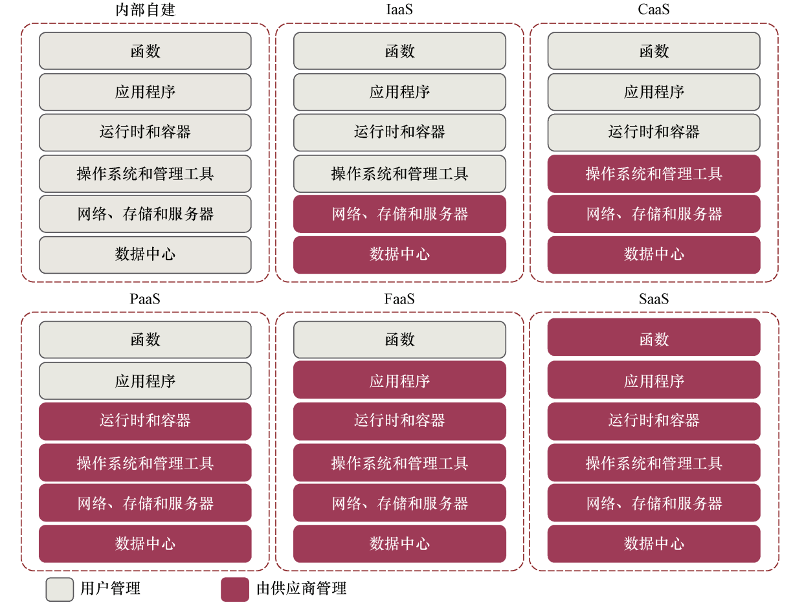
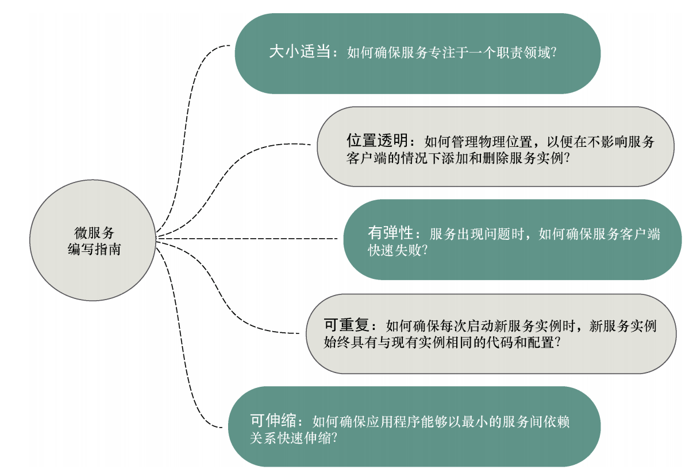

要构建高度可伸缩的高度冗余的应用程序， 我们需要将应用程序分解成可以互相独立构建和部署的小型服务。如果将应用程序“分解”为较小的服务，并将它们从单体制品中转移出来，那么就可以构建具有下面这些特性的系统。  

- 灵活性——可以将解耦的服务进行组合和重新安排，以快速交付新的功能。一个正在使用的代码单元越小，更改越不复杂，测试部署代码所需的时间越短。

- 有弹性——解耦的服务意味着应用程序不再是单个“泥浆球”，其中一部分应用程序的降级会导致整个应用程序失败。故障可以限制在应用程序的一小部分中，并在整个应用程序遇到中断之前被控制。这也使应用程序在出现不可恢复的错误的情况下能够优雅地降级。

- 可伸缩性——解耦的服务可以轻松地跨多个服务器进行水平分布，从而可以适当地对功能 / 服务进行伸缩。单体应用程序中的所有逻辑是交织在一起的，即使只有一小部分应用程序是瓶颈， 整个应用程序也需要扩展。小型服务的扩展是局部的，成本效益更高。为此，当我们开始讨论微服务时，请记住：

  > 小型的、简单的、解耦的服务 = 可伸缩的、弹性的、灵活的应用程序  

康威定律（由 Melvin R. Conway 在 1968 年 4 月的文章“How do Committees Invent”中首次提到）指出“设计系统的组织其产生的设计等价于组织间的沟通结构”。基本上，它所表明的是，团队内部以及与其他团队之间的沟通方式直接反映在他们生产的代码中。  

如果我们反向应用康威定律，也称为逆康威策略（ inverse Conway maneuver），并基于微服务架构设计公司结构，那么通过创建松耦合的自治团队来实现微服务，就能改善应用程序的通信、稳定性和组织结构。  

基于云的微服务的优势是以弹性的概念为中心。 云服务供应商允许开发人员在几分钟内快速启动新的虚拟机和容器。如果服务的容量需求下降，开发人员可以关闭容器，从而避免产生额外的费用。使用云供应商部署微服务可以显著地提高应用程序的水平可伸缩性（添加更多的服务器和服务实例）。

服务器弹性也意味着应用程序可以更具弹性。 如果其中一个微服务遇到问题并且处理能力正在不断地下降，那么启动新的服务实例可以让应用程序保持足够长的存活时间，让开发团队能够从容而优雅地解决问题  

编写或构建微服务时需要考虑的一些准则 ：

- 大小适当——如何确保微服务的大小适当，这样才不会让微服务承担太多的职责。请记住，服务大小适当，就能快速更改应用程序，降低整个应用程序中断的总体风险。
- 位置透明——如何管理服务调用的物理细节。在一个微服务应用程序中，多个服务实例可以快速启动和关闭。
- 有弹性——如何通过绕过失败的服务，确保采取“快速失败”的方法来保护微服务消费者和应用程序的整体完整性。
- 可重复——如何确保提供的每个新服务实例与生产环境中的所有其他服务实例具有相同的配置和代码库。
- 可伸缩——如何建立一种通信，使服务之间的直接依赖关系最小化，并确保可以优雅地扩展微服务  
