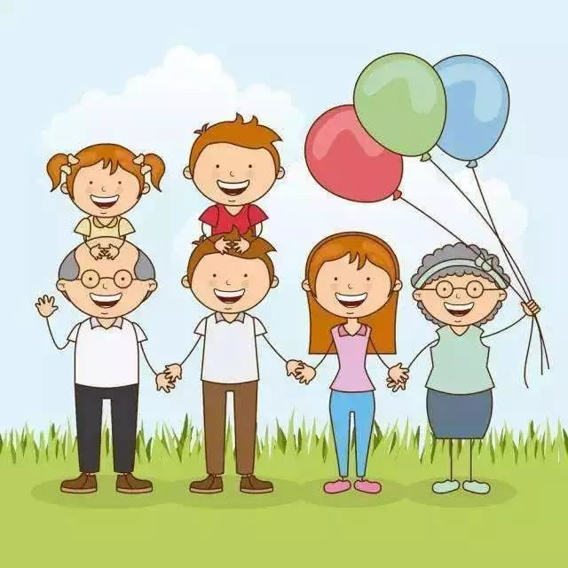
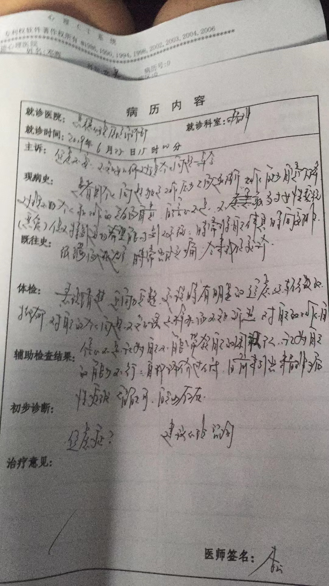
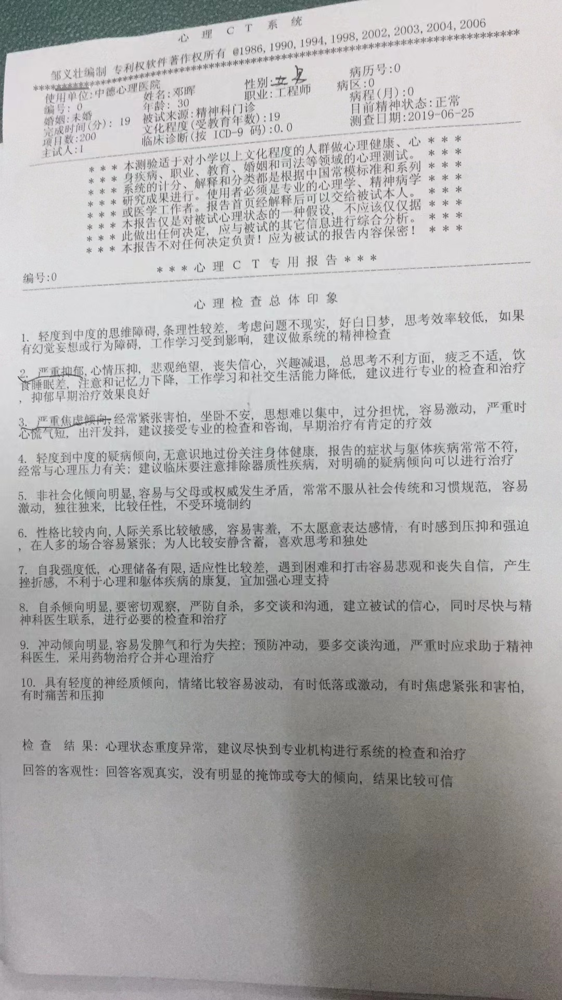

# 前置

“搅嘴”这个词小时候经常听到，大意是指没有依据的辩驳。

这个词常常被安在小孩子身上，倒也不无道理，因为小孩子的逻辑有时候确实天马行空难以捕捉，所以当一个成年人不理解或是懒得去理解孩子的想法时，一句“别搅嘴”就可以解决一切，孩子往往都会乖乖闭嘴。

和体罚式管教一样，我认为这其实都是一种经典的、承认作为成年人的自己束手无策之后的“偷懒式”教育，毕竟有这种能快速便捷“解决”问题的“万能钥匙”，我们为啥还要去费力费神地学习什么所谓的教育手段呢？打一下骂一下威胁一下就解决了嘛，多好多高效，至于孩子的想法，那不重要……希望您二位能够听出其中的反讽。

所以我要先感谢您二位愿意听听我这个小儿的一面之词，如果不愿意，也尽可当我是在“搅嘴”。

# 为什么要写

我知道常年的缺乏沟通使我们之间越来越不了解彼此，所以我听着你们口中对我所谓的理解和认知，往往有苦说不出。我不能直接喊出“不，我不是那样的！你们错了”，因为我认为越是激烈的否认往往越是来自于内心的承认，就像当丑陋且自卑的人听到对他外貌的攻击往往都会反应强烈一样。

我必须承认我对你们失望过，就像我也曾让你们失望过一样，这种相互的负面情绪加上不愿拉下脸做出“低头”姿态的偏执，使得一度我们之间的关系越来越疏远。

但我认为是时候做出积极的改变了，我们必须摒弃自己受害者的角色，不怨天尤人，积极地面对一切，对自己的生活和家庭负责，其中最重要的一环就是放下成见，主动沟通。我也相信现在就是最合适的时机，派派的出生，无疑是家里最近的一大喜事，但越是在一片祥和的背景下，越是容易埋藏着巨大的隐患，抱着一丝杞人之忧与责任心，我觉得我有必要来泼这盆冷水。

# 怎么写

落笔时，我尽量使自己的心态平和客观，避免我写下一篇像是讨伐或批斗的文章。

我秉持着一个观点——“一个人的缺点往往属于他所处的时代（环境），一个人的优点往往属于他自身”，所以后文可以认为是对那个时代或环境的反驳，而不是针对二位本身。若有三两引起不适，先行致歉。

# 正文

## 分歧是常态

开始之前，先跟二位分享两篇小文。

一篇来自于黎巴嫩裔美国诗人、作家、画家，卡里·纪伯伦。

> 你的儿女，其实不是你的儿女。
>
> 他们是生命对于自身渴望而诞生的孩子。
>
> 他们借助你来到这世界，却非因你而来，他们在你身旁，却并不属于你。
>
> 你可以给予他们的是你的爱，却不是你的想法，因为他们有自己的思想。
>
> 你可以庇护他们的是他们的身体，却不是他们的灵魂，因为他们的灵魂属于明天，属于你做梦也无法到达的明天。
>
> 你可以拼尽全力，变得像他们一样，却不要让他们变得和你一样。
>
> 因为生命不会后退，也不在过去停留。
>
> ————卡里·纪伯伦

一篇来自于胡适写给儿子的信。

> 我养育你，并非恩情，
>
> 只是血缘使然的生物本能；
>
> 所以，我既然无恩于你，你便无需报答我。
>
> 反而，我要感谢你，
>
> 因为有你的参与，
>
> 我的生命才更完整。
>
> 
>
> 我只是碰巧成为了你的父亲，你只是碰巧成为了我的女儿和儿子，
>
> 我并不是你的前传，你也不是我的续篇。
>
> 
>
> 你是独立的个体，
>
> 是与我不同的灵魂；
>
> 你并不因我而来，
>
> 你是因对生命的渴望而来。
>
> 你是自由的，
>
> 我是爱你的；
>
> 但我绝不会“以爱之名”，去掌控你的人生。
>
> ——胡适写给儿子的信

我们必须承认，作为两代人我们的观念之间有所不同，这是非常普遍，也理所当然的事，而我认为这也是您二位送我远渡他乡求学的初心。试问一句，若我求学多年，却依然如同出发时的模样，那求学的意义何在？留在故乡岂不美哉？求学的意义不就是走出自己的舒适圈去见证世界的多样性，不就是汲取百家之言，不断地磨砺和雕刻自己，不断地学习和更新自己，学会独立思考，质疑权威，不随波逐流，不人云亦云吗？为什么会期盼自己的孩子在阅历了千帆之后，却依然如同未出航时一般，和自己高度保持一致呢？这岂不是历史的倒车，这岂不是停滞不前，如同水中之木，不进则退吗？

这样的现实残酷但不容置疑，我们必须接受，就像我能预想到的，将来我们和派派之间也必然会存在这样思想的鸿沟，难以逾越。因此唯有抱着和而不同的态度，才能让家庭保持美满和睦，家庭不是君主专制，有人才有家。

但我们也不必灰心沮丧，现在改变也为时不晚，这篇文章就是我们沟通最好的起点。在开始之前，我真挚地希望与我对话的是两位真正意义上的的长者，我会寄望于他拥有这些珍贵的品质——从容不迫，言行间透露着岁月的沉淀和人生的阅历，眼神中蕴含着深邃的智慧和慈悲的关怀…而不是仅仅是一位痴长年岁的老人。

以下我会就一些我们主要的观念分歧分类作出回应，请先原谅我平日里的寡言，我不反驳并不是代表同意，而是意识到我们没有能够持续展开讨论的基础共识，且也需要照顾到二位的情绪、身体以及在不同场合的人情薄面，只能以这种方式做出回应。

## 权威

在我与您二位一起成长的岁月里，我注意到一个细节，

## 教育

## 人生

### ”什么年纪就该干什么事“

我不同意这句话，有独立认知的人也不会同意这句话，将来派派会更加不同意这句话。

这句话地潜在含义是——人生有模板，甚至有所谓”成功“的模板和”失败“的模板，有一个所谓的”标准“去衡量人生的”成功“与”失败“。不，我们只有我们自己手上的模板，大家都只活了一次，没有人特别有资格教别人怎么活，尤其是，我们都不了解是否存在有其他模板的时候。

我理解您二位在潜江有着一点点的影响力，于是你们在自己的脑海里定义了一种”成功“的、”对“的人生模板，那确实是一个很不错的模板，非常值得我们分析和借鉴。可问题是，那不是唯一的模板！或者说，不去了解其他人的追求和理想（就是之前所谓的”标准“），你们的模板的借鉴意义有多大，本身就是一个问题。

”标准“对每个人是不一样的。我承认，在这个充斥着物欲的时代，几乎所有人都把金钱和地位看成一个人的”成功“标准，一个人若是获得了权力和金钱，那他的人生模板就很有可能被认为是”成功“的模板。

“穿这种奇怪的衣服干嘛，学生就该穿得规规矩矩的”

“我们懂得不比你多？女孩子还是报文科比较好”

“赶紧把头发染回来，像什么样子”

“志愿还是填省内吧，离家近”

“当然要考公务员啦，女生最重要的就是稳定”

“喜欢有什么用，多少人想进你单位还进不去呢”

…我最终活成了一个“听话”的孩子，直到某一天真的轮到自己做选择时，我却从来没有问过自己想要什么，就其他人在替我做决定时也没问过我一样，我活成了一个“讨好型”人格，活在了别人的眼里，太在意别人的看法，忘记了自己的悲喜快乐也很重要，忘记了怎么去选择自己喜欢的人生，所以我总是不开心，总是容易被左右，因为我从来没有想过自己想要什么，因为父母也禁止我这么想——毕竟他们的模板已经将我的人生规定好了。

人生没有标准答案，随心所选，皆可得分。

——其实你们也没有听上一辈的话，你们也没有活成“标准模板”——

——名利的模板有什么危害？举例子——

——各种模板的成功和好处，举例子——

组成家庭是一种

家庭和睦算不算成功？内心的平和，不以物喜不以己悲算不算成功？身体健康算不算成功？兴趣爱好广泛且学得不错算不算成功？从事自己喜欢的工作算不算成功？有一帮志同道合的的朋友算不算成功？

相反，如果一切真以名利为中心，借用《高效能人士地七个习惯》的一段话：

>必须靠名利和物资来肯定自我的那些人，必定终日忧心忡忡，患得患失。面对名气、地位或者条件好过自己的人就觉得相形见绌，面对稍逊自己的人又趾高气扬。自我评价和自我认识如此飘忽不定，起落频繁，却还要固执地守住自己地资产、所有物、有价证券、地位和名誉不放。难怪有人会在股票大跌或政坛失意后一死了之。

同时我也必须表达我的失望，在我眼里，你们对人生的追求也就止于名利和地位了。

相信我，到了派派那一代，会存在比我所描述地更自由、更开放的人生观

## 家庭

## 工作

## 其他

我们爱派派，我相信您二位也非常地爱她，在我们的眼中，她被如此之多的爱所包围，应该是无比幸福的，然而事实可能并不随我们所愿。

就像我作为子女从您二位那里收获到的爱意一样，大部分时候的我确实是幸福的，但有时我也会感到烦恼，沉重，抗拒，无法呼吸，最严重的时候，相信您二位也知道，我不得已去咨询了心理医生。下面这张图是第一次我在医院作心理测试时的检查结果，我怕您二位担心所以一直不敢给你们看，但现在我觉得必须让你们明白事情的严重性。

你们当然可以怀疑心理类疾病是伪科学，都是小题大做，都是一些敏感的人的胡思乱想，都是矫情，就像我印象中你们说过的那句话一样。

> 你怎么会有这种想法（问题）？你怎么就不能和其他人一样？他们怎么没这个想法（问题）？

 如果让我现在回答你们这个问题，我会说是的，就是会有这种想法（问题），就是无法和其他人一样，我也不知道他们为什么没这个想法，但是我知道我有，因为我知道我病了。所以当你们问我这个问题时，就像在问一个被打断了腿的人——你为什么不能像其他人一样跑步？

我很庆幸我在慢慢好转，这花费了我太多太多的时间和勇气，但我觉得我是幸运的，因为我知道太多太多的人走不出来（比如歌手李玟coco）。有一次访谈时，我被问到“你觉得你做过最让自己骄傲的事是什么？”，我回答说，“我终于接受了自己”。

但是不重视的后果和代价是真真实实存在的，

幸福的定义从来不会止于物资和
 我们会抱着这样的教育理念来教育，派派的人生属于她自己，应该由她自己来开创和探索，不应该被任何人定义，包括我和佳佳。我们不一定完全正确，但我们愿意广纳真言，愿意倾听和共情，即使逆耳即使与我们的想法相悖。我认为这是我们最大的优点。

# 最后
