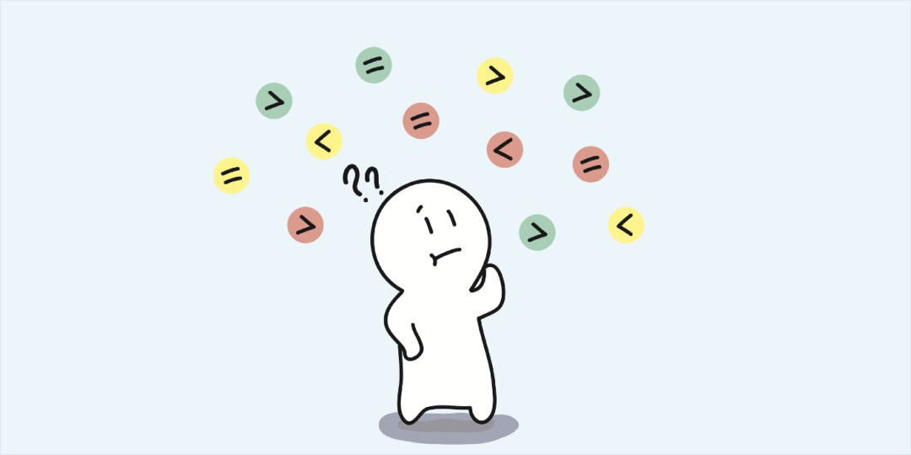
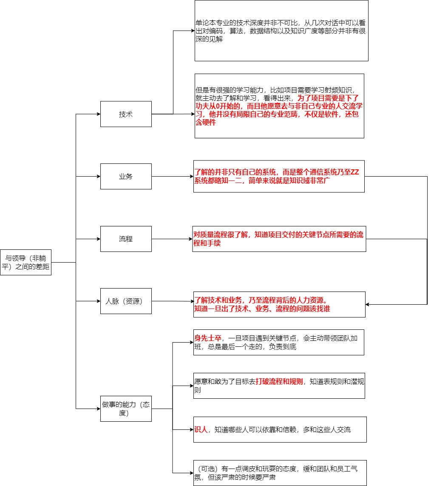
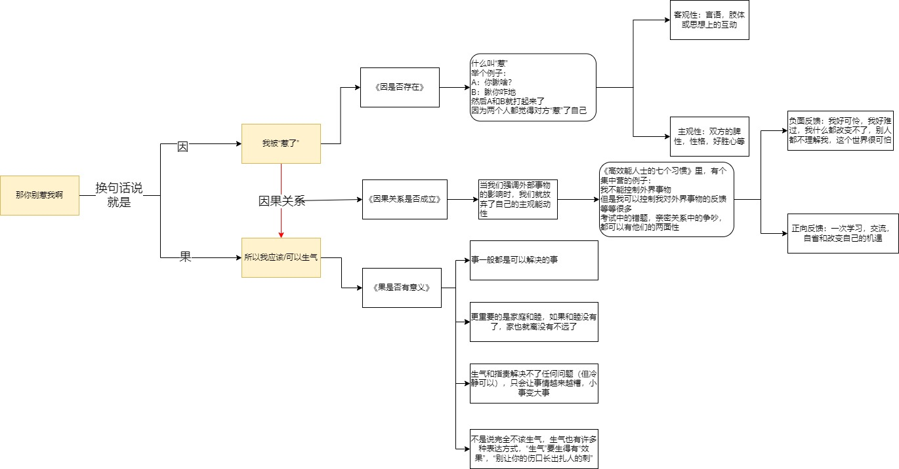

这篇文章记录每日生活中的反思与想法，持续更新。

有时候会有一些灵感、思索和心得，但是只停留在了脑海里，现在觉得应该记录下来，形成文字，目的在于：

- 方便回顾

- 训练自己文字输出的能力

- 锻炼自己逻辑思维的能力（不光自己能明白，也要让别人明白）

  > 运用职场逆袭的逻辑表达的技术

# 2023.05.14

## 反思

- 遇到了领导，习惯性地会心态不稳，将手里的书藏了一下——其实没有必要，心态要好，学习并不是一件需要遮掩的事（但野心有时候是）
- 对于业务问题，也要多沟通交流，不要闭门造车，集思广益，总有你能学习的地方，然后就是不仅要向比你强的人请教，也要向新人请教，有时候能打开一些新的思路
- 业务能力强是一方面，能在关键场合说上话也很关键，有时候在一些关键人物心里留下印象比你埋头苦干得到的收益更多，要争取在关键场合发言的机会（当然也不要乱出头）

## 学习

1. 项目在编码时没有构建单元测试的习惯，以至于对于很多bug都是重复出现，如果能构建代码的单元测试，每次版本发布都run一遍，就可以极大地减少bug产出，这需要两个东西：

- 单元测试代码
- 模拟的三方资源（数据库、注册中心、缓存、消息队列…）

3. MockMVC能模拟外部web请求
4. 有个Testme的IDEA插件好像不错，改天研究一下
5. junit的使用方法还是要学习一下，哪怕以后到了外面不要因为不写测试用例被diss
6. spotbug插件检测出了很多异常！抽时间一定要改了！

## 记录

butterfly的样式文件在themes\butterfly\source\css\_layout，可以改！哇哈哈哈我的Ellie终于有脸了！

# 2023.05.15

## 反思

- 昨晚凌晨一点睡眠，导致以下几个问题

1. 精神状态不佳——影响工作，锻炼的状态，甚至直接影响身体
2. 早上迟到——耽误了其他同事的工作进度，以及个人形象（重要）

# 2023.05.22

## 反思

部署库和开发库一定要分开！！如果开发的服务和部署的服务都连在一个库，会导致一些定时任务重复处理，比如定时统计，然后导致一些查询unique的场景代码失效

# 2023.05.23

## 反思

1. 很急（节点或者里程碑降至）或者很重要的项目不适合新人参与，因为他们需要的更多的是学习和成长的空间和时间，如果将之前所描述的项目赋予新人，出现风险的可能性很大，因为其他人都自顾不暇而无法对新人的工作成果做出及时的审查，很有可能导致新人做出无效工作或需要补救的工作。
2. 新人更适合在项目初期加入或者加入有充裕时间节点的项目，需要有经验的工程师带领他们完成几项工作并对其工作进行严格审查和指正（例如code review），在经过一段时间的磨练后才适合交付更重要的任务。
3. 团队里需要有一位技术总监之类的角色，对于每个技术人员的能力做出评估（并不是总结性地谁强谁弱，而是说谁比较擅长前端，谁比较擅长后端，谁比较擅长数据库之类的），这样才能在项目有技术需求的时候，提供符合项目需求的准确的人力资源，而不是瞎指派。

# 2023.05.24

## 反思

我们的性能测试和性能指标就是打马虎眼，根本没有起到作用，但一款线上产品如果没有经过性能测试，那它就好比是一颗定时炸弹，你不知道它什么时候会出现问题，你也不清楚它能承受的极限在哪儿。  

有些性能问题是时间累积慢慢产生的，到了一定时间自然就爆炸了；而更多的性能问题是由
访问量的波动导致的，例如，活动或者公司产品用户量上升；当然也有可能是一款产品上线
后就半死不活，一直没有大访问量，所以还没有引发这颗定时炸弹。  

**必须要做性能测试！！！**

# 2023.05.25

## 反思

### 关于睡前玩手机…

1. 为什么要戒掉这个坏习惯？

   **影响睡眠（导致第二天计划报废），导致赖床和迟到**

2. 放任这个习惯的话，会产生什么样的问题？

   永远都完不成你的计划，做不了你想做的事，成不了你想成的人，你永远有野心，永远没行动，永远在**痴人说梦**。

3. 戒掉这个坏习惯，会有怎么有副作用?

   你会舍弃一些娱乐项目，一些放松的项目

4. 即使这样，你也想戒掉这个坏习惯吗？

   其实我的信念并不够坚定，因为我从心底并不认为这是一个特别严重的事，特别是它还能带给我部分多巴胺的欢愉的时候…

5. 戒掉这个坏习惯，对未来有什么影响？

   你的生活会变得充实，但是也会苦闷和艰辛，会让你提升，但也会有一点压力，这一切的一切归咎于你对于目标的渴求程度。

   

>**你到底为了你的目标愿意付出到什么程度…**
>
>**因为真正让你变好的选择，过程绝对不会舒服。**

我叫不醒装睡的人，只有自己领悟沉迷的危害，才有醒过来的想法。

坚定改变的决心后，当你玩着手机想学习时，请再建立起这三感：

1. 危机感——再这样下去就糟了！
2. 快感——会有好多开心的事情等着我！
3. 期待感——将来，我一定会有个华丽的逆袭。

有危机意识时才能抵住诱惑，化压力为动力，强迫自己去做正确的事情。这段期间，不要自我感动，不要自我同情！你所得到的回报之所以没有达到你的期望，是因为自己的付出还不够多！

> 你永远都不知道未来自己能走到哪，但能确定今天可以走多久。

### 关于计划安排

安排得太满太多了，应该每一种先选一个进行学习，不然周期太长且会学得很杂。

# 2023.06.12

## 反思

忙得晕头转向，根本没有心情闲下来思考和学习，这就是单位的现状…怎么办？怎么办？怎么办？

你想要什么呢？

今天有位同事猝死了，难过之余我觉得有必要进行反思，加上前段时间高强度的工作，我的身体也出现了不适的症状。我感觉必须做出取舍了，必须思考一下，自己想要过什么样的人生？虽然这种思考其实已经做了很多次，但是经过了新的历练又有了新的感悟。

> 也许你不需要思考出一个答案，但是你需要提出一个可以被回答的问题。
>
> - 这条赛道有出路吗？（也许我的赛道与其他人并不一样）有的话，如果要在这个赛道做得不错，需要我付出多大的代价，我能承受这个代价吗
> - 如果不走这条赛道，我们还有别的选择吗，换赛道的代价是什么，我能承受吗
> - 其他在这条赛道的人是怎么过的，存不存在某一个人，我觉得他的生活工作状态是我能接受，如果有这么一个人，需要我付出什么代价去成为他
> - 我们放眼望去，如果做得最好，似乎也只能成为那些我们上面的那些人的样子，那是我们希望的样子吗？

# 2024.08.11

# 2024.08.16

# 2024.11.08（成功日记）

- 重新开始记录生活，并且找到了自己的目标，成功进入心流状态，证明遇到自己喜欢的事确实会有动力和激情
- 没有打游戏，即使有一点点冲动想玩，但是忍住了还学习了知识
- 找到了手机定位问题的原因，避免了一笔额外的开支
- 和老婆没有过夜仇，缓解了家庭关系
- 用比较优雅的方式完成了代码的改造，并且完成了vue的实战学习！正式进入深入学习！
- 行动力很强，说到哪里立刻就去做了而不是拖到后面

# 2024.11.09(成功日记)

- 成功说服爸妈租房
- 没有害怕讨论，勇敢积极发言
- 起床很早，不到八点就起床了
- 很优雅地完成了代码开发，并且发现了还可以优化的点
- 学习完了小狗钱钱
- 成功处理了车子抛锚的事情

# 2024.11.10（成功日记）

1. 搞定了保险
2. 知道了腿的问题以及怎么解决，放心了，多松解就会好的
3. 基本搞定了套餐问题，没有拖延并且勇敢去解决了
4. 整理问题的思路后（过度准备是小问题，不准备是大问题，不能拼概率），果断申请出差，并安排好了前后手
5. 用空余时间调试了代码，没有留下漏洞
6. 整理清楚了剩余问题的思路（修手机，改套餐，修车），所有的问题都在解决的路上，没有逃避问题！

# 2024.11.12（成功日记）

1. 成功地收尾了刘佳的项目
2. 搞清楚了手机的问题，仔细权衡利弊后下单了优惠的手机，还给老婆也买了手机
3. 又下单了新的套餐，电信的而且流量更多
4. 和桑博士成功接上了头，第一次交流很顺畅
5. 没有退避自己不喜欢的事，没有被感情左右，该联系别人麻烦别人的不要犹豫，感觉在中华眼里我还是很不错的
6. 对副业有了一个初步的想法和方向，这个很重要！

# 2025.1.16

1. 在不忙的时候提前准备，多早都不过分（没带光盘，没贴标签，没带本子和笔，没有为赶飞机打专车，时间都用来zw了，没有提前安排和预演自己要做的事情）
2. 及时预知风险，在发现自己可能解决不了的时候及时求助，不要逞强和好面子，能做成事情比什么都强
3. 开会时的持续注意力很差
4. 不要喝美式了！
5. 在排工作任务时工作耗时x1.5

汇报进度：

1. 功能 

2. UI
3. 所做的工作之后产生的中间文档
4. PPT（背景、需求/痛点，解决方案，功能，UI，演示，进度安排）
5. 资料备份光盘（拷给甲方）

# 2025.8.12

## 成功日志

- 晚上没有ZW
- 早上没有赖床，没有因为休息就赖床
- 主动梳理了要做的事，并且一一在执行
- 清洗了一直拖着的净水器，办公室卫生
- 清晰地认识到了工作不值得我投入那么多，能推出去就推出去，能交给别人就交给别人，让别人的工作饱和起来
- 晚上久违地认真读了书，认识到了自己是比较容易被操纵的人，想去取悦他人的人

## 反思

- 看病还是需要起的早一点，特别是那种普通科室/内外科，人数很多的科室，即便是工作日人也是很多的
- 中午睡眠时间很重要，尽量不要看直播，看书都行
- 优先安排别人的计划，而不是自己埋头做事
- 精力不足时，要主动休息（不是玩手机！）
- 还是不要刷手机了，晚上躺床上刷了一个小时
- 十一点睡，早上七点都起不来吗？而且早上还有点困？为什么？

# 2025.8.13

## 成功日记

- 成功把后端的事发布给了其他人，感觉解决了一个心头大患（虽然后面肯定还会有更多工作量）
- 成功组织了会议，效果还可以
- 遵循了主动休息的原则，工作效率有提升
- 申请好了cursor，迈出了很大一步
- 解决了虚拟机网络的问题，又对虚拟机比较了解了
- 主动了解了gpt5，主动了解了前沿技术

## 反思

- 组织会议之前，要把会议要讨论的内容、主题、目标和资料提前告知参会者，不要让参会者开会时临时去想，很耽误开会效率！！！！
- 白天就不要搜索让自己兴奋的东西了，不然老惦记着
- 身体不够疲劳…最好睡前做点运动，不够疲劳就会让自己不想睡觉不想躺下
- 工作…不值得你熬夜

# 2025.8.15

## 成功日记

- 开始领悟到咸鱼的好处了，成功开启了cursor AI coding之路，感觉自己无限可能了
- 意识到了付费的好处，如果有的东西值得付费，那么就不要执拗
- 没有被心魔战胜，参加了自己不太喜欢的局，并且没有觉得尴尬，没关系，人生就是这样，要适应不同的场合，我不必成为焦点，我不必被关注，我做我自己就好，做我会做的事就好
- 召开了断了一期的会议，其实自己不太喜欢开会和讨论，但还是需要站出来的
- 战胜了心魔，和总体联系了自己的失误
- 主动休息果然会工作效率好一点

## 反思

- 还是忍不住ZW了，看来白天不能看相关的东西，这点要牢记，慢慢来
- 早上出门有点磨蹭，起床后第一时间去喝杯水

# 2025.8.16

## 成功日记

- 终于调通了一个小demo，看来花小钱办大事的思路是对的

## 反思

- 又没忍住熬夜了，对身体对第二天的精神都不好，要能及时止住，就像老想赢一把就睡一样，导致熬夜，其实能克制住自己，能控制自己随时随地退出才是能力的体现
- 看多了兴奋的东西，特别是早上其实没有那么兴奋，但是你给自己加了把柴火…

# 2025.8.17-18

## 成功日记

- 学会claude code了，又多了一个神器，学习能力很强
- 主动付费了vpn，还是很有必要的，速度影响效率
- 上传了设计文档，感觉被认可了
- 主动找领导沟通工作思路，这个很重要，主动出击
- 又发现了一个比较好玩的儿童乐园，一个人带娃完全无压力，就是要注意别走丢了
- 主动学习了电脑鼓包的解决方法，行动力很强

## 反思

- 还是不能喝黑咖啡，喝了之后一整天都很颓废（也有可能是因为白天来了两次）
- ZW一次都非常影响状态，建议白天要忍住
- 如果感觉状态没了就看看远方，或者闭眼冥想
- 沟通工作还是要有计划，形成文字，会议之后要形成行动方案
- 不要老想着自己做，把一些活多派给他们，也是帮助他们成长，以后自己单干总会遇到的

# 2025.8.20

## 成功日记

- 主动找了领导，对齐了项目任务目标
- 感觉自己习惯于主动思考很多问题
- 没有玩游戏，虽然有点想玩，还主动和老婆看了电影增进了感情
- 意识到了问题在哪里，主动寻求解决方法
- 主动带姥爷去按摩，尽孝道
- 跟SB吵架又赢了，什么垃圾脑子也敢跟我吵架，真想痛快地骂她一顿，真可惜我是个有素质的人

## 反思

- 给开发的压力不够，计划任务不详细，他们不加班！！！好好梳理一下哪些活可以派给他们！！！给出详细的时间节点和任务要求！！！
- 你对任务的检查力度非常不够！！！很多事情没有后文了！！！其实还是第一点的问题
- 任务的五要素！！！——做什么，做到什么程度，时间节点，如何做，可能的问题，发布任务时要牢记
- 领导已经看出来你给他们的压力不够了，必须赶紧抓起来！！！
- 老是掉进自证陷阱里，有时候你必须承认，她真的是一个很恶毒/愚蠢的人，可能她自己都不知道，但如果她知道还故意这样，那么她真的就是一个垃圾人了，真可怕

# 2025.8.25

## 成功日记

- 周末基本上都是我在带娃，然后派派非常依赖我了，父女情深
- 主动思考自己这两天状态不佳的原因，并立即找出症状下决心改变
- 这几天连续写了成功日记和反思，坚持的还不错
- 虽然很想逃避，但还是勇于承担的去汇报了计划
- 思考到了一些风险，具有预先思考的习惯，有长期思维

## 反思

- 休息真的真的太重要了！——休息不好，什么都别想干好，一定要学会斩钉截铁地休息，放下手上的一切去休息，没有什么比你的精力和注意力更重要，况且你还要陪家人走过那么多岁月，没有一个好的身体好的精力你什么都做不到的，要当断则断地去休息
- 休息之后的注意力非常关键，这个时候你的思维是很纯净的，这个时候是你最能接受挑战的时候，但你如果把注意力放在琐碎的容易被诱惑的玩手机刷视频上，你的精力就会很快被耗费掉，反之如果你把注意力放在学习，读书和锻炼上面，这个时候的自制力代价是最小的

# 2025.8.26

## 成功日记

- 今天虽然zw了两次，但是已经很刻意地去避免了，有进步，没有怎么看游戏直播
- 完成了需要完成的文档，其实也可以拖，但是刻意去逼自己一把其实也可以完成的
- 和桑博士聊了一下，其实没有那么可怕，自己回答得也挺好，但问题已经很明显了，就是感觉任务压不下去
- 前面学习claude的成果出来，秒出文档和解决方案，还是要抓紧时间学习才行
- 新买的果汁很好喝哈哈哈哈啊哈，以后有得爽了

# 2025.8.30

## 成功日记

- 意识到了自己的问题，开始反思

# 2025.10.1

## 成功日记

- 上次记了接近两个星期，这次争取记得更长
- 前天本来想偷懒第二天再写大纲，但还是克服了自己加班写完了
- 自己主动制定了国庆攻略，并且安排了每个人的行程
- 积极去解决重放流量包的问题
- 去健身练手臂，感觉很有泵感

## 反思

- 目标感不明确，短期/中期/长期目标都不明确，导致每天浑浑噩噩的
- 早上有会还是迟到了，明明是自己的会，早上起不来晚上不睡的问题还是很严重
- 老是不看书，宁可刷手机都不看书
- 又开始刷手机和ZW了，就是你对生活没有热情了，老是想用东西麻痹自己

## 长期目标（5年）

- 多思考和学习，转管理，凡事做在前面，能推掉的都推掉，不要因为工作影响家庭和身体
- 稳定的副业，收入不亚于主业，甚至超过主业
- 身体健康，体能好，有不错的身材
- 会弹钢琴，丰富自己的精神世界
- 读100本书，强大自己的知识库
- 会做饭，有自己的手艺拿手菜饭

## 中期目标（3年）

- 能够完全胜任工作，有自己的见解和人脉
- 稳定的副业，有稳定的收入来源
- 保持运动的习惯，身材炸裂
- 钢琴十级
- 读50本书
- 能够做大部分的饭菜

## 短期目标（1年）

- 能够胜任系统级别的项目负责人
- 副业起步，能够有少量付费用户
- 保持运动和饮食习惯
- 恢复钢琴练习，把哈农能够练熟
- 读15本书
- 开始学习烹饪并自己下厨，每周两次

# 2025.10.12

## 成功日记

- 主动去了解了系统和环境，而不是只关心自己负责的软件
- 开始读书了
- 主动把任务分出去
- 主动去沟通了关键任务
- 思路很清晰，要做的事情心里有数
- 把健身的优先级提高了

## 反思

- 还是要禁欲，太磨时间了
- 不要寄希望于她了，优化自己比什么都重要，再去找更好的
- 哪怕是十点半开始空闲，还是会凌晨一点睡觉（ZW1+刷视频+ZW2+刷视频+刷手机），加上早上拖延一个小时，低效率算一个小时，每天一来一回就是4-5个小时的损失
- 要有压力感，就是现在不做…后面就会…，提前感受到未来的压力

# 2025.10.13

## 成功日记

- 昨晚12点以前就睡了，没有太熬夜

## 反思

- 但还是八点多才起床，说明，需要睡到8个小时（含入睡），也就是说六点半起床的话，确实要十点半开始入睡
- 你想做的事情太多了，反而不知道从何开始，结果就变成了什么都没做，或者只做那种容易的事情了
- 因为迟到，你有点不想面对同事和领导，然后就会犹豫，反而是如果你早点到的话，就能有信心去做难的事情，所以还是那句话——==“早点休息很重要”==
- 
