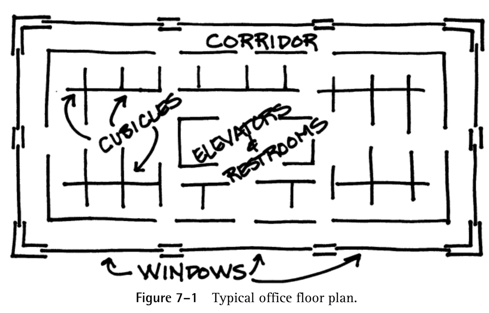
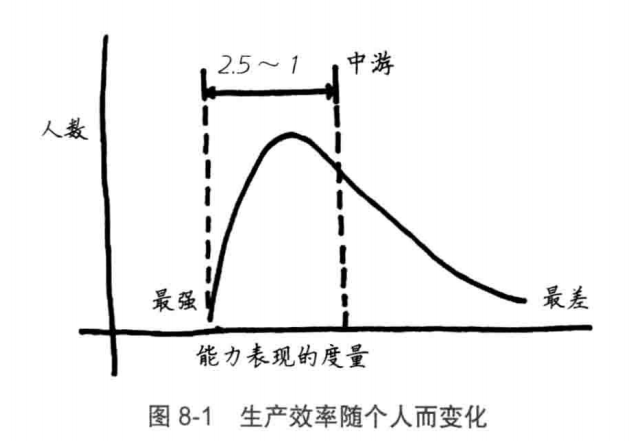
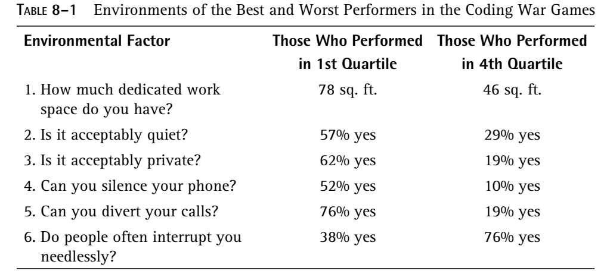
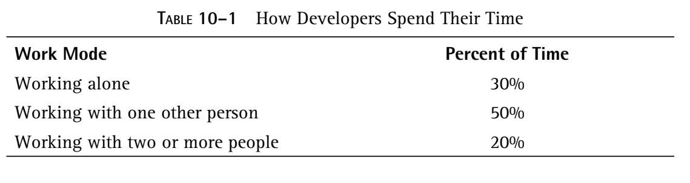

# 第一部分 Managing the HumanResource

# Somewhere Today, a Project Is Failing

## The Name of the Game  

The cause of failure most frequently cited by our survey participants was “politics.” But now observe that people tend to use this word rather sloppily.Included under “politics” are such unrelated or loosely related things as communication problems, staffing problems, disenchantment with the boss or with the client, lack of motivation, and high turnover. People often use the word politics to describe any aspect of the work that is people-related, but the English language provides a much more precise term for these effects: They constitute the project’s sociology. 

> The major problems of our work are not so much technological as sociological in nature.  

Most managers are willing to concede the idea that they’ve got more people worries than technical worries. But they seldom manage that way.   

Part of this phenomenon is due to the upbringing of the average manager. He or she was schooled in how the job is done, not how the job is managed.  

## The High-Tech Illusion  

The researchers who made fundamental breakthroughs in those areas are in a high-tech business. The rest of us are appliers of their work. We use computers and other new technology components to develop our products or to organize our affairs. Because we go about this work in teams and projects and other tightly knit working groups, we are mostly in the human communication business. Our successes stem from good human interactions by all participants in the effort, and our failures stem from poor human interactions.  

The main reason we tend to focus on the technical rather than the human side of the work is not because it’s more crucial, but because it’s easier to do. Getting the new disk drive installed is positively trivial compared to figuring out why Horace is in a blue funk or why Susan is dissatisfied with the company after only a few months. Human interactions are complicated and never very crisp and clean in their effects, but they matter more than any other aspect of the work.  

If you find yourself concentrating on the technology rather than the sociology, you’re like the vaudeville character who loses his keys on a dark street and looks for them on the adjacent street because, as he explains, “The light is better there.”  

# Make a Cheeseburger,Sell a Cheeseburger

• Squeeze out error. Make the machine (the human machine) run as smoothly as possible.

• Take a hard line about people goofing off on the job.

• Treat workers as interchangeable pieces of the machine.

• Optimize the steady state. (Don’t even think about how the operation got up to speed, or what it would take to close it down.)

• Standardize procedure. Do everything by the book.

• Eliminate experimentation—that’s what the folks at headquarters are paid for.

The “make a cheeseburger, sell a cheeseburger” mentality can be fatal in your development area. It can only serve to damp your people’s spirits and focus their attention away from the real problems at hand. This style of management will be directly at odds with the work.  

To manage thinking workers effectively, you need to take measures nearly opposite those listed above.  

## A Quota for Errors  

For most thinking workers, making an occasional mistake is a natural and healthy part of their work. But there can be an almost Biblical association
between error on the job and sin. This is an attitude we need to take specific pains to change.  

> 可是开发在实际开发中的话语权很小，换句话说，开发真的成为了码农…拿存储过程这个事举例，其实很早就有人察觉出事情不对劲，但是
>
> 1. 开发人员缺少积极反馈的勇气和氛围，项目一直以来都是负责人专制，包括技术决策，缺少一个可以与负责人制衡的技术角色
> 2. 负责人放不下技术角色的主观矜持，还是在把控着技术决策
> 3. 整体的研发氛围将错误看得很重（不管是bug还是设计性上的，但是从工期上来看，又将设计阶段划分得时间很少），这种氛围会导致研发倾向于保守
> 4. 在不允许犯错的氛围下，或许平均的技术水平会稳步提高，但团队内的氛围会遭受可怕的伤害。
>
> 导致这个错误的开发决策一直被沿用，沉没成本越来越高…

Speaking to a group of software managers, we introduced a strategy for what we think of as iterative design. The idea is that some designs are intrinsically defect-prone; they ought to be rejected, not repaired. Such dead ends should be expected in the design activity. The lost effort of the dead end is a small price to pay for a clean, fresh start. To our surprise, many managers felt this would pose an impossible political problem for their own bosses: “How can we throw away a product that our company has paid to produce?” They seemed to believe that they’d be better off salvaging the defective version even though it might cost more in the long run.  

Fostering an atmosphere that doesn’t allow for error simply makes people defensive. They don’t try things that may turn out badly. You encourage this defensiveness when you try to systematize the process, when you impose rigid methodologies so that staff members are not allowed to make any of the key strategic decisions lest they make them incorrectly. The average level of technology may be modestly improved by any steps you take to inhibit error. The team sociology, however, can suffer grievously.  

The opposite approach would be to encourage people to make some errors. You do this by asking your folks on occasion what dead-end roads they’ve been down, and by making sure they understand that “none” is not the best answer. When people blow it, they should be congratulated—that’s part of what they’re being paid for.  

> 鼓励尝试，并且鼓励分享自己尝试出错的经验经历，“没有问题”“没有错误”这绝对不是最完美的答案。

## The People Store  

In a production environment, it’s convenient to think of people as parts of the machine. When a part wears out, you get another. The replacement part is interchangeable with the original. You order a new one, more or less, by number.  

Many development managers adopt the same attitude. They go to great lengths to convince themselves that no one is irreplaceable. Because they
fear that a key person will leave, they force themselves to believe that there is no such thing as a key person. Isn’t that the essence of management, after all, to make sure that the work goes on whether the individuals stay or not? They act as though there were a magical People Store they could call up and say, “Send me a new George Gardenhyer, but make him a little less uppity.”  

> 人力，并不是一种可以直接替换的元器件，并不是一个简单的数字而已
>
> 我们将它简化成一个数字，有时候是因为我们害怕直面关键人物的可替代性到底有多少。

The uniqueness of every worker is a continued annoyance to the manager who has blindly adopted a management style from the production world. The natural people manager, on the other hand, realizes that uniqueness is what makes project chemistry vital and effective. It’s something to be cultivated.  

> 盲目的管理者用统一的方式管理所有人，而人性化的管理者却能认识到正是这种独特性使得项目团队产生了化学反应，是团队充满活力与高效的源泉。
>
> **疑问——这种特殊性和因人而异的管理成本，以及对其他人的暗示作用带来的负面影响怎么排除？**

## A Project in Steady State Is Dead  

Yet the way we assess people’s value to a new project is often based on their steady-state characteristics: how much code they can write or how much
documentation they can produce. We pay far too little attention to how well each of them fits into the effort as a whole.  

The catalyst is important because the project is always in a state of flux. Someone who can help a project to jell is worth two people who just do work.  

> 团队催化剂，我理解有点像当年许博士做的事，他并不懂技术，但是他一直在帮助团队内部进行沟通协调，贡献比一般的码农要大。

## We Haven’t Got Time to Think about This Job, Only to Do It  

Looking back over our own years as managers, we’ve both concluded that we were off-track on this subject. We spent far too much of our time trying to get things done and not nearly enough time asking the key question, , “Ought this thing to be done at all?” The steady-state cheeseburger mentality barely even pays lip service to the idea of thinking on the job. Its every inclination is to push the effort into 100-percent do-mode. If an excuse is needed for the lack of think-time, the excuse is always time pressure—as though there were ever work to be done without time pressure.  

> 我们总是在忙，总是在干活，却很少思考，比如我知道的某个人，我感觉就总是在做第一象限的事情，我觉得是事倍功半的。
>
> “Ought this thing to be done at all?”   这件事情到底该不该做？

# Vienna Waits for You  

For all the talk about “working smarter,” there is a widespread sense that what real-world management is all about is getting people to work harder and longer, largely at the expense of their personal lives. Managers are forever tooting their horns about the quantity of overtime their people put in, and the tricks one can use to get even more out of them.  

> 我们好像总是习惯吹嘘加班时长…

Productivity ought to mean achieving more in an hour of work, but all too often it has come to mean extracting more for an hour of pay. There is a large difference.   The Spanish Theory managers dream of attaining new productivity levels through the simple mechanism of unpaid overtime. They divide whatever work is done in a week by forty hours, not by the eighty or ninety hours that the worker actually put in.  

> 工作效率应该是指单位时间内产生更多的效益，而不是靠加班时长堆积

That’s not exactly productivity—it’s more like fraud—but it’s the state of the art for many American managers. They bully and cajole their people into
long hours. They impress upon them how important the delivery date is (even though it may be totally arbitrary; the world isn’t going to stop just because
a project completes a month late). They trick them into accepting hopelessly tight schedules, shame them into sacrificing any and all to meet the deadline, and do anything to get them to work longer and harder.  

> 太真实了，永远很急，永远快马加鞭…

## And Now a Word from the Home Front  

> 总有比工作更重要的事

If you think your project members never worry about such weighty matters, think again.  

## There Ain’t No Such Thing as Overtime  

Nobody can really work much more than forty hours, at least not continually and with the level of intensity required for creative intellectual work.  

> 持续长时间工作对于脑力劳动者并不是好事

Overtime is like sprinting: It makes some sense for the last hundred yards of the marathon for those with any energy left, but if you start sprinting in
the first mile, you’re just wasting time. Trying to get people to sprint too much can only result in loss of respect for the manager. The best workers have been through it all before; they know enough to keep silent and roll their eyes while the manager raves on that the job has got to get done by April. Then they take their compensatory undertime when they can, and end up putting in forty hours of real work each week. The best workers react that way; the others are workaholics.  

> 对于老油条来说，让他们加班他们是懂得怎么滑水的…他们是best workers？可能我是工作狂吧

## Workaholics  

The realization that one has sacrificed a more important value (family, love, home, youth) for a less important value (work) is devastating. It makes the person who has unwittingly sacrificed seek revenge. He doesn’t go to the boss and explain calmly and thoughtfully that things have to change in the future—he just quits, another case of burnout. One way or the other, he’s gone.

> 一旦工作狂了解到本质（即工作可能不值得他付出这么多），他会直接quit

If you exploit them to the hilt in typical Spanish Theory fashion, you’ll eventually lose them. No matter how desperately you need them to put in all those hours, you can’t let them do so at the expense of their personal lives.   

> 我就是例子，他们已经失去我了

## Productivity: Winning Battles and Losing Wars  

Consider some of the things that organizations typically do to improve productivity:

- Pressure people to put in more hours.
- Mechanize the process of product development.
- Compromise the quality of the product (more about this in the next
  chapter).
- Standardize procedures.  

> 太真实了，哈哈哈哈

That doesn’t say you can’t improve productivity without paying a turnover price. It only says you need to take turnover into account whenever you set out to attain higher productivity. Otherwise, you may achieve an “improvement” that is more than offset by the loss of your key people.  

> 当你想靠加班提高生产率时，你就得考虑人员的得失了，是否能取得平衡

Most organizations don’t even keep statistics on turnover. Virtually none can tell you what replacement of an experienced worker costs. And whenever productivity is considered, it is done as though turnover were nonexistent or cost-free. The Eagle project at Data General was a case in point. The project was a Spanish Theory triumph: Workaholic project members put in endless unpaid overtime hours to push productivity to unheard of levels. At the end of the project, virtually the entire development staff quit. What was the cost of that? No one even figured it into the equation.  

> 活生生的例子

## Reprise（反思）

One of my early consults was a project that was proceeding so smoothly that the project manager knew she would deliver the product on schedule. She was summoned in front of the management committee and was asked for a progress report. She said she could guarantee that her product would be ready by the deadline of March 1, exactly on time according to the original estimate. The upper managers chewed over that piece of unexpected good news and then called her in again the next day. Since she was on time for March 1, they explained, the deadline had been moved up to January 15.  

> 很真实，有时候不要把消息报的太好了，时不时报点坏消息是有好处的，因为管理层永远觉得你有剩余价值可以被压榨，他们永远希望员工保持压力，如果你能完成，那么就是你工作量不够。

A schedule that the project could actually meet was of no value to those Spanish Theory managers, because it didn’t put the people under pressure.
Better to have a hopelessly impossible schedule to extract more labor from the workers.  

What’s not so easy is keeping in mind an inconvenient truth like this one:

**People under time pressure don’t work better—they just work faster.**

In order to work faster, they may have to sacrifice the quality of the product and of their own work experience  

> **他们不是工作得更好，只是工作得更快，代价是牺牲产品质量和个人体验**

# Quality—If Time Permits  

There may be many and varied causes of emotional reaction in one’s personal life, but in the workplace, the major arouser of emotions is threatened self-esteem.  

We all tend to tie our self-esteem strongly to the quality of the product we produce—not the quantity of product, but the quality.  Any step you take that may jeopardize the quality of the product is likely to set the emotions of your staff directly against you.  

## The Flight from Excellence  

Managers jeopardize product quality by setting unreachable deadlines. They don’t think about their action in such terms; they think rather that what they’re doing is throwing down an interesting challenge to their workers, something to help them strive for excellence.  

> 管理者总是误认为设置一个不可达的deadline能帮助员工激发潜能，事实上是在危害产品质量。

Workers kept under extreme time pressure will begin to sacrifice quality. They will push problems under the rug to be dealt with later or foisted off
onto the product’s end user. They will deliver products that are unstable and not really complete. They will hate what they’re doing, but what other choice
do they have?  

> 员工是很无奈的…强行开发的产品充满隐患和不足

In many cases, you may be right about the market, but the decision to pressure people into delivering a product that doesn’t measure up to their own quality standards is almost always a mistake.  

> 对于市场来说，也许确实需要速度，但是后续也会带来代价

With sublime irony, this disastrous record is often blamed on poor quality consciousness of the builders. That is, those same folks who are chided for being inclined to “tinker forever with a program, all in the name of ‘Quality’” are also getting blamed when quality is low.  

> 讽刺的是，当产品质量很低时，那些原想提高质量但迫于时间压力的员工又受到指责。

By regularly putting the development process under extreme time pressure and then accepting poor-quality products, the software user community has shown its true quality standard.  

> 客户/甲方接锅

We have to assume that the people who pay for our work are of sound enough mind to make a sensible trade-off between quality and cost.  Reducing the quality of a product is likely to cause some people not to buy, but the reduced market penetration that results from virtually any such quality reduction will often be more than offset by increased profit on each item sold.  

> 如果产品质量堪忧，虽然每个单个产品的收益会变大，但从市场角度看是得不偿失

**Quality, far beyond that required by the end user, is a means to higher productivity**  

If you doubt that notion, imagine the following gedankenexperiment: Ask a hundred people on the street what organization or culture or nation is famous for high quality. We predict that more than half the people today would answer, “Japan.” Now ask a different hundred people what organization or culture or nation is famous for high productivity. Again, the majority can be expected to mention, “Japan.” The nation that is an acknowledged quality
leader is also known for its high productivity.  

> 日本是质量决定产量最好的例子

The trade-off between price and quality does not exist in Japan. Rather, the idea that high quality brings on cost reduction is widely accepted.

> 日本人普遍接受，高质量带来成本降低的观点

## Quality Is Free, But . . .  

Philip Crosby presented this same concept in his book Quality Is Free, published in 1979. In this work, Crosby gave numerous examples and a sound
rationale for the idea that letting the builder set a satisfying quality standard of his own will result in a productivity gain sufficient to offset the cost of improved quality.  

> 由开发者来确定产品质量？这对开发者的要求有点高吧…

Quality is free, but only to those who are willing to pay heavily for it.  

> （上面那句的翻译）只有愿意为质量倾其所有的人，质量才是免费的…都倾其所有了，还免费呢？老外的观点也有点问题

Hewlett-Packard has long been an example of an organization that reaps the benefits from increased productivity due to high, builder-set quality standards. From its beginning, the company has made a cult of quality. In such an environment, the argument that more time or money is needed to produce a high-quality product is generally not heard. The result is that developers know they are part of a culture that delivers quality beyond what the  marketplace requires. Their sense of quality identification works for increased job satisfaction and some of the lowest turnover figures seen anywhere in the industry.  

> 惠普从来不怀疑为了质量要付出的代价，因此他们从不就此争论，而且他们所交付的 标准超过市场需要，因此他们的工作满意度很高，人员流动率很低

## Power of Veto

In some Japanese companies, notably Hitachi Software and parts of Fujitsu, the project team has an effective power of veto over delivery of what they
believe to be a not-yet-ready product. No matter that the client would be willing to accept even a substandard product, the team can insist that delivery wait until its own standards are achieved. Of course, project managers are under the same pressure there that they are here: They’re being pressed to deliver something, anything, right away. But enough of a quality culture has been built up so that these Japanese managers know better than to bully their
workers into settling for lower quality.  

> 泪目了，日立软件和富士的部分团队，项目团队有权决定产品是否被发布，即使客户愿意接受不满足标准的产品，团队依然可以坚持己见，直到产品质量达标才交付。
>
> 整个文化氛围已经形成了——重视质量！重视质量！重视质量！

Could you give your people power of veto over delivery? Of course, it would take nerves of steel, at least the first time.   

# Parkinson’s Law Revisited

Even managers that know they know nothing about management nonetheless cling to that one axiomatic truth governing people and their attitude toward work: Parkinson’s Law. It gives them the strongest possible conviction that the only way to get work done at all is to set an impossibly optimistic delivery date.  

## Parkinson’s Law and Newton’s Law  

Even if you do, you go to great lengths to make sure that your people are spared its effects; otherwise, they’d never get anything done. The result is that your people have the possibility of lots of job-derived satisfaction.   

> 关键是让工作能带来成就感，也有点我们说的画大饼的意思…

Their lives are just too short to allow too much loafing on the job. Since they enjoy their work, they are disinclined to let it drag on forever—that
would just delay the satisfaction they all hanker for. They are as eager as you are to get the job done, provided only that they don’t have to compromise
their standard of quality.  

> 能让员工喜欢工作，才能让他们得到成就感，他们才会渴望工作

## You Wouldn’t Be Saying This If You’d Ever Met Our Herb（见闻）

The point here is not what does work, but what doesn’t: Treating your people as Parkinsonian workers doesn’t work. It can only demean and demotivate them.  

## Some Data from the University of New South Wales  

The systems analyst tends to be a better estimator than either the programmer or the supervisor. He or she typically knows the work in as much detail, but is not hampered by the natural optimism of the person who’s actually going to do the job or the political and budgetary biases of the boss. Moreover, systems analysts typically have more estimating experience; they are able to project the effort more accurately because they’ve done more of it
in the past and have thus learned their lessons.  

> 分析师可能既不会向开发人员那么乐观，也不会像管理者那样被政策和预算所限制，所以更有可能给出准确的估计，因为他们之前已经做过很多了，并且吸取了经验教训。

Bad estimates, hopelessly tight estimates, sap the builders’ energy. Capers Jones, known for his metric studies of development projects, puts it this way: “When the schedule for a project is totally unreasonable and unrealistic, and no amount of overtime can allow it to be made, the project team becomes angry and frustrated . . . and morale drops to the bottom.”1 It doesn’t matter too terribly much whether the “totally unreasonable and unrealistic” schedule comes from the boss or from the builders themselves. People just don’t work very effectively when they’re locked into a no-win situation .

> 管理者总是会落入马谡一样的思维陷阱，先给出一个绝境（不合理的安排和规划），以为能置于死地而后生，以为将士们能在绝境中以一敌百，其实只是自己的痴心妄想，只会让士气衰落。

The decision to apply schedule pressure to a project needs to be made in much the same way you decide whether or not to punish your child: If punishment is rare and your timing is impeccable so the justification is easily apparent, then maybe it can help. If you do it all the time, it’s just a sign that
you’ve got problems of your own.  

## Variation on a Theme by Parkinson  

A slight variation on Parkinson’s Law produces something that is frighteningly true in many organizations:

> Organizational busy work tends to expand to fill the working day.  

This effect can start when the company is founded, and become worse every year. If the Dutch East India Company (founded in 1651 and once the
largest company in the world) were still around, its employees might well be spending forty hours a week filling in forms. Notice that in this case, it’s the
company that exhibits Parkinsonian behavior rather than its employees.  

# Laetrile

Similarly, lots of managers are “desperate enough,” and their desperation makes them easy victims of a kind of technical laetrile that purports to improve productivity. There is seldom any evidence at all to support the claims of what they buy. They, too, dispense with evidence because their need is so great.  

> 人在绝望的时候就会相信一些缺乏论据的东西，例如购买的新技术，新的管理方式。

 ## Lose Fat While Sleeping

We’re all under a lot of pressure to improve productivity. The problem is no longer susceptible to easy solutions, because all the easy solutions were
thought of and applied long ago. Yet some organizations are doing a lot better than others. We’re convinced that those who do better are not using any
particularly advanced technology. Their better performance can be explained entirely by their more effective ways of handling people, modifying the workplace and corporate culture, and implementing some of the measures that we’ll discuss in Parts II through VI.  

> 为了提高产能，其实大部分解决方案都被试验过了，做的好的公司并不是使用了什么高级的技术，他们只是更高效地管理人力，修整工作场合，提高合作氛围，以及章节2到6的一些举措。

The relative inefficacy of technology may be a bit discouraging, at least in the short run, because the kinds of modification to corporate culture we advocate are hard to apply and slow to take effect.  Of course, it may not do much for you, but then easy nonsolutions are often more attractive than hard solutions.  

> 那些灵丹妙药总是充满诱惑力，因为它们看起来那么简单，而艰难的解决方案（例如改善合作氛围）总是很难实施并且收效很慢。

## The Seven Sirens  

The Seven False Hopes of Software Management  

1. There is some new trick you’ve missed that could send productivity soaring.

Response: You are simply not dumb enough to have missed something so fundamental. You are continually investigating new approaches and trying out the ones that make the most sense. None of the measures you’ve taken or are likely to take can actually make productivity soar. What they do, though, is to keep everybody healthy: People like to keep their minds engaged, to learn, and to improve. The line that there is some magical innovation out there that you’ve missed is a pure fear tactic, employed by those with a vested interest in selling it.  

2. Other managers are getting gains of 100 percent or 200 percent or more!

Response: Forget it. The typical magical tool that’s touted to you is focused on the coding and testing part of the life cycle. But even if coding and testing went away entirely, you couldn’t expect a gain of 100 percent. There is still all the analysis, negotiation, specification, training, acceptance testing, conversion, and cutover to be done.  

3. Technology is moving so swiftly that you’re being passed by.

Response: Yes, technology is moving swiftly, but (the High-Tech Illusion again) most of what you’re doing is not truly high-tech work. While the machines have changed enormously, the business of software development has been rather static. We still spend most of our time working on requirements and specification, the low-tech part of our work. Productivity within the software industry has improved by 3 to 5 percent a year, only marginally better than the steel or automobile industry.  

4. Changing languages will give you huge gains.

Response: Languages are important because they affect the way you think about a problem, but again, they can have impact only on the implementation part of the project. Because of their exaggerated claims, some of our newer languages qualify as laetrile. Sure, it may be better to implement a new feature in Java, for example, rather than PHP, but even before Java came along, there were better ways to do whatever you needed to do: niche tools that made certain classes of function pretty easy to implement. Unless you’ve been asleep at the switch for the past few decades, change of a language won’t do much for you. It might give you a 5-percent gain (nothing to sneeze at), but not more.  

5. Because of the backlog（未完成/启动的项目，库存的项目）, you need to double productivity immediately.

Response: The much talked about software backlog is a myth. We all know that projects cost a lot more at the end than what we expected
them to cost at the beginning. So the cost of a system that didn’t get built this year (because we didn’t have the capacity for it) is optimistically assumed to be half of what it would actually cost to build, or even less. The typical project that’s stuck in the mythical backlog is there because it has barely enough benefit to justify building it, even with the most optimistic cost assumptions. If we knew its real cost, we’d see that project for what it is: an economic loser. It shouldn’t be in the backlog, it should be in the reject pile.  

6. You automate everything else; isn’t it about time you automated away your software development staff?

Response: This is another variation of the High-Tech Illusion: the belief that software developers do easily automatable work. Their principal work is human communication to organize the users’ expressions of needs into formal procedure. That work will be necessary no matter how we change the life cycle. And it’s not likely to be automated.  

7. Your people will work better if you put them under a lot of pressure.

Response: They won’t—they’ll just enjoy it less.  

## This Is Management  

> In my early years as a developer, I was privileged to work on a project managed by Sharon Weinberg, later to become president of the Codd and Date Consulting Group. She was a walking example of much of what I now think of as enlightened management. One snowy day, I dragged myself out of a sickbed to pull together our shaky system for a user demo. Sharon came in and found me propped up at the console. She disappeared and came back a few minutes later with a container of soup. After she’d poured it into me and buoyed up my spirits, I asked her how she found time for such things with all the management work she had to do. She gave me her patented grin and said, “Tom, this is management.”  

Sharon knew what all good instinctive managers know: The manager’s function is not to make people work, but to make it possible for people to work.  

> 管理者的作用不是让大家去工作，而是创造环境，让大家可以顺利开展工作。

# 第二部分 The Office Environment

In order to make it possible for people to work, you have to come to grips with those factors that sometimes make it impossible. The causes of lost hours and days are numerous but not so different from one another. They are often—maybe even most often—failures, in one form or another, of the
environment that the organization has provided to help you work. The phone rings off the hook, the printer service man stops by to chat, the copier breaks down, the chap from the blood drive calls to revise donation times, Personnel continues to scream for the updated skills survey forms, time sheets are due at 3 P.M., lots more phone calls come in, . . . and the day is gone. Some days you never spend a productive minute on anything having to do with getting actual work done.  

> 太生动了，天天都是一堆杂事…

There are a million ways to lose a workday, but not even a single way to get one back.  

> 有千万种方法可能会令人损失一天的工作时间，但没有一种方法能够弥补回来。

# The Furniture Police  

## The Police Mentality  

While on break at a seminar, a fellow told me that his company doesn’t allow anything to be left on the desk at night except for a five-by-seven photo of the worker’s family. Anything else and in the morning you’ll find stuck to your desktop a nasty note (on corporate letterhead yet) from the Furniture Police. One guy was so offended by these notes that he could barely restrain his anger. Knowing how he felt, his fellow workers played a joke on him: They bought a picture frame from the local five-and-dime store, choosing one with a photograph of an allAmerican family as a sample. Then they replaced the photo of his own family with the other. Under the photo was what looked like a note from the Furniture Police, stating that since his family didn’t pass muster by the corporate standards, he was being issued an “official company family photo” to leave on his desk.  

> 就像小时候上英语课一样…严格的办公环境规章制度就像家具警察一样

## The Uniform Plastic Basement  

To get a better feeling for the police mentality, look at the floor plan of Figure 7–1, now becoming common in organizations all over America. 

There were magnificent views in every direction, views that virtually nobody ever saw. The people in that building may as well have worked in a basement.  

> 人们就像在地下室里工作一样

Basement space is really preferable from the point of view of the Furniture Police, because it lends itself more readily to uniform layouts. But people
work better in natural light. They feel better in windowed space and that feeling translates directly into higher quality of work. People don’t want to work in a perfectly uniform space either. They want to shape their space to their own convenience and taste. These inconvenient facts are typical of a general
class of inconveniences that come from dealing with human workers.  

> 关于办公环境，管理者总想统一，而员工总想有个性。

Visiting a few dozen different organizations each year, as we do, quickly convinces you that ignoring such inconvenient facts is intrinsic to many
office plans. Almost without exception, the work space given to intellect workers is noisy, interruptive, un-private, and sterile. Some are prettier than
others, but not much more functional. No one can get much real work done there. The very person who could work like a beaver in a quiet little cubbyhole with two large folding tables and a door that shuts is given instead an EZ-Whammo Modular Cubicle with 73 plastic appurtenances. Nobody shows much interest in whether it helps or hurts effectiveness.  

> 我们的办公环境嘈杂，干扰多，没有隐私。但是Nobody showsmuch interest in whether it helps or hurts effectiveness 

Police-mentality planners design workplaces the way they would design prisons: optimized for containment at minimal cost. We have unthinkingly yielded to them on the subject of workplace design, yet for most organizations with productivity problems, there is no more fruitful area for improvement than the workplace. As long as workers are crowded into noisy, sterile, disruptive space, it’s not worth improving anything but the workplace.  

> 不解决办公环境问题，任何其他举措都是徒劳的，可惜很少有公司注意到。

# “You Never Get Anything Done around Here between 9 and 5.”

How to explain then the fact that software people as well as workers in other thought-intensive positions are putting in so many extra hours?

A disturbing possibility is that overtime is not so much a means to increase the quantity of work time as to improve its average quality. You hear evidence that this is true in such frequently repeated statements as these:  

“I get my best work done in the early morning, before anybody elsearrives.”

“In one late evening, I can do two or three days’ worth of work.”

“The office is a zoo all day, but by about 6 P.M., things have quieted down and you can really accomplish something.”  

To be productive, people may come in early or stay late or even try to escape entirely, by staying home for a day to get a critical piece of work done.
One of our seminar participants reported that her new boss wouldn’t allow her to work at home, so on the day before an important report was due, she
took a sick day to get it done.  

> 有的时候，上班时间根本完成不了工作，反而是上班前或者下班后，或者单独的休息日能够更好的完成主要的工作，因为工作需要**peace**

Staying late or arriving early or staying home to work in peace is a damning indictment of the office environment. The amazing thing is not that it’s so
often impossible to work in the workplace; the amazing thing is that everyone knows it and nobody ever does anything about it.  

> 奇怪的是似乎每个人都知道在工作场合几乎不可能好好工作（嘈杂？打扰？分心？）但是都无动于衷

## A Policy of Default  

All the more discouraging is that the manager wasn’t even particularly embarrassed about failing to take steps to improve the environment.   

management had decided after due reflection that they couldn’t really domuch about it; it was a problem whose solution was beyond human capacity. This is a policy of total default. Changing the environment is not beyond human capacity.   

> 对于环境问题，大部分管理者选择弃权，认为这超出了能力范围。

## Coding War Games: Observed Productivity Factors  

作者组织了一种代码比赛来分析影响效率的因素，比赛规则是：每个公司的两个人成对参赛，但这两个人并不合作，而是彼此竞争，并且也和其他组的人竞争，然后他们各自完成比赛要求的题目并记录时间（比赛时采用他们各自工作时一样的环境，时间点，工具等，模拟真实工作场景）

## Individual Differences  

- 能力最强的人较之最差的产出比大概是10：1

- 能力最强的人比居中的产出高2.5倍左右

- 能力靠前一半的人比后一半的产出比大于2：1

These rules apply for virtually any performance metric you define. So, for instance, the better half of a sample will do a given job in less than half the
time the others take; the more defect-prone half will put in more than two thirds of the defects, and so on.  

> 不管用什么指标衡量，结果都差不多

## Productivity Nonfactors  

In our analysis of game results, we discovered that the following factors had little or no correlation to performance:  

> 以下因素几乎不影响效率

- 编程语言
- 经验年限
- 缺陷数量：并不是说快速完成的缺陷数量就比慢的要多
- 酬劳

## You May Want to Hide This from Your Boss

Among our findings of what did correlate positively to good performance was this rather unexpected one:

 **It mattered a lot who your pair mate was.**  

> 让人意想不到的关联性很强的因素是：**你的工作伙伴**

Now, why is that so important? Because even though the pairs didn’t work together, the two members of the pair came from the same organization. (In most cases, they were the only ones from that organization.) They worked in the same physical environment and shared the same corporate culture. The fact that they had nearly identical performances suggests that the wide spread of capabilities observed across the whole sample may not apply within the organization: Two people from the same organization tend to perform alike. That means the best performers are clustering in some organizations while the worst performers are clustering in others. This is the effect that software pioneer Harlan Mills predicted in 1981:  

While this [10 to 1] productivity differential among programmers is understandable, there is also a 10 to 1 difference in productivity among software organizations.  

> 优秀的员工往往来自同一家公司，差劲的员工往往也扎堆在同一家公司

Managers for years have affected a certain fatalism about individual differences. They reasoned that the differences were innate, so you couldn’t do much about them. It’s harder to be fatalistic about the clustering effect. Some companies are doing a lot worse than others. Something about their environment and corporate culture is failing to attract and keep good people or is making it impossible for even good people to work effectively.  

> 我们之前往往相信个体差异，但是现在这种集群效应是管理者所无法接受的，公司的环境确实很难吸引或者留住人才，也很难让人才有效的工作。

## Effects of the Workplace  

The top performers’ space is quieter, more private, better protected from interruption, and there is more of it.  

> 比赛中成绩在前四分之一的人的工作环境要明显比后四分之一的人的工作环境更安静，更私人，更能避免打扰…

## What Did We Prove?  

The data presented above does not exactly prove that a better workplace will help people to perform better. It may only indicate that people who perform better tend to gravitate toward organizations that provide a better workplace. Does that really matter to you? In the long run, what difference does it make whether quiet, space, and privacy help your current people to do better work or help you to attract and keep better people?  

If we proved anything at all, it’s that a policy of default on workplace characteristics is a mistake. If you participate in or manage a team of people who need to use their brains during the workday, then the workplace environment is your business. It isn’t enough to observe, “You never get anything done around here between 9 and 5,” and then turn your attention to something else. It’s dumb that people can’t get work done during normal work hours. It’s time to do something about it.  

> 如果说我们真的证明了什么，那就是放弃工作环境的改造是一个错误，如果你的员工是脑力工作者，那么工作环境问题就是你的责任，显而易见。

# Saving Money on Space  

A penny saved on the work space is a penny earned on the bottom line, or so the logic goes. Those who make such a judgment are guilty of performing a cost/benefit study without benefit of studying the benefit. They know the cost but haven’t any idea what the other side of the equation may be. Sure, the savings of a cost-reduced workplace are attractive, but compared to what? The obvious answer is that the savings have to be compared to the risk of lost effectiveness.  

> 只看到成本的降低，而不看到效率的降低风险也是一种误判，只是这种风险看起来那么的飘渺以至于经常被忽视。

> 但我觉得，首先得证明这个投资是值得的，就是说这个员工本身是值得这项投资的，不然投入太多也是浪费

## A Plague upon the Land  

> 开放格被广泛使用，但是是否能提高生产效率是存疑的，它被广泛使用的唯一原因是被反复提及。

## We Interrupt This Diatribe to Bring You a Few Facts  

From their studies, they concluded that a minimum accommodation for the mix of people slated to occupy the new space would be the following:

- 100 square feet of dedicated space per worker
- 30 square feet of work surface per person
- Noise protection in the form of enclosed offices or 6-foot-high partitions (they ended up with about half of all professional personnel in enclosed one- and two-person offices)  

> 每人100平方英尺（约9平方）的独立空间，30平方英尺（约2.7平方）的工作平面，封闭的办公室或者6尺高的隔断…有点奢侈

## Workplace Quality and Product Quality

Workers who reported before the exercise that their workplace was acceptably quiet were one-third more likely to deliver zero-defect work.  

> 在工作场所安静得可以接受的工人，完成零缺陷工作的可能性高出三分之一。

Zero-defect workers: 66 percent reported noise level okay

One-or-more-defect workers: 8 percent reported noise level okay  

As a result, we cannot distinguish between those who worked in a genuinely quiet workplace and those who were well adapted to (not bothered by) a noisy workplace. But when a worker complains about noise, he’s telling you he doesn’t fit into either of those fortunate subsets. He’s telling you that he is
likely to be defect-prone. You ignore that message at your peril.  

> 虽然我们不能分辨出这些人是真的工作在安静环境还是能够忍受噪音，但是当一个员工抱怨噪声，就表明他不属于以上说的两种，就表明他很容易出错，对于这个结果你必须自行担责

## A Discovery of Nobel Prize Significance（诺贝尔奖级别的发现）

Worker density (say, workers per thousand square feet) is inversely proportional to dedicated space per person  

> 工人密度（比如说，每千平方英尺的工人）与每人的专用空间成反比…这不是显而易见的吗

If you’re having trouble seeing why this matters, you’re not thinking about noise. Noise is directly proportional to density, so halving the allotment of
space per person can be expected to double the noise.   Even if you managed to prove conclusively that a programmer could work in thirty square feet
of space without being hopelessly space-bound, you still wouldn’t be able to conclude that thirty square feet is adequate space. The noise in a thirtysquare-foot matrix is more than three times the noise in a hundred-squarefoot matrix. That could mean the difference between a plague of product
defects and none at all.  

> 员工可以在30英寸的区域工作，但这并不代表足够（好的工作），区别就是是否有一大堆缺陷。

## Hiding Out  

People are hiding out to get some work done. If this rings true to your organization, it’s an indictment. Saving money on space may be costing you a fortune  

> 有些人你压根儿找不到，都躲起来完成工作去啦，假如你的组织发生了上述现象，就是在对工作环境进行控诉。

# Productivity Measurement and Unidentified Flying Objects

## Measuring with Your Eyes Closed  

Work measurement can be a useful tool for method improvement, motivation, and enhanced job satisfaction, but it is almost never used for these purposes. Measurement schemes tend to become threatening and burdensome  

In order to make the concept deliver on its potential, management has to be perceptive and secure enough to cut itself out of the loop. That means the data on individuals is not passed up to management, and everybody in the organization knows it. Data collected on the individual’s performance has to be used only to benefit that individual. The measurement scheme is an exercise in self-assessment, and only the sanitized averages are made available to the boss  

> 生产率的测量更适用于个人的提高和度量，只有平均值被呈现给老板

This concept is a hard one to swallow for many managers. They reason that they could use the data to do some aspects of their work more effectively
(precision promotion, for example, or even precision firing). Their company  has paid to have the data collected, so why shouldn’t it be made available to
them? But collection of this very sensitive data on the individual can only be effected with the active and willing cooperation of the individual. If ever
its confidentiality is compromised, if ever the data is used against even one individual, the entire data collection scheme will come to an abrupt halt.

The individuals are inclined to do exactly the same things with the data that the manager would do. They will try to improve the things they do less well or try to specialize in the areas where they already excel. In the extreme case, an individual may even “fire” himself in order to stop depending on skills that have been found to be deficient. The manager doesn’t really need the individual data in order to benefit from it.  

> 如果生产率测量值被直接报告给老板，员工会变得功利（我理解是这么个意思）

# Brain Time versus Body Time  

For a typical day, they concluded that workers divide their time as shown in Table 10–1.  

The significance of this table from a noise standpoint should be evident: Thirty percent of the time, people are noise sensitive, and the rest of the time, they are noise generators. Since the workplace is a mixture of people working alone and people working together, there is a clash of modes. Those working alone are particularly inconvenienced by this clash. Though they represent a minority at any given time, it’s a mistake to ignore them, for it is during their solitary work periods that people actually do the work. The rest of the time is dedicated to subsidiary activities, rest, and chatter  

> 人们真正单独工作的时间不足三分之一，并且彼此互为干扰者

## 流

就是心流。

并非所有工作都需要进入流的状态才能变得高产，但对于从事工程，设计，开发，写作或类似的工作，流是必须的，这些任务都需要精神高度集中，只有处在流的状态下，才能够很好的工作。

一般需要一个缓慢的过程来进入状态，15分钟或更长时间的集中才能把自己锁定在流里面。在这个引入过程中，你对噪声和干扰是非常敏感的。每次被打断后，就需要再一个引入过程来使你回到流的状态，而在引入过程中，你并不是真正在工作。

## 没有流的无休止状态

假设电话花费了五分钟，你重新引入的时间为15分钟，那么一个电话在流时间上的损失就是20分钟，一打（12个）的电话会耗掉半天，再加上其他的干扰，剩下的半天也泡汤了，这就是为什么“朝九晚五在这里什么也做不了”

与工作有效性降低一样严重的是随之而来的焦躁。

如果你是管理者，可能不会太在意这种无法进入流的焦躁，事实上，你就是在不停被打断的模式下完成自己大部分工作的，但任何阻碍大家进入流的事情都会造成工作效率与满意度的降低，从而导致工作成本的上升。

## 根据流来计算时间

An hour in flow really accomplishes something, but 10 six-minute work periods sandwiched between 11 interruptions won’t accomplish anything  

> 一个小时的心流工作确实会有所成就，但夹在11次干扰之间的10个6分钟的工作时间不会有任何成就

计算流的系统机制并不复杂，将原来的记录小时数改为记录没有打断的小时数即可。为了得到真实的数据，你必须消除大家的顾虑，不用担心是否填写了太少的不间断小时数，要让大家认识到，若一个星期仅有一两个小时不被打断，并非他们的错误，而是组织的问题，它没有为大家提供一个流友好的环境。当然，这样的数据是不能提交给薪资部门的，你可能还是需要将出勤时间用于薪资结算。

First, it focuses your people’s attention on the importance of flow time. If they learn that each workday is expected to afford them at least two or three hours free from interruption, they will take steps to protect those hours. The resultant interrupt-consciousness helps to protect them from casual interruption by peers.

Second, it creates a record of how meaningful time is applied to the work. If a product is projected to require three thousand flow hours to complete,
then you’ve got a valid reason to believe you’re two-thirds done when two thousand flow hours have been logged against it. That kind of analysis would be foolish and dangerous with body-present hours  

> 好处是能让大家指导流时间的重要性并且自主保护每天的流时间，起码两三个小时，同时能够比较真实地反映工作的进度，

## The E-Factor  

E-Factor = Uninterrupted Hours/Body-Present Hours  

> E=不被打扰的时间/出勤时间

E参数可能会威胁到现状，如果你报告说一个合理的E参数是0.38，而在一个成本被削减的环境中是0.10，大家可能很快就会发现成本削减很不合理——在0.10环境中工作的员工共，比在0.38环境中的员工需要花3.8倍的出勤时间来完成同样的工作。这就是说，在成本削减的环境中，要完成工作所需要的额外补偿要大于成本削减本身，显然，必须禁止这样的异端邪说，否则所有削减成本的“好处/节省”都将被质疑，那就在其他人读到这本书之前烧掉它吧doge

## 一座丝巾花园

有个客户的公司在收集了几周E参数时间后，大家自发地开始用在办公桌上系上红丝带来表明“请勿打扰”，每个人很快就理解了这个标识地重要性，并开始尊重这个标识。

稍微强调一点E参数的重要性能够帮助我们改变公司的文化，让大家意识到不要随意打断别人。

## 对工作的思考

# 电话

## 进入另一个世界

作者架设了一个没有电话的世界，并且拒绝了电话的产生，因为这机器对工作的影响完全是毁灭性的，如果安装了这样的机器，没人能够在办公室正常工作——因为不管响铃时你正在做啥，不管你当时有多投入，你都会放下手上的事情去回答它，要不然它就会一直响。

## 魔界奇谭

确实有一些方法能够减少电话打断带来的不良影响，最重要的就是意识到电话在多大程度上决定了我们的时间分配。

我们的工作方式确实被电话改变了，但我们不应该对打断带来的影响视而不见，管理者至少应该警惕打断对想要完成工作的员工带来的影响，然而往往管理者自己才是做得最糟的。

## A Modified Telephone Ethic  

当他们需要进入流的工作状态时，要有一种可被接受的，行之有效的办法来忽略那些来电，”可被接受“意味着公司文化允许大家在某些时间选择不被电话铃打断，”行之有效“意味着大家不需要等到铃声结束再返回工作（提前结束铃声）。

当电子邮件首先被提出时，我们大多数人都认为它巨大的价值在于节约用纸，但相对于重新进入心流所消耗的时间的节省，就显得微不足道了。电话和邮件之间的主要差别在于电话是打断性质的，而邮件不会；邮件的接收者可以再他方便的时候来处理。The amount of traffic going through these systems proves that priority “at the receiver’s convenience” is acceptable for the great majority of business communications.   经过一段时间的适应，工作人员开始倾向于使用电子邮件，而不是公司的内部电话，当然并非所有电话都被替代了，只是大部分。

其实关键不在技术，而在于习惯的改变（please note this recurring theme）我们需要扪心自问，为这样的消息或问题值得去打断目前的工作吗？我可以等目前工作完成了再去回答吗？这个消息需要马上回应吗？如果不是，在造成麻烦之前，还可以延后多少再去处理？

一旦你开始问这些问题，最适应你的交流模式就呼之欲出了。

## 不兼容的多任务处理

如果你在做诸如涉及这样的思维密集型工作，打断就是生产效率的杀手。

将一个需要流状态的任务和一些经常打断性的工作放在一起只能滋生焦躁。

> 任何精密装置都比不上改变观念来的重要。

电话：坏东西；电子邮件：好东西

# 门的回归

办公环境设计往往过分关注外观，事实上与设计密切相关的是要看工作环境能否让你安心开展工作。有益工作的办公室不是地位的象征，而是一种必需品。你要么为打造这样的环境买单，要么就是牺牲生产效率来偿付。

很多专业工作者的日常任务都是在左脑的处理中心完成的，音乐并不会对这些工作造成影响，因为是右脑在倾听音乐。但并非所有工作都在左脑，有时偶然会有让你突然感到”啊！“的突破以及推动你产生创新想法的突破，这种突破甚至能够让你少做几年工作。创造性的突破包含右脑的功能。如果右脑正在忙于聆听音乐，那么就会与创造性突破失之交臂。

两名员工在一起工作的时间如果超过50%，那么他们俩就是同一间办公室的自然候选人。即便是开放式的办公环境，一起工作的员工也应该将格子间修改为一个共同的小套间。

管理要做得最好，就应该保证为大家提供足够的空间、足够的安宁以及足以保护个人隐私的办法，让大家能够创造自己的可工作空间。按照这种思想，就不可能存在整齐划一。

# 霍恩布洛尔因素

## 天生与后天练就

他知道只有少数能够跟他并肩战斗的人才是他真正的资源，让这部分人成长起来，而且了解什么时候该依靠它们，这是霍恩布洛尔船长最大的能力。

我们假设每个人天生都有价值，管理着的工作应该是用自己的领导能力去发掘下属的能力，这样的观点比起霍恩布洛尔船长让人沮丧的判断要容易接受很多，而且对于管理着来说更像是一种吹捧，但是我们觉得这并非现实。

管理着不可能从本质上改变他们的员工，人们通常在短时间内很难做出改变，管理着也很难找到杠杆的支点来撬动让门发生本质的改变，所以在为你工作期间，人们在离开时和刚进来时并没有什么区别，一开始不适合工作的人，那就永远都不适合。

这意味着从一开始就找到正确的人至关重要。

## 整齐的塑料人

即使是新晋的管理者，在初次面试人的时候也知道一些招聘原则。比如它们指导不能以貌取人，产品质量与外貌无关，外表出色未必能交付优秀的产品。

尽管这一道理人人皆知，但让人奇怪的是，许多招聘上的失误又都是由于过度重视外表而忽略了真正能力造成的。

随着个人的成熟，他学习着在选择朋友和发展个人关系时去客服这种内在的超乎标准的偏爱，即使你在个人生活中早已了解，但在招聘时仍需要重新学习。

当你每次在决定雇佣一个人时，高层管理的喜好都在左右着你，这种几乎无形的压力推动着公司区域平均化，促使你去招聘长相相似，说法相似，思想相似的人。

这种对整齐划一的要求是部分管理着缺乏安全感的表现，自信的管理着不会关心团队成员是否按时理发或是否打领带，他们的荣耀寄于员工做出的成绩。

要是内部员工（通常是自信不足的二三线管理者）对任何异于习惯的行为都感到不安，那才是真正的问题。他们需要指定统一的规范让员工遵守，以此来刷存在感，让大家知道一切尽在其掌控。

不专业这个词语经常被用来形容哪些让人吃惊或有威胁的行为，任何让自信不足的管理着害怕的事物都是不专业的——😀

反过来，专业意味着不会让人吃惊。考量你是否专业，涉及你的长相，动作以及别人雷同的想法，就是要做一只勤劳的工蜂。

当然，这种变态的专业论无疑是病态的，在一个更加健康的组织文化里，衡量一个人是否专业，看的是他的学识和能力。

## 企业熵

> 管理热力学第二定律：组织里的熵总是增加的

这就是为什么老龄化的机构比起有活力的年轻公司来，总是觉得约束更多，因而缺少了工作的乐趣。

我们无法改变这种整体现象，但可以在自己的领域做出改变，最成功的管理着总是能摇动熵、带来正确的员工，并让他们展现自我，甚至允许他们偏离公司的标准，你所在的组织可能已经僵化了，但可以让你负责的部门幸免于难

# 谈谈领导力

- 主动承担责任
- 明显地胜任工作
- 为任务准备提前做足必要的功课
- 为每个人创造最大的价值
- 实施过程中保持幽默和明显的善意

当然有感染力也很有帮助。

# 雇佣一位杂技演员

并不是说技能测试就不好，相反，你应该去用，只是不该用于招聘。通过购买或自己开发的经典技能测试是给员工提供的很好的自我评价工具。一个健康组织所必需的，是能够为员工经常性地提供独立地自我评价机会。

在我们所在的行业，社会成分比技术成分多，更多的是依靠员工和其他人交流地能力而不是它们跟机器交流地能力。

应该让应聘者按自己过去工作地某个方面准备一个10或15分钟地演讲，可以是关于一种新技术地第一手体验，或者是从痛苦经历中学到地管理知识，或者是关于一个很有趣地项目。应聘者自己选择话题，然后你定一个日子并且邀请未来可能和他一起工作的人来当听众。

之所以要组织这样的会，就是要考察应聘者的交流技巧，同时也给未来同事们一个参加招聘的机会。

在试验完成，应聘者离开后，你可以组织一次听众讨论。每个人都评价一下应聘者跟工作的契合度，以及是否能够融入团队。虽然决定最后是否招聘仍然是你的职责，但来自未来同事们的反馈是无价的，更为重要的是，这位新招进来的员工可能在未来很容易就能融入到团队中，因为其他团队成员在招聘过程中都表达了自己的意见。

# 与他人良好合作

# 童年的终结

新加入工作大军的年轻人差异并不算大，但不同年代的差异还是需要去理解和适应的。

年轻一代关注的内容繁多，而老一辈的员工通常会集中精力，把注意力投向一两件事上。

你需要让你的年轻员工理解，虽然花在Facebook上的时间只占总时间的百分之二，但一个固定的时间断与整体不时去看看还是不同的，前者是员工作为社会人的合理需要，后者是对它们成为有价值员工的阻碍。不能进入流状态的员工是低效的。

持续不断的局部注意力的时间段需要被定义为个人非工作时间，在每个工作日都应该有个限制。

在会议上，无论出于何种明确的合法目的，这种持续不断的局部注意力对于会议都会产生同样的破坏力。

# 在这儿很开心
