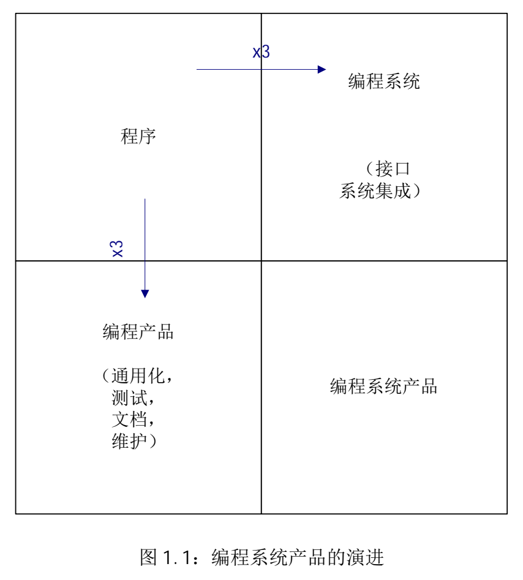
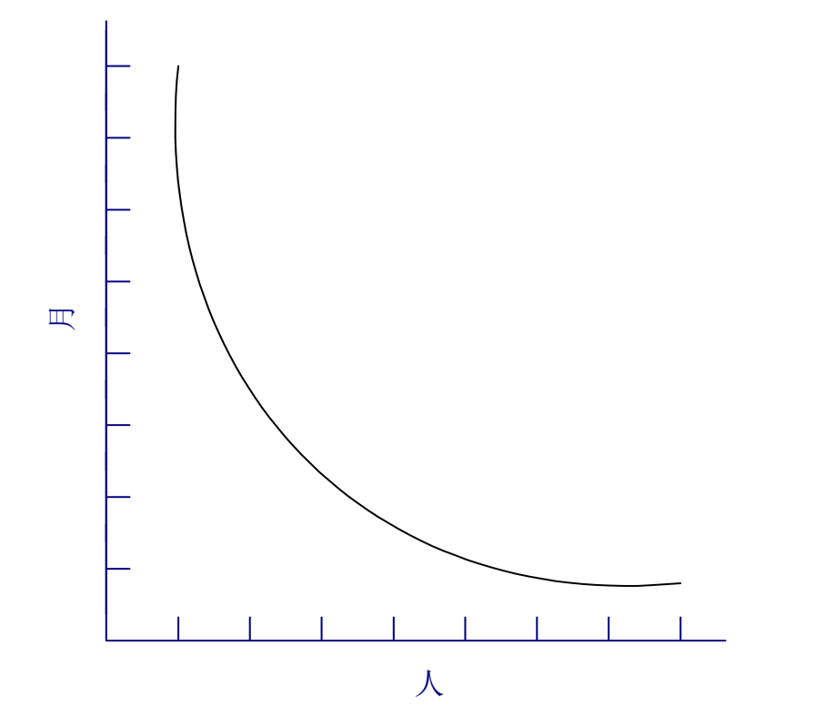
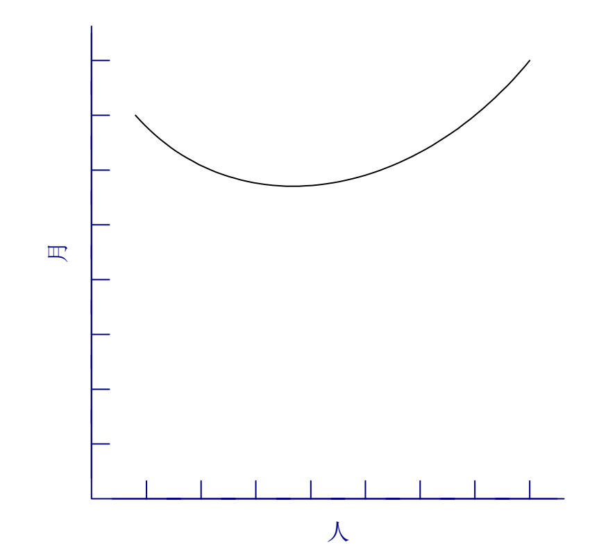
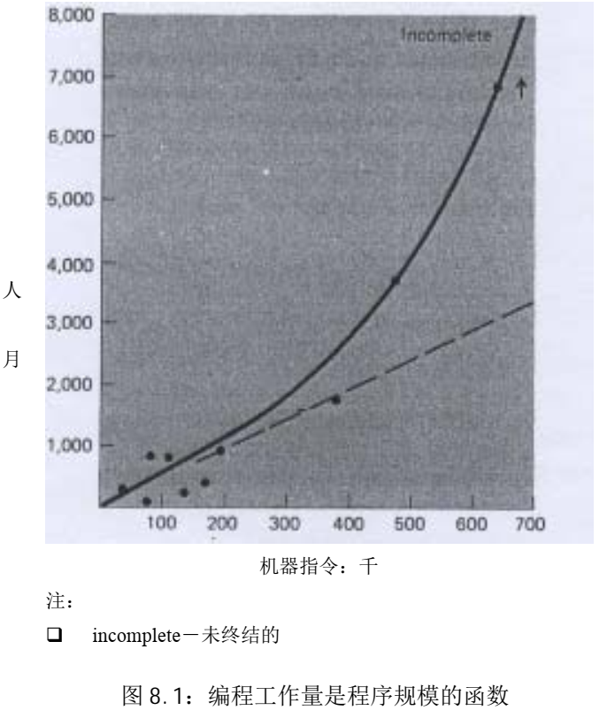
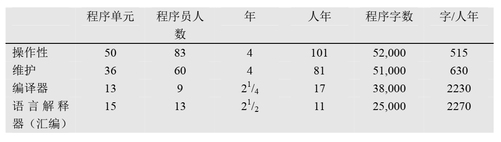

> 我相信由于人员的分工， 大型编程项目碰到的管理问题和小项目区别很大； 我相信关键需要是维持产品自身的概念完整性。   ——人月神话

> 报纸上经常会出现这样的新闻，讲述两个程序员如何在经改造的简陋车库中，编出了超过大型团队工作量的重要程序。 接着， 每个编程人员准备相信这样的神话， 因为他知道自己能以超过产业化团队的 1000 代码行/年的生产率来开发任何程序。  

单纯的程序演化成编程产品和系统中的一个单元所付出的成本都是原先的三倍，而只有同时满足这两者的才是最终的项目目标，因此最终的编程系统产品的成本是编码成本的九倍…

#### 项目计划常见的误解

> 缺乏合理的**时间进度**是造成项目滞后的最主要原因，它比其他所有因素加起来的影响还大。  

首先，我们对估算技术缺乏有效的研究，更加严肃地说，它反映了一种悄无声息， 但并不真实的假设——一切都将运作良好。  

第二，我们采用的估算技术隐含地假设**人**（人力）和**月**（时间）可以互换，错误地将**进度**与**工作量**相互混淆。  

第三，由于对自己的估算缺乏信心，软件经理通常不会有耐心持续地进行估算这项工作。  

第四，对进度缺少跟踪和监督。其他工程领域中，经过验证的跟踪技术和常规监督程序，在软件工程中常常被认为是无谓的举动。  

第五，当意识到进度的偏移时，下意识（以及传统）的反应是增加人力。这就像使用汽油灭火一样， 只会使事情更糟。 越来越大的火势需要更多的汽油， 从而进入了一场注定会导致灾难的循环。  

##### 乐观主义

> 几乎所有的编程人员都是乐观主义者。  

所以系统编程的进度安排背后的第一个假设是： 一切都将运作良好， 每一项任务仅花费它所“应该”花费的时间。对这种弥漫在编程人员中的乐观主义，理应受到慎重的分析。   

对于创造者， 只有在实现的过程中， 才能发现我们构思的不完整性和不一致性。因此，对于理论家而言，书写、试验以及“工作实现”是非常基本和必要的。  

我们容易去责怪外界条件没有顺应我们设定的计划思路。其实，这只不过是我们的骄傲使判断带上了主观主义色彩 。

然而，计算机编程基于十分容易掌握的介质，编程人员通过非常纯粹的思维活动——概念以及灵活的表现形式来开发程序。 正由于介质的易于驾驭， 我们期待在实现过程中不会碰到困难， 因此造成了乐观主义的弥漫。 而我们的构思是有缺陷的， 因此总会有 bug。也就是说，我们的乐观主义并不应该是理所应当的。  

在单个的任务中， “一切都将运转正常” 的假设在时间进度上具有可实现性。 因为所遇的延迟是一个概率分布曲线， “不会延迟”仅具有有限的概率，所以现实情况可能会像计划安排的那样顺利。 然而大型的编程工作， 或多或少包含了很多任务， 某些任务间还具有前后的次序，从而一切正常的概率变得非常小，甚至接近于无。  

##### 人月

第二个谬误的思考方式是在估计和进度安排中使用的工作量单位：人月。成本的确随开发产品的人数和时间的不同， 有着很大的变化， 进度却不是如此。因此我认为用人月作为衡量一项工作的规模是一个危险和带有欺骗性的神话。 它暗示着人员数量和时间是可以相互替换的。     

人数和时间的互换仅仅适用于以下情况：某个任务可以分解给参与人员，并且他们之间不需要相互的交流（图 2.1）。 这在割小麦或收获棉花的工作中是可行的；而在系统编程中近乎不可能。  

**对于可以分解的任务，可以看到，刚开始时随着人数的增加，收益越来越小。**

沟通所增加的负担由两个部分组成，培训和相互的交流。每个成员需要进行技术、 项目目标以及总体策略上的培训。 这种培训不能分解， 因此这部分增加的工作量随人员的数量呈线性变化 。  

相互之间交流的情况更糟一些。如果任务的每个部分必须分别和其他部分单独协作，则工作量按照 n(n-1)/2 递增。一对一交流的情况下，三个人的工作量是两个人的三倍，四个人则是两个人的六倍。 而对于需要在三四个人之间召开会议、 进行协商、 一同解决的问题，情况会更加恶劣。所增加的用于沟通的工作量可能会完全抵消对原有任务分解所产生的作用，此时我们会被带到图 2.4 的境地。  

因为软件开发本质上是一项系统工作——错综复杂关系下的一种实践——沟通、交流的工作量非常大，它很快会消耗任务分解所节省下来的个人时间。从而，添加更多的人手，实际上是延长了，而不是缩短了时间进度。  

##### 系统测试

在时间进度中，顺序限制所造成的影响，没有哪个部分比单元调试和系统测试所受到的牵涉更彻底。而且， 要求的时间依赖于所遇到的错误、 缺陷数量以及捕捉它们的程度。 理论上， 缺陷的数量应该为零。 但是， 由于我们的乐观主义， 通常实际出现的缺陷数量比预料的要多得多。因此，系统测试进度的安排常常是编程中最不合理的部分。  

对于软件任务的进度安排，以下是我使用了很多年的经验法则：  

- 1/3 计划
- 1/6 编码  
- 1/4 构件测试和早期系统测试  
- 1/4 系统测试，所有的构件已完成  

在许多重要的方面，它与传统的进度安排方法不同：

- 分配给计划的时间比寻常的多。 即便如此， 仍不足以产生详细和稳定的计划规格说明，也不足以容纳对全新技术的研究和摸索。  
- 对所完成代码的调试和测试，投入近一半的时间，比平常的安排多很多。  
- 容易估计的部分，即编码，仅仅分配了六分之一的时间。  

通过对传统项目进度安排的研究，我发现很少项目允许为测试分配一半的时间，但大多数项目的测试实际上是花费了进度中一半的时间。 它们中的许多项目， 在系统测试之前还能保持进度。或者说，除了系统测试，进度基本能保证。特别需要指出的是，不为系统测试安排足够的时间简直就是一场灾难。  

##### 空泛的估计

为了满足顾客期望的日期而造成的不合理进度安排， 在软件领域中却比其他的任何工程领域要普遍得多。而且， 非阶段化方法的采用， 少得可怜的数据支持， 加上完全借助软件经理的直觉，这样的方式很难生产出健壮可靠和规避风险的估计。  

开发并推行生产率图表、缺陷率、估算规则等等，而整个组织最终会从这些数据的共享上获益。     

##### 重复产生的进度灾难  

简单、武断地重复一下 Brooks 法则：向进度落后的项目中增加人手，只会使进度更加落后。（Adding manpower to a late software project makes it later）  

##### 总结

这就是除去了神话色彩的人月。项目的时间依赖于顺序上的限制，人员的数量依赖于单个子任务的数量。 从这两个数值可以推算出进度时间表， 该表安排的人员较少， 花费的时间较长（唯一的风险是产品可能会过时）。相反，分派较多的人手， 计划较短的时间，将无法得到可行的进度表。 总之， 在众多软件项目中， 缺乏合理的时间进度是造成项目滞后的最主要原因，它比其他所有因素加起来的影响还要大。  

# 外科手术队伍

# 贵族专制、 民主政治和系统设计  

> 在系统设计中，概念完整性应该是最重要的考虑因素。也就是说为了反映一系列连贯的设计思路，宁可省略一些不规则的特性和改进，也不提倡独立和无法整合的系统，哪怕它们其实包含着许多很好的设计。   

我理解就是需求描述的一致性，完整性和明确性。实际上需要设计的一致性和概念上的完整性。  

> 概念的完整性要求设计必须由一个人，或者非常少数互有默契的人员来实现。  

而进度压力却要求很多人员来开发系统。有两种方法可以解决这种矛盾。第一种是仔细地区分设计方法和具体实现。 第二种是前一章节中所讨论的、 一种崭新的组建编程开发团队的方法。  

对于非常大型的项目，将设计方法、体系结构方面的工作与具体实现相分离是获得概念完整性的强有力方法。   

系统的体系结构（architecture） 指的是完整和详细的用户接口说明。 对于计算机， 它是编程手册； 对于编译器， 它是语言手册； 对于控制程序， 它是语言和函数调用手册； 对于整个系统，它是用户要完成自己全部工作所需参考的手册的集合。  

因此，系统的结构师，如同建筑的结构师一样，是用户的代理人。结构师的工作， 是运用专业技术知识来支持用户的真正利益，而不是维护销售人员所鼓吹的利益。  

系统的概念完整性决定了使用的容易程度。 不能与系统基本概念进行整合的良好想法和特色， 最好放到一边，不予考虑。 如果出现了很多非常重要但不兼容的构想， 就应该抛弃原来的设计， 对不同基本概念进行合并，在合并后的系统上重新开始。  

> 实际上， 产品的成本性能比很大程度上依靠实现人员，就如同易用性很大程度上依赖结构师一样。  

我理解的是开发（实现）人员决定了产品的产入产出比例，即用多大的成本来维护和开发一个产品，好的开发能将这个比例降至最低，而设计人员（结构师）决定了一个产品是否好用，符合用户期待。

## 在等待时，实现人员应该做什么？

作者举了一个例子，在构建系统阶段，作者和体系结构经理、程序实现经理一起制订计划进度，并确认责任分工。  

体系结构经理拥有 10 个很好的员工， 他声称他们可以书写规格说明， 并出色地完成任务。该任务需要 10 个月，比所允许的进度多了 3 个月。  

程序实现经理有 150 人。他认为在体系结构队伍的协助下，他们可以准备技术说明，并且能按照时间进度， 完成高质量的、 切合实际的说明。 此外， 如果光是由体系结构的团队承担该工作，他的 150 人只能坐在那儿干等 10 个月，无所事事。  

对此，体系结构的经理的反应是，如果让程序实现队伍来负责该工作，结果不会按时完成， 仍将推迟 3 个月， 而且质量更加低劣。 我将工作分派给了程序实现队伍， 其结果也**确实如此**。。 体系结构经理的两个结论都得到了证实。 另外， 概念完整性的缺乏导致系统开发和修改上要付出更昂贵的代价，我估计至少增加了一年的调试时间。     

决定性因素是时间进度和让 150 名编程人员进行工作的愿望。而它也正是我想强调的致命危险。  

### 问题：当体系结构的队伍缓慢工作时，很多实现人员只能空闲地坐着等待 ？

问题的简要回答是，在说明完成的时候，才雇用编程实现人员。这也正是在搭建一座建筑时所采用的方法。  

# The Second-System Effect  

## Interactive Discipline for the Architect  

The architect has two possible answers when confronted with an estimate that is too high: cut the design or challenge the estimate by suggesting cheaper implementations. This latter is inherently an emotion-generating activity. The architect is now challenging the builder's way of doing the builder's job. For it to be successful, the architect must  

- remember that the builder has the inventive and creative responsibility for the implementation; so the architect suggests, not dictates  
- always be prepared to suggest a way of implementing anything he specifies, and be prepared to accept any other way that meets the objectives as well;  
- deal quietly and privately in such suggestions;  
- be ready to forego credit for suggested improvements  
- Normally the builder will counter by suggesting changes to the architecture. Often he is right—some minor feature may have unexpectedly large costs when the implementation is worked out.  

> 尊重开发…

## Self-Discipline—The Second-System Effect  

A discipline that will open an architect's eyes is to assign each little function a value: capability x is worth not more than m bytes of memory and n microseconds per invocation. These values will guide initial decisions and serve during implementation as a guide and warning to all. 

How does the project manager avoid the second-system effect? By insisting on a senior architect who has at least two systems under his belt. Too, by staying aware of the special temptations, he can ask the right questions to ensure that the philosophical concepts and objectives are fully reflected in the detailed design.  

> 怎么避免过度设计，绑一个至少有两个项目以上经验的高级架构师在皮带上！

# Passing the Word  

## Written Specifications—the Manual  

The manual, or written specification, is a necessary tool, though not a sufficient one. The manual is the external specification of the product. It describes and prescribes every detail of what the user sees. As such, it is the chief product of the architect.  

Round and round goes its preparation cycle, as feedback from users and implementers shows where the design is awkward to use or build. For the sake of implementers it is important that the changes be quantized—that there be dated versions appearing on a schedule.

The manual must not only describe everything the user does see, including all interfaces; it must also refrain from describing what the user does not see. That is the implementer's business, and there his design freedom must be unconstrained. **The architect must always be prepared to show an implementation for any feature he describes, but he must not attempt to dictate the implementation.**    

The style must be precise, full, and accurately detailed. A user will often refer to a single definition, so each one must repeat all the essentials and yet all must agree. This tends to make manuals dull reading, but precision is more important than liveliness  

> 用户手册必须精确

or the writing of a definition will necessitate a host of minidecisions which are not of full-debate importance. An example in System/360 is the detail of how the Condition Code is set after each operation. Not trivial, however, is the principle that such mini-decisions be made consistently throughout.  

> 对于在整个设计中， 保证这些看似琐碎的问题处理原则上的一致性， 决不是一件无关紧要的事情  

I think the finest piece of manual writing I have ever seen is Blaauw's Appendix toSystem/360 Principles of Operation. This describes with care and precision the limits of System/360 compatibility. It defines compatibility, prescribes what is to be achieved, and enumerates those areas of external appearance where the architecture is intentionally silent and where results from one model may differ from those of another, where one copy of a given model may differ from another copy, or where a copy may differ even from itself after an engineering change. This is the level of precision to which manual writers aspire, and they must define what is not prescribed as carefully as what is.  

Let us examine the merits and weaknesses of formal definitions. As noted, formal definitions are precise. They tend to be complete; gaps show more conspicuously, so they arefilled sooner. What they lack is comprehensibility. With English prose one can show structural principles, delineate structure in stages or levels, and give examples. One can readily mark exceptions and emphasize contrasts. Most important, one can explain why. The formal definitions put forward so far have inspired wonder at their elegance and confidence in their precision. But they have demanded  prose explanations to make their content easy to learn and teach. For these reasons, I think we will see future specifications to consist of both a formal definition and a prose definition.  

> 又要有形式化定义也要有叙述性描述…我理解就是说又要有流程图，又要有文字描述。

If one has both, one must be the standard, and the other must be a derivative description, clearly labeled as such. Either can be the primary standard.  

> 一个为主，一个为辅

> **小团队（使沟通更加高效）、文档、会议、手把手的带、防微杜渐的项目管理意识可以解决人月神话的大部分问题。**

> 软件工程虽然没有银弹，但采用新技术、快速开发原型、聘用卓越人才可以改善这种状况。

> 没有任何技术或管理上的进展，能够独立地许诺十年内使生产率，可靠性或者简洁性获得数量级地进步。——没有银弹

## Conferences and Courts  

Needless to say, meetings are necessary. The hundreds of man-toman consultations must be supplemented by larger and more formal gatherings. We found two levels of these to be useful. The first is a weekly half-day conference of all the architects, plus official representatives of the hardware and software implementers, and the market planners. The chief system architect presides.  

> 第一种举行会议的方式是半天的周例会，所有的架构师，加上硬件和软件实现的官方代表，由系统架构师主持

Anyone can propose problems or changes, but proposals are usually distributed in writing before the meeting. A new problem is usually discussed a while. The emphasis is on creativity, rather than merely decision. The group attempts to invent many solutions to problems, then a few solutions are passed to one or more of the architects for detailing into precisely worded manual change proposals.  

> 任何人都可以提出问题和改变（通常提前准备好文字记录），每个问题被讨论一段时间，例会的关键是创新，而不是结论，解决方案会被传递给一个和几个结构师， 详细地记录到书面文档中。  

Detailed change proposals then come up for decisions. These have been circulated and carefully considered by implementers and users, and the pros and cons are well delineated. If a consensus emerges, well and good. If not, the chief architect decides. Minutes are kept and decisions are formally, promptly, and widely disseminated.  

之前的讨论的建议解决方案的文档为决策的基础，方案的优点和缺点都要讨论，如果能达成共识最好，如果不能则由首席架构师决定。这需要花费时间，最终所发布的结论是正式和果断的。  

Decisions from the weekly conferences give quick results and allow work to proceed. If anyone is too unhappy, instant appeals to the project manager are possible, but this happens very rarely.  

The fruitfulness of these meetings springs from several
sources:

1. The samegroup—architects, users, andimplementers—meets weekly for months. No time is needed for bringing people up to date.
2. The group is bright, resourceful, well versed in the issues, and deeply involved in the outcome. No one has an "advisory" role. Everyone is authorized to make binding commitments.
3. When problems are raised, solutions are sought both within and outside the obvious boundaries.
4. The formality of written proposals focuses attention, forces decision, and avoids committee-drafted inconsistencies.
5. The clear vesting of decision-making power in the chief architect avoids compromise and delay.  

As time goes by, some decisions don't wear well. Some minor matters have never been wholeheartedly accepted by one or another of the participants. Other decisions have developed unforeseen problems, and sometimes the weekly meeting didn't agree to reconsider these. So there builds up a backlog of minor appeals, open issues, or disgruntlements. To settle these we held annual supreme court sessions, lasting typically two weeks. (I would hold them every six months if I were doing it again.)  

> 周例会的方式会有很多遗留问题，也许是决策没有被很好的执行，也许不能被全部接受，也许是导致了其他的问题；为了解决这些问题，可以举行为期两周的年度会议（如果是作者组织，他会半年举行一次）。

By the miracle of computerized text editing (and lots of fine staff work), each participant found an updated manual, embodying yesterday's decisions, at his seat every morning.  

These "fall festivals" were useful not only for resolving decisions, but also for getting them accepted. Everyone was heard, everyone participated, everyone understood better the intricate constraints and interrelationships among decisions.  

> 共同参与，共同决定，有参与才会有认同

## Multiple Implementations  

In most computer projects there comes a day when it is discovered that the machine and the manual don't agree. When the confrontation follows, the manual usually loses, for it can be changed far more quickly and cheaply than the machine. Not so, however, when there are multiple implementations. Then the delays and costs associated with fixing the errant machine can be overmatched by delays and costs in revising the machines that followed the manual faithfully.  

This notion can be fruitfully applied whenever a programming language is being defined. One can be certain that several interpreters or compilers will sooner or later have to be built to meet various objectives. The definition will be cleaner and the discipline tighter if at least two implementations are built initially.  

> 多重实现来维护手册的准确性？额…成本有点高

## The Telephone Log  

As implementation proceeds, countless questions of architectural interpretation arise, no matter how precise the specification. Obviously many such questions require amplifications and clarifications in the text. Others merely reflect misunderstandings.  

> 不管文档怎样详细，都还是会有译文需要被澄清

It is essential, however, to encourage the puzzled implementer to telephone the responsible architect and ask his question, rather than to guess and proceed. It is just as vital to recognize that the answers to such questions are ex cathedra architectural pronouncements that must be told to everyone.  

> 显然，对于存有疑问的实现人员，应鼓励他们打电话询问相应的结构师，而不是一边自行猜测一边工作， 这是一项很基本的措施。 他们还需要认识到的是， 上述问题的答案必须是可以告知每个人的权威性结论。  

One useful mechanism is a telephone log kept by the architect. In it he records every question and every answer. Each week the logs of the several architects are concatenated, reproduced, and distributed to the users and implementers. While this mechanism is quite informal, it is both quick and comprehensive.  

> 将被提问的疑问整合，每周发布给用户和开发，这个方法不错，不用太正式，但是非常快捷和易于理解。  

## Product Test  

The project manager's best friend is his daily adversary, the independent product-testing organization. This group checks machines and programs against specifications and serves as a devil's advocate, pinpointing every conceivable defect and discrepancy. Every development organization needs such an independent technical auditing group to keep it honest.  

> 最大的敌人就是最好的朋友——测试

In the last analysis the customer is the independent auditor. In the merciless light of real use, every flaw will show. The product-testing group then is the surrogate customer, specialized for finding flaws. Time after time, the careful product tester will find places where the word didn't get passed, where the design decisions were not properly understood or accurately implemented. For this reason such a testing group is a necessary link in the chain
by which the design word is passed, a link that needs to operate early and simultaneously with design.  

> 测试的重要性

# Why Did the Tower of Babel Fail?  

> 现在整个大地都采用一种语言， 只包括为数不多的单词。 在一次从东方往西方迁徙的过程中，人们发现了苏美尔地区， 并在那里定居下来。接着他们奔走相告说： “来， 让我们制造砖块， 并把它们烧好。” 于是， 他们用砖块代替石头， 用沥青代替灰泥（建造房屋）。 然后，他们又说： “来，让我们建造一座带有高塔的城市，这个塔将高达云宵，也将让我们声名远扬，同时， 有了这个城市，我们就可以聚居在这里，再也不会分散在广阔的大地上了。”于是上帝决定下来看看人们建造的城市和高塔， 看了以后， 他说： “他们只是一个种族，使用一种的语言，如果他们一开始就能建造城市和高塔，那以后就没有什么难得倒他们了。来，让我们下去，在他们的语言里制造些混淆， 让他们相互之间不能听懂。”这样， 上帝把人们分散到世界各地，于是他们不得不停止建造那座城市。（创世纪， 11:1-8）  

## A Management Audit of the Babel Project  

Well, if they had all of these things, why did the project fail? Where did they lack? In two respects—communication, and its consequent, organization. They were unable to talk with each other; hence they could not coordinate. When coordination failed, work ground to a halt. Reading between the lines we gather that lack of communication led to disputes, bad feelings, and group jealousies. Shortly the clans began to move apart, preferring isolation
to wrangling.  

> 巴比伦塔为什么会失败？——这个工程几乎拥有一切成功的先决条件，然而它缺少了两个东西，即沟通与沟通的结果——组织。

## Communication in the Large Programming Project  

So it is today. Schedule disaster, functional misfits, and system bugs all arise because the left hand doesn't know what the right hand is doing. As work proceeds, the several teams slowly change the functions, sizes, and speeds of their own programs, and they explicitly or implicitly change their assumptions about the inputs available and the uses to be made of the outputs.  

> 因为左手不知道右手在做什么  

How, then, shall teams communicate with one another? In as many ways as possible.

• Informally. Good telephone service and a clear definition of intergroup dependencies will encourage the hundreds of calls upon which common interpretation of written documents depends.

• Meetings. Regular project meetings, with one team after another giving technical briefings, are invaluable. Hundreds of minor misunderstandings get smoked out this way.

• Workbook. A formal project workbook must be started at the beginning. This deserves a section by itself.  

> 鼓励沟通，非正式（电话），会议（消除小误解），工作文档（从一开始就要有）

## The Project Workbook

What.  All the documents of the project need to be part of this structure. This includes objectives, external specifications, interface
specifications, technical standards, internal specifications, and administrative memoranda.  

Why.  Technical prose is almost immortal. If one   examines the genealogy of a customer manual for a piece of hardware or software, one can trace not only the ideas, but also many of the very sentences and paragraphs back to the first memoranda proposing the product or explaining the first design. For the technical writer, the paste-pot is as mighty as the pen.  

> 文档的过程版本也非常重要，可以追溯到第一版设计的思想，因此一定要保留中间版本的文档

Since this is so, and since tomorrow's product-quality manuals will grow from today's memos, it is very important to get the structure of the documentation right. The early design of the project workbook ensures that the documentation structure itself is crafted, not haphazard.   

> 越早开始设计文档越好，这能保证文档是精心策划的而不是随意编写

The second reason for the project workbook is control of the distribution of information. The problem is not to restrict information, but to ensure that relevant information gets to all the people who need it.  

> 文档的变更要及时通知到需要它的人，员工要能及时了解文档的变更，以最简单获取的方式，同时文档变更的记录要准确明了，方便员工快速地获取变更内容

When he first receives a changed page, he wants to know, "What has been changed?" When he later consults it, he wants to know, "What is the definition today?"  

> 变更记录要做好

First, one must mark changed text on the page, e.g., by a vertical bar in the margin alongside every altered line. Second, one needs to distribute with
the new pages a short, separately written change summary that lists the changes and remarks on their significance  

对于修改的地方，可以用批注，以及修订（更改总结）

## 大型编程项目的组织架构  

如果项目有 n 个工作人员，则有（n2 - n） / 2 个相互交流的接口。   团队组织的目的是减少不必要交流和合作的数量， 因此良好的团队组织是解决上述交流问题的关键措施  

Let us consider a tree-like programming organization, and examine the essentials which any subtree must have in order to be effective. They are:

1. a mission
2. a producer
3.  a technical director or architect
4. a schedule
5. a division of labor
6. interface definitions among the parts   

> 如果要使用树状编程架构，那么这几点需要明确
>
> 1.  任务（a mission）
> 2.  产品负责人（a producer）
> 3.  技术主管和结构师（a technical director or architect）
> 4.  进度（a schedule）
> 5.  人力的划分（a division of labor）
> 6.  各部分之间的接口定义（interface definitions among the parts）  

产品负责人的角色是什么？他组建团队，划分工作及制订进度表。他要求，并一直要求必要的资源。 这意味着他主要的工作是与团队外部， 向上和水平地沟通。 他建立团队内部的沟通和报告方式。 最后， 他确保进度目标的实现， 根据环境的变化调整资源和团队的构架  

那么技术主管的角色是什么？他对设计进行构思，识别系统的子部分，指明从外部看上去的样子， 勾画它的内部结构。 他提供整个设计的一致性和概念完整性； 他控制系统的复杂程度。 当某个技术问题出现时， 他提供问题的解决方案， 或者根据需要调整系统设计。 用Al Capp 所喜欢的一句谚语， 他是“攻坚小组中的独行侠”（inside-man at the skunk works.）。他的沟通交流在团队中是首要的。他的工作几乎完全是技术性的  

产品负责人和技术主管之间可能有三种关系，它们都在成功的应用被发现  

1. The producer and the technical director may be the same man. This is readily workable on very small teams, perhaps three to six programmers. On larger projects it is very rarely workable, for two reasons. **First, the man with strong management talent and strong technical talent is rarely found. Thinkers are rare; doers are rarer; and thinker-doers are rarest.** **Second, on the larger project each of the roles is necessarily a full-time job, or more.** It is hard for the producer to delegate enough of his duties to give him any technical time. It is impossible for the director to delegate his without compromising the conceptual integrity of the design  

> 产品负责人和技术主管是同一个人

2. The producer may be boss, the director his right-hand man. The difficulty here is to establish the director's authority to make technical decisions without impacting his time as would putting him in the management chain-of-command  

> 产品负责人是老板，技术主管是左右手，难点是很难在技术主管不参与任何管理工作的同时，建立在技术决策上的权威  

Obviously the producer must proclaim the director's technical authority  

> 产品负责人必须预先声明技术主管的威信

For this to be possible, the producer and the director must see alike on fundamental technical philosophy; they must talk out the main technical issues privately, before they really become timely; and the producer must have a high respect for the director's technical prowess.  

要达到这一点， 产品责任人和技术主管必须在基本的技术理论上具有相似观点； 他们必须在主要的技术问题出现之前， 私下讨论它们； **产品责任人必须对技术主管的技术才能表现出尊重。**  

the management line, is a source of decision power  

> 决策权力的源泉来自管理  

这种组合可以使工作很有效。不幸的是它很少被应用。不过，它至少有一个好处， 即项目经理可以使用并不很擅长管理的技术天才来完成工作。  

3. 技术主管作为总指挥， 产品负责人充当其左右手。  我猜测最后一种安排对小型的团队是最好的选择，  对于真正大型项目中的一些开发队伍， 我认为产品负责人作为管理者是更合适的安排  

巴比伦塔可能是第一个工程上的彻底失败，但它不是最后一个。交流和交流的结果——组织， 是成功的关键。 交流和组织的技能需要管理者仔细考虑， 相关经验的积累和能力的提高同软件技术本身一样重要。  

# 胸有成竹（Calling the Shot）  

实践是最好的老师 

实践是最好的老师，但是，如果不能从中学习，再多的实践也没有用  

先前，我推荐了用于计划进度、编码、构件测试和系统测试的比率。

首先，需要指出的是，**仅仅通过对编码部分的估计，然后应用上述比率，是无法得到对整个任务的估计的**。The coding is only one-sixth or so of the problem, and errors in its estimate or in the ratios could lead to ridiculous'results.  

第二，必须声明的是，构建独立小型程序的数据不适用于编程系统产品。  对规模平均为 3200 指令的程序， 如Sackman、 Erikson 和 Grant 的报告中所述， 大约单个的程序员所需要的编码和调试时间为 178 个小时， 由此可以外推得到每年 35,800 语句的生产率。而规模只有一半的程序花费时间大约仅为前者的四分之一， 相应推断出的生产率几乎是每年80,000 代码行 。  

> 计划、编制文档、测试、系统集成和培训（以及沟通）的时间必须被考虑在内。因此，上述小型项目数据的外推是没有意义的。 就好像把 100 码短跑记录外推， 得出人类可以在 3分钟之内跑完 1 英里的结论一样。  

下图讲述了这个悲惨的故事。它阐述了 Nanus 和 Farr2 在 System Development Corporation 公司所做研究，结果表明该指数为 1.5，即，

> 工作量 ＝ （常数）×（指令的数量） 1.5

Weinwurm3的 SDC 研究报告同样显示出指数接近于 1.5。  

## Portman's Data  

He found his programming teams missing schedules by about one-half—each job was taking approximately twice as long as estimated.   

The estimates were very careful, done by experienced teams estimating man-hours for several hundred subtasks on a PERT chart. When the slippage pattern appeared, he asked them to keep careful daily logs of time usage. These showed that the estimating error could be entirely accounted for by the fact that his teams were only realizing 50 percent of the working week as actual programming and debugging time.   

> 尽管做了非常仔细认真的评估，但实际上每周真正的工作（编码和debug）时间只有50%甚至不到

Machine downtime, higher-priority short unrelated jobs, meetings, paperwork, company business, sickness, personal time, etc. accounted for the rest    

> 机器故障，高优先级的临时任务，会议，文档，业务往来，疾病，个人生活等等占据了剩下的时间

In short, the estimates made an unrealistic assumption about the number of technical work hours per man-year. My own experience quite confirms his conclusion.

> 简言之， 项目估算对每个人年的技术工作时间数量做出了不现实的假设。我个人的经验也在相当程度上证实了他的结论   

## Aron 的数据  

他根据程序员（和系统部分） 之间的交互划分这些系统， 得到了如
下的生产率：

| 非常少的交互 | 10,000 指令每人年 |
| ------------ | ----------------- |
| 少量的交互   | 5,000             |
| 较多的交互   | 1,500             |

该人年数据未包括支持和系统测试活动，仅仅是设计和编程。当这些数据采用除以 2，以包括系统测试的活动时，它们与 Harr 的数据非常的接近  

> 就是说如果包含系统测试时，生产率要除以2

## Harr 的数据  

注意所有的四个程序都具有类似的规模——差异在于工作组的大小、 时间的长短和模块的个数。 那么， 哪一个是原因， 哪一个是结果呢？是否因为控制程序更加复杂,所以需要更多的人员？ 或者因为它们被分派了过多的人员，所以要求有更多的模块？是因为复杂程度非常高， 还是分配较多的人员， 导致花费了更长的时间？没有人可以确定。 控制程序确实更加复杂。 除开这些不确定性， 数据反映了实际的生产率——描述了在现在的编程技术下，大型系统开发的状况。因此， Harr 数据的确是真正的贡献。  

## OS/360 的数据  

生产率会根据任务本身复杂度和困难程度表现出显著差异。 在复杂程度估计这片“沼泽” 上的指导原则是： 编译器的复杂度是批处理程序的三倍，操作系统复杂度是编译器的三倍。  

## Corbato 的数据  

对常用编程语句而言。 生产率似乎是固定的。 这个固定的生产率包括了编程中需要注释，并可能存在错误的情况.

使用适当的高级语言，编程的生产率可以提高 5 倍  

# 削足适履（Ten Pounds in a Five-Pound Sack）

## 作为成本的程序空间  

我理解就是，程序运行本身是需要耗费内存资本的，作为系统设计师是需要思考对硬件和对软件的投入哪个性价比更高的。

由于规模是软件系统产品用户成本中如此大的一个组成部分，开发人员必须设置规模的目标， 控制规模， 考虑减小规模的方法， 就像硬件开发人员会设立元器件数量目标， 控制元器件的数量， 想出一些减少零件的方法。 同任何开销一样， 规模本身不是坏事， 但不必要的规模是不可取的。  

# 提纲挈领（The Documentary Hypothesis

在一片文件的汪洋中，少数文档形成了关键的枢纽，每件项目管理的工作都围绕着它们运转。它们是经理们的主要个人工具。  

技术、组织规定、行业传统等若干因素凑在一起，定义了项目必须准备的一些文书工作。 对于一个刚从技术人员中任命的项目经理来说， 这简直是一件彻头彻尾令人生厌的事情， 而且是毫无必要和令人分心的， 充满了被吞没的威胁。 是的，大多数情况确实都是这样的 。

慢慢的，他逐渐认识到这些文档的某些部分包含和表达了一些管理方面的工作。每份文档的准备工作是集中考虑， 并使各种讨论意见明朗化的主要时刻。如果不这样， 项目往往会处于无休止的混乱状态。 文档的跟踪维护是项目监督和预警的机制。 文档本身可以作为检查列表、状态控制，也可以作为汇报的数据基础    

## 计算机产品的文档

如果要制造一台机器，哪些是关键的文档呢？  

- 目标：定义待满足的目标和需要，定义迫切需要的资源、约束和优先级。
- 技术说明： 计算机手册和性能规格说明。它是在计划新产品时第一个产生，并且最后完成的文档。
- 进度、时间表
- 预算：预算不仅仅是约束。对管理人员来说，它还是最有用的文档之一。预算的存在会迫使技术决策的制订， 否则， 技术决策很容易被忽略。 更重要的是， 它促使和澄清了策略上的一些决定。
- 组织机构图
- 工作空间的分配
- 报价、预测、价格：这三个因素互相牵制，决定了项目的成败。  

## 大学科系的文档  

- 目标
- 课程描述
- 学位要求
- 研究报告（申请基金时，还要求计划）
- 课程表和课程的安排
- 预算
- 教室分配
- 教师和研究生助手的分配  

注意这些文档的组成与计算机项目非常相似： 目标、 产品说明、 时间安排、 资金分配、空间分派和人员的划分。 只有价格文档是不需要的， 学校的决策机构完成了这项任务。 这种相似性不是偶然的——**任何管理任务的关注焦点都是时间、地点、人物、做什么、资金**。  

## 软件项目的文档  

在许多软件项目中，开发人员从商讨结构的会议开始，然后开始书写代码。不论项目的规模如何小， 项目经理聪明的做法都是： **立刻正式生成若干文档作为自己的数据基础， 哪怕这些迷你文档非常简单**。接着，他会和其他管理人员一样要求各种文档。  

- 做什么： 目标。定义了待完成的目标、迫切需要的资源、约束和优先级。
- 做什么： 产品技术说明。以建议书开始，以用户手册和内部文档结束。速度和空间说明是关键的部分。
- 时间：进度表
- 资金：预算
- 地点：工作空间分配人员：组织图。它与接口说明是相互依存的，如同 Conway 的规律所述： **“设计系统的组织架构受到产品的约束限制，生产出的系统是这些组织机构沟通结构的映射。” Conway接着指出， 一开始反映系统设计的组织架构图， 肯定不会是正确的。 如果系统设计能自由地变化，则项目组织架构必须为变化做准备。**  

## 为什么要有正式的文档？  

首先，书面记录决策是必要的。只有记录下来，分歧才会明朗，矛盾才会突出。  

第二，文档能够作为同其他人的沟通渠道。项目经理常常会不断发现，许多理应被普遍认同的策略， 完全不为团队的一些成员所知。 正因为项目经理的基本职责是使每个人都向着相同的方向前进， 所以他的主要工作是沟通， 而不是做出决定。 这些文档能极大地减轻他的负担。  

最后，项目经理的文档可以作为数据基础和检查列表。通过周期性的回顾，他能清楚项目所处的状态，以及哪些需要重点进行更改和调整。  

项目经理的任务是制订计划，并根据计划实现。但是只有书面计划是精确和可以沟通的。 计划中包括了时间、 地点、 人物、 做什么、 资金。 这些少量的关键文档封装了一些项目经理的工作。 如果一开始就认识到它们的普遍性和重要性， 那么就可以将文档作为工具友好地利用起来， 而不会让它成为令人厌烦的繁重任务。 通过遵循文档开展工作， 项目经理能更清晰和快速地设定自己的方向。  
