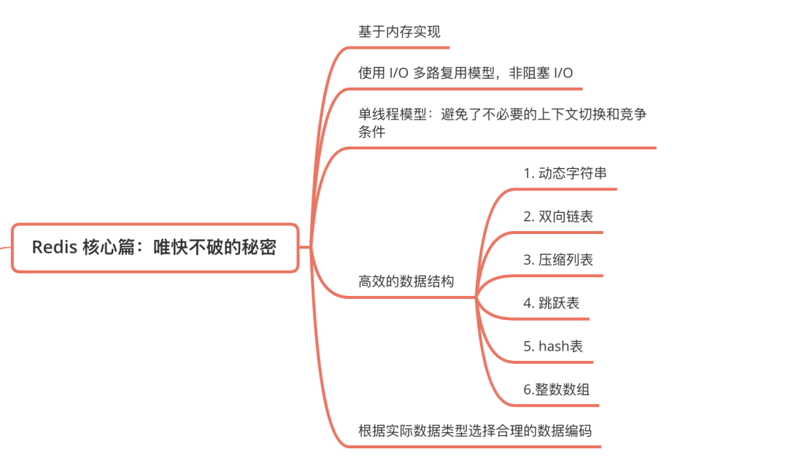
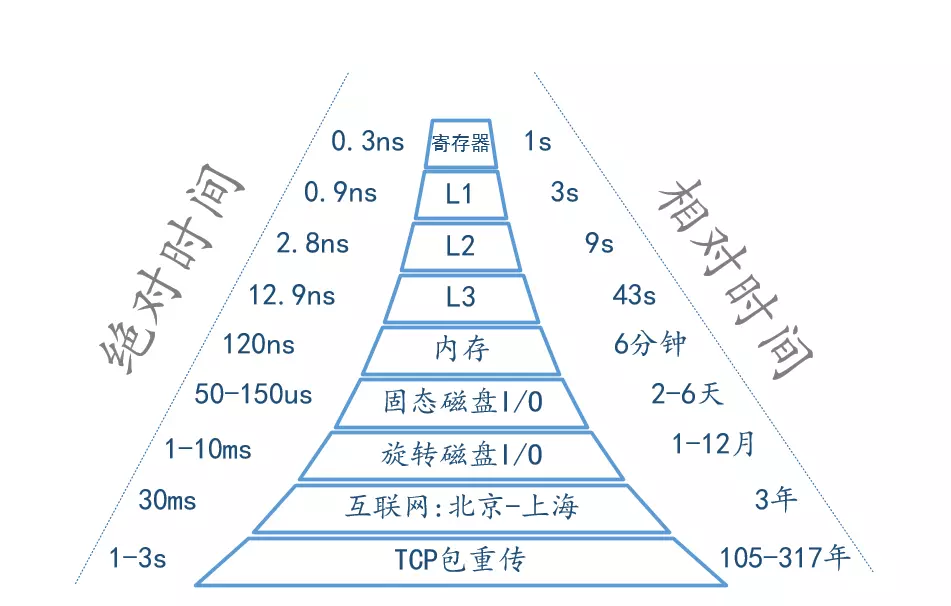
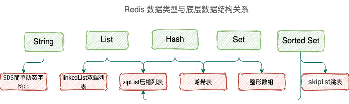

# redis

## Redis 核心篇：唯快不破的秘密



各级硬件的读写速度：



redis数据类型和底层数据类型关系：



整个数据库就是一个**全局哈希表**，而哈希表的时间复杂度是 O(1)，只需要计算每个键的哈希值，便知道对应的哈希桶位置，定位桶里面的 entry 找到对应数据，这个也是 Redis 快的原因之一

当写入 Redis 的数据越来越多的时候，哈希冲突不可避免，会出现不同的 key 计算出一样的哈希值。

Redis 通过**链式哈希**解决冲突：**也就是同一个 桶里面的元素使用链表保存**。但是当链表过长就会导致查找性能变差，所以 Redis 为了追求快，使用了两个全局哈希表。用于 rehash 操作，增加现有的哈希桶数量，减少哈希冲突。

开始默认使用 hash 表 1 保存键值对数据，哈希表 2 此刻没有分配空间。当数据越来多触发 rehash 操作，则执行以下操作：

1. 给 hash 表 2 分配更大的空间；
2. 将 hash 表 1 的数据重新映射拷贝到 hash 表 2 中；
3. 释放 hash 表 1 的空间。

**值得注意的是，将 hash 表 1 的数据重新映射到 hash 表 2 的过程中并不是一次性的，这样会造成 Redis 阻塞，无法提供服务。**

而是采用了**渐进式 rehash**，每次处理客户端请求的时候，先从 hash 表 1 中第一个索引开始，将这个位置的 所有数据拷贝到 hash 表 2 中，就这样将 rehash 分散到多次请求过程中，避免耗时阻塞。

> 在 Redis 中，rehash 是一个用于扩展哈希表大小的操作。当哈希表的负载因子（load factor）超过一定阈值时，Redis 会自动触发 rehash 操作。
>
> Rehash 操作的目的是为了扩大哈希表的容量，以减少哈希冲突的概率，提高哈希表的性能。它涉及到以下几个步骤：
>
> 1. 创建一个较大的新哈希表，其大小通常为当前哈希表的两倍。
> 2. 将旧哈希表中的所有键值对按照新哈希表的计算规则重新映射到新哈希表中。
> 3. 将所有新的键值对添加到新哈希表中。
> 4. 释放旧哈希表的内存空间。
>
> 在 rehash 过程中，Redis 会将旧哈希表和新哈希表共同使用，当对一个键进行读、写或删除操作时，会同时在旧哈希表和新哈希表中进行操作，以确保数据的一致性。当所有的键都迁移到新哈希表后，Redis 会将旧哈希表释放，完成 rehash 操作。
>
> 需要注意的是，rehash 操作可能会占用大量的 CPU 资源，并且在 rehash 过程中，哈希表的性能可能会略有降低。因此，当执行 rehash 操作时，可能会对 Redis 的性能产生一些影响，特别是在处理大量数据时。此外，Redis 的配置文件中可以设置 rehash 操作的负载因子阈值和步长，以便对 rehash 过程进行进一步调优。
>
> 总的来说，rehash 是 Redis 中一种用于扩展哈希表的操作，它可以提高哈希表的性能和容量，以满足数据增长的需求，并确保在扩容期间数据的一致性。

**String**：存储数字的话，采用 int 类型的编码，如果是非数字的话，采用 raw 编码；

**List**：List 对象的编码可以是 ziplist 或 linkedlist，字符串长度 < 64 字节且元素个数 < 512 使用 ziplist 编码，否则转化为 linkedlist 编码；

注意：这两个条件是可以修改的，在 redis.conf 中：

```
list-max-ziplist-entries 512
list-max-ziplist-value 64
```

**Hash**：Hash 对象的编码可以是 ziplist 或 hashtable。

当 Hash 对象同时满足以下两个条件时，Hash 对象采用 ziplist 编码：

- **Hash 对象保存的所有键值对的键和值的字符串长度均小于 64 字节。**
- **Hash 对象保存的键值对数量小于 512 个。**

否则就是 hashtable 编码。

**Set**：Set 对象的编码可以是 intset 或 hashtable，intset 编码的对象使用整数集合作为底层实现，把所有元素都保存在一个整数集合里面。

保存元素为整数且元素个数小于一定范围使用 intset 编码，任意条件不满足，则使用 hashtable 编码；

**Zset**：Zset 对象的编码可以是 ziplist 或 zkiplist，当采用 ziplist 编码存储时，每个集合元素使用两个紧挨在一起的压缩列表来存储。

Ziplist 压缩列表第一个节点存储元素的成员，第二个节点存储元素的分值，并且按分值大小从小到大有序排列。


当 Zset 对象同时满足一下两个条件时，采用 ziplist 编码：

- **Zset 保存的元素个数小于 128。**
- **Zset 元素的成员长度都小于 64 字节。**

如果不满足以上条件的任意一个，ziplist 就会转化为 skiplist 编码。注意：这两个条件是可以修改的，在 redis.conf 中：

```
zset-max-ziplist-entries 128
zset-max-ziplist-value 64
```

### 单线程又什么好处？

1. 不会因为线程创建导致的性能消耗；
2. 避免上下文切换引起的 CPU 消耗，没有多线程切换的开销；
3. 避免了线程之间的竞争问题，比如添加锁、释放锁、死锁等，不需要考虑各种锁问题。
4. 代码更清晰，处理逻辑简单。

**单线程是否没有充分利用 CPU 资源呢？**

官方答案：因为 Redis 是基于内存的操作，CPU 不是 Redis 的瓶颈，Redis 的瓶颈最**有可能是机器内存的大小或者网络带宽**。既然单线程容易实现，而且 CPU 不会成为瓶颈，那就顺理成章地采用单线程的方案了

## 唯快不破的原理总结

1. 纯内存操作，一般都是简单的存取操作，线程占用的时间很多，时间的花费主要集中在 IO 上，所以读取速度快。
2. 整个 Redis 就是一个全局 哈希表，他的时间复杂度是 O(1)，而且为了防止哈希冲突导致链表过长，Redis 会执行 rehash 操作，扩充 哈希桶数量，减少哈希冲突。并且防止一次性 重新映射数据过大导致线程阻塞，采用 渐进式 rehash。巧妙的将一次性拷贝分摊到多次请求过程中，避免阻塞。
3. Redis 使用的是非阻塞 IO：IO 多路复用，使用了单线程来轮询描述符，将数据库的开、关、读、写都转换成了事件，Redis 采用自己实现的事件分离器，效率比较高。
4. 采用单线程模型，保证了每个操作的原子性，也减少了线程的上下文切换和竞争。
5. Redis 全程使用 hash 结构，读取速度快，还有一些特殊的数据结构，对数据存储进行了优化，如压缩表，对短数据进行压缩存储，再如，跳表，使用有序的数据结构加快读取的速度。
6. 根据实际存储的数据类型选择不同编码
