1

## 会赚先会花：明智购物

### 聪明的消费者

#### 第一招：搬家炸裂法

==好东西法则
怎么判断一样东西有没有价值呢？教你一个简单的方法。
把你对一样东西的相对喜爱程度从1分到5分划分个标准，然后用这个分数乘以你每月使用的频率，所有低于10分的，都可以根据具体情况考虑丢掉。==

我们常见的错误是：

- 购买瞬间，高估了单次购买的快感值，购买了不需要的东西。

- 错误估计了实际使用时的场景（频率），买了过于粗糙的日用品。

如果一件东西的使用频率低而你对它的喜爱程度高，很可能这件东西对你来说真正的意义并不大。如果是喜爱程度低而使用频率高，那为什么不替换成一件更物美价廉的同类物品呢？

> 至于那些变形的鞋子、一年也不会穿一次的衣服、半年也不会弹上一次的乐器，统统妥善处理掉吧。因为到最后，你可能也不会用到它。

==减少购买“次东西”，也让我们能更理直气壮地选择好东西。==

如果你总是在淘宝上买一些廉价的衣服，那么久而久之，也许并不会觉得买一件得体的好衣服很必要，但是实际算一算，那些最后被丢掉的不合适的衣服的总价，可能要远远高于一件好衣服的价格。

> 少买，但买的话就买好一点的

==想象一下3个月或者6个月后你就要搬家了，在已经有十几个大箱子的前提下，即使很辛苦，你也要把这件东西带走吗？如果答案是不，那么三思之后再买。==

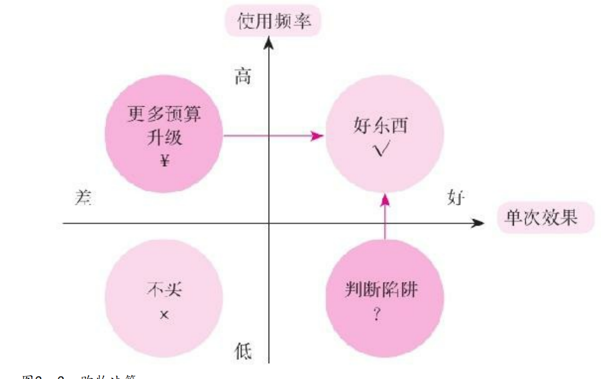

#### 第二招：**10%“**品质生活**”**基金

==每月她会拿出工资的10%，买点不那么舍得买的单品，用来升级生活，比如将针织衫换成纯羊毛的，换一个质感更好的通勤包。==

#### 第三招：多买资产，不买负债

所谓资产，就是能为我们带来正收益的东西，而负债则是从我们的口袋中拿钱的东西。

其实这一招就是要教你用投资的思维去消费。当我们投一笔钱出去时，总会想，这笔投资未来会赚多少钱。赚的少了，我们会不高兴。但是当我们花出去更大的金额时，却很少思考购买的这件东西在未来的回报是不是正的。

所以，无论是那些买回来只穿了一两次的衣服，还是放到过期的化妆品，或者是很快就被淘汰掉的电子产品，统统都是负债。大多数情况下，这些消费除了导致我们白白向商家付了一笔钱之外，并没有为我们带来太多收益。这一类消费，我们在花钱之前就要想到。未来会成为我们负债的东西，千万不要买。

#### 第四招：多为自己买单

买名牌包，有100条理由是为自己好，但其实是为了别人眼中的自己。而购买一张几乎不会被别人看到的床垫，却是对我们人生1/3时光的投入，是对自己真正的贴心

要想明智地为自己买单，要记得“我需要、我喜欢、我适合”的“三我”法则，时刻把自己真正的需求放在最核心的位置。

> 郑重地向自己提问
>
> 这件东西我需要吗？是健康需要、成长需要，还是虚荣心需要？
>
> 这件东西我喜欢吗？是真正喜欢，还是因为人云亦云而喜欢？
>
> 这件东西适合吗？是符合我的消费能力，而且适合我现阶段的生活状况的吗？

最后，再送你几条黄金小贴士。

- 永远不吝惜投资自己。我们学到的知识永远属于自己，而且很可能在未来会给我们带来难以估量的回报。我身边有很多这样的例子：因为多学习了一个技能，未来收入大幅提高了；因为投入时间、金钱去考取证件和执照，获得了更多的升职、加薪机会等。所以，永远不要吝惜为提高自己的能力而投资。

- 一些能用钱解决的问题，尽量用钱解决。时间成本更为重要，因为并非所有的事都有“性价比”，追求低价优质本身就是很浪费专注力的行为。比如从网上下载一本PDF格式的电子书，虽然是免费的，能省下几十元，但读书体验很可能较差，或者会花费太多的搜索时间，直接消耗了阅读热情。这种情况下，你应该果断选择花钱购买纸书。==对于一些专业性较强的学习需求，比起零碎的免费课程，应该优先选择系统性的付费课程。付费的产品并不一定好，但至少有一定的保障，还可以帮助我们减少搜索成本。==

- 常规性的物品，可以提前做好年度规划。每年年初很多人都有给自己做计划的习惯，但很少会想到给自己的消费内容也做个规划。其实，这样做有很多好处：一方面会逼着我们盘点自己已经有的物品，避免重复消费；另一方面也让我们在一年开头最有决心的时候，想清楚自己最需要什么，避免稀里糊涂的消费。

  对于女生来说，每年最需要的，无非就是衣服、护肤品等。男生除了衣服，可能会考虑电子产品。这些东西，其实都会产生类似的问题——买一百样没用的，不如买一件经典的，比如一套好的职业装，或者一个高质量的通勤包。你应提前想好使用它们的场合和搭配，省的要用的时候着急。如果因为投入过大，无法一年买齐，也可以分几年购买。

- 积累自己的好物清单。我曾经组织“简七读财”的读者发起过一次活动，写下大家认为的过去5年里最好的消费是什么。大家给了我非常多的灵感（详见附录“好物清单”）。如果你能有意识地积累那些真正对自己有巨大好处的消费项目，以后所做的消费决策也会越来越明智。

## 告别**“**月光**”** ，先从这五步做起

我们要告别“月光”，可以通过五个步骤来实现

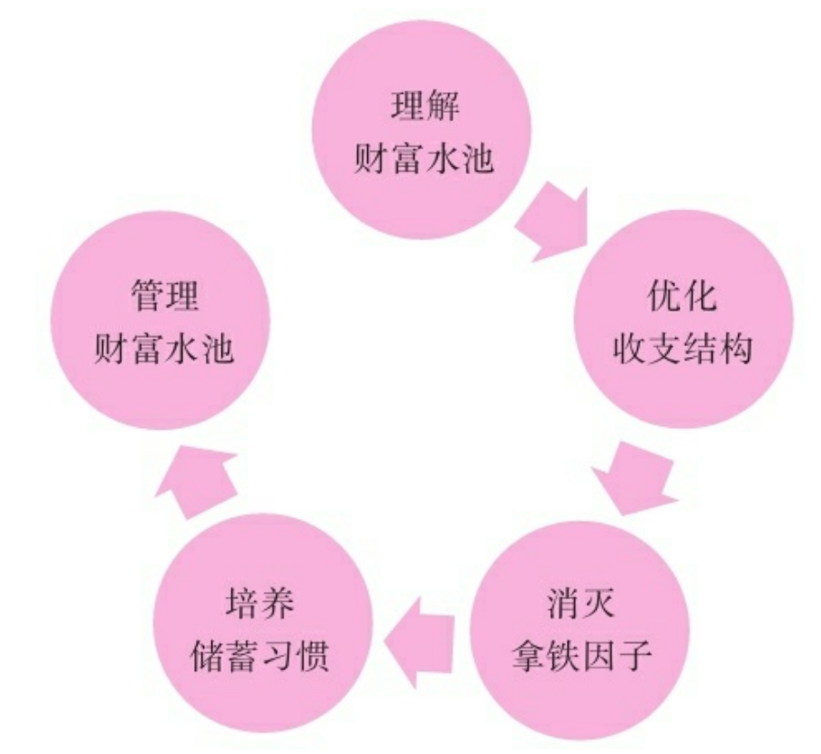

### 第一步：理解财富水池

所谓财富水池模型，就是我们把自己的收入和支出想象成流水，把

自己的资产想象成蓄水池，把通货膨胀想象成日照的作用下水的无形蒸

发。

我们要做的事情就是让水池的进水速度超过蒸发速度，用术语来说

就是做投资，让钱增值的速度超过物价上涨的速度

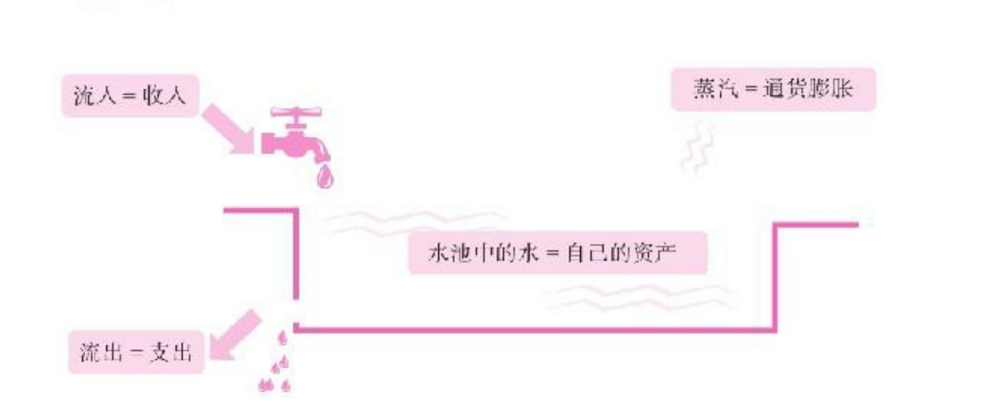

> 财富水池模型：
>
> ·日常现金池：高频、小额的日常生活支出，例如，吃饭、交通、买衣服等。
>
> ·中短期目标池：低频、大额支出，例如，季度交纳的房租、每年
>
> 交的保险费、3~6个月的生活费紧急预备金账户。
>
> ·长期金鹅池：没有特定用途的强制储蓄，按照养小金鹅的心态进
>
> 行长期投资。这是我们为了财务自由这个大目标所存下的钱

### 第二步：优化收支结构

一般来说，我们的收入主要有以下四个去处：

- 日常的必要支出，比如保障最基本的衣食住行的开销。

- 偶发的必要支出，比如旅行、送婚礼红包的钱，以及给父母的钱等。这些支出看似偶发，却难以避免。

- 非必要支出，比如每个月随意的网购消费、购买打折的名牌包、每天喝一杯星巴克等。

- 少量结余。

合理的分配比例

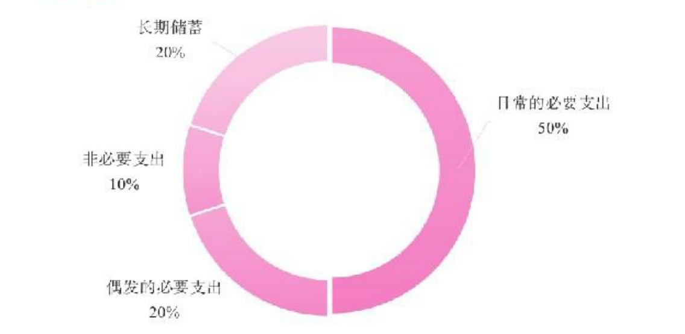

- 日常的必要支出：占收入的50%。如果你日常的必要支出远远超出收入的50%，达到80%甚至90%，那么我建议你要把现阶段的重点放在提升自己的收入水平上。

- 偶发的必要支出：占收入的20%。

- 非必要支出：占收入的10%。

- 长期储蓄：占收入的20%。

### 第三步：消灭拿铁因子

> 拿铁因子是人们每天生活中如买杯咖啡般可有可无的习惯性支出，例如，每天午饭后的一杯拿铁咖啡、看到商场促销就买的衣服、付了钱却不去使用的健身卡……这个概念源于一个故事：一对夫妻每天早上一定要喝一杯拿铁咖啡，看似很小的花费，30年累积的花费竟达到70万元。

==你一定知道消灭拿铁因子的好办法就是做个聪明的消费者，买东西之前多问自己是否“需要、喜欢、适合”，时时把自己真正的需求放在核心位置。==

### 第四步：培养储蓄习惯

如果你现在还没有养成固定的储蓄习惯，下面有两个简单的小诀窍。

**第一个小诀窍：牢记“先支付自己”（见图3–9）。**

我们拿到收入总是先支付必要支出，然后支付非必要支出，最后剩下多少存多少。如果能够转换为支付完必要支出以后直接强制储蓄，剩下的部分再用于喝咖啡之类的非必要支出，情况就会大不一样。

千万不要小看这个简单的思维转变，很多人都因为这个转变，存下一笔钱。

**第二个小诀窍：10/50法则**

每月从10%的工资开始储蓄。10%的金额一般不会影响生活质量。同时，试着将意外收入、奖金、加薪的50%存下来，用剩余的50%好好犒劳自己，也会让人惊喜。

### 第五步：管理财富水池

- 日常现金池：放入货币基金或者银行活期存款，记录现金池的资金进出。

- 中短期目标池：建议每一个用途单独用一类产品来打理。对于相对刚性的需求，比如三个月后要付房租，提前把需要的钱存在一笔单独的定期理财产品中。对于有弹性的支出需求，比如旅行基金，甚至可以考虑放在一些波动较小的基金中，既方便记录，又好打理。

- 长期金鹅池：用单独的投资账户来存放养鹅基金，不做短期支取，只用作长期投资。

# 第4章 检查自己的财务状况

## 影响财务健康的因素

### 第一项指标：应急能力

应急能力（见图4–1）参考指标：活期资产/每月日常支出,推荐数值：3~6

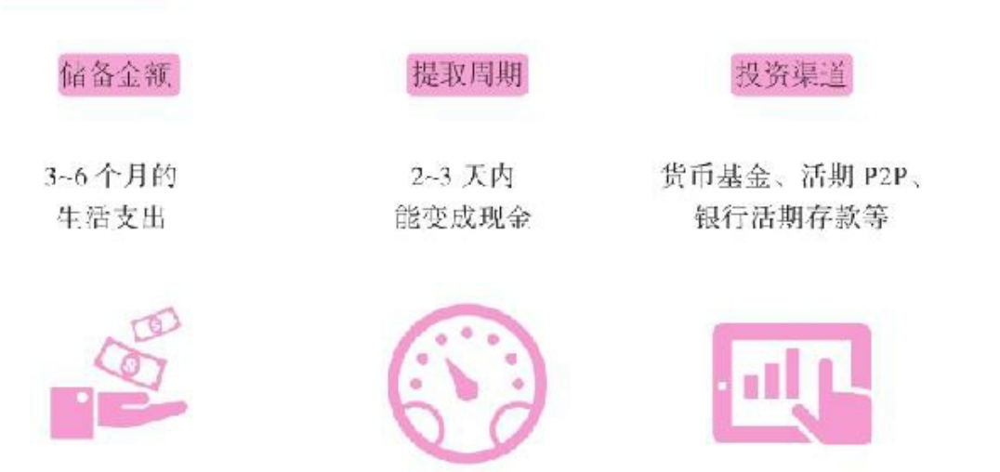

> 由于这笔钱是应急资金，因此可能随时需要取用，所以推荐你存放
>
> 在可以在两三天就可以变成现金的账户里。例如，货币基金、银行活期存款等。

当然，银行活期存款利率太低，建议大家还是放在货币基金里。货

币基金由基金管理人运作，专门投向风险较小的货币市场，具有高安全

性、高流动性和稳定收益性。例如，余额宝就是一种货币基金。做好了

这个准备，你既能底气十足地选择自己喜欢的工作，也可以来一场说走

就走的旅行。

### 第二项指标：偿债能力

偿债能力参考指标：月还款金额/月收入<1/3

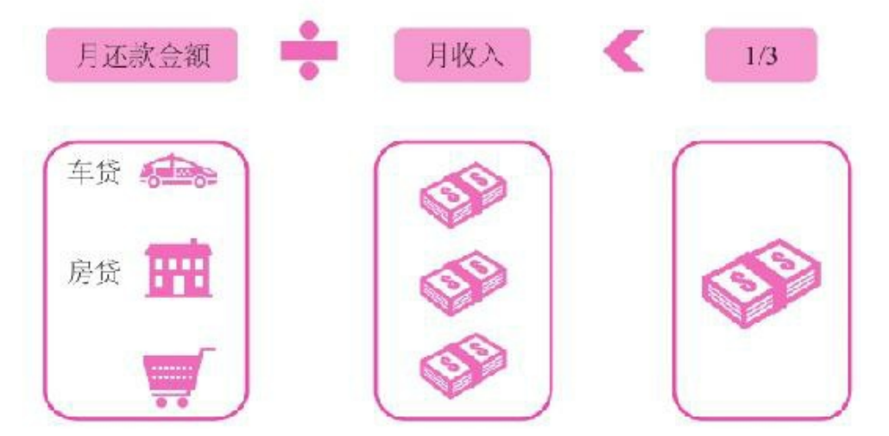

> 2010年，我有个朋友准备在老家买房，一室一厅，全新小区，全价是20万元。他当时手上正好有20万元左右。他应该一次性付清房款，还是只付30%的首付，贷款买房呢？
>
> 不知你的心里有没有答案呢？来看看我的朋友是怎么做的。这位朋友也是觉得有负债就不安心，于是一次性付清了20万元的房款。到现在，那个小区一室一厅户型的房价已经涨到50万元。我们来算一笔账，如果当时他只支付首付款6万元，那就可以购买三套房子，到现在的资产总额就是150万元。
>
> 这就是杠杆的魔力。杠杆的本质就是通过自己的资源和别人的资源，撬动更大的资源，博取更高的收益。所以，当借款成本合理时，我们一定要尽可能地使用杠杆这个工具，获得杠杆自由。
>
> 那么，以目前不到5%的房贷利率来看，对于买房应不应该付全款这样的问题，答案就相当明确了。就是付最低首付款，选择最长时间的贷款。

这里要检查的指标是什么呢？是不要让每个月必须还的贷款金额，

包括车贷、房贷，超过你收入的1/3。一旦超过40%，就会对你造成很大

的压力，而且如果发生失业、疾病等意外情况会更麻烦。因此，保持良

好的偿债能力，对我们的财务健康非常重要。

### 第三项指标：保障能力

保障能力参考标准：家庭收入的主要贡献者，要配置一定的保障。

很多人想到保险，总是想给家里的老人和孩子买，其实保险的本质是爱和责任。家庭的经济支柱有没有给自己买足够的保险？一旦我们发生意外，可以用保险公司赔付的钱来照顾家人。

### **第四项指标：生息能力**

生息能力（见图4–4）参考指标：全部可赚取收益的资产量/总资产≥30%，总体投资收益率≥5%

还记得在前面提到的三个要素吗？本金、利率和计息期。本金与我

们良好的储蓄习惯有关，这里要分析的是利率（或收益率），也叫生息

能力。

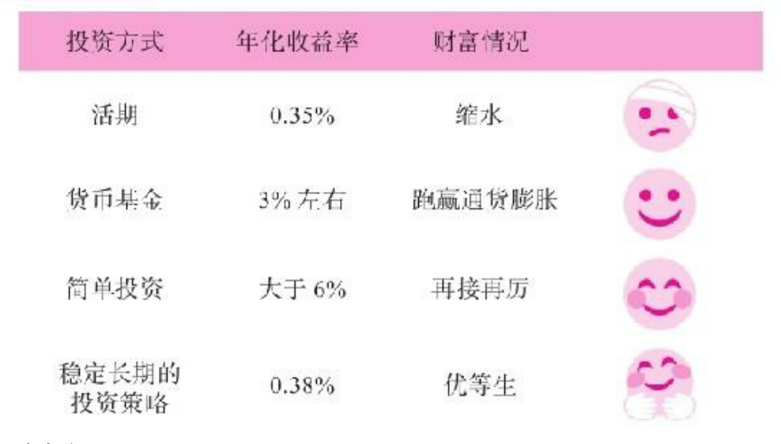

如果你去年把钱全部放在活期账户里，利率是0.35%，很抱歉，不及格，你的财富在缩水。

如果你去年把钱放在货币基金里，收益率在3%左右，恭喜你，至少跑赢了通货膨胀，不过还有很大的提升空间。

如果你去年通过简单的投资，收益率超过了6%，那么可以为自己点个赞，再接再厉。

如果你有自己稳定长期的投资策略，收益率可以稳定在8%以上，可以说已经是很棒的成绩了，优等生。

我们会发现大体有两种不同的获利形式。一种叫转让

价差，比如你4元买的股票，一年之后涨到5元卖出，这1元就是转让价

差收入。用1元除以成本4元，收益率就是25%。另一种是金鹅下蛋，包

括股息、利息等，比如用10万元买了一个年化5%的一年期银行理财产

品，到了年末会分给你5000元利息。

​	我们就要把它们统统换算成年化收益率。

​	年化收益率仅是把当前收益率（日收益率、周收益率、月收益率）换算成年收益率来计算。这是一种理论收益率，并不是真正的已取得的收益率。例如，日利率是万分之一，则年化收益率就是3.65﹪(平年是365天)。

> 通常当你投资一些结算周期比一年短的产品时，比如35天的银行理财产品、7天的国债逆回购等，对方会以年化收益率来宣传收益水平。
>
> 需要注意的是，不要误以为5%的年化收益率代表投入100元能收回
>
> 105元，而是要按照投资期限进行换算。比如投资半年，就算实际的年
>
> 化收益率为5%，半年后你只能拿到102.5元。
>
> 不知道你的成绩如何。有人说：“我想要20%、30%的收益率，能介
>
> 绍什么好产品吗？”大家一定要知道，有人统计了股神巴菲特1957—
>
> 2010年的投资情况，也只有年化20%左右的收益率。
>
> 比起某一次靠运气赚取的高收益，我们更应该寻找的是长期稳健的
>
> 合理收益。年化20%的收益已经是神一样的水平，我认为普通人通过资
>
> 产配置追求收益长期稳定在==8%~12%==是理想的状态。

## 总结

首先，检查自己的应急能力，获得说走就走的自由。

其次，检查自己的偿债能力，获得一份聪明的杠杆自由。

再次，检查自己的保障能力，获得一份对家人的责任自由。

最后，检查自己的生息能力，希望早日实现财务自由。

## 急需用钱时，你有哪些好选择

> 首先，我想向你提个问题，下面两种情况，你更愿意借钱给谁呢？
>
> 情况A：马上要付房租的小天，工资6000元要一周以后才发，房东
>
> 催得紧，他只好向你求助，想借2000元。
>
> 情况B：你的好闺密芳芳，最近又看上了一款名牌包。总是买奢侈
>
> 品的她，自己的工资根本不够花，信用卡也一直只还最低还款额。为了
>
> 买包，她向你借1000元。
>
> 我想你应该听说过这个大原则：救急不救穷。所以这个问题的答案
>
> 很明显，大部分人会借给情况A中的小天。

### 借钱的三个问题

#### 第一，你是为好东西借钱吗

们在前文的财务体检中提到了杠杆自由，讲的就是面对收益确定性比较高的东西，要敢于用杠杆放大收益。

以下是几个典型的为好东西借钱的情况：

- 职场考证需要花2000元，一旦考下来，每个月的工资会增加800元。

- 婚后自己住的房子。全家人都认为一定要拥有自己的房子才有安全感。这种情感上的需求也是我们在经济学效用里考量的一部分，虽然我认为租房会是未来大部分人的好选择，但是毕竟每个人的观念不一样，适合自己和家人的需求最重要。

- 投资用的房产。它的租金和未来升值的速度高于你支付的房贷利息。

总之，不管向谁借钱，一切借钱的本质，都是向未来的自己借钱。所以，是不是好东西，问问还钱时那个未来的自己，会不会同样得到足够的回报呢？

==你现在所做的一切，代价是什么？==

==凡事都有代价，孩子==

#### 第二，借完钱你会不会太累

在借钱之前，我们就更应该了解自己的负债情况，作为到底要不要借、借多少的一个重要判断标准。

> 公式一：总负债/总财富G≤40%

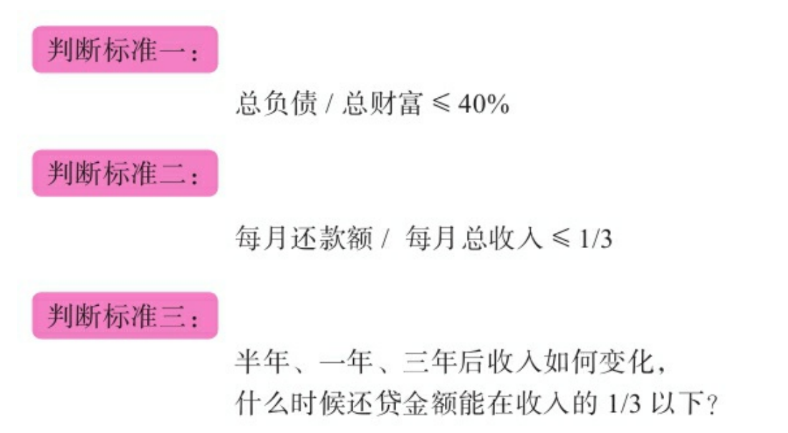

> 公式二：每月还款额/每月总收入G≤1/3
>
> 如果你的月收入为4000元，却要还3000元的债，就很可能会感觉压力太大。

==理财是为了生活从容淡定，而不是为了为难自己。==

如果一定要买，也要记住：第一，只付最低的首付款，不要全款买房；第二，还贷期限越长越好。

面对一些足够好的机会，我们可能会暂时觉得压力过大，同时觉得放弃的成本太大。怎么抉择呢？这时，可以试试动态观察我们的负债压力。

结合自己的收入变化，思考什么时候负债指标能达标呢？半年，一年，还是三年？我认为，如果你的负债比率能够在5年内回到正常水平，目前的负债压力只是轻度影响生活质量，那么就可以考虑负债。

如果结合这个动态负债率的结果，这个好东西还是让我们“想想就有点小激动”，不妨勇敢一点。说不定，良性的压力还能激发我们的潜能。

分享简七用户的一句留言：

面对机会，你在最坏的情况下也能自己承担，就是最好的结果。

#### 第三，你借钱的成本够低吗

借钱的成本一定要低于带给你的收益。这个收益可以包括潜在的、心理上的，而成本则很明确，就是你要还多少利息。

> 利息<收益

通常来说，当我们决定要借一笔钱时，主要考虑借款额度（能借到

多少）、放款速度（多久能拿到钱）、利率（要还多少利息）三个因素

来决定使用哪个渠道，它们有不同的优点和缺点。

1.尽可能在账单日之后刷大笔的金额，因为这样免息期最长。简单

来说，就是能更长时间地向银行免费借钱。

2.如果你有很多张信用卡，不妨利用记账或信用卡类App，以及信

用卡相关公众号进行管理，或者把还款日期设置在同一天。

3.我们每年都有一次修改账单日的机会。如果遇到某次账单金额过

大、还款吃力，可以充分利用这个机会，延长免息期。4.使用信用卡，千万不要本末倒置，为了优惠而额外消费。一句

话，尽量不提现、不分期、不循环授信。提现、分期付款以及循环授

信，这三项是信用卡利润来源最大的项目，也是费率最高的三项。这些

借贷看起来费率不高，但实际年利率非常高。

# 第5章 建立安全保障

## 保险是财务体系中基本的一环

关于保险，请大家记住两个关键词——少量可承受的保费和无法承受的经济损失。如果身边有人叫你每年花收入的20%甚至30%买保险，这就超过了合理范围。正常情况下，你的保费应该控制在年收入的5%—10%。

- 简单来说，重疾险就是一旦确诊重大疾病，就可按照合同约定向保险公司申请赔付。不管之后会花多少钱治疗，这笔赔偿金已经全额给付，不会增加或减少。

- 医疗险，主要用来报销医疗费用。无论是重疾，还是意外，只要发生医疗费用，就按照规定对医药费用进行报销，没有额外补偿。

大家可以参考以下几个计算保费与保额的方法，确定自己的保险区间。

- 最简单的倍数法：双十原则，即用年收入的10%作为保险预算，做足年收入10倍的保额。

- 补偿收入的生命价值法：未来还能工作多少年，把总收入减掉税收和个人消费等，得出你未来的经济价值。

- 以家庭责任、支出补偿为导向的需求分析法：不同的保险，应对不同的需求。主要是从支出的角度考虑，计算当不幸发生时，会给家庭支出带来多大的压力，给其他家庭成员带来多大的经济压力，根据这个实际缺口确定保额。

# 第6章 投资前必须知道的事

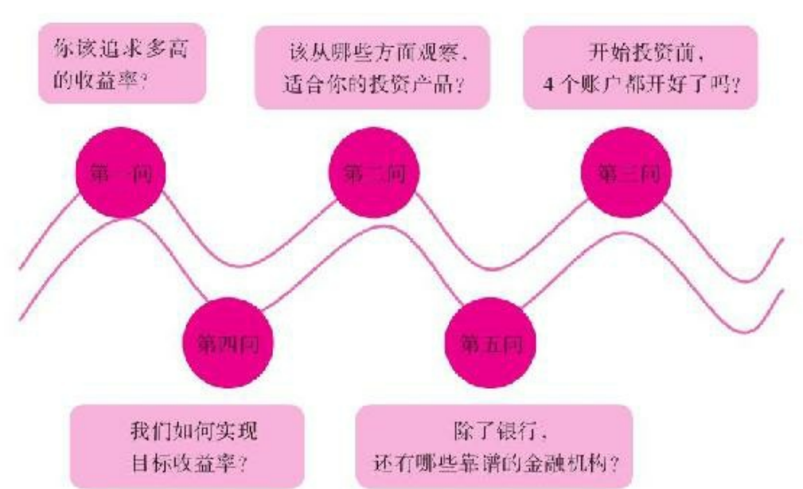

## 你该追求多高的收益率

> 预期收益率=无风险收益率+风险溢价

1. 无风险收益率的高低决定了我们应该追求最低多少的收益率。这个数字可不是一个恒定不变的值，我们通常通过观察短期国债利率来确定。

> 2017年3月10日是2017年第一批国债发行的日子，这一批国债可以通过银行柜台、网上银行购买，3年期的利率是3.8%，5年期的是4.17%。我会推荐老人用国债类的投资打理退休金，但是对于年轻人，这样的期限往往过长，收益太低。

==今年3月发行的国债3年利率是2.3%，5年是2.5%，后面越来越低，11月发行计划3年期限票面年利率为1.93%，5年期限票面年利率为2%。==

2. 风险溢价决定了我们能够追求最高多少的收益率。相信你听过一句话——风险和收益成正比。在投资上，它也是如同真理一般的存在。为什么说风险溢价决定了我们的收益呢？因为这跟我们能够承受的风险评级有关。

- 如果你对钱比较保守，非常害怕亏损，那么比较适合在一些比较保守和安全的品种上投资，比如货币基金、银行理财、保险理财、券商理财，有5%左右的年收益率水平就很不错了。

- 如果你能够承受中等风险，可以考虑增加一些网贷投资、权益类资产，那么可以预期5%—8%的收益水平。

- 如果你有比较高的风险承受能力，可以忍受投资组合某一年可能会出现10%—20%的亏损，通过配置较高比例的资金在权益类资产上，比如股票或股票型基金，那么长期来看，可以获得年均10%以上的投资收益。注意这是长期年化平均之后的结果，单个年份有可能面临亏损

==随着市场上好的投资标的减少，市场越来越成熟，未来这个收益水准很可能还会降低。所以未来一谈到收益率，或者利息，大家首先应该有一个概念。目前市场上，8%以上的投资收益率，就算比较可观的水平了。如果一个产品承诺给你超高回报，但是告诉你没风险或者风险很低，99%的可能是骗局。==

==时刻牢记，我们要求的回报越高，需要承担的风险也就越高==

## 你如何实现目标收益率

==其实在投资过程中，我们内心一定会经历欲望和理性之间不断拉扯的战争。为了早日到达财务自由的彼岸，欲望引诱我们走捷径，看上去高收益让我们走得更快了，但前面也许是万劫不复的深渊。在投资过程中，不是看谁走得快，而是看谁活得久。==

> 没有价值创造支持的收益来源，就是无源之水。比如很多互助项目承诺，投入10000元，不到一个月就让你赚3000元，30%的月收益率，也就是超过300%的年化收益率。听上去是不是很诱人？其实，这背后有极大的风险。这种风险，是可以通过简单的常识判断规避的。因为现在一家普通的公司，每年的利润率超过10%，已经是很不错的业绩了。什么样的借款人能承受超过300%的资金成本呢？这种明显高于正常水平的项目，都是骗局，都是在赌有人会接盘，谁接最后一棒，谁就输得最惨

## 投资品分类

我们可以把现金类投资、债权类投资、权益类投资和商品实物类投资看成投资四原色，其他很多资产都是以不同的比例投到这几个品类中。

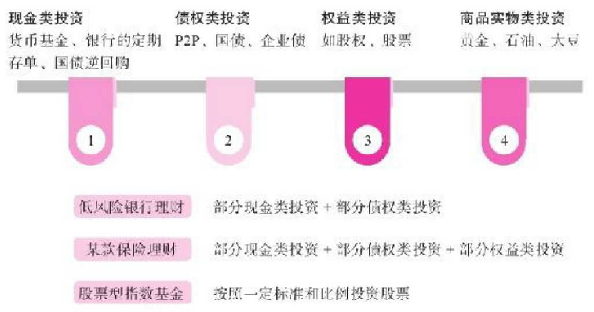

仅就这四类投资而言，一般来说，它们的风险水平逐渐升高，权益类投资和商品实物类投资的风险高于债权类投资，债权类投资的风险通常高于现金类投资。

> 风险：权益类投资和商品实物类投资>债权类投资>现金类投资

当然，这个风险程度也不是绝对的，要具体产品具体分析。债权类投资中的P2P网贷产品，也属于风险较高的投资品，因为这类投资大多是银行不愿意出借的借款项目。一旦出现风险，甚至有可能无法收回本金。所以投资的时候要格外注意鉴别平台和投资标的。

## 该从哪些方面观察适合你的投资产品

如何避免掉进投资中的坑呢？查理·芒格推崇用“检查清单”进行自查。他说：“聪明的飞行员永远不会忘记在起飞前核对他的检查清单，无论他拥有多么突出的天赋或多么丰富的经历。”

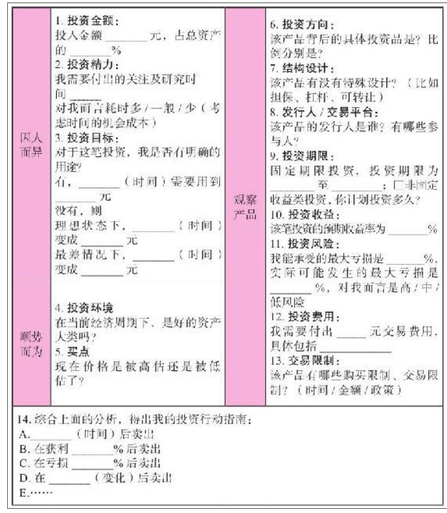

## 除了银行还有哪些靠谱的金融机构

那么到底怎样判断一个机构是不是合规地在卖金融产品呢？我想和你分享两个方法。

一看牌照。我国现在需要审批的金融牌照主要有12种，其中我们会经常接触的有银行、保险、券商、基金等。如果你买的产品跟以上任何一种有关，那么在填写自查清单时，你就要回答，这个产品的发行方是谁。然后去证监会、银监会等官方网站查询这个机构是不是榜上有名。没有牌照的，一律不要碰。

二看资金。这个主要针对P2P网贷。这个类型的产品由于最近五六年才兴起，所以暂时没有金融牌照可以查询，但是我们可以看它是否完成了资金银行托管，这个信息在官网上就能查到，或者可以直接打电话问客服。

## 开始投资前，**4**个账户都开好了吗

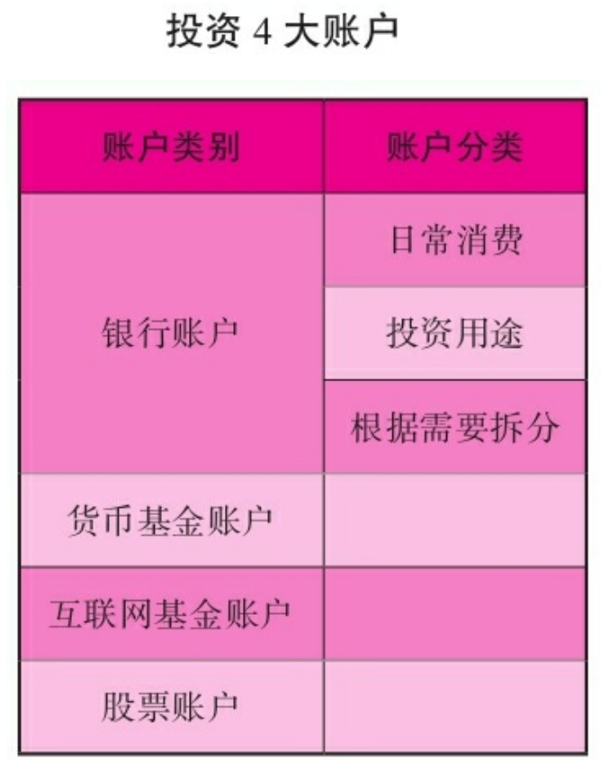

第一类是银行账户。银行账户上，我建议你至少办两张以上的银行卡，把日常消费和投资进行明确区分。可以把工资卡当作日常消费账户，再选择一张专门的银行卡用作投资，可以用来绑定各类投资账户、购买银行理财产品等。

当然，如果你的投资比较分散，希望再进行区分，比如投资P2P用

的卡、投资基金用的卡等，也是可以的。

第二类是必备账户，即货币基金账户。余额宝的本质就是一只货币

基金。货币基金既方便支取，又可以有一定的收益，是升级版的零钱

包。

第三类是互联网基金账户。基金是最适合普通人的投资方式之一，

所以推荐你在开始投资之前先准备一下此类账户。

除了一些基金必须通过股票账户购买外，选一个第三方基金代销平

台也是很好的选择，手续费更低，品种也更全，蚂蚁聚宝、好买基金、

天天基金都是比较大众的选择。在第三方基金平台开立一个基金账户非

常简单，你只需要准备好手机、身份证、银行卡和一台能上网的设备，

按照开户流程，随时随地都可以完成。

第四类是股票账户。可能很多读者都没想到这类账户。你们可能会

问，股票的风险很高吗？我不适合炒股，为什么要开股票账户呢？其

实，后面有不少低风险、高收益的投资方式，都需要通过股票账户进

行。

# 第7章 低风险的理财也有讲究

有一句话可以形容90%的人的生活状态：间歇性勇猛精进，间歇性混吃等死。反观我们的投资，何尝不是这样。到底如何进入投资的良性循环？我先向你介绍一类投资产品——==活期投资==。

## 花钱与赚钱两不误的活期投资

### 锦囊一：用货币基金，每天花钱、赚钱两不误

由于日常现金池最重要的任务就是支持日常消费，其次才是投资生息，所以我们选择的是最灵活的货币基金。

说到货币基金，大家可能最先想到余额宝，但货币基金可不只是余

额宝，比如在微信理财通中的余额+，还有可以在京东金融上购买的京

东小金库，背后都是货币基金。它有什么好处呢？

- 它的风险极低，主要投向如国债、银行定期存单、政府短期债券等较安全的产品。

- 特定的货币基金是消费的好帮手，既能进行支付，又能偿还信用卡。

1. 第一步：确定每月日常金额

在帮助KK的时候，我先让他设了一个不会太过分，也不会让自己的日子苦哈哈的合理月消费金额，一发工资，只留下这个金额，其他的钱用来做更长期的投资。也就是说，我们在现金池中留足水，让多余的水流入中短期目标池和长期金鹅池做投资。

2. 第二步：确定方便消费的货币基金

尽可能把日常消费的钱，全部转入一个方便消费的货币基金，然后用它进行支付。

你可以选择余额宝，也可以选择一些银行卡自带的、可用作消费的货币基金，如中信银行卡的薪金煲功能、招商银行的朝朝盈功能。这样一来，不仅更容易统计消费，而且零钱也在生息。

3. 第三步：确定方便还信用卡的货币基金

每次出现信用卡大额消费时，将一笔等额的钱存入另一个独立的，可以直接还信用卡的货币基金。这样，不仅避免了还卡的尴尬，而且能产生一笔利息。

### 锦囊二：用互联网活期理财，管好几个月后要用到的钱

几个月以后要用到的钱，其实在我们的生活中也很常见，比如需要三个月一付的房租、平时存下来的生活应急准备金，甚至包括你筹划下半年要去旅行的资金预算。

这些钱，只要满足到某个时点可以取出来用即可，不像我们每天都要吃饭、乘车，需要及时和频繁地使用，所以对投资渠道的便利度要求不像日常资金那么高。我们也可以选择一些灵活性稍微差一点，但是收益更高的产品

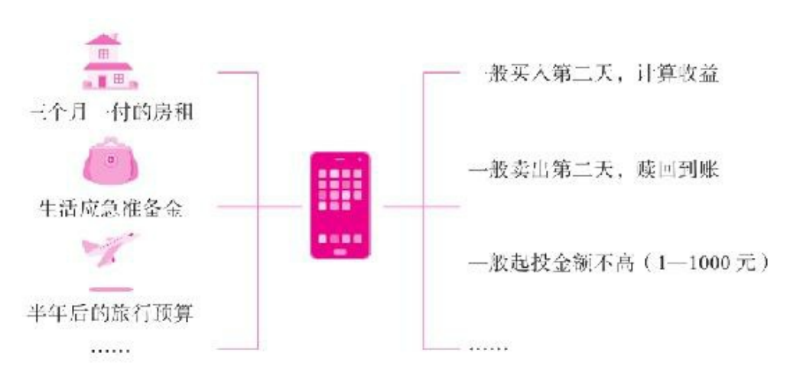

其中一个比较合适的选择，就是各类互联网理财平台发售的活期理

财产品。这些产品一般很难像货币基金那样随存随取，但是通常可以做到在买入的第二天就开始计算收益，在卖出的第二天，就可以赎回到

账。总体来说，还是不错的。

这类产品还有一个好处，一般起投金额都不高，从1元到1000元，

是比较常见的起投范围。不像很多银行理财或者券商理财产品，动不动

就要5万元起，显得特别高冷。

#### 去哪里找这类产品呢？

既然说是互联网活期理财，其实就是到各大互联网理财平台的网站

或者手机App中寻找。比如腾讯理财通、平安集团陆金所、百度理财平

台等比较大的平台。

在这些互联网理财平台上，只要找到“活期产品”，或者“灵活赎

回”“随存随取”等字样，就会知道它们属于活期类产品。

这一类产品，通常风险比货币基金要高。所以我们在投资之

前，一定要提前调查清楚，对我们的钱通过产品，到底投向哪里，做到

心里有数。

1. 第一类，就是换了一个“马甲”的活期产品。

2. 第二类，是平台把我们的钱委托给了别的投资管理公司去做投资，投资范围非常广，从银行票据、债券、基金到一些证券公司发行的理财产品，都有可能。一般我们在详细的产品说明里，可以看到这个产品投向不同产品类别的比例约束，同时，还会给出一个风险等级的参考水平。
3. 第三类，是背后投向的，是养老公司发行的养老保障委托管理产品。
4. 第四类，其实就是我们在P2P平台上常常见到的那些活期投资。这一类投资一般风险都比较高，而且如果平台操作不规范，很容易出现问题。

==所以千万要在看清楚背后的投资资产并判断风险后，再谨慎投资。==

其实，除了活期类产品，我们还可以根据这些资金的期限和流动

性，选择投向一些定期理财产品，比如定期银行理财、定期互联网理

财，或者债券型基金等收益变化比较平稳的产品。

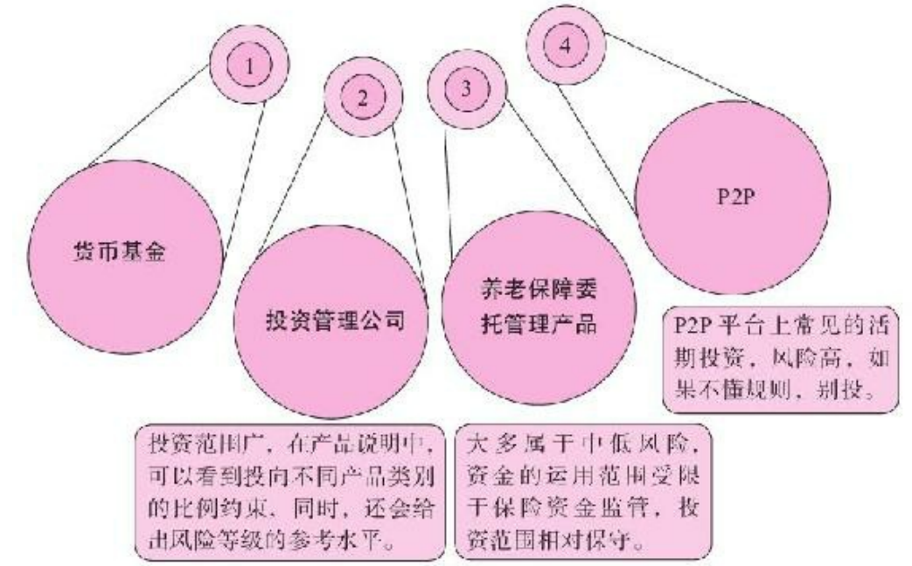

### 锦囊三：投资间隙，钱突然闲置了，怎么投资来过渡

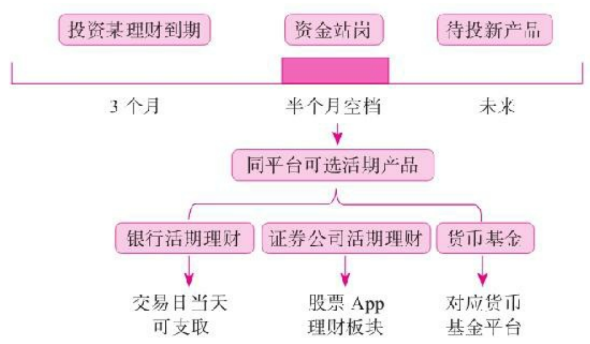

一旦遇到这种情况，投资思路非常简单，因为几乎各类主流投资品种，都有对应的活期产品可以暂时“收留”我们的钱。

> 比如，如果你买银行理财产品碰到了间隙，可以考虑去买银行的活
>
> 期产品，这一类产品叫银行T+0理财，所谓T就是交易日当天的意思，
>
> T+0意思就是交易日当天可以支取。
>
> 如果你炒股，股票App里也有活期理财产品可供选择，我们一般可
>
> 以在理财板块中找到。
>
> 这两类活期产品的风险和收益一般属于中低水平。

总之，面对这类情况，我们的原则是，为了方便继续投资，让钱在同一个平台体系内循环即可。

## 银行存款和国债

### 银行存款

#### 问题一：如何让存款收益更高

- 技巧一：比较不同银行的存款利率浮动水平，选择利率上浮水平更高的银行。

大家可以通过查询各家银行的官网，来方便地比较利率。一般来说，四大行的存款利率都比较低，股份制银行、城商行和信用社的利率一般较高。

- 技巧二：20万元以上，考虑购买大额存单。

大额存单是指由银行业存款类金融机构面向个人、非金融企业、机关团体等发行的一种大额存款凭证。与一般存单不同的是，大额存单在到期之前可以转让，期限不低于7天，投资门槛高，金额为整数。

==大额存单的发行利率不受存款利率浮动上限的限制，比同期限定期存款的利率高==。目前银行发行的大额存单利率，大多在基准利率基础上上浮40%，少部分银行上浮45%，而定期存款最高上浮30%。一些期限长的大额存单，收益可以赶超银行保本类理财产品，相比之下有一定的吸引力。

大额存单的高收益，就是给大客户的优惠利率。目前市场整体收益率不断下降，大额存单在低风险投资中的优势越来越明显，但大额存单有==20万元==的起购门槛限制。

大额存单的期限包括1个月、3个月、6个月、9个月、1年、18个

月、2年、3年和5年，期限选择比普通存款更灵活。

另外，大额存单的流动性也比较好。如果需要使用没到期的大额存

单，有两种办法：

- 提前支取。大部分大额存单可以提前支取。但不同于普通定期存

款，提前支取按照活期存款计算收益，不同银行对大额存单提前支取的

收益，有不同的规定。一般来说，提前支取不太划算，我们可以考虑第

二种方式。

- 直接转让。大额存单，由于是标准化的存单，还可以像股票一

样，在指定的二级市场转让。现在不少银行推出的大额存单，都含有可

转让功能（见表7–1），银行还会提供协助完成大额存单转让的服务。和受让方协商转让的收益，这样，你的损失会更小。

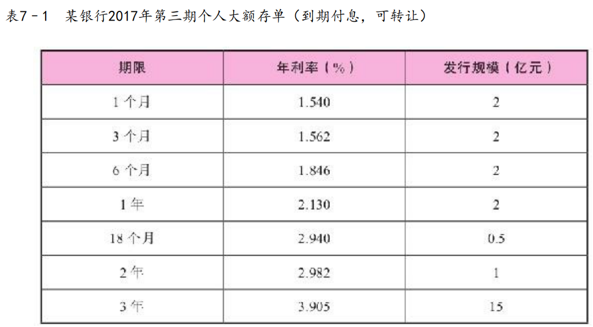

#### 问题二：想买的理财产品，不是买晚了就是买不到，怎么办

通知存款是一种不

约定存期、一次性存入、可多次支取，支取时需提前通知银行、约定支

取日期和金额方能支取的存款。

你只要记住两个前提和一个通知就够了。目前，通知存款有两种，1天通知存款和7天通知存款，起存金额为5万元。所以，两个前提就是：

- 你准备存入的钱至少要有5万元。

- 你确定未来这笔钱，超过1天（或7天）都用不上。

一个通知是指，当你准备支取通知存款时，分别需要提前1天（或7

天）告知银行，才不会有利率损失。

> 我有个朋友，公司在除夕夜发了6万多元年终奖。她选择在除夕夜
>
> 用手机银行把这笔钱存入7天通知存款，同时办理告知7天后赎回的手续。
>
> 这样，7天后到期，她可以按照7天通知存款的利率结息。比起不做
>
> 处理的活期存款，收益有4倍以上。

通知存款有两个注意事项：

- 收益计算。它的计算方式和一般活期存款不同，满足对应期限和

对应期限整数倍的日子，才会按照指定的利息计算，其余时间按照活期

利息计算。

- 部分支取。通知存款可以部分提取，但前提是必须保证该笔通知

存款的余额要在5万元以上。

虽然通知存款有一些门槛，收益也不算高，但在适合的场景下，可

以成为大额资金的好选择：

- 遇上周末或者节假日，没有其他理财产品可以买。

- 需要办理三个月以下的大额存款证明（20万元以上可以考虑大额

存单）。

- 有一大笔资金要在你的某个账户里躺几天，比如一笔银行理财到

期后，你计划继续购买，但中间有几天间隔（如果该银行账户自带随存

随取的货币基金，也是好选择）。

#### 问题三：需要提供存款证明时，怎么办理好

#### 问题四：如何存钱更灵活

> 我曾遇到一位老人，为了收益高一些，把30万元存了5年期定期，
>
> 结果过了1年要用7万元，只能提前支取。于是这7万元在银行存了1年多，只能根据活期利率来计息。

学会搭配不同期限的定期存款，就可以避免这种情况。比如，这位

==老人可以把30万元拆分成3份，分别存1年期、3年期和5年期，每笔到期后自动转存。这样不仅能够保证每年都有一笔存款到期，也可以尽可能享受更高的存款利率==。再比如==12单法，也是用了期限搭配的方法：每月将一笔存款以1年定期的方式存入银行，坚持12个月。从第二年第一个月开始，每个月你都会获得一笔定期收入。这时，你可以选择加入新的投资本金，继续如此投资==。

利用这个方法，一年后我们就可以既享受1年期定期存款的收益，还可以享受每月有存款到期的高流动性。

期限搭配的方法，在所有固定收益类产品上，都可以应用，一通百通。学会这种方法，以后会有很多用得上的地方。

### 国债

#### 国债有什么价值

国债本质上是国家向我们借钱，有了国家信用作为后盾，可谓安全

性很高的投资产品。用债券这种非常标准的形式包装后，国债就变得更

有价值了。

##### 投资价值

把钱借给国家，然后赚取稳定的收益，这很好理解。一般来说，国

债的收益率要高于同期的银行定期存款，这也是一些非常保守的投资人

非常喜欢国债的原因。

即使你不买国债，也很可能会买货币基金、银行理财、债券基金等

常见的固定收益类产品，它们基本上都会配置一部分国债。

除此以外，一些国债还可以像股票一样，直接用证券账户买卖，所

以有可能从中赚取买卖差价。

##### 了解市场的无风险收益率

。如果我们细心观察生活中的一些

指标，就能把握宏观经济的变化趋势。国债的利率也是一种很好的观察

指标。

，所以我们往往会把短期国债的利率视作市场的无风险利率。

国债收益率不断下降，大家还是争先购买，这说明大家想轻轻松

松、不冒什么风险就能获得的收益少了。再进一步说，在市场上想赚取

同样的收益，比以前更难了。所以，无风险收益率是衡量市场整体赚钱

水平非常好的一个参照物。

前几年国债收益率不断下降，这也是近年来很多专业人士都会说，

大家应该把投资收益率目标放低一些的原因。一些新闻报道感叹，低收

益时代离我们越来越近了，也是这个道理。

##### 了解国家财政政策的风格

首先，发行国债本身就是国家财政政策的一种具体措施。国家发行

国债，我们购买，政府可以支配的钱就会变多。通俗来说，就是它会有

更多的钱来“集中力量办大事”。

一般来说，国债发行量较大的年份，往往反映国家在实行积

极的财政政策。比如，2007年，我国的国债发行量明显增加，财政政策

开始更积极。

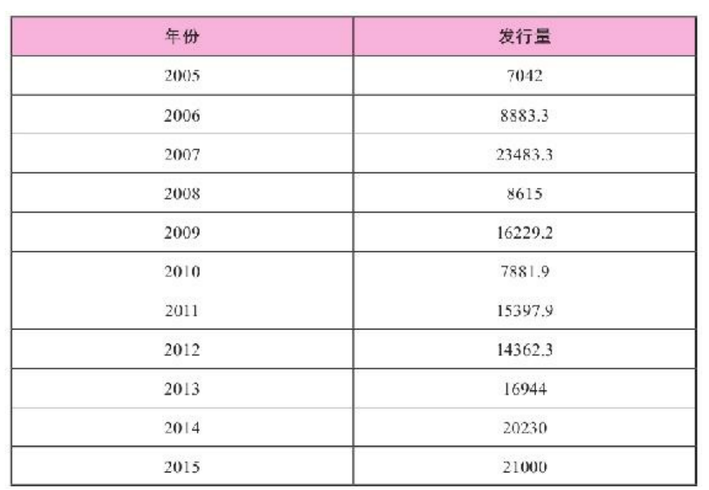

##### 什么时候适合买国债

虽然国债非常安全，但是收益率整体比较低。如果仅持有国债，长

期来说很难跑赢通货膨胀。其实，一般情况下大家都来疯抢国债的情况

并不常见。如果某些时刻大家都来买国债，很可能说明市场混乱，安全

性排在了第一位。当很多人都这么想时，国债会被格外追捧。国债的热

门程度，可以用来判断市场上大家的避险情绪高不高。

其实，作为超低风险的资产配置选择，可以买一些。这可能有点老

套，但真理就是这么朴实。另外，如果你觉得未来大家可能会有避险情

绪，也可以提前买一些。

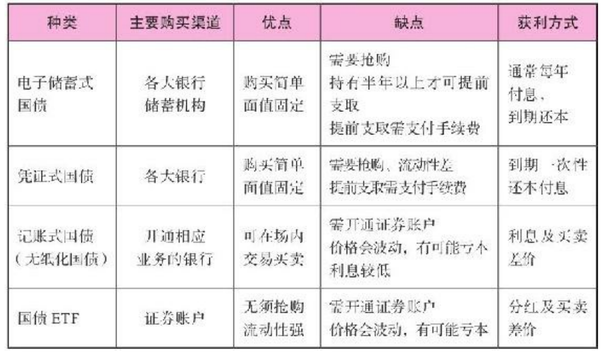

# 第8章 如何选择理财产品

经常有朋友问我，银行理财是否安全。其实，这就是我们首先要避

免的一个投资误区。上面提到的产品分类，只代表发行或发售机构，并

不能直接判断其投资风险如何。

不少人出于对券商的不了解和对保险公司的不信任，认为银行出品

的理财产品是最优秀、最安全的。其实，并不是这样，发行机构和背后

的资产不是直接关联的。

不同金融机构都会利用“投资四原色”中的不同基础投资品，搭配出

一系列理财产品。这就好比，无论是哪家饭店，都可以选择某些原材料

来做特定的菜式。

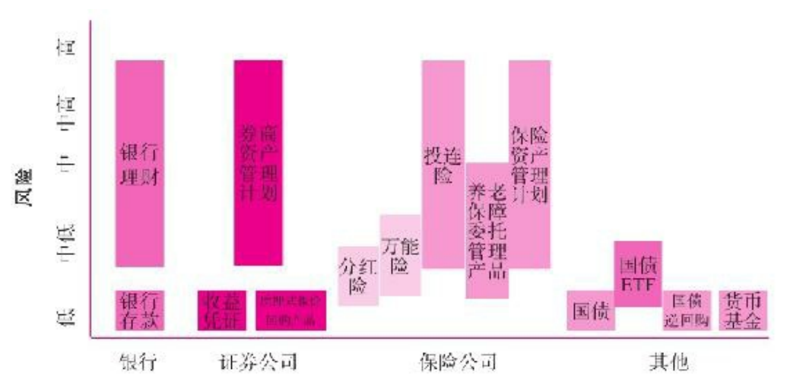

你会发现，银行理财、券商资产管理计划、投连险、保险资产管理

计划等产品，风险跨越了低、中、高。因为这些产品本身可以投资的范

围非常广，一定要具体产品具体分析。

==面对越来越多的新产品，先从风险维度，根据自己的需求挑出几个相似的产品，再比较其他细节，是比较好的思路==。

我们整理了不同产品的投资门槛，你可以根据自己的资金量做合理的组合。

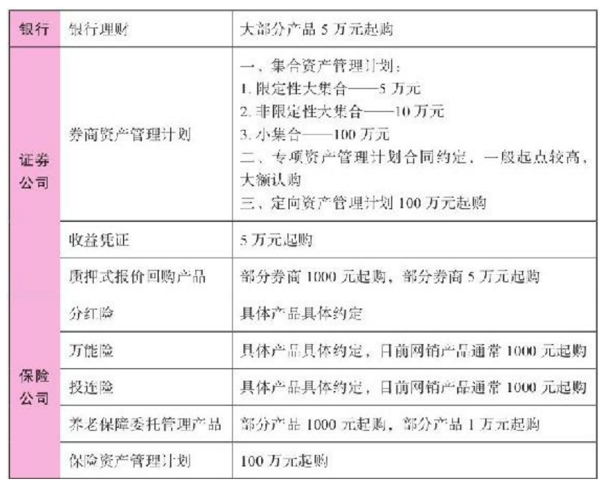

  从风险和门槛来说，银行理财并没有明显比券商和保险理财风险低

或者更亲民，尤其从风险角度来说，这三类产品都需要具体产品具体分

析。

作为资产配置的好选择，我们既可以从中挖掘低风险的现金类、固

定收益类理财产品，也可以筛选一些适合的权益类投资产品博取高收

益。

## 银行发行的理财产品

目前来看，银行理财的确是低风险固定收益类投资的好选择，大多

数银行理财产品都属于这一类。

但是，现在银行都有几千家了，银行理财产品更是令人眼花缭乱，

面对那么多银行理财产品到底怎么挑呢？

### 筛选适合你的理财产品

### 明确购买需求

==无论做什么投资，我们都不应该直接陷入对具体投资品的讨论，而是应该先回归自己的需求、自己的节奏。==

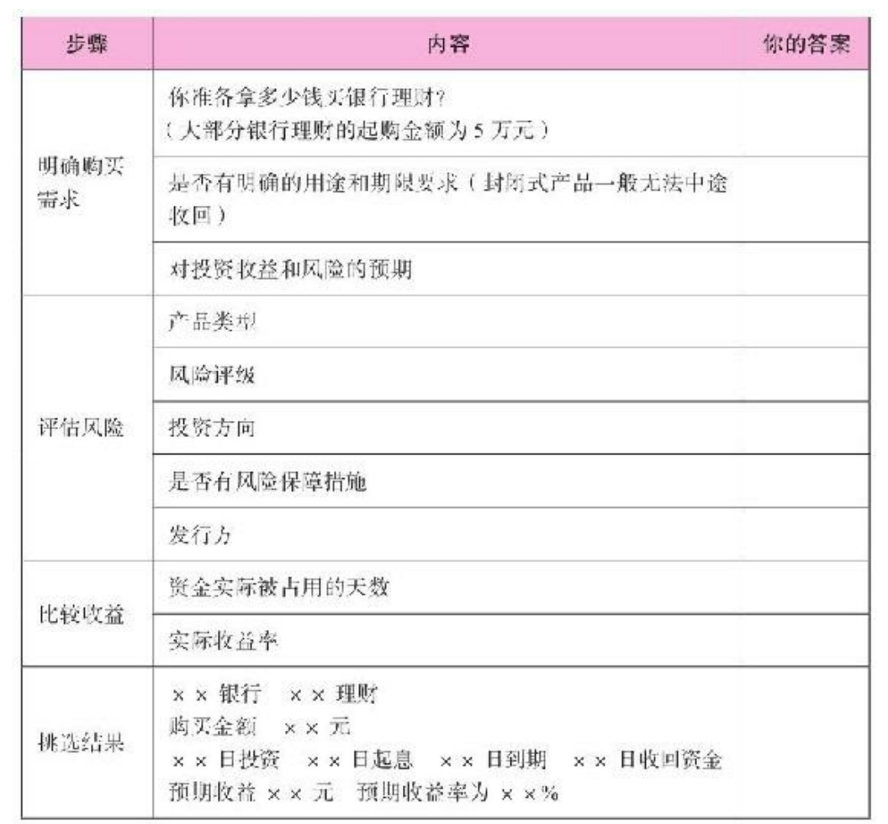

1. 你希望拿出多少钱来购买银行理财产品？

我们一般用对安全性要求较高的资金购买银行理财产品。通常银行理财产品的起购金额是5万元，所以资金太少的话，就得先考虑其他选择了。

2. 这笔资金，是否有比较明确的用途和期限要求？

不少银行理财产品都有固定期限，所以如果你有明确的使用计划，

一定要记得让银行理财产品的期限配合你的用途。

封闭式的银行理财产品一旦成立，基本不能像定期存款那样，可以提前支取。颇有一点买定离手、概不退货的霸气。所以买之前一定要注

意自己的用途。开放式理财产品可以接受赎回，赎回条件要看具体产品

的说明书。

3. 你对投资收益和风险的预期是怎样的？

2016年，根据统计，银行理财产品的收益率主要为3%—5%，比货

币基金的收益高1%—2%

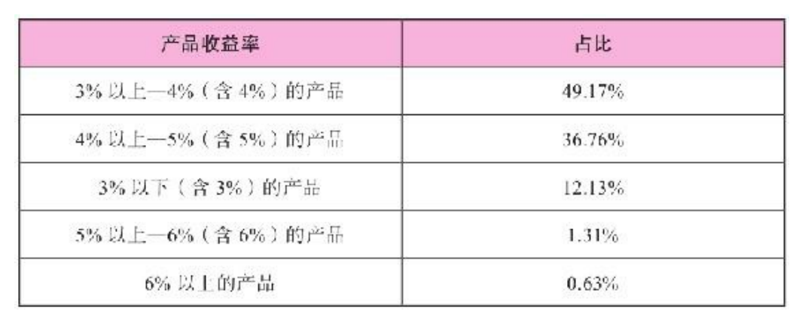

### 评估风险

#### 产品类型

很多人认为银行理财和银行有关，和银行存款差不多，很安全。这

个观念其实并不正确。

> 某天，一家信托公司找到银行，想募集8000万元资金，作为某个产
>
> 品的优先级资金，年化收益率为7%，期限为1年。
>
> 领导把这个任务交给了小布，小布做了这样的设计：找银行托管一
>
> 整笔交易，托管费为0.02%/年，发行、管理这个产品需要人力、物力，
>
> 所以需要再支付托管费用，这个固定管理费率为0.2%/年。银行也不能
>
> 白做这笔买卖，银行决定留存2%的收益作为利润。
>
> 7%–0.02%–0.2%–2%=4.78%
>
> 于是，最终一款年化收益率为4.78%，期限为1年，额度为8000万元的银行理财产品诞生了。
>
> 当然，实际操作过程中会更复杂，比如银行会首先评估项目的风险
>
> 情况，采取一些风控措施。银行理财产品的投资方向也更复杂，往往是
>
> 多种投资品的混合。另外，还要考虑募集期等时间因素。

由于这笔钱会被投资到各种不同的资产上，风险就千差万别了。一

个主要投向房地产信托的银行理财产品和一个主要投向银行间存款的银

行理财产品的风险大不相同。

给大家介绍一下银行理财能够投资什么、不能投资什么

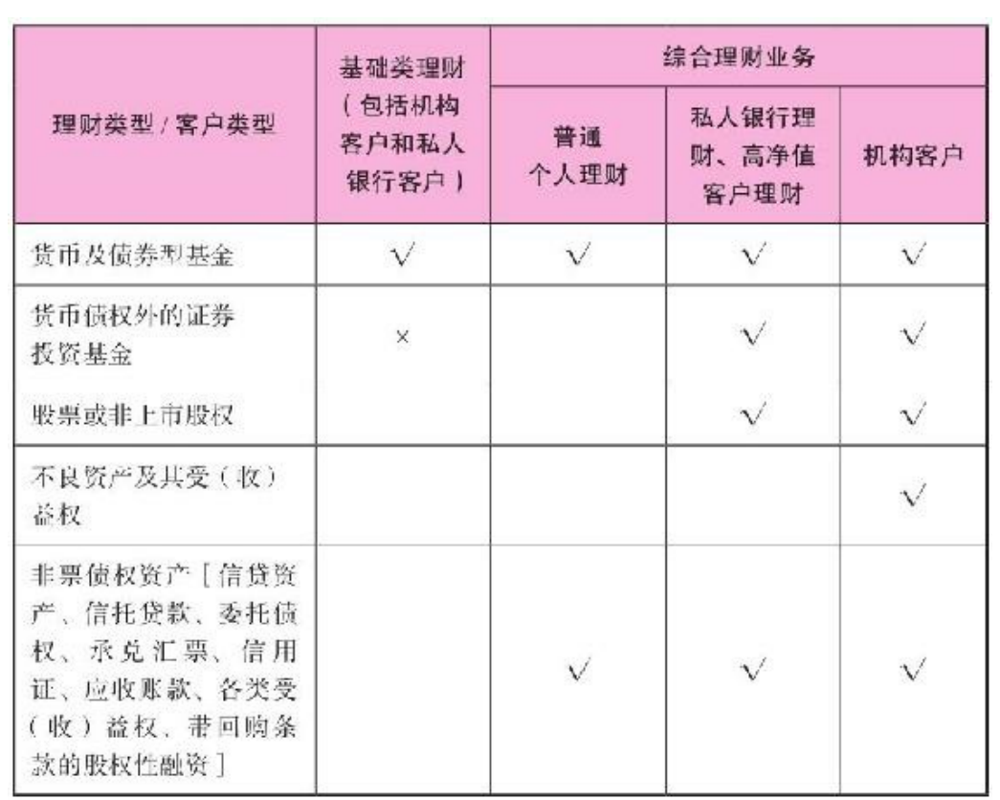

我们在购买银行理财产品的时候，要多一个心眼，关注银行理财产

品的说明书，可以看到本产品中资金的投向和比例。

例如，我们在某银行官网上找到一款银行理财产品，这个产品的说

明书上的投资方向与比例是这样写的

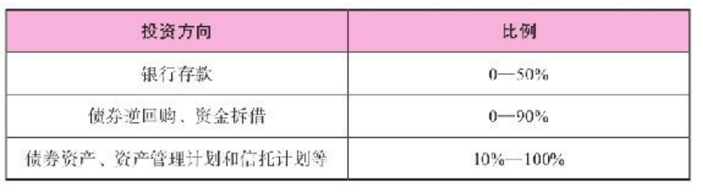

可以看到，投资方向都是风险等级比较低的，而且网站上标注这个

产品的预期收益是4.3%，由此可以判断，这款银行理财产品的风险比较

低。

> 根据全国银行业理财信息系统统计发布的《中国银行业理财市场年
>
> 度报告（2015年）》显示，债券和货币市场工具、现金及银行存款是投
>
> 资大头，非标准化债券占比位列第三。回顾2016年的银行理财资金，主
>
> 要投向基本没有变化，整体风险较低。

#### 风险等级

银行理财产品说明书中一般都会标注所属的风险等级，也值得关

注。风险等级通常分为5级，从R1到R5（见图8–3），也有部分银行分

成6级。级别越高，风险越高。

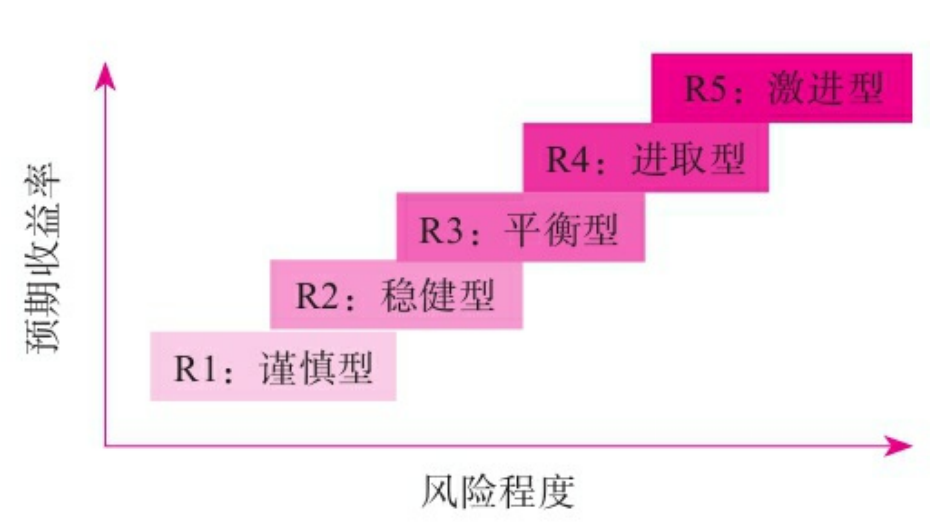

R1、R2等级的银行理财产品的风险非常低，基本都能达到产品标注的预期收益率。除此以外，仔细阅读产品说明书中是否有担保条款等

风险保障措施，也可以进一步判断风险情况。

#### 分类

很多人一听到保本、保收益，都觉得很好，实际情况并非如此。

> 例如，图8–4中的三种银行理财产品，从预期收益率来看，B的收益
>
> 最高，实际上B的实际收益最低，这与它是结构性产品有很大关系。
>
> 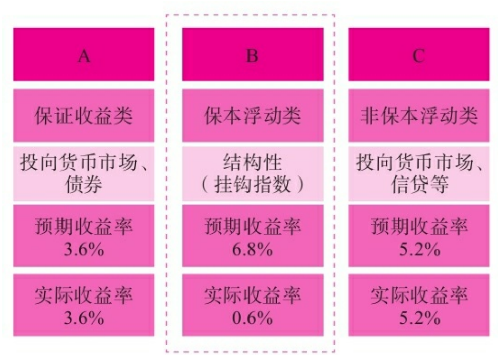

我们在比较银行理财产品的收益率时，最重要的是关注投资方向和

产品设计，不能简单地以保不保本来做判断。事实上，目前市面上的低

风险、非保本浮动收益类产品的发行量最大（见表8–6），也最受欢

迎。

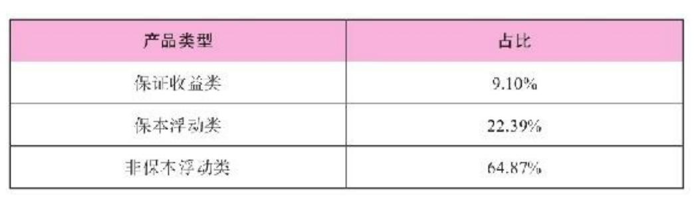

#### 查看发行方

银行发售的理财，并不仅仅有银行理财。现在的银行有点像一些网

上的购物平台，除了有自营商品，还会代销他人的产品。比如，一些基

金、信托、保险类理财也会借银行柜台发售。另外，还有银保产品、银证产品等合作产品，分别是银行和保险公

司、证券公司合作发行的产品（见图8–5），也需要仔细观察，投资方

式和范围可能与纯粹由银行发行的产品有所不同。

购买之前，要看清楚产品发行方和管理方。

除了一些活期类银行理财产品，目前市面上最常见的，且最受大家

欢迎的银行理财产品，通常有以下一些特点：

·期限一般在1年以内，有固定期限。

·多是非保本浮动类产品，年化收益率在3%—5%。

·风险等级一般为R2。·投资方向主要是中低风险的债券和货币类市场。

这样的银行理财产品，往往可以作为升级银行存款的低风险投资渠

道。

#### 比较收益

一方面，我们可以货比三家，挑选预期收益率更高的产品。另一方

面，仅看收益率可能会踩坑，这坑就是时间。

如果你在认购期的第一天就买到了银行理财产品，那么除了购买日

和实际算收益的时间，在认购期、募集期以及最后到账前的回款期，你

的资金都是不可用的，收益率也会受影响。

> 例如，有两款银行理财产品
>
> （90天），风险差不多，A产品的预期收益率为6%，B产品的预期收益
>
> 率为5.4%，为什么人们可能会选预期收益率更低的B产品呢？
>
> 让我们仔细看看这两款产品。
>
> A产品：认购期7天，募集期1天，到期后2天到账，因为比较抢
>
> 手，认购期的第一天就要抢购，实际第100天才能收回本息，实际年化
>
> 收益率是5.4%[6%×90÷（7+1+90+2）]。
>
> B产品：认购期7天，募集期1天，到期后当晚到账，因为不抢手，
>
> 认购期最后一天购买即可，实际92天可以收回本息，实际年化收益率达
>
> 到了5.48%[5.6×90÷92]。

==认购期与募集期之间，只有活期利息。在产品说明书中若写有“遇到节假日，要顺延到工作日”，则更应该好好算算自己的资金实际占用时间。==

一般来说，银行理财的相关费用都会在产品说明书中有明确注释，

常见的包括托管费、管理费、销售费等。一般来说，这些费用会在显示

预期收益率或者产品净值前扣除，所以直接比较预期收益率或净值即

可。

#### 银行理财这么多，如何挑选与比较

向大家推荐以下几种方法：

- 各大银行官网（最详细，有完整的产品说明书，但各家互相独立，不方便跨行比较）

- 中国理财网（银监会批准设立，最权威）

- 金牛理财网（《中国证券报》设立，界面易用）

### 手把手带你买银行理财产品

购买途径：线下购买和线上购买（==网上银行、手机银行、直销银行==）。

第一步：线下完成风险评估测试。首次购买银行理财产品比较复杂，因为我们必须携带身份证，去该银行的线下网点完成一次风险评估。

需要注意的是：

- 你可以购买风险等于或低于测试结果的银行理财产品。

- 每家银行都需要单独做测试，不通用。

- 每次测评的有效期为1年，不过从第二次起，这个风险评估可以在线上完成。

第二步：线下购买银行理财产品。完成风险测试后，线下购买银行理财产品，需要准备好该银行的一张借记卡，存入相应的投资金额，然后签署相应产品的购买合同和风险提示说明，并用该借记卡完成支付。

第三步：线上购买银行理财产品。如果你已经在某家银行完成了风险测试，之后购买这家银行的银行理财产品，就可以在线上操作了。线上操作的方法很简单。

### 比起大银行，不妨关注一下城商行及股份制银行

一方面，在产品风险差不多时，中小银行的银行理财产品的收益率往往更高。

另一方面，选择产品发售更频繁、不难抢的银行，当我们想买银行理财产品时，就能买到即将起息的产品，资金的利用效率更高。

### 期限搭配，灵活**+**高收益两不误

可以将你的资金分成几份，分别购买不同期限的银行理财产品，使它们到期的时间相差一个月左右或更短的时间。到期后继续投入，保持每隔较短的时间，就有一笔银行理财产品到期的状态。

### 巧用通知存款、银行活期理财，不让钱休息

在购买银行理财产品时，在募集期，只按照活期计息。如果产品不需要抢购，募集期的最后几天也能买，你不妨在之前先把钱存入通知存款或者该银行可以随时支取的活期理财产品，收益会更高。

### 季末、年末，银行理财产品的收益往往更高

一般来讲，在季末、年末时购买银行理财产品是一个很好的时机。这时，银行理财产品的收益率相较于前一段时间会提高大概0.5个百分点，当“钱荒”时，提高的幅度会更大。

## 证券公司发行的理财产品

### 券商理财

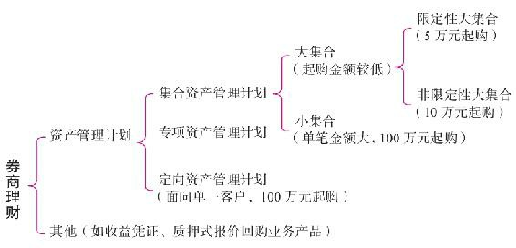

这些产品中，我们比较容易购买的是==集合资产管理计划、收益凭证和质押式报价回购业务产品==。

我们不能单纯地说××发行的产品就一定好或一定不好。我们需要用更普遍的方法去分析一款产品（见表8–7），再判断它的风险和收益水平是否符合自己的需求。

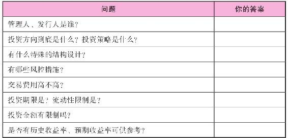

## 保险公司发行的投资品

有了越来越多的资金，也有了越来越大的投资权限（见图8–12），保险公司的目标自然是希望做更好的投资、赚更多的钱。

买保险，保障功能和投资功能，千万不要混为一谈。这就好比你把红墨水和蓝墨水混在一起，很难得到理想的红色或蓝色。

买任何保险之前，请大家务必先回答这个问题：买这款保险产品，你是为了保障，还是为了投资？

### 投资属性的保险

## 银行、券商、保险公司，谁家的理财产品更值得买

一方面有了越来越多的新产品，另一方面各种金融机构的产品的共同点越来越多。

当对任何产品有所疑惑的时候，你都不妨从以下三个角度重新审视一下这个产品：

- 它背后的基础资产是什么？

- 它的投资策略是什么？

- 它的发行方和管理人是谁，他们的投资能力如何？

# 第9章 巴菲特推荐的指数基金
