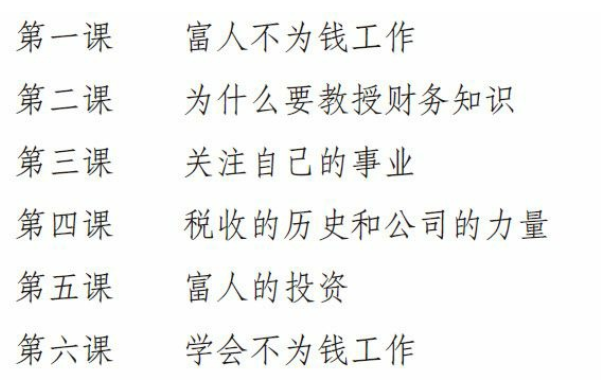
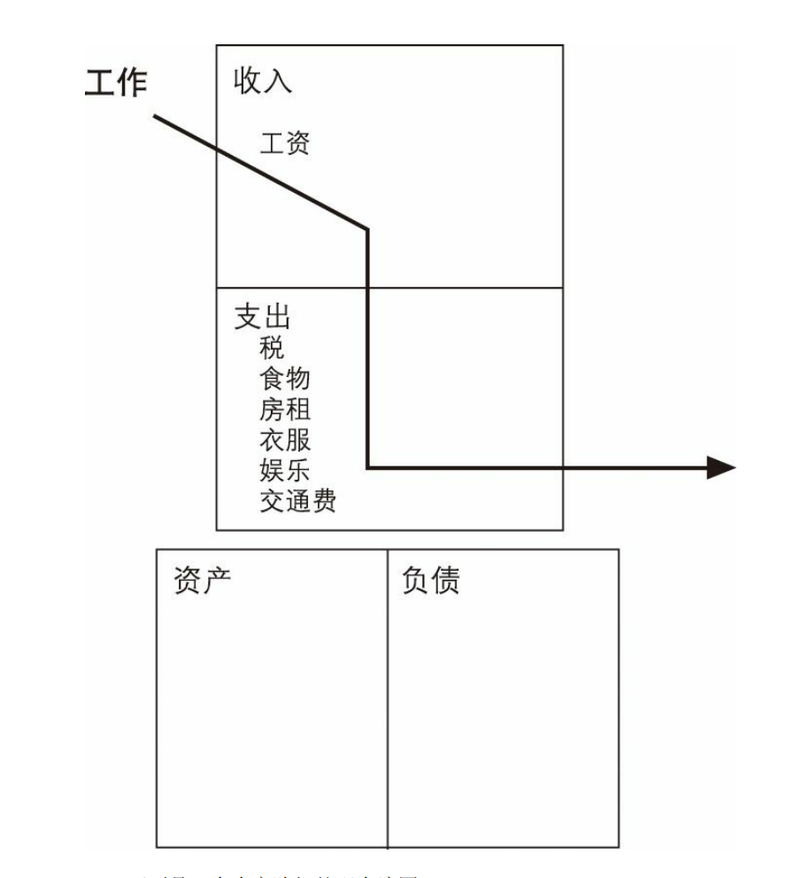
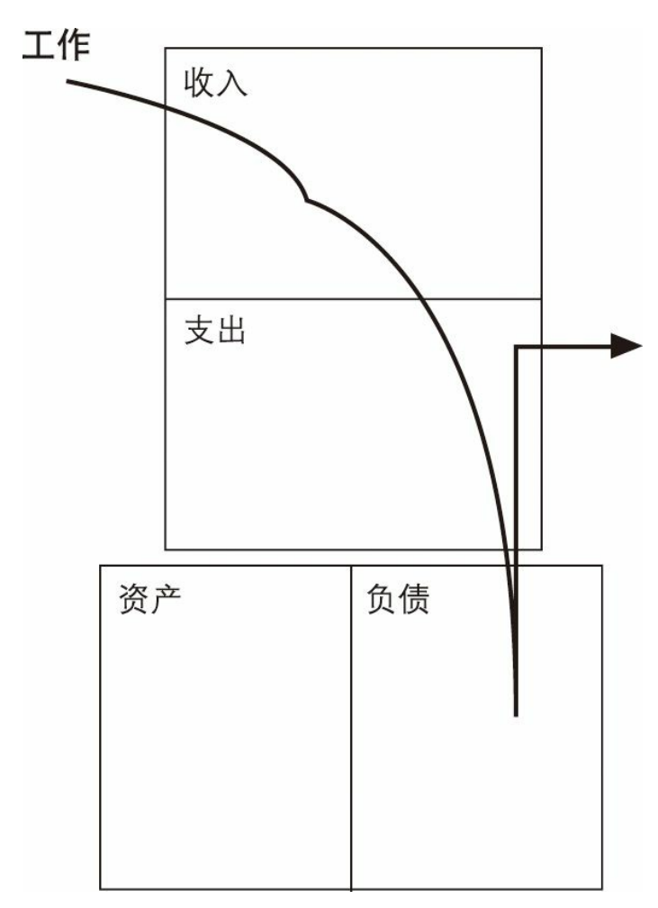
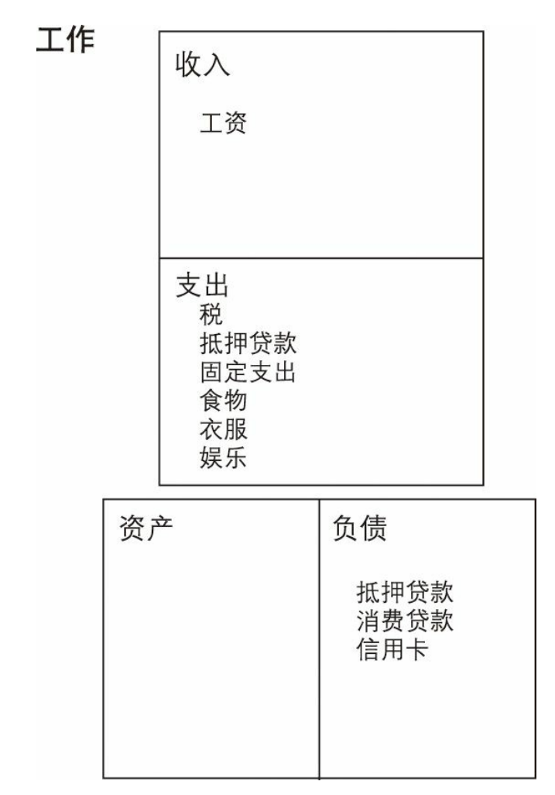
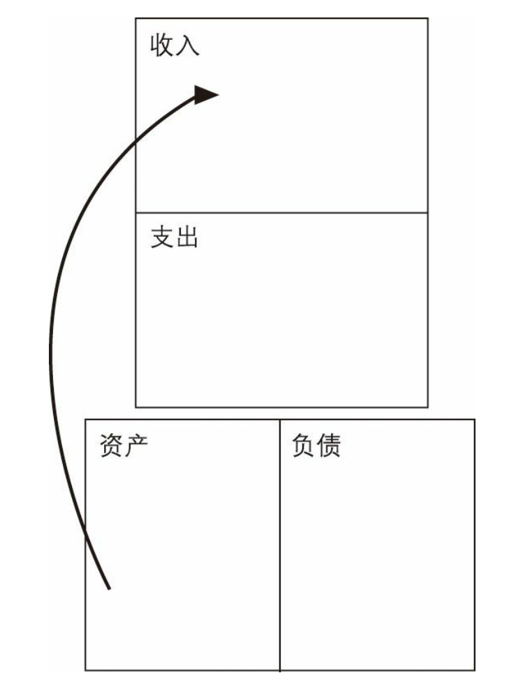
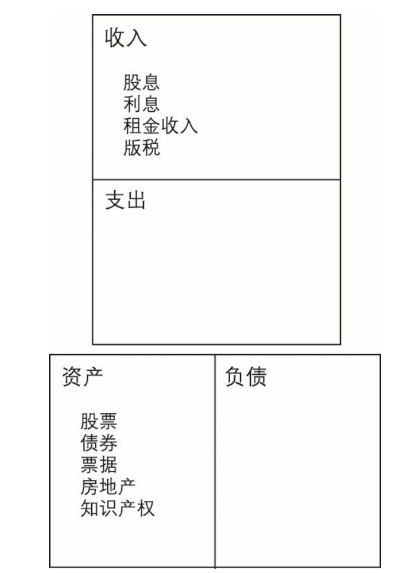
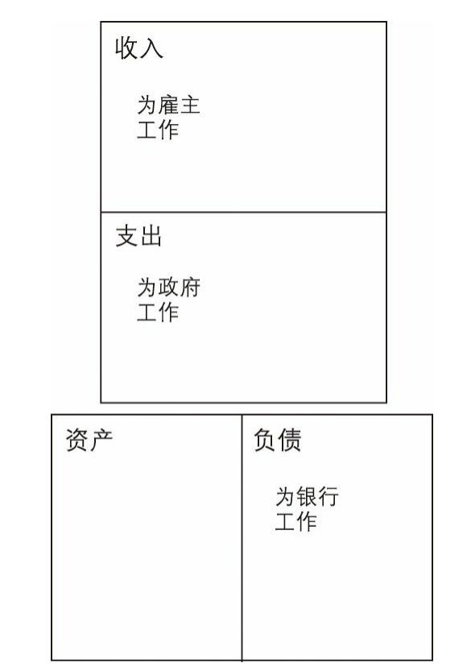
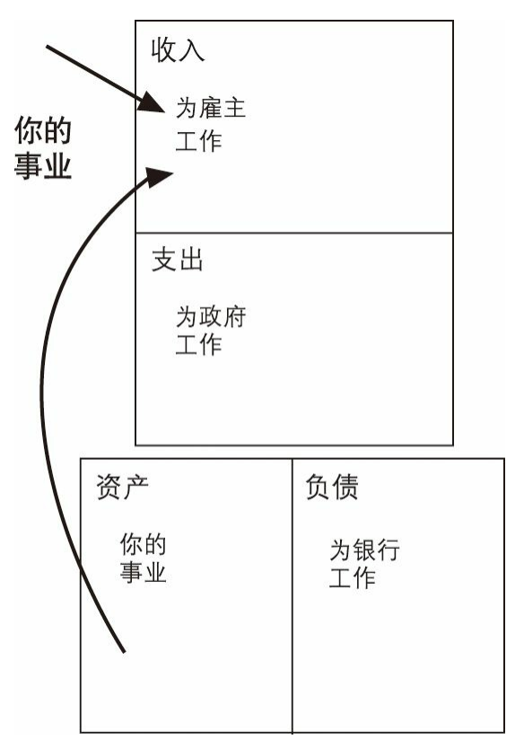
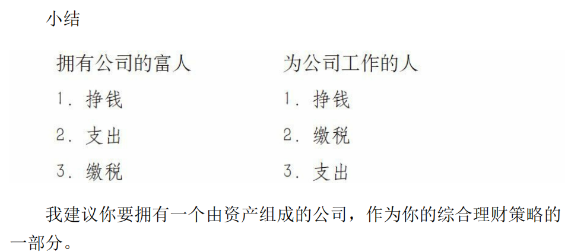

得到良好的教育和获得优异的成绩不再能确保成功了。

我想他是对的，他需要新的出路，我也一样。我父母的忠告对1945年以前出生的人来说也许是有用的，但对于当今这个迅速变化的时代中的人来说则可能是一场灾难。我不能再简单地对我的孩子们说：“去上学，争取拿好成绩，然后找一份安稳的工作。”

我知道我必须找到一条新路来教育孩子。

身为一个母亲，同时也是会计师，我很担心，因为孩子们在学校缺少有关财商的教育。今天许多年轻人在高中毕业前就有了信用卡，却从未上过关于钱和投资的课程，更不用说理解那些信用卡复杂的利息计算了。若不具备足够的财务知识，不了解金钱运动的规律，他们就没有准备好进入他们面前的现实世界，因为在这个世界里会消费将比会储蓄更重要

> “如果你看看那些受过教育的、努力工作的人的生活，就会看到一条十分相似的道路。孩子出生了，然后去上学。自豪的父母十分兴奋，因为他们的孩子很优秀，成绩很好，还上了大学。之后孩子从大学毕业了，也许还会继续念研究生，然后像编好的程序一样做下面的事：找个安稳的工作。孩子们找了工作，可能是医生，也可能是律师，或者参军或是进政府部门。他们开始挣钱了，手上有了一大堆信用卡，他们会买很多东西，如果以前他们还没买的话。
>
> 手里有了钱，孩子们就会去其他年轻人都喜欢去的地方。他们在那里结交朋友、约会，可能还会结婚。现在生活简直棒极了，因为在现代社会里夫妻双方都工作，两份收入真是太幸福了。他们觉得成功了，前途光明，于是决定买房、买车、买电视机、度假并且生孩子。这样甜蜜的负担就来了：他们需要大量的钱。那对幸福的夫妇认定他们的事业是最重要的，并且开始更加努力地工作，希望能够升职和加薪。他们加薪了，但另一个孩子也出生了，于是他们就需要一幢更大的房子。他们工作得更努力、更专注了，也成为了更优秀的雇员。他们回到学校去学习更多的专业技能，以便赚更多的钱。他们可能会再做一份兼职。他们的收入上升了，但要缴纳的房地产税、社会保险税和其他税也上升了。他们赚了很多钱却不知道钱都到哪儿去了。他们买了一些基金，还用信用卡购买日用品。孩子们都已经五六岁了，又要为他们上大学和自己的退休金存钱了
>
> “这对快乐的夫妇，在35岁后陷入了‘老鼠赛跑’的陷阱。他们不仅为公司老板工作，还要通过缴税为政府工作，通过偿还住房贷款和信用卡贷款为银行工作。
>
> “接着，他们劝告他们的孩子努力学习，取得好成绩，然后找个安稳的工作或职业。而对于钱，除了从那些利用他们的天真而获利的人那儿学到点东西之外，他们什么都没学到。他们终生辛苦地工作，他们的下一代又将重复相同的过程，这就叫‘老鼠赛跑’。

只有精通会计和投资才能跳出“老鼠赛跑”的陷阱，可以说这是两个最难掌握的专业。

在罗伯特看来，孩子们把时间都浪费在一个过时的教育体系中，学一些他们永远用不着的东西，并为一个根本不存在的世界做准备。

“今天，你给孩子的最危险的建议就是：去学校，好好念书，然后找个安稳的工作。”罗伯特常这么说，“这个建议过时，而且很愚蠢，如果你看见在亚洲、欧洲、南美洲发生的变化，你就会像我一样担忧。”

他确信这是个坏建议，“因为如果你想让你的孩子有一个财务安全的未来，就不能让他们因袭旧的游戏规则，那样太危险了”

我问他什么是“旧的规则”。

“像我这样的人在理财上有一套与你们完全不同的游戏规则。”他说，“当一家公司宣布裁员时会发生什么事情？”

“会有人被解雇，”我说，“家庭会受到伤害，失业人数会增加。”

“对。但公司会发生什么变化？尤其对一个上市公司来说？”

我想了想说：“当宣布裁员时，上市公司的股价通常会上涨，公司通过自动化或是整合人力资源减少了人工成本，市场喜欢这样的消息。”

“是这样的，”他说，“当股价上涨时，像我这样的人，即股东，就更富了。这就是我说的一套不同的规则。雇员损失了，但老板和投资者却获利了。”

罗伯特不仅描述了雇员和雇主的区别，还解释了掌握自己的命运和命运由别人掌握的区别。

“许多人恐怕难以理解这一点，”我说，“他们只是认为那是不公平的。”

“这就是为什么对孩子说‘争取上大学’是愚蠢的。”他说，“认为学校的教育能使你的孩子在毕业后准备好应对现实生活也是愚蠢的。每个孩子都需要得到更多的、不同的教育，他们得知道真实生活中的游戏规则，各种不同的规则。”

“富人有他们的关于金钱的规则，其他占人口95％的人也有他们的规则，”他说，“而这些人是从学校和家庭教育中学到这些规则的。这就是如今为什么简单地对孩子说‘努力学习，找好工作’是危险的。今天的孩子需要更多层次的教育，而现在的教育体系并未涵盖这些。我并不关心他们在教室里安了多少台电脑或是学校已经花了多少钱。教育体系怎么有能力教授连它自己都不知道的东西呢？”

罗伯特说教育是成功的基础，正如学校里教的某些技能非常重要一样，理财技能和沟通技巧也十分重要。

他受过良好教育的父亲建议他为企业工作，而他富有的父亲则建议他拥有自己的企业。两条道路都需要教育，但学习的科目却完全不同。他受过良好教育的父亲鼓励他成为聪明人，而他富有的父亲则鼓励他雇用聪明人。

。鼓励孩子们成为雇员就是建议他们缴纳超过他们应付的份额的税，并只得到数量很少，而且还没什么保障的退休金。毫无疑问，税是一个人最大的支出，实际上，大多数家庭每年从1月到5月中旬的工作都是为了给政府缴税。因此我们需要新的观念，而本书提供的正是这种全新的思维方式。

作为一个母亲和注册会计师，我认为仅仅好好学习，然后找个好工作的想法已经过时了。我们要建议孩子学习一些更复杂的东西。我们需要新思想和新教育。也许告诉孩子们努力做个好雇员，同时努力去拥有自己投资的企业会是一个不错的主意

没人拥有可以预测未来的水晶球，但有一件事是可以肯定的：比我们现实生活中的变化更大的变化就在前面。谁知道未来会怎么样？但无论发生什么，我们至少有两个基本的选择：安全地理财，或是通过接受教育唤醒你和你孩子的理财天赋，从而更聪明地理财。

# 1 富爸爸穷爸爸

> 我花了很多时间思考，问自己诸如“他为什么那样说”之类的问题，然后又对另一个爸爸的话提出同样的疑问。如果只是说“噢，他是对的，我同意”，或是说“他不知道自己在说什么”应该是很容易的事。相反，拥有两位我深爱的父亲，这促使我去思考，最终为自己选择其中一种思维方式。这一过程是我自己去选择而不是简单地接受或否定的过程，在后来的漫长岁月中被证明对我非常有益。

富人之所以越来越富，穷人之所以越来越穷，中产阶级之所以总是

在债务的泥潭中挣扎，其中一个主要原因就是，他们对金钱的认识不是

来自学校，而是来自家庭。大多数人都是从父母那儿了解钱是怎么回事

的。关于金钱，贫穷的父母能够教给孩子们什么呢？他们只会说：“在

学校里要好好学习喔。”结果，他们的孩子可能会以优异的成绩毕业，

但同时也秉承了穷人的理财方式和思维习惯。这是孩子们在很小的时候

就从父母那里学到的。

学校并没有开设有关“金钱”的课程。学校教育只专注于学术知识的

传授和专业技能的培养，却忽视了理财技能的培训。所以众多精明的银

行家、医生和会计师在学校时成绩优异，可还是要一辈子在财务问题上

挣扎。美国岌岌可危的债务问题在很大程度上也应归因于那些政治家和

政府官员们作出的财务决策，他们虽然受过高等教育，但很少甚至几乎

没有接受过理财方面的培训。

由于我有两位极具影响力的爸爸，所以我从他们两人身上都学到了

很多东西。我不得不思考每个爸爸的建议，在我把这些建议付诸实际的

同时，我认识到有一点很重要，那就是一个人的观念对他的一生影响巨

大。例如，我的一个爸爸总是习惯说“我可付不起”，而另一个爸爸则禁

止我们说这样的话，他坚持让我这样说：“我怎样才能付得起？”这两句

话，一句是陈述句，另一句是疑问句。一句让你放弃，而另一句则促使

你去想办法。我那个在不久之后就富起来的爸爸解释，当你下意识地说

出“我付不起”的时候，你的大脑就会停止思考；而如果你自问“我怎样

才能付得起”，则会让你的大脑动起来。当然，他的意思并不是让你把

每件想要的东西都买到手，这里只是强调要不停地锻炼你的大脑——它

是世界上最强大的“计算机”。富爸爸说：“我的大脑越用越活，大脑越

活，我挣的钱就越多。”他认为，下意识地说“我可付不起”意味着精神

上的懒惰。

尽管两个爸爸都高度重视教育和学习，但两人对于什么才是最应该

学习的看法却不同。一个爸爸希望我努力学习，获得学位，找个工资高

的好工作。他希望我能成为一名专业人士，例如：律师、会计师，或者

去商学院读MBA。另一个爸爸则鼓励我学习成为富人，了解钱的运动

规律并让钱为我工作。“我不为钱工作，”这句话他说了一遍又一

遍，“我要让钱为我工作。”

# 第一课 富人不为钱工作

如果你是那种没有勇气的人，生活每次推动你，

你都会选择放弃。如果你是这种人，你的一生会过得稳稳当当，不做错

事、假想着有事情发生时自救，然后慢慢变老，在无聊中死去。你会有

许多朋友，他们很喜欢你，因为你真的是一个努力工作的好人。你的一

生过得很安稳，处世无误。但事实是，你向生活屈服了，不敢承担风

险。你的确想赢，但失败的恐惧超过了成功的兴奋。只有你知道，在你

内心深处，你始终认为你不可能赢，所以你选择了稳定。

> 不敢苟同，只是从强势进取的视角去看待问题而已

“你最好改变一下

观点，停止责备我，不要认为是我的问题。如果你认为是我的问题，你

就会想改变我；如果你认为问题在你那儿，你就会改变自己，学习一些

东西让自己变得更聪明。大多数人认为世界上除了自己外，其他人都应

该改变。让我告诉你吧，改变自己比改变他人更容易。

## 穷人和中产阶级为钱工作

我很高兴你为每小时10美分的报酬生

气，如果你不生气而是高兴地接受了，那我只能说我没法教你。你看，

真正的学习需要精力、激情和热切的愿望。愤怒是其中一个重要的组成

部分，因为激情正是愤怒和热爱的结合体。说到钱，大多数人都希望稳

稳妥妥地挣钱，这样他们才感到安全。关于钱，他们没有激情，有的只

是恐惧。

正是出于恐惧的心理，人们才想找一份安

稳的工作。这些恐惧有：害怕付不起账单，害怕被解雇，害怕没有足够

的钱，害怕重新开始。为了寻求保障，他们会学习某种专业，或是做生

意，拼命为钱而工作。大多数人成了钱的奴隶，然后就把怒气发泄在他

们老板身上。”

## 富人不为钱工作

## 避开一生中最大的陷阱

“大多数人都希望有一份工资收入，因为

他们都有恐惧和贪婪之心。一开始，没钱的恐惧会促使他们努力工作，

得到报酬后，贪婪或欲望又让他们想拥有所有用钱能买到的好东西。于

是就形成了一种模式。”“什么模式？”我问。

“起床，上班，付账，再起床，再上班，再付账……他们的生活从

此被这两种感觉所控制：恐惧和贪婪。给他们更多的钱，他们就会以更

高的开支重复这种循环。这就是我所说的‘老鼠赛跑’。”

“不谈钱就像依赖钱一样是一

种精神上的疾病。”

“比如说吧，”富爸爸说，“如果害怕没钱花，也先不要去找工作，

挣几个小钱去消除恐惧，而要先问问自己：一份工作是最终消除这种恐

惧的最佳解决办法吗？依我看，答案是‘不是’，从人的一生来看更是如

此。工作只是试图用暂时的办法来解决长期的问题。”

“我想教你们支配钱，而不是害怕它，这是在学校里学不到的。如

果不学，你就会变成金钱的奴隶。”

如果你们不先控制

恐惧和欲望，即使你们获得高薪，也只不过是金钱的奴隶而已。”

“造成贫困和财务问题的主要原因是恐惧和无知，而不是经济环

境、政府或者富人。人们自身的恐惧和无知使他们困在陷阱里，所以你

们应该去上学、接受高等教育，而让我来教你们怎样不落入陷阱。”

“在我用更高的工资诱惑你们时，你们感觉怎样？非常想要吗？”

我们点了点头。

“但你们没有屈服于自己的感觉，你们没有立刻作出决定。这一点

最重要。我们总是会有恐惧、贪婪的时候。从现在开始，对你们来说最重要的是，运用感情作长远打算，别让感情控制了思想。大多数人让恐

惧和贪婪来支配自己，这是无知的开始。因为恐惧和贪婪，大多数人一

生都在追求工资、加薪和职业保障，从来不问这种感情支配思想的生活

之路将通向哪里。就像一幅画表现的：驴子拉车，因为主人在它面前挂

了个胡萝卜。主人清楚自己想要去哪里，而驴子却只是在追逐一个幻

影。但第二天驴子依旧会去拉车，因为又有胡萝卜放在它的面前。”

“无知使恐惧和欲望更加强烈，这就是为什么很多有钱人越有钱就

越害怕。钱就是驴子面前的胡萝卜，是幻象。如果驴子能了解到全部事

实，它可能会重新想想是否还要去追求胡萝卜。”

富爸爸继续解释说人生实际上是在无知和觉醒之间的一场斗争。

他说一个人一旦停止了解有关自己的知识和信息，就会变得无知。

这种斗争实际上就是你时刻都要做的一种决定：是通过不断学习打开自

己的心扉，还是封闭自己的头脑。

永远

不要忘记，你有两种感情——恐惧和欲望，如果你让它们来控制你的思

想，你就会落入一生中最大的陷阱。一直生活在恐惧中，从不追求自己

的梦想，这是残酷的。为钱拼命工作，以为钱能买来快乐，这也是残酷

的。半夜醒来想着还有许多账单要付是一种可怕的生活方式，以工资的

多少来决定过什么样的生活不是真正的生活。认为工作会给你带来安全

感其实是在欺骗自己。这些都很残酷，但我希望你们能尽可能地避开这

些陷阱。我看过钱如何控制人们的生活，别让这些问题发生在你们身

上，别让钱支配你们的生活。”

不要因为

害怕付不起账单就起床去工作，希望以这种方法来解决问题。你要花时

间去思考这个问题：更努力地工作是解决问题的最好方法吗？大多数人

都害怕知道真相——他们被恐惧所支配——不敢去思考，就出门去找工

作了。他们被柏油孩子‘粘’住了。这就是我说的确定你的思想。”

工作只是面对长期问题的一种暂时的解决

办法。大多数人心里只有一个问题，并且亟待解决，那就是月末要付账

了，账单就像那个柏油孩子。钱控制了他们的生活，或者确切地说是，

对钱的无知和恐惧控制了他们的生活。所以他们就像他们的父母一样，

每天起床之后就去工作挣钱，没有时间问问自己：还有什么别的法子

吗？他们的思想被他们的感情，而不是他们的头脑控制着。

## 看见了别人看不见的

> 在第二个星期六工作结束时，我向马丁太太道别，依依不舍地看着
>
> 架子上的连环画。每星期六没有了30美分的收入，我就没有钱去买连环
>
> 画了。而就在马丁太太和我们说再见时，她做了一件我以前从未见她做
>
> 过的事，我的意思是我以前也见她这样做过，只是我没太在意。
>
> 马丁太太把连环画的封面撕成两半，然后把上面一半留下，下面一
>
> 半扔进了棕色的书橱。我问她这是做什么，她说：“我要把这些没有卖
>
> 掉的旧书扔掉。等书商送新书来，我会把这半边封面交给他，作为没有
>
> 卖掉的证明。他一小时后就到。”
>
> 我和迈克等了一个小时，书商终于来了。我问他能否把那些他不要
>
> 的连环画送给我们。他回答：“如果你们在这家店干活，而且保证不把
>
> 它们卖掉，我就送给你们。”
>
> 于是，我们成交了。迈克家的地下室里有个空房间，我们把它清理
>
> 出来，把几百本连环画搬了进去。很快我们的连环画阅览室就开始营业
>
> 了。我们雇了迈克的妹妹——她很爱读书——来做图书管理员。她向每
>
> 个来阅览室看书的孩子收10美分，每天从下午2点30分到4点30分，阅览
>
> 室都会开放。读者呢，包括邻家的孩子，他们可以在这两个小时内看个
>
> 够。对于他们来说这是相当便宜的，因为10美分只能买1本连环画，而
>
> 两小时足够他们看五六本了。
>
> 迈克的妹妹在读者离开时要负责检查，确保他们不把书带走。她还
>
> 要保管书，记录每天有多少人来、他们的名字以及他们有什么意见。我
>
> 和迈克在以后三个月里平均每星期能赚9.5美元，我们付给迈克的妹妹1
>
> 美元，而且允许她免费看书，但她很少看，因为她总是在学习。
>
> 我和迈克仍然每星期六去小店干活，从各个店收集卖不出去的连环
>
> 画。我们恪守了对书商的诺言，没有卖一本连环画，如果书太破了我们
>
> 就烧掉。我们想开一家分店，但实在找不到一个像迈克的妹妹那样尽职
>
> 尽责、值得信任的管理员。
>
> 小小年纪，我们就已经发现找个好职员有多么困难了。
>
> 阅览室开张3个月后，发生了一场争斗，附近的小流氓盯上了这桩
>
> 生意。富爸爸建议我们关门，所以我们的连环画生意就此结束了，同时
>
> 我们也不去小店工作了。不管怎样，富爸爸十分兴奋，因为他可以教我
>
> 们新东西了。他很欣慰，因为我们的第一课学得这么好。我们已经学会
>
> 怎样让钱为我所用了。由于没有从小店的工作中得到报酬，我们就不得
>
> 不发挥想象力去寻找挣钱的机会。通过经营我们自己的连环画阅览室，
>
> 我们就掌控了自己的财务，而不是依赖雇主。最棒的是我们的生意让我
>
> 们赚了钱，甚至当我们不在那儿时，它也照样赚钱，我们的钱为我们工
>
> 作了。
>
> 虽然富爸爸没有付给我们工钱，却给了我们更多的东西。
>
> 

# 第二课 为什么要教授财务知识

## 最富有的生意人

我只想提醒一句：从长远来看，重

要的不是你挣了多少钱，而是你能留下多少钱，以及能够留住多久。

> 资产是能把钱放进你口袋里的东西。
>
> 负债是把钱从你口袋里取走的东西。

80％的家庭的财务报表表现的是一幅拼命工作、努力争先的图景，

这不是因为他们挣不到钱，而是因为他们购买的是负债而非资产。

例如，下面是一个穷人（也可以表示一个没有经济独立的年轻人）

的现金流图：

下面是一个中产阶级的现金流图：

下面是一个富人的现金流图：

很显然，所有这些图表都经过了简化，只表现人们最基本的吃、穿、住、用。

这些图表显示了穷人、中产阶级和富人一生的现金流。正是现金流

说明了问题，即一个人怎样处理他的钱，当他有了钱后会怎么做。

## 发财梦变成噩梦的故事

如果他们知道镜子的力量，也许会自问：“这有意义吗？”可通常人

们总是不相信自己内在的智慧，只会随波逐流，人云亦云。他们做事情

只是因为其他人也这么做，他们总是服从而不去提问。他们总是轻率地

重复别人告诉他们的东西，例如：“分期付款”、“你的房子就是你的资

产”、“你的房子是你最大的投资”、“欠债可以抵税”、“找一个稳定的工

作”、“别犯错误”、“别冒险”之类的话。

大多数人热衷于“稳定”是出于恐惧。

我和迈克有时会问老师，怎样才能学以致用，或是为什么我们不学

习有关钱的知识及其运动的规律。对第二个问题，我们得到的回答通常

是：钱并不重要，如果我们学习成绩好，自然就会有钱。

我们越了解钱的力量，与老师和同学们的距离就越远。

> 总之，决定买很昂贵的房子，而不是早早开始证券投资，将对一个
>
> 人的生活在以下3个方面形成冲击：
>
> 1．失去了用其他资产增值的时机。
>
> 2．本可以用来投资的资本将用于支付房子高额的维修和保养费用。
>
> 3．失去受教育的机会。人们经常把他们的房子、储蓄和退休金计划作为他们资
>
> 产项的全部内容。因为没钱投资，也就不去投资，这就使他们无法获得投资经验，
>
> 并永远不会成为被投资界称为“成熟投资者”的人。而最好的投资机会往往都是先给
>
> 那些“成熟投资者”的，再由他们转手给那些谨小慎微的投资者，当然，在转手时他
>
> 们已经拿走了绝大部分的利益。
>
> 我并不是说就一定不能买房子。我的意思是要理解资产和负债的区
>
> 别。当我想要换一所大一点的房子时，我会先买入一些资产，让它们创
>
> 造能够支付这所房子的现金流。
>
> 我那受过良好教育的爸爸的财务状况，很好地描述了“老鼠赛跑”式
>
> 的生活。他的支出总是和他的收入持平，根本不可能去投资。结果，他
>
> 的负债，比如抵押贷款、信用卡贷款总是比他的资产还多。
>
> 另一方面，富爸爸的财务状况反映了致力于投资和减少负债的结
>
> 果。
>
> 关于富爸爸的财务状况的分析说明了为什么富人会越来越富。资产
>
> 项产生的收入足以弥补支出，还可以用剩余的收入对资产项进行再投资。资产项不断增长，相应的收入也会越来越多。
>
> 其结果是：富人越来越富！

这种把房子当资产的想法和那种认为钱越多就能买更大的房子或更

多东西的理财哲学就是今天这个债台高筑的社会的基础。过多的支出把

家庭拖入债务和财务不稳定的旋涡之中，即使人们工作业绩优秀、收入

固定增长，也会出现这种情况，而这种高风险的生活正是由于缺乏财商

教育造成的。

如果你盲从于别人，你的财务状况就会像下图展示的那样。

作为一个自己有房子的雇员，你努力工作的结果如下：1．你为别人工作。就像为工资而工作的大多数人一样，你的工作只会使雇主或

股东更加富有，你的努力和成功将使雇主更加成功并得以提早退休。

2．你为政府工作。政府在你还未看到自己的工资时就已拿走了一部分，你努力

工作，其结果是使政府的税收增加。实际上大多数人每年从1月到5月都是在为政府

白白工作。

3．你为银行工作。缴了税后，你的最大支出应该是抵押贷款和信用卡账单了。

问题是如果你只懂得努力工作，以上三方从你那儿拿走的劳动成果

也就会更多。你需要学会怎样才能使你的努力更直接地为你和你的家人

带来好处。

> 请记住下面这些话：
>
> 富人买入资产。
>
> 穷人只有支出。
>
> 中产阶级购买自以为是资产的负债。

# 第三课 关注自己的事业

一幅图胜过了千言万语。下面是一张收益表和一张资产负债表，它

们能很好地描述雷·克罗克的思想。

请注意，你的职业和你的事业有很大的差别。我经常问人们：“你

的事业是什么？”他们会说：“我在银行工作。”接着我问他们是否拥有

一家银行，他们通常回答：“不是的，我只在那儿工作。”

在这个例子中，他们混淆了他们的职业和事业，他们可以在银行工

作，但他们仍应有自己的事业。雷·克罗克很清楚职业和事业的区别，

他的职业总是不变的，他是个商人。他卖过牛奶搅拌器，后来又转卖汉

堡包。但在他卖麦当劳分店的时候，他的事业是购买能产生收入的地

产。

从事你所学的专业的可怕后果在于，

它会让你忘记关注自己的事业。人们耗尽一生去关注别人的事业并使他

人致富。

为了财务安全，人们需要关注自己的事业。你的事业的重心是你的

资产项，而不是你的收入项。正如以前说过的，秘诀一是要知道资产与

负债的区别，并且去买入资产。富人关心的焦点是资产而其他人关心的

是收入。

开始关注你自己的事业，在继续工作的同时购买一些房地产，而不

要买负债或是一旦被你带回家就没有价值的个人用品。在你把一辆新车

开出停车场的同时，它已经贬值25％了。汽车不是真正的资产，即使你

的银行经理让你把它列入资产项。一根新的价值400美元的钛合金高尔

夫球杆被我开过球后，就只值150美元了。

对成年人而言，把支出保持在低水平、减少借款并勤劳地工作会帮

你打下一个稳固的资产基础。对于还未经济独立的年轻人来说，父母应

该教他们搞清楚资产和负债的区别，让他们在离家、结婚、买房子、生

孩子、陷入财务危机、完全依赖工作和贷款之前建立起坚实的资产基

础，这是非常重要的。

> 1．不需我到场就可以正常运作的业务。我拥有它们，但由别人经营和管理。如
>
> 果我必须在那儿工作，那它就不是我的事业而是我的职业了；
>
> 2．股票；
>
> 3．债券；
>
> 4．共同基金；
>
> 5．能够产生收入的房地产；
>
> 6．票据（借据）；
>
> 7．版税，如音乐、手稿、专利；
>
> 8．其他任何有价值、可产生收入或有增值潜力并且有很好销路的东西。

许多人害怕买小

公司的股票，认为它们风险大，事实上也确是如此。但是如果你喜爱你

所投资的对象，了解它并懂得游戏的规则，风险就会降低。对于小公

司，我的投资策略是：一年内脱手。另一方面，我的房地产投资策略则

是从小买卖开始一点点做大，条件允许的话尽量晚一些出手，这样做的

好处是可以延迟缴纳所得税，从而使资产戏剧化地增长。我持有的房产

通常会在7年内脱手。

当我说关注自己的事业时，我的意思是建立自己牢固的资产。一旦

把1美元投入了资产项，就不要让它出来。你应该这么想，这1美元进了你的资产项，它就成了你的雇员。关于钱，最妙的就是让它可以一天24

小时不间断工作，还能为你的子孙后代服务。你要照常去工作，做个努

力的雇员，但要不断构筑你的资产项。

富人与穷人一个重要

的区别就是：富人最后才买奢侈品，而穷人和中产阶级会先买下诸如大

房子、珠宝、皮衣、宝石、游艇等奢侈品，因为他们想让自己看上去很

富有。他们看上去的确很富有，但实际上他们已深陷贷款的陷阱之中。

那些能给子孙留下遗产的人和那些能长期富有的人，就是先构筑资产

项，然后才用资产所产生的收入购买奢侈品的，而穷人和中产阶级则用

他们的血汗钱和本应该留给子孙的遗产来购买奢侈品。

# 第四课 税收的历史和公司的力量

税收的初衷是惩罚有钱人，而现实却是它惩

罚了对它投赞同票的中产阶级和穷人。

他是政府官员，而我是资本家，我

们都得到了报酬，但我们对成功的衡量标准却相反。他的工作是花钱和

雇人，他花的钱和雇的人越多，他的机构就会越大。在政府中，谁的机

构更大，谁就更受尊敬。而在我的公司中，我雇的人越少，花的钱越

少，我就越能受到投资者的尊敬。这就是我不喜欢政府官员的原因。他

们与大多数生意人的目标不同。随着政府规模的不断扩大，就需要征收

更多的税以维持运营。”

富人胜过那些受过良好教育的人，是因为他们明白钱的力量，这

是学校不曾教过的科目。

政府的政策

是，如果你是一个政府官员，就不应该握有过多的钱；如果你没有用完

预算的资金，下次你所得到的钱就可能减少，你不会因为有节余而被认

为是有效率。而商人恰恰相反。

所得税法被通

过之后，成立公司就变得流行起来了，因为企业所得税率低于个人收入

所得税率。此外，正如之前我们所讨论过的，公司的某些支出可以用税

前收入支付

当我们明白了让钱为我们工作的道理，富爸爸就希望我们精于计算

而不要让钱牵着我们走。我们还需要了解法律系统是如何运作的。如果

你对法律一无所知，就很容易被欺负；如果你了解法律，你就有还击的

机会。这也是富爸爸高薪雇用聪明的会计师和律师的原因——付给他们

的钱要比付给政府的少得多。“精于计算你就不会被别人牵着走”是他给

我上过的最好的一课，我几乎受用一生。富爸爸了解法律，不仅因为他

是一个守法的公民，还因为他知道不懂法律的代价有多么昂贵。“如果

你知道你是对的，就不会害怕受到攻击”，哪怕你遇到了罗宾汉和他

的“绿林好汉”们

财商是由4个方面的专门知识构成的：

第一是会计，也就是我说的财务知识。如果你想建立一个自己的商

业帝国，财务知识是非常重要的。你管理的钱越多，就越要精确，否则

这幢大厦就会倒塌。这需要左脑来处理，是细节的部分。财务知识能帮

助你读懂财务报表，还能让你辨别一项生意的优势和劣势。第二是投资，我把它称为钱生钱的科学。投资涉及策略和方案，这

要右脑来做，是属于创造的部分。

第三是了解市场，它是供给与需求的科学。这要求了解受感情驱动

的市场的“技术面”。1996年圣诞节的搔痒娃娃大获成功就是一个受技术

与感情影响的市场的最佳佐证。市场的另一个因素是“基本面”，或者说

是一项投资的经济意义。一项投资究竟有无意义最终取决于当前的市场

状况。

第四是法律。例如：利用一个具有会计、投资和市场运营的企业会

使你的财富实现爆炸性地增长。了解减税优惠政策和公司法的人会比雇

员和小业主更快致富。这就像一个人在走，而另一个人却在飞，久而久

之这种差距就更大了

> **1**．减税优惠。公司可以做许多个人无法做的事，例如：用税前收入支付开支。这是一个如此令人激动的专业领域，但在你没有足够的资
>
> 产或业务之前不能进入。
>
> 雇员挣钱、纳税，并靠剩下的钱为生；企业挣钱、花钱，并只为剩
>
> 下来的钱缴税。这是富人钻的最大的法律的空子。如果你有能带来现金
>
> 流入的投资，你就可以轻松、廉价地使用这些漏洞。例如，假如你拥有
>
> 自己的公司，在夏威夷召开的董事会就是你的假期，买车以及随之而来
>
> 的车险和修理费也可以算是企业的支出，健身俱乐部的会员费是企业支
>
> 出，大部分的餐饮费也算是企业的支出，如此等等，但要注意在税前合
>
> 法支付它们。
>
> **2**．在诉讼中获得保护。我们生活在一个爱打官司的社会中。有太
>
> 多人想占你的便宜。富人用公司和信托来隐藏部分财富以免被债主发
>
> 现，当一些人起诉富人时，他们经常遇到法律对富人的保护，发现这些
>
> 富人其实没有财产。他们控制着一切，却一无所有。穷人和中产阶级尽
>
> 力去拥有一切，但最后却不得不把劳动所得都给了政府和那些乐于起诉
>
> 有钱人的小市民，这些小市民们是从罗宾汉的故事中学到劫富济贫的。

# 第五课 富人的投资

我很明显地

意识到，对大多数人来说，一旦涉及金钱的问题，他们宁愿安全行事。

我不得不回答诸如此类的问题：为什么要去冒险？为什么必须永不停止

地提高自己的财商？为什么必须懂得财务知识？

对此我的回答是：“就是为了获得更多的选择机会。”

“那金钱是什么？”我和迈克经常会这么反问，“如果金钱不是真实

的资产，那它又是什么？”

“它是我们大家都认可的东西。”富爸爸会说。

我之前已经说

过，但它值得我一再强调，财商是由这4项主要技能组成的：

1．财务知识。即阅读理解数字的能力。

2．投资策略。即以钱生钱的科学。

3．市场、供给与需求。贝尔提供了市场所需要的东西，比尔·盖茨也是如此。

用2万美元买了一套值7.5万美元的房子，以6万美元的价格卖出，也就是抓住了市场

所创造的机会。在市场上，总是有买方，就有卖方。

4．法律规章。要熟悉有关会计、公司方面的法律以及各州和国家的法规。我们必须按规则来进行“游戏”。

> 就我而言，我主要使用两种工具来实现资产的增值：房地产和小型
>
> 公司的股票。房地产是我的基础投资，通过日复一日的积累，我的资产
>
> 不断地提供现金流，偶尔也会有价值上的飙升。再有就是等待小型公司
>
> 的股票快速增值。
>
> 我并不建议别人做我做的事情，例子仅仅只是例子。如果投资机会
>
> 太复杂而我又弄不明白，我就不会去投资。简单的数学计算和一般常识
>
> 是有效理财所需要的一切。
>
> 关于房地产我还有最后一点需要说明。我周游世界讲授投资课程，
>
> 在我到过的每一个城市，我都听到有人说他们买不到便宜的房地产，但
>
> 这并不符合我的经验。即便是在纽约和东京，也会有一些质量不错，价
>
> 格也便宜的房产被大多数人忽略。在新加坡，尽管眼下房地产价格很
>
> 高，但仍能在离城市不远的地方发现一些低价交易的机会。因此，每当
>
> 我听到某人对我说“在这儿你不能这么做”时，我就会提醒他们，也许正
>
> 确的说法应该是：“其实，我不知道在这儿该如何做这个。”

投资者分为两类：

**1**．第一类也是最普遍的一类，即进行一揽子投资的人。他们联系

一家从事经营个人投资业务的中介机构，例如房地产公司、股票经纪人

或财务规划师等，然后买下某些产品。这些产品可能是共同基金、房地

产投资信托、股票或债券等。这是一个较好的、简单明了的投资方式，

就好像一位顾客到商店去购买一台组装好的电脑。

**2**．第二类是自己创造投资机会的投资者。这种投资者通常会自行

组织一项交易，好比一个人买来电脑零部件，然后自己组装，这有点像

量身定做。虽然我连组装电脑的第一步工序都不知道，但我清楚应该如

何将许多投资机会组织起来，也知道谁能够这样做

如果你想成为第二类投资者，那么你还需要提高3种主要技能，除

了之前提到的提高财商的4项基本技能之外，要想成为理财能手，你就

必须具备3种技能。

**1**．如何寻找其他人都忽视的机会。你要用心去发现别人看不到的

那些机会。例如，我的一个朋友买了一幢破旧不堪的房子，它看起来就

像座鬼屋，每个认识他的人都很奇怪他为什么要买下它，那是因为他看

到了我们没有看到的东西。他通过产权公司了解到这间房子连着4间额

外的空房，于是在买下房子后，他就把空房拆掉，然后把土地卖给了一

位建筑商，得到的钱3倍于他买房子所花费的成本。在两个月里，他挣

了7.5万美元。这笔钱虽然不算多，但却比最低工资高多了，而且在技

术上也不难。

**2**．如何增加资金。一般人只会去找银行贷款，而第二类投资者则

知道不找银行也能通过多种方法获得资金。在一开始，我讲了如何不找

银行就能买下房子。房子本身并不重要，从中学到的获得资金的技巧却

是无价之宝。

**3**．怎样把精明的人组织起来。聪明的人往往会雇用比自己更聪明

的人或与他们一起工作。当你需要建议的时候，你一定要确定你选择的

是明智的顾问

# 第六课 学会不为钱工作

> 因为我愿意引起争议

富爸爸则鼓励我去做恰好相反的事情。“对许多知识你只需知道一

点就够了”，这是他的建议。所以，这些年来我曾在他的公司的不同部

门工作过。有一段时间我在他的会计部工作，虽然我从来不想成为会

计，但他仍希望我借助这种渗透作用学习一些会计方面的常识。富爸爸

知道我会明白那些“行话”，而且懂得哪些东西重要，哪些东西不重要。

我也曾做过公共餐厅服务员、建筑工人、推销员、仓库保管员和市场营

销人员。富爸爸一直在培养我和迈克，坚持让我们列席他与银行经理、

律师、会计师和经纪人的会议，希望我们对他的商业帝国的每一部分都

能有所了解。

对于受过良好教育的爸爸来说，工作的稳定就是一切；而对于富爸

爸来说，不断学习才是一切。

正如一句格言所说：“工作（job）一词就是‘比破产强一点’（just

over broke）。”

当我问自己班上的学生“你们中间有多少人能做出比麦当劳更好的

汉堡包”时，几乎所有的学生都举起了手。我接着问：“如果你们中大部

分人都能做出比麦当劳更好的汉堡包，那为什么麦当劳比你们更赚

钱？”

答案是显而易见的：麦当劳拥有一套出色的商业体系。许多才华横

溢的人之所以贫穷，就是因为他们只是专心于做好产品，而对商业体系却知之甚少。

成功所必需的管理技能包括：

1．对现金流的管理。

2．对系统（包括你本人、时间及家庭）的管理。

3．对人员的管理。

最重要的专门技能是销售和对市场营销的理解。销售技能是个人成

功的基本技能，它涉及与其他人的交往，包括与顾客、雇员、老板、配

偶和孩子。而沟通能力，如书面表达、口头表达及谈判能力等对一个人

的成功来说更是至关重要。

富爸爸鼓励我和迈克多去涉猎一些东西。他鼓励我们去和比我们更

精明的人一起工作，并把他们组成一个团队。现在把这种做法称为专家

组合。

我还不知道有比销售

和市场营销更重要的技能，但要掌握它们对大部分人来说是很困难的，

这主要是因为他们害怕被拒绝。所以，你在处理人际关系、商务谈判和

被拒绝时的恐惧心理等方面做得越好，生活就会越轻松。

# 第**8**章 克服困难

掌握财务知识的人有时候还是不能

积累丰厚的资产项，其主要原因有5个：

1．恐惧心理。

2．愤世嫉俗。

3．懒惰。

4．不良习惯。

5．自负。

## 原因之一：对可能亏钱的恐惧心理。

我从未遇见喜欢亏钱的人，但在我的一生中，从未遇见一位没亏过

钱的富人，却遇见许多从未亏掉一毛钱的穷人——我是说在投资活动

中。

失败会激励胜利者，击垮失败者。这是胜利者最大的秘密，也是失

败者所不知道的秘密。胜利者最大的秘密是失败能够激励他们取胜，所

以他们不怕失败。

> 如果你有致富的愿望，就必须集中精力。把你大部分的鸡蛋放在较
>
> 少的篮子里，别像穷人和中产阶级那样：把很少的鸡蛋放在许多篮子
>
> 里。
>
> 真的吗？？？？？？？？？？

如果你不愿失败，那就安全地投资；如果损失会使你元气大伤，那

就稳妥一点，去做一个“平衡的”投资。你要是已经超过了25岁并害怕冒

险，那就不要改变自己的投资方式。以安全的方式投资，但要尽早起

步，要早点开始积累你的“鸡蛋”，因为以这种方式积累需要大量的时

间。

## 原因之二：愤世嫉俗的心理。

大部分人之所以贫穷，是因为在他们想要投资的时候，周围到处是

跑来跑去的“小鸡”，叫嚷着“天要塌下来了，天要塌下来了”。“小鸡”们

的说法很有影响力，因为我们每个人的心中也都有一只“小鸡”。因此，

我们常常需要极大的勇气，不让谣言和杞人忧天的怀疑加剧我们的恐惧

和疑虑。

“愤世者永远不会成功。”富爸爸说。“未经证实的怀疑和恐惧会使

人们成为愤世嫉俗者。愤世者抱怨现实，而成功者分析现实。”这是富

爸爸最喜欢说的另一句话。富爸爸解释，抱怨蒙蔽人的头脑，而分析使

人心明眼亮。通过分析能使成功者看到那些愤世者无法看到的东西，发

现被其他人都忽视的机会，而发现机会的能力正是取得成功的关键。

富爸爸教给我一种看待“小鸡”的方式，“要像桑德斯上校那样去

做”。桑德斯上校在66岁时失去了所有的产业，开始靠社会保险金生

活，而那点钱根本不够用。于是他走遍全国推销他的炸鸡秘方，在最终

有人肯买秘方之前，他被拒绝了1009次。然而通过不懈努力，他在大部

分人都退休的年龄成为了千万富翁。“他是一个勇敢、坚韧不拔的人”，

富爸爸说的就是肯德基的创始人哈兰·桑德斯上校。

所以，如果你疑虑重重，又有点害怕，不妨像桑德斯上校那样对待

自己内心的“小鸡”：油炸它。

## 原因之三：懒惰。

**忙碌的人常常是最懒惰的人**。也许我们都听说过某个人努力工作挣

钱的故事，他拼命工作希望让妻子儿女生活得更好。他整天待在办公室里，周末还把工作带回家去做。一天，他回到家，却发现人去楼空，他

的妻子带着孩子离开了他。他早就知道自己和妻子之间有一些问题，可

他却宁愿选择工作，而不去改善双方的关系。这件事让他非常沮丧，所

以在工作中的表现也不如以前了，最后失去了这份工作。

我经常遇到那些过分忙于工作而不关心自己的财富的人。还有一些

人过分地忙于工作而不照顾自己的身体。使这两种人如此忙碌的原因是

一样的，他们把忙碌作为逃避问题的借口。没有人告诉他们这些，但他

们心里其实很明白。事实上，如果你去提醒他们，他们往往还会很不高

兴。

如果他们不忙着工作或是与孩子在一起，就会忙着看电视、钓鱼、

打高尔夫球和购物。总之，他们内心很清楚自己是在逃避一些很重要的

事情。这是懒惰最普遍的表现形式，一种通过忙碌掩饰下的懒惰。

那么，怎么才能治疗这种惰性呢？答案就是要“贪婪”一点。

**富爸爸禁止我们说“我可付不起”这类的话。**

在我自己的家里，这可是我经常听到的。但富爸爸要求他的孩子们

这样说：“**我怎样才能付得起**？”他的理由是：“我可付不起”这句话禁锢

了你的思想，使你无法进一步思考。“我怎样才能付得起”这句话则开启

了你的头脑，迫使你去思考并寻求答案。

那么，你怎样才能克服懒惰的心理呢？答案是多一点“贪婪”。记得

有家电台的频率是WII-FM，它可以被解释成“我还能得到什么”（What's

In It-For me）。人们需要坐下来问问自己：“如果我身体健康、性感、

长相英俊，我还能得到什么？”或者：“如果我不再工作，我的生活会是

什么样？”又或：“如果我拥有足够的钱，我会做什么？”没有一点“贪

婪”，没有想拥有更好的东西的渴望，就不会前进。世界之所以发展是

因为我们都渴望生活得更好，新发明的诞生是因为我们渴望更好的东

西，我们努力学习也是因为我们想要了解更好的东西。因此，每当你发

现自己在逃避你内心清楚应该去做的事情时，就应该问问自己：“我还

能得到什么？”稍稍“贪婪”一点，这是治愈懒惰的灵丹妙药。

当然，就像任何事情都要有“度”一样，过于贪婪就不好了。但要记

住迈克尔·道格拉斯在电影《华尔街》中说的话：“欲望是好事。”富爸

爸用另一种方式进行解释：“负罪感比欲望要糟，因为负罪感抢走了灵

魂。”对我来说，埃莉诺·罗斯福说的最好：“做你内心认为正确的事情因为你不管怎么做总会受到批评。如果你做，会受到指责；而你不做，

还是会受到指责。”

## 原因之四：习惯。

我喜欢富爸爸的这句话。“所以，如果我也学会先支付给自己，就

会在财务上更‘强壮’，噢，应该是在精神上和财务上都更加‘强壮’。”

富爸爸点了点头。“而如果我最后支付给自己，或根本就不支付，我就会变得越来

越‘虚弱’，那么我一生都会围着老板、经理、税务官员、收账员和土地

主们转，这仅仅是因为我没有良好的理财习惯。”

## 原因之五：傲慢

傲慢是自大和无知的结合体。

“我知道的东西给我带来金钱，我不知道的东西使我失去金钱。因

为每当我自高自大时，我就认为我不知道的东西并不重要。”富爸爸经

常这样告诉我。

我发现许多人试图用傲慢来掩饰无知，当我同会计甚至是其他投资

者讨论财务报告时，也经常会发生这样的事。

他们试图用自吹自擂来赢得争论，而我很清楚，这是因为他们根本

不知道自己在说些什么。他们并没有撒谎，只是没有讲出真相。

在金钱、财务和投资领域，有许多人完全不知道自己在谈论什么。

财经领域的大部分人只不过像二手车推销员似的一心想兜售产品而已。

如果你知道自己在某一问题上有所欠缺，你就应该找一位本领域的

专家或是一本相关的书，马上开始教育自己。

# 第**9**章 开始行动

我建议你采取以下10个步骤来开发上帝赐予你的才能，这种才能只

有你才可以控制：

**1**．我需要一个超现实的理由**——**精神的力量。如果你问别人是否

愿意致富或者获得财务自由，大部人都会说“愿意”。可是一想到现实，

致富之路似乎就变得崎岖而漫长了，相比之下，为了钱工作并把剩余的

钱托付给经纪人似乎更容易一些。

谈到这一点时，我希望能说这是很容易办到的，但事实并非如此，

可也不是很难做到。没有强有力的理由和目标，任何事都会变得非常困

难。

如果你没有一个强有力的理由，就无需再读下去了，因为这看起来

是一项很艰巨的工作。

**2**．每天作出自己的选择**——**选择的力量。这是人们希望生活在一

个自由国度的主要原因。我们需要有选择的权力。

从理财的角度来说，我们每挣到一美元，就得到了一次选择自己是成为富人、穷人还是中产阶级的机会。我们花钱的习惯反映了我们是什

么样的人，穷人之所以贫穷是因为他们有着不良的消费习惯。

**3**．慎重地选择朋友**——**关系的力量。首先，我不会把理财状况作

为挑选朋友的标准。我既有穷困潦倒的朋友，也有每年都有数百万美元

进账的朋友，因为我相信“三人行，必有我师”，我愿意努力向他们学

习。

但我要承认我确实会特意交一些有钱的朋友，我的目标不是他们的

钱财，而是他们得以致富的知识。有时，这些有钱人会成为我的亲密朋

友，当然，也不尽然。

但在这里我要指出一点区别。我会注意我有钱的朋友是如何谈论金

钱的（我不是指他们的夸夸其谈），他们对这个话题感兴趣。这样，我通过交谈向他们学习，他们也向我学习。我的另一些朋友经济上很困

难，他们不爱谈论金钱、生意或投资，他们认为这既粗俗又不明智。但

我也能从他们那里学到许多知识，我会知道什么东西不可以去做。

**4**．掌握一种模式，然后再学习一种新的模式**——**快速学习的力

量。面包师要按照一定的配方做面包，即使配方只是记在脑子里。挣钱

也是一样的道理，这也是金钱有时被称做“面包圈”的原因。

如果你对自己所做的工作感到厌倦或是你挣的钱不够多，那么很简

单，改变你的挣钱模式

**5**．首先支付自己**——**自律的力量。如果你控制不了自己，就别想

着致富。首先你可能想加入海军特种部队或宗教团体，以此来约束自

己，但我相信这样做对于投资、挣钱和花钱来说毫无意义。正是因为缺

乏自律，大部分中彩票大奖的人在获得数百万美元后很快就破产了。也

正是由于缺乏自律，人们才会在加薪后立即去买新车或乘游轮旅行。

很难说这10个步骤中哪一个最重要，不过对于所有这些步骤来说，

这个步骤最难掌握，如果它不是你习惯去做的事情就更是如此。我要冒

昧说一句：能否自律是将富人、穷人和中产阶级区分开来的首要因素。

在我教过的企业家培训班中，我经常提醒人们，不要仅将注意力集

中在产品、服务或生产设备上，而要集中精力开发管理才能。开创事业

所必备的最重要的3种管理技能是：

1．现金流管理。

2．人事管理。

3．个人时间管理。

我得说，这3项管理技能不仅适用于企业，而且还适用其他地方。

比如，管理自己的日常生活、家庭、企业、慈善组织、城市甚至是国

家。

自律精神可以增强上面每一项技能。因此我非常重视“**首先支付自**

**己**”这句话。

所以，答案就是：

不要背上数额过大的债务包袱。要保持低支出。首先增加自己的资

产，然后，再用资产项产生的现金流来买大房子或好车子。陷在“老鼠

赛跑”中不是明智的选择。

穷人有一些不好的习惯，其中一个普遍的坏习惯就是随便动用储

蓄。富人知道储蓄只能用于创造更多的收入，而不是用来支付账单。

**6**．给你的经纪人以优厚的报酬**——**好建议的力量。我经常看到人

们在自己的房子前面插上一块牌子，上面写着：“房主直接出售，中介

免谈。”或者像今天我从电视上看到的，许多人说：“对经纪人的话不能

完全相信。”

我的富爸爸教我的做法与这些人相反。他坚持给专业人士优厚的报

酬，而我也运用了这一策略。今天，我聘请身价不菲的律师、会计师、

房地产经纪人和股票经纪人为我工作。为什么要这样做呢？因为我认

为，如果他们是专业人才，他们的服务就会为我创造财富，而他们创造

的财富越多，我挣到的钱也就越多。

我付给经纪人的钱与我根据他们提供的信息而赚到的钱相比，只是一小部分。我乐意见到我的房地产经纪人或股票经纪人赚到很多的钱，

因为这通常意味着我赚到了更多钱。

一个好的经纪人不仅能为我赚钱，而且为我节省了时间。这样，当

我以9000美元购得一块闲置地皮然后立即转手以2.5万美元卖出的时

候，还能马上去买一辆保时捷。

经纪人是我在市场上的“眼睛”和“耳朵”，他们代替我整天密切地注

视着市场动向，而我可以去打高尔夫球。

要找一位很关心你的利益的经纪人。许多经纪人会花时间来教导

你，那么他们可能是你得到的最好的资产。你慷慨地对待他们，大多数

人也会慷慨地对待你。如果你总是琢磨着要减少他们的佣金，那么他们

凭什么要尽力为你服务呢？这是很简单的逻辑。

我在前文中说过，人事管理是重要的管理技能之一。许多人只会管

理不如自己聪明的人或是能力不如自己的人，比如下属。许多中层管理

人员一直停留在中层，就是因为他们只知道如何与职位低于自己的人一

起工作，却不善于和比自己职位高的人一起工作。真正的技能是在某些

技术领域能够管理比你更聪明的人并给他们提供优厚的报酬。这也是为

什么公司要拥有一个董事会的原因，你应该有这种顾问，而这也是你的

财商。

**7**．做一个**“**印第安给予者**”——**无私的力量。

> 没明白

确实，有时我也会损失资金，但我投资的项目都是在我能承担的损

失范围之内的。我承认，在平均每10项投资中，我会有2～3项赢利，5

～6项不赚不赔，2～3项亏本。但是我会将自己可能发生的损失限制在

那个时期我所拥有的资金量的范围之内。

在我所有的投资中，必有一些投资是能带来一些额外收入的，比如

一处公寓，一处小型仓储库，一片土地，一处房子，股票，写字楼等，

这些项目的风险很低。其原因在一些书中专门讲到，我在这里就不予展

开了。这就像雷·克罗克，以创立麦当劳而出名，他出让汉堡包特许经

营权并不是因为他喜欢汉堡包，而是因为出让特许经营权后获得房地

产。

因此明智的投资者不只看到投资回报率，而且还能看到，一旦收回

投资，就能额外得到的资产。这也是财商。

**8**．用资产来购买奢侈品**——**专注的力量。

在“首先支付自己”一节中，我谈到如果一个人缺乏自律，最好别想

着致富。因为从理论上来讲，从一项资产中获得现金流的过程是容易

的，但是拥有控制金钱的坚强意志却是困难的。在今天的消费者世界

里，由于种种外在的诱惑，所以很容易在支出项上挥霍金钱。因为意志

薄弱，金钱的流出简直是无遮无拦，这就是大多数人贫困并在财务困境

中苦苦挣扎的原因。

假设我们在年初给100个人每人1万美元，到了年底我想会出现这样

的情况：

> 有80个人会分文不剩。事实上，许多人可能会通过先付首付来买新车、电冰
>
> 箱、电视机、录像机或是去度假，从而背上很重的债务。
>
> 有16个人会将这1万美元增值5％～10％。
>
> 有4个人会将这1万美元增值到2万美元至数百万美元。
>
> 我们上学去学习某个专业，这样我们就可以为金钱工作了，但我认
>
> 为——学会让金钱为你工作同样重要。

**9**．对英雄的崇拜**——**神话的力量。当我是个孩子时，我非常崇拜

威利·梅斯、汉克·阿龙、约吉·贝拉，他们是我心中的英雄。作为少年棒

球联赛的参与者，我希望自己能像他们那样。我珍藏着他们的棒球卡，

我想知道他们的一切事情。我知道他们的总得分，他们的打点和投手防

御率，他们挣多少钱，以及他们是怎样在少年棒球联赛上崭露头角的。

我想知道关于他们的每一件事，因为我想成为像他们那样的人。

在我9岁或10岁的时候，每当我上场击球或是充当一垒手和接球手

时，我便不再是我自己，我成了约吉和汉克，这是我学到的最有效的方

法之一。但当我们长大成人后，却失去这种模仿能力，我们失去了心中

的英雄，失去了过往的单纯。

通过偶像的模范作用，我们挖掘出自身的巨大潜

能。

英雄人物不仅激励了我们，还会使难题看起来容易一些。他们坚定

了我们要像他们一样的信心，“如果他们能做到，那么我也能”。

在投资问题上，许多人总是说有多么多么困难，而不去找能够“帮

助”他们的英雄。

> 有利有弊吧

**10**．先予后取**——**给予的力量。

如果我可以给你提供一种新思路，那一定是这个思路：当你感到手

头“有点紧”或是想得到什么时，首先要想到给予，只有先“予”，你才能

在将来取得丰厚的回报，无论金钱、微笑、爱情还是友谊都是如此。我

知道人们常把给予放在最后，但事实证明勇于付出对我总是大有裨益。

我相信互利互惠的原则，我想要得到就要付出。我想要钱，所以我给别

人钱，然后我又成倍地收回钱；我想做销售，所以我帮助其他人卖东

西，这样我的东西也卖出去了；我需要签合约做生意，所以我会尽我所

能去帮助其他人得到合约，就像变魔术一样，我要的合约也到手了。多

年前我曾听到一句谚语说“上帝不需要得到，但人类需要付出”。

这使我想起了一个故事，说的是一个人抱着柴火坐在寒冷的夜里，

冲着一只大火炉叫道：“你什么时候给我温暖，我就什么时候给你添柴火。”推而广之，当涉及金钱、爱情、幸福、销售和合约等时，都应记

住要为自己想要的东西先付出，然后才能得到加倍的回报。常常是在思

索我想要什么，以及要为此给予别人什么的过程中，我会变得慷慨大

方。**每当人们没有向我微笑时，我就开始笑着和别人问好**，然后，非常

神奇地，似乎我周围突然多出了许多面带微笑的人。的确，**你的世界就**

**是你的一面镜子**。

所以我说“先予后取”。我发现，越真诚地教那些想学习的人，我就

从中学到越多。如果你想学习有关金钱的知识，那就要先告诉别人你赚

钱的方法，然后，新的思想和绝妙的灵感就会喷涌而出。

也有许多次我虽然付出了但没有任何回报，或者得到的并非我想要

的东西，但仔细想想，大多数时候我并不是白白付出，而是取得了很好

的回报。

我爸爸培养老师，最终成为一名资深的教师。同样的，富爸爸总是

把自己做生意的经验和知识传授给年轻人。回想起来，当他们把自己懂

得的知识十分慷慨地传授给别人时，他们也变得更加聪明了。在这个世

界上有人比我们更聪明，你也许可以凭借自己的努力取得成功，但是如

果有了这些人的帮助，你的成功之路也许就会更平坦。你应当做的就

是：慷慨一些。反过来，那些人也会慷慨地对你。

# 第**10**章 还想要更多吗？这里有一些要做的事情

我喜欢新思想，也乐于付诸行动。

那么，对于那些想行动起来的人来说，应该如何开始呢？在此我想

简要地介绍一下我是怎样做的。

停下你手头的活儿。换句话说，就是先停下来，评估一下你的做法

中哪些有效，哪些无效。做同一件事情却希望有不同的结果是神志不清

的表现。不要做那些无效的事情，找一些有效的事情去做。

寻找一桩好生意、一家好企业、一位合适的人、一位合适的投资

者，或任何类似的东西，就如同约会一样。你必须到市场上去和许多人

谈，做许多报价、还价、谈判、拒绝或者接受。我知道有些单身的人宁可在家里坐等电话铃响，但是，除非你是辛迪·克劳馥或者汤姆·克鲁

斯，否则你最好还是到市场上去，即使只是一家超市也好。从寻找、报

价、拒绝、谈判到成交，几乎是人的一生中要经历的全部过程。

> 看到卡车进进出出，我会停下来和司机交谈。我还与邮政货车的司
>
> 机聊天，从这些人口中可以得到有关某一地区详细得惊人的信息。
>
> 我找到一个市场行情很差的地区，是那种人人唯恐避之不及的地
>
> 区。在一年里我不时开车来到这里，以观察有没有好转的迹象。我和零
>
> 售店主，特别是那些新搬来的交谈，以弄清楚他们搬来的原因。这样做
>
> 每月只需要花很少时间，同时我还能做其他的事情，比如锻炼锻炼身
>
> 体，或去商店走走看看等。

多和不同的人交流

**我首先寻找想买进的人，然后才去找想卖出的人**。一位朋友想买

一片地，他有钱，但没时间去找。我发现了一处地产，比我朋友想要的

面积大一些。我打电话给朋友，他说想要其中一片，于是我买下了土

地，然后把那一片卖给了他。我一直没有卖掉剩余的土地，它一直为我

带来收益。这个故事的中心是：买下馅饼并把它切成小块。大部分人寻

找的只是自己能付得起的东西，所以他们只看到较小的东西。他们只买

一小块馅饼，却总是付出更高的价格。只盯着小生意的人是不会有大突

破的。你如果想致富，就要首先考虑较大的生意。

零售商喜欢提供数量折扣，就是因为大部分商人都喜欢大额购买

的人。所以即使你的投资规模很小，你也可以多考虑考虑大生意。当我

的公司想购买电脑时，我就打电话给几位朋友，问他们是否也要买电

脑。接着我们到不同的零售商那里进行谈判，尽量压低价格，因为我们购买电脑的数量很大。我也以同样的方式买卖股票。小规模投资人善于

小规模的动作，因为他们思考的范围太狭窄，他们总是单干，从不协同

作战。

> 不要单干，发挥团队的作用

行动的人总会击败不行动的人。

金钱是一种观念，如果你想要更多的钱，只需改变你的思想。任何

一个白手起家的人都是在某种思想的指导下，从小生意做起，然后不断

做大。投资也是如此，起初只需投入一点钱，最后增长到很大数额。我

遇到过许多人，他们耗费一生来寻找大生意，或者想筹集一大笔钱来做

大生意，但是对于我来说，这种做法愚不可及。我见过太多的幼稚的投

资者，他们将大量的资金投入一项交易，然后很快就赔掉了大部分钱。

他们可能是好职员，但肯定不是优秀的投资者。

有关金钱的教育和智慧是非常重要的。早点动手，买一本好书，参

加一些有用的研讨班，然后付诸实践，从小笔金额做起。我用了不到6

年的时间将5000美元变成100万美元，每月还产生5000美元的现金流。

当我还是孩子的时候就开始学习了。我鼓励你学习，因为这并不困难。

事实上，只要你找到窍门，一切都会十分容易。

每一美元钞票到了你的手中，你，且只

有你，才有权决定自己的前途。愚蠢地用掉它，你就选择了贫困；把钱

用在负债项上，你就会成为中产阶级；投资于你的头脑，学习如何获取

资产，富有将成为你的目标和你的未来。

