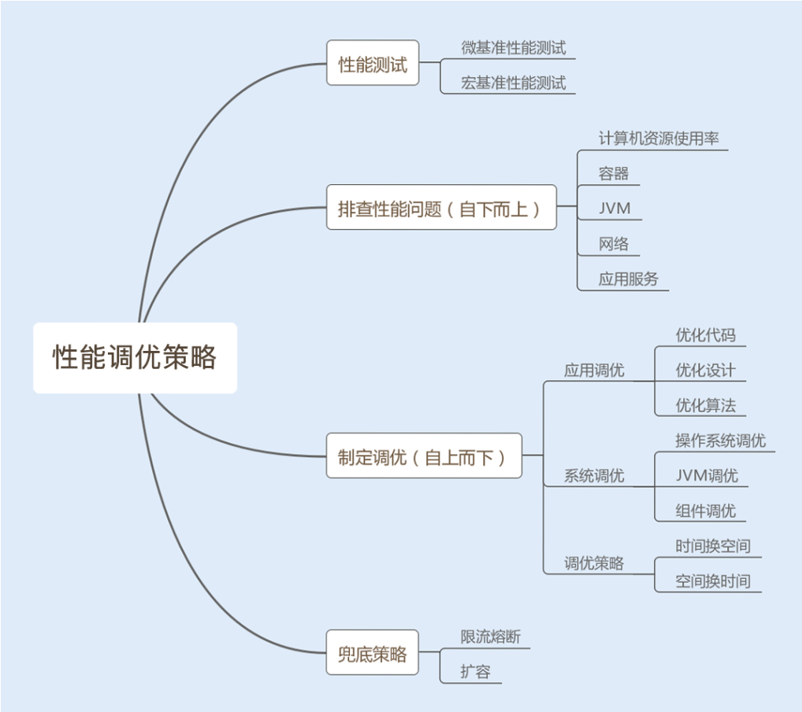
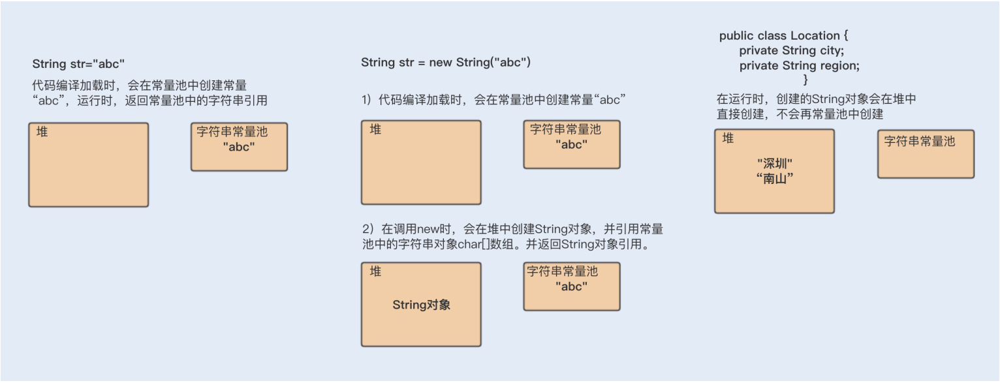
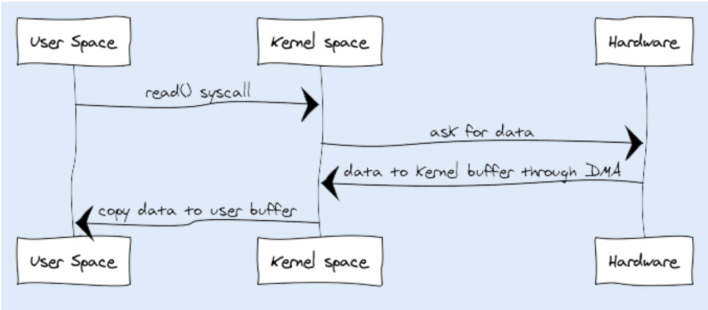
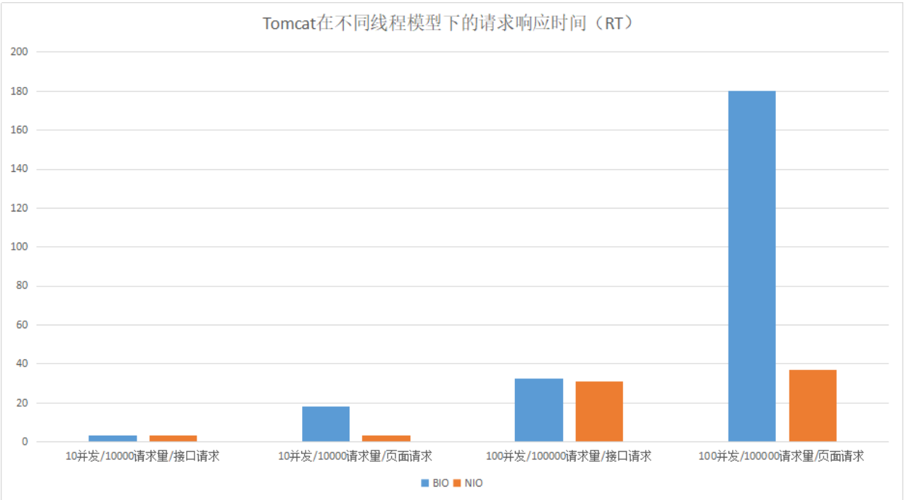
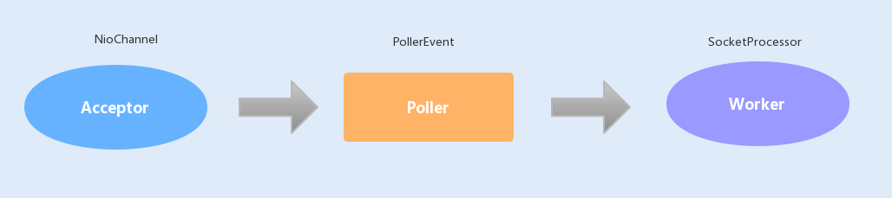

# 概述

## 为什么要做性能调优

一款线上产品如果没有经过性能测试，那它就好比是一颗定时炸弹，你不知道它什么时候会出现问题，你也不清楚它能承受的极限在哪儿。  

有些性能问题是时间累积慢慢产生的，到了一定时间自然就爆炸了；而更多的性能问题是由
访问量的波动导致的，例如，活动或者公司产品用户量上升；当然也有可能是一款产品上线
后就半死不活，一直没有大访问量，所以还没有引发这颗定时炸弹。  

**必须要做性能测试！！！**

预估这个访问量（并发量）并作出可能的场景模拟，再通过性能调优去解决这些问题。

**好的系统性能调优不仅仅可以提高系统的性能，还能为公司节省资源。**这也是我们做性能调
优的最直接的目的。  

## 何时进行性能调优

其实，在项目开发的初期，我们没有必要过于在意性能优化，这样反而会让我们疲于性能优
化，不仅不会给系统性能带来提升，还会影响到开发进度，甚至获得相反的效果，给系统带
来新的问题 。

我们只需要在代码层面保证有效的编码，比如，减少磁盘 I/O 操作、降低竞争锁的使用以
及使用高效的算法等等。遇到比较复杂的业务，我们可以充分利用设计模式来优化业务代
码。例如，设计商品价格的时候，往往会有很多折扣活动、红包活动，我们可以用装饰模式
去设计这个业务。  

在系统编码完成之后，我们就可以对系统进行性能测试了。这时候，产品经理一般会提供**线**
**上预期数据**，我们在提供的参考平台上进行压测，通过性能分析、统计工具来统计各项性能
指标，看是否在预期范围之内。  

在项目成功上线后，我们还需要根据线上的实际情况，依照日志监控以及性能统计日志，来
观测系统性能问题，一旦发现问题，就要对日志进行分析并及时修复问题。  


## 有哪些参考因素可以体现系统的性能？  

在我们了解性能指标之前，我们先来了解下哪些计算机资源会成为系统的性能瓶颈。  

CPU，内存，磁盘IO，网络

> 异常：Java 应用中，抛出异常需要构建异常栈，对异常进行捕获和处理，这个过程非常消
> 耗系统性能。如果在高并发的情况下引发异常，持续地进行异常处理，那么系统的性能就会
> 明显地受到影响。  

> 锁竞争：在并发编程中，我们经常会需要多个线程，共享读写操作同一个资源，这个时候为
> 了保持数据的原子性（即保证这个共享资源在一个线程写的时候，不被另一个线程修改），
> 我们就会用到锁。锁的使用可能会带来上下文切换，从而给系统带来性能开销。JDK1.6 之
> 后，Java 为了降低锁竞争带来的上下文切换，对 JVM 内部锁已经做了多次优化，例如，新
> 增了偏向锁、自旋锁、轻量级锁、锁粗化、锁消除等。而如何合理地使用锁资源，优化锁资
> 源，就需要你了解更多的操作系统知识、Java 多线程编程基础，积累项目经验，并结合实
> 际场景去处理相关问题。  


我们的服务主要都是用socket接收报文，不是http协议怎么判断响应时间？只能内部统计，用AOP Around来统计每个报文的处理时间。

## 总结

性能调优可以使系统稳定，用户体验更佳，甚至在比较大的系统中，还能帮公司节约资源  

延伸一个方法，就是将迭代之前版本的系统性能指标作为参考标准，通过自动化性能测试，校验迭代发版之后的系统性能是否出现异常，这里就不仅仅是比较吞吐量、响应时间、负载能力等直接指标了，还需要比较系统资源的 CPU 占用率、内存使用率、磁盘I/O、网络 I/O 等几项间接指标的变化。  


## 如何制定性能调优策略

### 两种常用的测试方法

1. 微基准性能测试
   微基准性能测试可以精准定位到某个模块或者某个方法的性能问题，特别适合做一个功能模块或者一个方法在不同实现方式下的性能对比。例如，对比一个方法使用同步实现和非同步实现的性能。  

2. 宏基准性能测试
   宏基准性能测试是一个综合测试，需要考虑到测试环境、测试场景和测试目标。
   首先看测试环境，我们需要模拟线上的真实环境。
   然后看测试场景。我们需要确定在测试某个接口时，是否有其他业务接口同时也在平行运行，造成干扰。如果有，请重视，因为你一旦忽视了这种干扰，测试结果就会出现偏差。

   最后看测试目标。我们的性能测试是要有目标的，这里可以通过吞吐量以及响应时间来衡量系统是否达标。不达标，就进行优化；达标，就继续加大测试的并发数，探底接口的TPS（最大每秒事务处理量），这样做，可以深入了解到接口的性能。除了测试接口的吞吐量和响应时间以外，我们还需要循环测试可能导致性能问题的接口，观察各个服务器的CPU、内存以及 I/O 使用率的变化  

我们在做性能测试时，还要注意一些问题  

1. 热身问题  

   随着代码被执行的次数增多，当虚拟机发现某个方法或代码块运行得特别频繁时，就会把这些代码认定为热点代码（Hot Spot Code）。为了提高热点代码的执行效率，在运行时，虚拟机将会通过即时编译器（JIT compiler，just-in-time compiler）把这些代码编译成与本地平台相关的机器码，并进行各层次的优化，然后存储在内存中，之后每次运行代码时，直接从内存中获取即可。所以在刚开始运行的阶段，虚拟机会花费很长的时间来全面优化代码，后面就能以最高性能执行了。
   这就是热身过程，如果在进行性能测试时，热身时间过长，就会导致第一次访问速度过慢，你就可以考虑先优化，再进行测试。  

2. 性能测试结果不稳定
   我们在做性能测试时发现，每次测试处理的数据集都是一样的，但测试结果却有差异。这是因为测试时，伴随着很多不稳定因素，比如机器其他进程的影响、网络波动以及每个阶段JVM 垃圾回收的不同等等。
   我们可以通过多次测试，将测试结果求平均，或者统计一个曲线图，只要保证我们的平均值是在合理范围之内，而且波动不是很大，这种情况下，性能测试就是通过的。  

### 合理分析结果，制定调优策略  

我们在完成性能测试之后，需要输出一份性能测试报告，帮我们分析系统性能测试的情况。其中测试结果需要包含测试接口的平均、最大和最小吞吐量，响应时间，服务器的 CPU、内存、I/O、网络 IO 使用率，JVM 的 GC 频率等。  

通过观察这些调优标准，可以发现性能瓶颈，我们再通过自下而上的方式分析查找问题。首先从操作系统层面，查看系统的 CPU、内存、I/O、网络的使用率是否存在异常，再通过命令查找异常日志，最后通过分析日志，找到导致瓶颈的原因；还可以从 Java 应用的 JVM  层面，查看 JVM 的垃圾回收频率以及内存分配情况是否存在异常，分析日志，找到导致瓶颈的原因。
		如果系统和 JVM 层面都没有出现异常情况，我们可以查看应用服务业务层是否存在性能瓶颈，例如 Java 编程的问题、读写数据瓶颈等等。  

我们分析查找问题可以采用自下而上的方式，而我们解决系统性能问题，则可以采用自上而下的方式逐级优化。  

### 调优策略

1. 优化代码
   应用层的问题代码往往会因为耗尽系统资源而暴露出来。例如，我们某段代码导致内存溢出，往往是将 JVM 中的内存用完了，这个时候系统的内存资源消耗殆尽了，同时也会引发JVM 频繁地发生垃圾回收，导致 CPU 100% 以上居高不下，这个时候又消耗了系统的CPU 资源。
   还有一些是非问题代码导致的性能问题，这种往往是比较难发现的，需要依靠我们的经验来优化。例如，我们经常使用的 LinkedList 集合，如果使用 for 循环遍历该容器，将大大降低读的效率，但这种效率的降低很难导致系统性能参数异常。
   这时有经验的同学，就会改用 Iterator （迭代器）迭代循环该集合，这是因为 LinkedList是链表实现的，如果使用 for 循环获取元素，在每次循环获取元素时，都会去遍历一次List，这样会降低读的效率。  

2. 优化设计
   面向对象有很多设计模式，可以帮助我们优化业务层以及中间件层的代码设计。优化后，不仅可以精简代码，还能提高整体性能。例如，单例模式在频繁调用创建对象的场景中，可以共享一个创建对象，这样可以减少频繁地创建和销毁对象所带来的性能消耗。
3. 优化算法
   好的算法可以帮助我们大大地提升系统性能。例如，在不同的场景中，使用合适的查找算法可以降低时间复杂度。
4. 时间换空间
   有时候系统对查询时的速度并没有很高的要求，反而对存储空间要求苛刻，这个时候我们可以考虑用时间来换取空间。
   例如，我在 03 讲就会详解的用 String 对象的 intern 方法，可以将重复率比较高的数据集存储在常量池，重复使用一个相同的对象，这样可以大大节省内存存储空间。但由于常量池使用的是 HashMap 数据结构类型，如果我们存储数据过多，查询的性能就会下降。所以在这种对存储容量要求比较苛刻，而对查询速度不作要求的场景，我们就可以考虑用时间换空间。
5. 空间换时间
   这种方法是使用存储空间来提升访问速度。现在很多系统都是使用的 MySQL 数据库，较为常见的分表分库是典型的使用空间换时间的案例。
   因为 MySQL 单表在存储千万数据以上时，读写性能会明显下降，这个时候我们需要将表数据通过某个字段 Hash 值或者其他方式分拆，系统查询数据时，会根据条件的 Hash 值判断找到对应的表，因为表数据量减小了，查询性能也就提升了。  

6. 参数调优
   以上都是业务层代码的优化，除此之外，JVM、Web 容器以及操作系统的优化也是非常关键的。
   根据自己的业务场景，合理地设置 JVM 的内存空间以及垃圾回收算法可以提升系统性能。例如，如果我们业务中会创建大量的大对象，我们可以通过设置，将这些大对象直接放进老年代。这样可以减少年轻代频繁发生小的垃圾回收（Minor GC），减少 CPU 占用时间，提升系统性能。
   Web 容器线程池的设置以及 Linux 操作系统的内核参数设置不合理也有可能导致系统性能瓶颈，根据自己的业务场景优化这两部分，可以提升系统性能。  

### 兜底策略，确保系统稳定性

#### 什么是兜底策略？

- 限流，对系统的入口设置最大访问限制。这里可以参考性能测试中探底接口的 TPS。同时采取熔断措施，友好地返回没有成功的请求。
- 实现智能化横向扩容。智能化横向扩容可以保证当访问量超过某一个阈值时，系统可以根据需求自动横向新增服务。
- 提前扩容。这种方法通常应用于高并发系统，例如，瞬时抢购业务系统。这是因为横向扩容无法满足大量发生在瞬间的请求，即使成功了，抢购也结束了。

目前很多公司使用 Docker 容器来部署应用服务。这是因为 Docker 容器是使用Kubernetes 作为容器管理系统，而 Kubernetes 可以实现智能化横向扩容和提前扩容Docker 服务。

### 总结  

调优策略千变万化，但思路和核心都是一样的，都是从业务调优（业务层面，有没有冗余流程等）到编程调优（代码层面，是否有死循环，效率低的算法等），再到系统调优（基础设施层面，是否有成为性能瓶颈的第三方资源等）  

> 最后，给你提个醒，任何调优都需要结合场景明确**已知问题和性能目标**，不能为了调优而调优，以免引入新的 Bug，带来风险和弊端。  



# JAVA编程性能调优

## String的优化

在 Java 中要比较两个对象是否相等，往往是用 ==，而要判断两个对象的值是否相等，则需要用 equals 方法来判断。

### 如何构建超大字符串？    

Java 在进行字符串的拼接时，偏向使用 StringBuilder，这样可以提高程序的效率。

```
String str = "abcdef";
for(int i=0; i<1000; i++) {
str = str + i;
}
```

上面的代码编译后，你可以看到编译器同样对这段代码进行了优化。不难发现，Java 在进行字符串的拼接时，偏向使用 StringBuilder，这样可以提高程序的效率。

```
String str = "abcdef";
for(int i=0; i<1000; i++) {
str = (new StringBuilder(String.valueOf(str))).append(i).toString();
}  
```

综上已知：即使使用 + 号作为字符串的拼接，也一样可以被编译器优化成 StringBuilder的方式。但再细致些，你会发现在编译器优化的代码中，每次循环都会生成一个新的StringBuilder 实例，同样也会降低系统的性能。**所以平时做字符串拼接的时候，我建议你还是要显示地使用 String Builder 来提升系统性能。**

如果在多线程编程中，String 对象的拼接涉及到线程安全，你可以使用 StringBuffer。但是要注意，由于 StringBuffer 是线程安全的，涉及到锁竞争，所以从性能上来说，要比StringBuilder 差一些。  

### 如何使用 String.intern 节省内存  



### 如何使用字符串的分割方法？  

最后我想跟你聊聊字符串的分割，这种方法在编码中也很最常见。Split() 方法使用了正则表达式实现了其强大的分割功能，而正则表达式的性能是非常不稳定的，使用不恰当会引起回溯问题，很可能导致 CPU 居高不下。
		所以我们应该慎重使用 Split() 方法，我们可以用 String.indexOf() 方法代替 Split() 方法完成字符串的分割。如果实在无法满足需求，你就在使用 Split() 方法时，对回溯问题加以重视就可以了。  

### 总结

String 对象的不可变性，正是这个特性实现了字符串常量池，通过减少同一个值的字符串对象的重复创建，进一步节约内存。但也是因为这个特性，我们在做长字符串拼接时，需要显示使用 StringBuilder，以提高字符串的拼接性能。最后，在优化方面，我们还可以使用 intern 方法，让变量字符串对象重复使用常量池中相同值的对象，进而节约内存。  

## Stream如何提高遍历集合效率？

在循环迭代次数较少的情况下，常规的迭代方式性能反而更好；在单核 CPU 服务器配置环境中，也是常规迭代方式更有优势；而在大数据循环迭代中，如果服务器是多核 CPU 的情况下，Stream 的并行迭代优势明显。所以我们在平时处理大数据的集合时，应该尽量考虑将应用部署在多核 CPU 环境下，并且使用 Stream 的并行迭代方式进行处理。  

我们看到其实使用 Stream 未必可以使系统性能更佳，还是要结合应用场景进行选择，也就是合理地使用 Stream。  

## 网络通信优化之I/O模型：如何解决高并发下I/O瓶颈？

### 多次内存复制

在传统 I/O 中，我们可以通过 InputStream 从源数据中读取数据流输入到缓冲区里，通过OutputStream 将数据输出到外部设备（包括磁盘、网络）。你可以先看下输入操作在操作系统中的具体流程，如下图所示：  



JVM 会发出 read() 系统调用，并通过 read 系统调用向内核发起读请求；内核向硬件发送读指令，并等待读就绪；内核把将要读取的数据复制到指向的内核缓存中；操作系统内核将数据复制到用户空间缓冲区，然后 read 系统调用返回。  

在这个过程中，数据先从外部设备复制到内核空间，再从内核空间复制到用户空间，这就发生了两次内存复制操作。这种操作会导致不必要的数据拷贝和上下文切换，从而降低 I/O的性能。  

### 阻塞

在传统 I/O 中，InputStream 的 read() 是一个 while 循环操作，它会一直等待数据读取，直到数据就绪才会返回。这就意味着如果没有数据就绪，这个读取操作将会一直被挂起，用户线程将会处于阻塞状态。在少量连接请求的情况下，使用这种方式没有问题，响应速度也很高。但在发生大量连接请求时，就需要创建大量监听线程，这时如果线程没有数据就绪就会被挂起，然后进入阻塞状态。一旦发生线程阻塞，这些线程将会不断地抢夺 CPU 资源，从而导致大量的 CPU 上下文切换，增加系统的性能开销。  

> 说的是读取大量磁盘数据的场景，貌似目前没有遇到过，文件/数据库里的数据统计？

我们可以把监听多个 I/O 连接请求比作一个火车站的进站口。以前检票只能让搭乘就近一趟发车的旅客提前进站，而且只有一个检票员，这时如果有其他车次的旅客要进站，就只能在站口排队。这就相当于最早没有实现线程池的 I/O 操作。
		后来火车站升级了，多了几个检票入口，允许不同车次的旅客从各自对应的检票入口进站。这就相当于用多线程创建了多个监听线程，同时监听各个客户端的 I/O 请求。最后火车站进行了升级改造，可以容纳更多旅客了，每个车次载客更多了，而且车次也安排合理，乘客不再扎堆排队，可以从一个大的统一的检票口进站了，**这一个检票口可以同时检票多个车次**。这个大的检票口就相当于 Selector，车次就相当于 Channel，旅客就相当于I/O 流。  

> 最形象的是一个检票口可以同时检票多个车次，哪个车次先到就先运哪个车次的乘客，这就是NIO的思路

```java
import java.io.FileInputStream;
import java.io.FileOutputStream;
import java.nio.ByteBuffer;
import java.nio.channels.FileChannel;

public class DirectBufferExample {
    public static void main(String[] args) {
        try {
            FileInputStream fis = new FileInputStream("source_file.txt");
            FileOutputStream fos = new FileOutputStream("destination_file.txt");

            FileChannel sourceChannel = fis.getChannel();
            FileChannel destinationChannel = fos.getChannel();

            // 使用DirectBuffer进行数据传输
            ByteBuffer buffer = ByteBuffer.allocateDirect(1024);
            while (sourceChannel.read(buffer) != -1) {
                buffer.flip();
                destinationChannel.write(buffer);
                buffer.clear();
            }

            sourceChannel.close();
            destinationChannel.close();
            fis.close();
            fos.close();
        } catch (Exception e) {
            e.printStackTrace();
        }
    }
}
```

我们使用 ByteBuffer.allocateDirect() 方法创建了一个 DirectBuffer，它是一个直接缓冲区，可以直接从操作系统内核空间传输数据。

与使用 heap（堆）上的缓冲区不同，NIO的DirectBuffer 通过直接在系统内核空间中分配内存来存储数据。这样一来，在数据传输时就可以直接从内核空间读取数据，然后写入目标通道，而不需要复制数据到 Java 堆中，再进行传输。

使用 DirectBuffer 的主要优点包括：

避免了数据复制：由于 DirectBuffer 可以直接访问内核空间，因此避免了数据在Java堆和内核空间之间的复制，提高了传输效率。

减少了内存开销：DirectBuffer 的内存存储在系统内核空间中，并且由系统管理。因此，它不会占用 Java 堆的内存，减少了堆内存的使用。

需要注意的是，使用 DirectBuffer 时需要注意控制内存的使用量，因为 DirectBuffer 的内存是直接由操作系统分配和管理的，并且分配的内存可能比堆上的缓冲区大。因此，如果频繁地创建大量的 DirectBuffer，可能会导致内存使用不当和内存泄漏问题。

## 网络通信优化之序列化：避免使用Java序列化

Java 默认的序列化是通过 Serializable 接口实现的，只要类实现了该接口，同时生成一个默认的版本号，我们无需手动设置，该类就会自动实现序列化与反序列化。Java 默认的序列化虽然实现方便，但却存在安全漏洞、不跨语言以及性能差等缺陷，所以我强烈建议你避免使用 Java 序列化。纵观主流序列化框架，FastJson、Protobuf、Kryo 是比较有特点的，而且性能以及安全方面都得到了业界的认可，我们可以结合自身业务来选择一种适合的序列化框架，来优化系统
的序列化性能。  

## 深入了解NIO的优化实现原理

Tomcat 中经常被提到的一个调优就是修改线程的 I/O 模型。Tomcat 8.5 版本之前，默认情况下使用的是 BIO 线程模型，如果在高负载、高并发的场景下，可以通过设置 NIO 线程模型，来提高系统的网络通信性能  



**Tomcat 在 I/O 读写操作比较多的情况下，使用 NIO 线程模型有明显的优势。**  

你可以通过以下几个参数来设置 Acceptor 线程池和 Worker 线程池的配置项。



- acceptorThreadCount：该参数代表 Acceptor 的线程数量，在请求客户端的数据量非常巨大的情况下，可以适当地调大该线程数量来提高处理请求连接的能力，默认值为 1。
- maxThreads：专门处理 I/O 操作的 Worker 线程数量，默认是 200，可以根据实际的环境来调整该参数，但不一定越大越好。
- acceptCount：Tomcat 的 Acceptor 线程是负责从 accept 队列中取出该 connection，然后交给工作线程去执行相关操作，这里的 acceptCount 指的是 accept 队列的大小。当 Http 关闭 keep alive，在并发量比较大时，可以适当地调大这个值。而在 Http 开启keep alive 时，因为 Worker 线程数量有限，Worker 线程就可能因长时间被占用，而连接在 accept 队列中等待超时。如果 accept 队列过大，就容易浪费连接。
- maxConnections：表示有多少个 socket 连接到 Tomcat 上。在 BIO 模式中，一个线程只能处理一个连接，一般 maxConnections 与 maxThreads 的值大小相同；在 NIO 模式中，一个线程同时处理多个连接，maxConnections 应该设置得比 maxThreads 要大的多，默认是 10000。  
