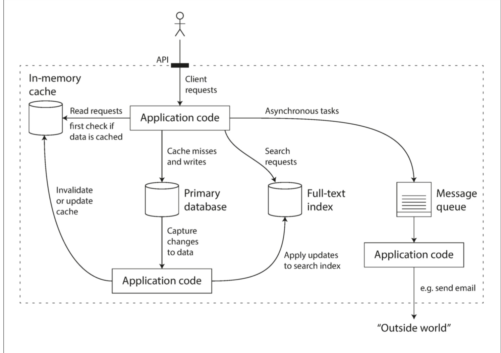
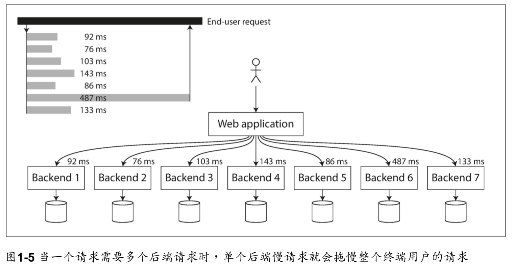

# Preface

We call an application data-intensive if data is its primary challenge—the quantity of data, the complexity of data, or the speed at  which it is changing—as opposed to compute-intensive, where CPU cycles are the bottleneck.  

After reading this book, you will be in a great position to decide which kind of technology is appropriate for which purpose, and understand how tools can be combined to form the foundation of a good application architecture.  


# 数据系统的基石

## 第一章： 可靠性， 可扩展性， 可维护性

数据密集型应用通常由标准组件构建而成， 标准组件提供了很多通用的功能； 例如， 许多应用程序都需要：

- 数据库（ database）：存储数据， 以便自己或其他应用程序之后能再次找到
- 缓存（ cache）：记住开销昂贵操作的结果， 加快读取速度
- 搜索索引（ search indexes）：允许用户按关键字搜索数据， 或以各种方式对数据进行过滤
- 流处理（ stream processing）：向其他进程发送消息， 进行异步处理
- 批处理（ batch processing）：定期处理累积的大批量数据  



**一个可能的组合使用多个组件的数据系统架构**（很经典）  

There are many factors that may influence the design of a data system, including the skills and experience of the people involved, legacy system dependencies, the timescale for delivery, your organization’s tolerance of different kinds of risk, regulatory constraints, etc. Those factors depend very much on the situation.  

- Reliability（可靠性/可用性）
  The system should continue to work correctly (performing the correct function at the desired level of performance) even in the face of adversity (hardware or software faults, and even human error). 
- Scalability（可扩展性）
  As the system grows (in data volume, traffic volume, or complexity), there should be reasonable ways of dealing with that growth. 
- Maintainability（）
  Over time, many different people will work on the system (engineering and operations, both maintaining current behavior and adapting the system to new usecases), and they should all be able to work on it productively. See “Maintainability” on page 18.  

> - 可靠性（ Reliability）
>   系统在困境（ adversity） （ 硬件故障、 软件故障、 人为错误） 中仍可正常工作（ 正确完成功能， 并能达到期望的性能水准） 。
> - 可扩展性（ Scalability）
>   有合理的办法应对系统的增长（ 数据量、 流量、 复杂性） （ 参阅“可扩展性”）
> - 可维护性（ Maintainability）
>   许多不同的人（ 工程师、 运维） 在不同的生命周期， 都能在高效地在系统上工作（ 使系统保持现有行为， 并适应新的应用场景） 。 （ 参阅”可维护性“）  

### 可靠性

人们对于一个东西是否可靠， 都有一个直观的想法。 人们对可靠软件的典型期望包括：

- 应用程序表现出用户所期望的功能。
- 允许用户犯错， 允许用户以出乎意料的方式使用软件。
- 在预期的负载和数据量下， 性能满足要求。
- 系统能防止未经授权的访问和滥用。
如果所有这些在一起意味着“正确工作”， 那么可以把可靠性粗略理解为“即使出现问题， 也能继续正确工作”。  

造成错误的原因叫做故障（ fault） ， 能预料并应对故障的系统特性可称为容错（ faulttolerant） 或韧性（ resilient） 。 “容错”一词可能会产生误导， 因为它暗示着系统可以容忍所有可能的错误， 但在实际中这是不可能的。 比方说， 如果整个地球（ 及其上的所有服务器）都被黑洞吞噬了， 想要容忍这种错误， 需要把网络托管到太空中——这种预算能不能批准就祝你好运了。 **所以在讨论容错时， 只有谈论特定类型的错误才有意义。**  

> 性能也是如此，understand？Mr.yu

注意故障（ fault） 不同于失效（ failure） 【2】 。 故障通常定义为系统的一部分状态偏离其标准， 而失效则是系统作为一个整体停止向用户提供服务。 故障的概率不可能降到零， 因此最好设计容错机制以防因故障而导致失效。 本书中我们将介绍几种用不可靠的部件构建可靠系统的技术。  

Counterintuitively, in such fault-tolerant systems, it can make sense to increase the rate of faults by triggering them deliberately—for example, by randomly killing individual processes without warning. Many critical bugs are actually due to poor error handling [3]; by deliberately inducing faults, you ensure that the fault-tolerance machinery is continually exercised and tested, which can increase your confidence that faults will be handled correctly when they occur naturally. The Netflix Chaos Monkey [4] is an example of this approach.  

> 故意引起故障是有意义(make sense)的，他代表你的系统能正确处理故障

#### Hardware Faults

直到最近， 硬件冗余对于大多数应用来说已经足够了， 它使单台机器完全失效变得相当罕见。 只要你能快速地把备份恢复到新机器上， 故障停机时间对大多数应用而言都算不上灾难性的。 只有少量高可用性至关重要的应用才会要求有多套硬件冗余。

但是随着数据量和应用计算需求的增加， 越来越多的应用开始大量使用机器， 这会相应地增加硬件故障率。 此外在一些云平台（ 如亚马逊网络服务（ AWS, Amazon Web Services） ）中， 虚拟机实例不可用却没有任何警告也是很常见的【7】 ， 因为云平台的设计就是优先考虑灵活性（ flexibility） 和弹性（ elasticity） ， 而不是单机可靠性。

如果在硬件冗余的基础上进一步引入软件容错机制， 那么系统在容忍整个（ 单台） 机器故障的道路上就更进一步了。 这样的系统也有运维上的便利， 例如： 如果需要重启机器（ 例如应用操作系统安全补丁） ， 单服务器系统就需要计划停机。 而允许机器失效的系统则可以一次修复一个节点， 无需整个系统停机。  

#### 软件错误

另一类错误是内部的系统性错误（ systematic error） 【7】 。 这类错误难以预料， 而且因为是跨节点相关的， 所以比起不相关的硬件故障往往可能造成更多的系统失效【5】 。 例子包括：

- 接受特定的错误输入， 便导致所有应用服务器实例崩溃的BUG。 例如2012年6月30日的
  闰秒， 由于Linux内核中的一个错误， 许多应用同时挂掉了。
- 失控进程会占用一些共享资源， 包括CPU时间、 内存、 磁盘空间或网络带宽。
- 系统依赖的服务变慢， 没有响应， 或者开始返回错误的响应。
- 级联故障， 一个组件中的小故障触发另一个组件中的故障， 进而触发更多的故障  

导致这类软件故障的BUG通常会潜伏很长时间， 直到被异常情况触发为止。 这种情况意味着软件对其环境做出了某种假设——虽然这种假设通常来说是正确的， 但由于某种原因最后不再成立了【11】 。  

#### 人为错误

一项关于大型互联网服务的研究发现， 运维配置错误是导致服务中断的首要原因， 而硬件故障（ 服务器或网络） 仅导致了10-25％的服务中断  

尽管人类不可靠， 但怎么做才能让系统变得可靠？ 最好的系统会组合使用以下几种办法：

- 以最小化犯错机会的方式设计系统。 例如， 精心设计的抽象、 API和管理后台使做对事情更容易， 搞砸事情更困难。 但如果接口限制太多， 人们就会忽略它们的好处而想办法绕开。 很难正确把握这种微妙的平衡。
- 将人们最容易犯错的地方与可能导致失效的地方解耦（ decouple） 。 特别是提供一个功能齐全的非生产环境沙箱（ sandbox） ， 使人们可以在不影响真实用户的情况下， 使用真实数据安全地探索和实验。
- 在各个层次进行彻底的测试【3】 ， 从单元测试、 全系统集成测试到手动测试。 自动化测试易于理解， 已经被广泛使用， 特别适合用来覆盖正常情况中少见的边缘场景（ corner case） 。
- 允许从人为错误中简单快速地恢复， 以最大限度地减少失效情况带来的影响。 例如， 快速回滚配置变更， 分批发布新代码（ 以便任何意外错误只影响一小部分用户） ， 并提供数据重算工具（ 以备旧的计算出错） 。
- 配置详细和明确的监控， 比如性能指标和错误率。 在其他工程学科中这指的是遥测（ telemetry） 。 （ 一旦火箭离开了地面， 遥测技术对于跟踪发生的事情和理解失败是至关重要的。 ） 监控可以向我们发出预警信号， 并允许我们检查是否有任何地方违反了假设和约束。 当出现问题时， 指标数据对于问题诊断是非常宝贵的。
- 良好的管理实践与充分的培训——一个复杂而重要的方面， 但超出了本书的范围。  

####  可靠性有多重要？  

即使在“非关键”应用中， 我们也对用户负有责任。 试想一位家长把所有的照片和孩子的视频储存在你的照片应用里【15】 。 如果数据库突然损坏， 他们会感觉如何？ 他们可能会知道如何从备份恢复吗？

在某些情况下， 我们可能会选择牺牲可靠性来降低开发成本（ 例如为未经证实的市场开发产品原型） 或运营成本（ 例如利润率极低的服务） ， 但我们偷工减料时， 应该清楚意识到自己在做什么。  

### 可扩展性  

系统今天能可靠运行， 并不意味未来也能可靠运行。 服务降级（ degradation） 的一个常见原因是负载增加， 例如： 系统负载已经从一万个并发用户增长到十万个并发用户， 或者从一百万增长到一千万。 也许现在处理的数据量级要比过去大得多。

可扩展性（ Scalability） 是用来描述系统应对负载增长能力的术语。 但是请注意， 这不是贴在系统上的一维标签： 说“X可扩展”或“Y不可扩展”是没有任何意义的。 相反， 讨论可扩展性意味着考虑诸如“如果系统以特定方式增长， 有什么选项可以应对增长？ ”和“如何增加计算资源来处理额外的负载？ ”等问题。  

#### 描述负载  

推特的扩展性挑战并不是主要来自推特量， 而是来自扇出（ fan-out） ——每个用户关注了很多人， 也被很多人关注。  

1. 发布推文时， 只需将新推文插入全局推文集合即可。 当一个用户请求自己的主页时间线时， 首先查找他关注的所有人， 查询这些被关注用户发布的推文并按时间顺序合并。 在如图1-2所示的关系型数据库中， 可以编写这样的查询：

```
SELECT tweets.*, users.*
FROM tweets
JOIN users ON tweets.sender_id = users.id
JOIN follows ON follows.followee_id = users.id
WHERE follows.follower_id = current_user  
```

2. 为每个用户的主页时间线维护一个缓存， 就像每个用户的推文收件箱（ 图1-3） 。 当一个用户发布推文时， 查找所有关注该用户的人， 并将新的推文插入到每个主页时间线缓存中。 因此读取主页时间线的请求开销很小， 因为结果已经提前计算好了。  

在推特的例子中， 每个用户粉丝数的分布（ 可能按这些用户的发推频率来加权） 是探讨可扩展性的一个关键负载参数， 因为它决定了扇出负载。 你的应用程序可能具有非常不同的特征， 但可以采用相似的原则来考虑它的负载。

推特轶事的最终转折： 现在已经稳健地实现了方法2， 推特逐步转向了两种方法的混合。 大多数用户发的推文会被扇出写入其粉丝主页时间线缓存中。 但是少数拥有海量粉丝的用户（ 即名流） 会被排除在外。 当用户读取主页时间线时， 分别地获取出该用户所关注的每位名流的推文， 再与用户的主页时间线缓存合并， 如方法1所示。 这种混合方法能始终如一地提供良好性能。 在第12章中我们将重新讨论这个例子， 这在覆盖更多技术层面之后。  

#### 描述性能  

一旦系统的负载被描述好， 就可以研究当负载增加会发生什么。 我们可以从两种角度来看：

- 增加负载参数并保持系统资源（ CPU、 内存、 网络带宽等） 不变时， 系统性能将受到什么影响？

- 增加负载参数并希望保持性能不变时， 需要增加多少系统资源？  

Latency and response timeLatency and response time are often used synonymously, but theyare not the same. The response time is what the client sees: besidesthe actual time to process the request (the service time), it includesnetwork delays and queueing delays. Latency is the duration that a request is waiting to be handled—during which it is latent, awaiting service [17].  

通常使用百分位点（ percentiles） 会更好。 如果将响应时间列表按最快到最慢排序， 那么中位数（ median） 就在正中间： 举个例子， 如果你的响应时间中位数是200毫秒， 这意味着一半请求的返回时间少于200毫秒， 另一半比这个要长。  

如果想知道典型场景下用户需要等待多长时间， 那么中位数是一个好的度量标准： 一半用户请求的响应时间少于响应时间的中位数， 另一半服务时间比中位数长。 中位数也被称为第50百分位点， 有时缩写为p50。 注意中位数是关于单个请求的； 如果用户同时发出几个请求（ 在一个会话过程中， 或者由于一个页面中包含了多个资源） ， 则至少一个请求比中位数慢的概率远大于50％  

为了弄清异常值有多糟糕， 可以看看更高的百分位点， 例如第95、 99和99.9百分位点（ 缩写为p95， p99和p999） 。 它们意味着95％， 99％或99.9％的请求响应时间要比该阈值快， 例如： 如果第95百分位点响应时间是1.5秒， 则意味着100个请求中的95个响应时间快于1.5秒，而100个请求中的5个响应时间超过1.5秒。   

响应时间的高百分位点（ 也称为尾部延迟（ tail latencies） ） 非常重要， 因为它们直接影响用户的服务体验。 例如亚马逊在描述内部服务的响应时间要求时以99.9百分位点为准， 即使它只影响一千个请求中的一个。 这是因为请求响应最慢的客户往往也是数据最多的客户， 也可以说是最有价值的客户 —— 因为他们掏钱了【19】 。 保证网站响应迅速对于保持客户的满意度非常重要， 亚马逊观察到： 响应时间增加100毫秒， 销售量就减少1％【20】 ； 而另一些报告说： 慢 1 秒钟会让客户满意度指标减少16%  

另一方面， 优化第99.99百分位点（ 一万个请求中最慢的一个） 被认为太昂贵了， 不能为亚马逊的目标带来足够好处。 减小高百分位点处的响应时间相当困难， 因为它很容易受到随机事件的影响， 这超出了控制范围， 而且效益也很小。  

排队延迟（ queueing delay） 通常占了高百分位点处响应时间的很大一部分。 由于服务器只能并行处理少量的事务（ 如受其CPU核数的限制） ， 所以只要有少量缓慢的请求就能阻碍后续请求的处理， 这种效应有时被称为头部阻塞（ head-of-line blocking） 。 即使后续请求在服务器上处理的非常迅速， 由于需要等待先前请求完成， 客户端最终看到的是缓慢的总体响应时间。 因为存在这种效应， 测量客户端的**响应时间**非常重要。  

简单的实现是在时间窗口内保存所有请求的响应时间列表， 并且每分钟对列表进行排序。 如果对你来说效率太低， 那么有一些算法能够以最小的CPU和内存成本（ 如前向衰减【25】 ， t-digest【26】 或HdrHistogram 【27】 ） 来计算百分位数的近似值。 请注意， 平均值（ 例如， 减少时间分辨率或合并来自多台机器的数据） 在数学上没有意义 - 聚合响应时间数据的正确方法是添加直方图  

> 平均值没有意义，因为只要有少量耗时长的请求就会导致响应时间边长，但对于我们这种接口响应还是有意义的吧，除非对应某个接口有好几个处理



#### 应对负载的方法  

人们经常讨论纵向扩展（ scaling up） （ 垂直扩展（ vertical scaling） ， 转向更强大的机器） 和横向扩展（ scaling out） （ 水平扩展（ horizontal scaling） ， 将负载分布到多台小机器上） 之间的对立。 跨多台机器分配负载也称为“无共享（ shared-nothing） ”架构。 可以在单台机器上运行的系统通常更简单， 但高端机器可能非常贵， 所以非常密集的负载通常无法避免地需要横向扩展。 现实世界中的优秀架构需要将这两种方法务实地结合， 因为使用几台足够强大的机器可能比使用大量的小型虚拟机更简单也更便宜。  

有些系统是弹性（ elastic） 的， 这意味着可以在检测到负载增加时自动增加计算资源， 而其他系统则是手动扩展（ 人工分析容量并决定向系统添加更多的机器） 。 如果负载极难预测（ highly unpredictable） ， 则弹性系统可能很有用， 但手动扩展系统更简单， 并且意外操作可能会更少  

跨多台机器部署无状态服务（ stateless services） 非常简单， 但将带状态的数据系统从单节点变为分布式配置则可能引入许多额外复杂度。 出于这个原因， 常识告诉我们应该将数据库放在单个节点上（ 纵向扩展） ， 直到扩展成本或可用性需求迫使其改为分布式。  

> 非必要不要轻易横向扩展数据库，因为数据库一般都是有状态的，它是基于历史数据的

随着分布式系统的工具和抽象越来越好， 至少对于某些类型的应用而言， 这种常识可能会改变。 可以预见分布式数据系统将成为未来的默认设置， 即使对不处理大量数据或流量的场景也如此。  

> 好吧，还是分布式起来吧哈哈哈哈

大规模的系统架构通常是应用特定的—— 没有一招鲜吃遍天的通用可扩展架构（ 不正式的叫法： 万金油（ magic scaling sauce） ） 。 应用的问题可能是读取量、 写入量、 要存储的数据量、 数据的复杂度、 响应时间要求、 访问模式或者所有问题的大杂烩。  

> 没有银弹知道不，Mr.yu

举个例子， 用于处理每秒十万个请求（ 每个大小为1 kB） 的系统与用于处理每分钟3个请求（ 每个大小为2GB） 的系统看上去会非常不一样， 尽管两个系统有同样的数据吞吐量。  

> 所以测试一定要基于真实场景和确定的指标，懂吗Mr.Yu

### Maintainability  

众所周知， 软件的大部分开销并不在最初的开发阶段， 而是在持续的**维护阶段**， 包括修复漏洞、 保持系统正常运行、 调查失效、 适配新的平台、 为新的场景进行修改、 偿还技术债、 添加新的功能等等。  

但是我们可以， 也应该以这样一种方式来设计软件： 在设计之初就尽量考虑尽可能减少维护期间的痛苦， 从而避免自己的软件系统变成遗留系统。 为此， 我们将特别关注软件系统的三个设计原则：

- 可操作性（ Operability）
  便于运维团队保持系统平稳运行。
- 简单性（ Simplicity）
  从系统中消除尽可能多的复杂度（ complexity） ， 使新工程师也能轻松理解系统。 （ 注意这和用户接口的简单性不一样。 ）
- 可演化性（ evolability）
  使工程师在未来能轻松地对系统进行更改， 当需求变化时为新应用场景做适配。 也称为可扩展性（ extensibility） ， 可修改性（ modifiability） 或可塑性（ plasticity） 。  

#### Operability: Making Life Easy for Operations  

运维团队对于保持软件系统顺利运行至关重要。 一个优秀运维团队的典型职责如下（ 或者更
多） 【29】 ：

- 监控系统的运行状况， 并在服务状态不佳时快速恢复服务
- 跟踪问题的原因， 例如系统故障或性能下降
- 及时更新软件和平台， 比如安全补丁
- 了解系统间的相互作用， 以便在异常变更造成损失前进行规避。
- 预测未来的问题， 并在问题出现之前加以解决（ 例如， 容量规划）
- 建立部署， 配置、 管理方面的良好实践， 编写相应工具
- 执行复杂的维护任务， 例如将应用程序从一个平台迁移到另一个平台
- 当配置变更时， 维持系统的安全性
- 定义工作流程， 使运维操作可预测， 并保持生产环境稳定。
- 铁打的营盘流水的兵， 维持组织对系统业务的了解。  

良好的可操作性意味着更轻松的日常工作， 进而运维团队能专注于高价值的事情。 数据系统可以通过各种方式使日常任务更轻松：

- 通过良好的监控， 提供对系统内部状态和运行时行为的可见性（ visibility）
- 为自动化提供良好支持， 将系统与标准化工具相集成
- 避免依赖单台机器（ 在整个系统继续不间断运行的情况下允许机器停机维护）
- 提供良好的文档和易于理解的操作模型（ “如果做X， 会发生Y”）
- 提供良好的默认行为， 但需要时也允许管理员自由覆盖默认值
- 有条件时进行自我修复， 但需要时也允许管理员手动控制系统状态
- 行为可预测， 最大限度减少意外  

#### 简单性： 管理复杂度  

因为复杂度导致维护困难时， 预算和时间安排通常会超支。 在复杂的软件中进行变更， 引入错误的风险也更大： 当开发人员难以理解系统时， 隐藏的假设、 无意的后果和意外的交互就更容易被忽略。 相反， 降低复杂度能极大地提高软件的可维护性， 因此简单性应该是构建系统的一个关键目标。  

简化系统并不一定意味着减少功能； 它也可以意味着消除额外的（ accidental） 的复杂度。Moseley和Marks【32】 把额外复杂度定义为： 由具体实现中涌现， 而非（ 从用户视角看， 系统所解决的） 问题本身固有的复杂度。  

> 就是说业务很简单，但是实现得过于复杂了

用于消除额外复杂度的最好工具之一是抽象（ abstraction） 。 一个好的抽象可以将大量实现细节隐藏在一个干净， 简单易懂的外观下面。 一个好的抽象也可以广泛用于各类不同应用。比起重复造很多轮子， 重用抽象不仅更有效率， 而且有助于开发高质量的软件。 抽象组件的质量改进将使所有使用它的应用受益。  

> 也就是我们说的封装细节，我觉得叫封装更好一点

例如， 高级编程语言是一种抽象， 隐藏了机器码、 CPU寄存器和系统调用。 SQL也是一种抽象， 隐藏了复杂的磁盘/内存数据结构、 来自其他客户端的并发请求、 崩溃后的不一致性。 当然在用高级语言编程时， 我们仍然用到了机器码； 只不过没有直接（ directly） 使用罢了， 正是因为编程语言的抽象， 我们才不必去考虑这些实现细节。

抽象可以帮助我们将系统的复杂度控制在可管理的水平， 不过， 找到好的抽象是非常困难的。 在分布式系统领域虽然有许多好的算法， 但我们并不清楚它们应该打包成什么样抽象。

本书将紧盯那些允许我们将大型系统的部分提取为定义明确的、 可重用的组件的优秀抽象。  

#### 可演化性： 拥抱变化  

在组织流程方面， 敏捷（ agile） 工作模式为适应变化提供了一个框架。 敏捷社区还开发了对在频繁变化的环境中开发软件很有帮助的技术工具和模式， 如测试驱动开发（ TDD, testdriven development） 和重构（ refactoring） 。  

例如， 为了将装配主页时间线的方法从方法1变为方法2， 你会如何“重构”推特的架构 ？  

修改数据系统并使其适应不断变化需求的容易程度， 是与简单性和抽象性密切相关的： 简单易懂的系统通常比复杂系统更容易修改。 但由于这是一个非常重要的概念， 我们将用一个不同的词来指代数据系统层面的敏捷性： 可演化性（ evolvability）   

### 本章小结  

一个应用必须满足各种需求才称得上有用。 有一些功能需求（ functional requirements）（ 它应该做什么， 比如允许以各种方式存储， 检索， 搜索和处理数据） 以及一些非功能性需求（ nonfunctional ） （ 通用属性， 例如安全性， 可靠性， 合规性， 可扩展性， 兼容性和可维
护性） 。 在本章详细讨论了可靠性， 可扩展性和可维护性。

可靠性（ Reliability） 意味着即使发生故障， 系统也能正常工作。 故障可能发生在硬件（ 通常是随机的和不相关的） ， 软件（ 通常是系统性的Bug， 很难处理） ， 和人类（ 不可避免地时不时出错） 。 容错技术可以对终端用户隐藏某些类型的故障。

可扩展性（ Scalability） 意味着即使在负载增加的情况下也有保持性能的策略。 为了讨论可扩展性， 我们首先需要定量描述负载和性能的方法。 我们简要了解了推特主页时间线的例子， 介绍描述负载的方法， 并将响应时间百分位点作为衡量性能的一种方式。 在可扩展的系统中可以添加处理容量（ processing capacity） 以在高负载下保持可靠。

可维护性（ Maintainability） 有许多方面， 但实质上是关于工程师和运维团队的生活质量的。 良好的抽象可以帮助降低复杂度， 并使系统易于修改和适应新的应用场景。 良好的可操作性意味着对系统的健康状态具有良好的可见性， 并拥有有效的管理手段。  

## 第二章 数据模型与查询语言  

### Relational Model Versus Document Model

#### NoSQL的诞生

采用NoSQL数据库的背后有几个驱动因素， 其中包括：

- 需要比关系数据库更好的可扩展性， 包括非常大的数据集或非常高的写入吞吐量
- 相比商业数据库产品， 免费和开源软件更受偏爱。
- 关系模型不能很好地支持一些特殊的查询操作
- 受挫于关系模型的限制性， 渴望一种更具多动态性与表现力的数据模型【5】  

#### 对象关系不匹配

目前大多数应用程序开发都使用面向对象的编程语言来开发， 这导致了对SQL数据模型的普遍批评： 如果数据存储在关系表中， 那么需要一个笨拙的转换层， 处于应用程序代码中的对象和表， 行， 列的数据库模型之间。 模型之间的不连贯有时被称为阻抗不匹配（ impedance mismatch）  

有一些开发人员认为JSON模型减少了应用程序代码和存储层之间的阻抗不匹配。 不过， 正如我们将在第4章中看到的那样， JSON作为数据编码格式也存在问题。 缺乏一个模式往往被认为是一个优势;我们将在“文档模型中的模式灵活性”中讨论这个问题。JSON表示比图2-1中的多表模式具有更好的局部性（ locality） 。 如果在前面的关系型示例中获取简介， 那需要执行多个查询（ 通过 user_id 查询每个表） ， 或者在User表与其下属表之间混乱地执行多路连接。 而在JSON表示中， 所有相关信息都在同一个地方， 一个查询就足够了。  

从用户简介文件到用户职位， 教育历史和联系信息， 这种一对多关系隐含了数据中的一个树状结构， 而JSON表示使得这个树状结构变得明确  

#### 多对一和多对多的关系

使用ID的好处是， ID对人类没有任何意义， 因而永远不需要改变： ID可以保持不变， 即使它标识的信息发生变化。 任何对人类有意义的东西都可能需要在将来某个时候改变——如果这些信息被复制， 所有的冗余副本都需要更新。 这会导致写入开销， 也存在不一致的风险（ 一 些副本被更新了， 还有些副本没有被更新） 。 去除此类重复是数据库规范化（ normalization） 的关键思想  

不幸的是， 对这些数据进行规范化需要多对一的关系（ 许多人生活在一个特定的地区， 许多人在一个特定的行业工作） ， 这与文档模型不太吻合。 在关系数据库中， 通过ID来引用其他表中的行是正常的， 因为连接很容易。 在文档数据库中， 一对多树结构没有必要用连接， 对连接的支持通常很弱   

如果数据库本身不支持连接， 则必须在应用程序代码中通过对数据库进行多个查询来模拟连接。 （ 在这种情况中， 地区和行业的列表可能很小， 改动很少， 应用程序可以简单地将其保存在内存中。 不过， 执行连接的工作从数据库被转移到应用程序代码上。  

####  文档数据库是否在重蹈覆辙？

在一个方面， 文档数据库还原为层次模型： 在其父记录中存储嵌套记录（ 图2-1中的一对多关系， 如 positions ， education 和 contact_info ） ， 而不是在单独的表中。但是， 在表示多对一和多对多的关系时， 关系数据库和文档数据库并没有根本的不同： 在这两种情况下， 相关项目都被一个唯一的标识符引用， 这个标识符在关系模型中被称为外键，在文档模型中称为文档引用【9】 。 该标识符在读取时通过连接或后续查询来解析。 迄今为止， 文档数据库没有走CODASYL(网状数据库)的老路  

#### 关系型数据库与文档数据库在今日的对比

将关系数据库与文档数据库进行比较时， 可以考虑许多方面的差异， 包括它们的容错属性（ 参阅第5章） 和处理并发性（ 参阅第7章） 。 本章将只关注数据模型中的差异。支持文档数据模型的主要论据是架构灵活性， 因局部性而拥有更好的性能， 以及对于某些应用程序而言更接近于应用程序使用的数据结构。 关系模型通过为连接提供更好的支持以及支持多对一和多对多的关系来反击。  

#### 哪个数据模型更方便写代码？

如果应用程序中的数据具有类似文档的结构（ 即， 一对多关系树， 通常一次性加载整个树） ， 那么使用文档模型可能是一个好主意。 将类似文档的结构分解成多个表（ 如图2-1中的 positions ， education 和 contact_info ） 的关系技术可能导致繁琐的模式和不必要的复杂的应用程序代码。  

> 有点像我代码里的计划…

文档模型有一定的局限性： 例如， 不能直接引用文档中的嵌套的项目， 而是需要说“用户251的位置列表中的第二项”（ 很像分层模型中的访问路径） 。 但是， 只要文件嵌套不太深， 这通常不是问题  

> 文档模型适用于横向扩展，不适用垂直扩展

The poor support for joins in document databases may or may not be a problem, depending on the application. For example, many-to-many relationships may never be needed in an analytics application that uses a document database to record which events occurred at which time  

> 文档数据库对连接的糟糕支持可能是也可能不是一个问题， 这取决于应用程序。  

但是， 如果你的应用程序确实使用多对多关系， 那么文档模型就没有那么吸引人了。 通过反规范化可以减少对连接的需求， 但是应用程序代码需要做额外的工作来保持数据的一致性。通过向数据库发出多个请求， 可以在应用程序代码中模拟连接， 但是这也将复杂性转移到应用程序中， 并且通常比由数据库内的专用代码执行的连接慢。 在这种情况下， 使用文档模型会导致更复杂的应用程序代码和更差的性能  

It’s not possible to say in general which data model leads to simpler application code; it depends on the kinds of relationships that exist between data items. For highly interconnected data, the document model is awkward, the relational model is acceptable, and graph models (see “Graph-Like Data Models” on page 49) are the most natural.  

#### 文档模型中的架构灵活性

例如， 假设你把每个用户的全名存储在一个字段中， 而现在想分别存储名字和姓氏【23】 。 在文档数据库中， 只需开始写入具有新字段的新文档， 并在应用程序中使用代码来处理读取旧文档的情况。 例如：

```
if (user && user.name && !user.first_name) {
// Documents written before Dec 8, 2013 don't have first_name
user.first_name = user.name.split(" ")[0];
}  
```

一方面， 在“静态类型”数据库模式中， 通常会执行以下迁移（ migration） 操作：

```sql
ALTER TABLE users ADD COLUMN first_name text;

UPDATE users SET first_name = substring_index(name, ' ', 1);
```

模式变更的速度很慢， 而且要求停运。 它的这种坏名誉并不是完全应得的： 大多数关系数据库系统可在几毫秒内执行 ALTER TABLE 语句。 MySQL是一个值得注意的例外， 它执行 ALTER TABLE 时会复制整个表， 这可能意味着在更改一个大型表时会花费几分钟甚至几个小时的停机时间， 尽管存在各种工具来解决这个限制  

大型表上运行 UPDATE 语句在任何数据库上都可能会很慢， 因为每一行都需要重写。 要是不可接受的话， 应用程序可以将 first_name 设置为默认值 NULL ， 并在读取时再填充， 就像使用文档数据库一样。  

#### 查询的数据局部性

The database typically needs to load the entire document, even if you access only a small portion of it, which can be wasteful on large documents. On
updates to a document, the entire document usually needs to be rewritten—only modifications that don’t change the encoded size of a document can easily be performed in place [19]. For these reasons, it is generally recommended that you keep documents fairly small and avoid writes that increase the size of a document [9]. These performance limitations significantly reduce the set of situations in which document databases are useful.  

> 除非应用大多数时候需要整个文档，不然使用文档数据库会造成性能浪费

#### 文档和关系数据库的融合

随着时间的推移， 关系数据库和文档数据库似乎变得越来越相似， 这是一件好事： 数据模型相互补充 ， 如果一个数据库能够处理类似文档的数据， 并能够对其执行关系查询， 那么应用程序就可以使用最符合其需求的功能组合。关系模型和文档模型的混合是未来数据库一条很好的路线。  

### 数据查询语言
