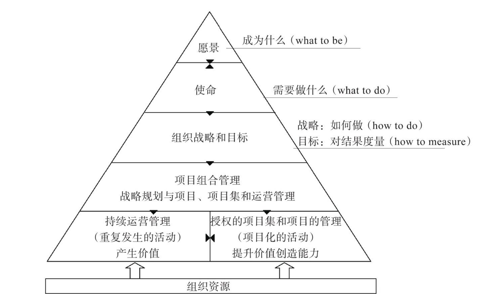
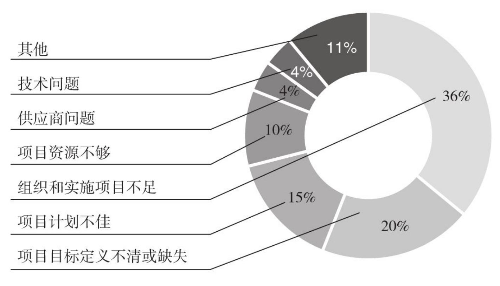
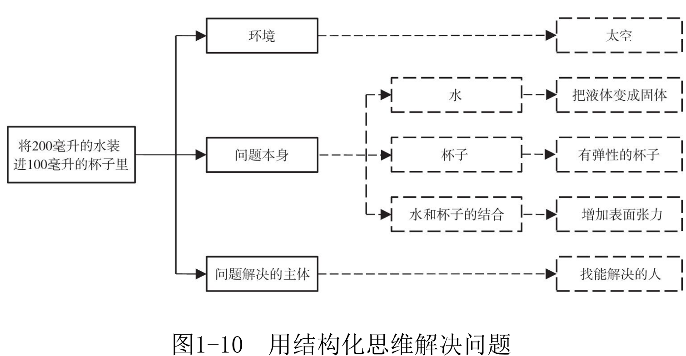
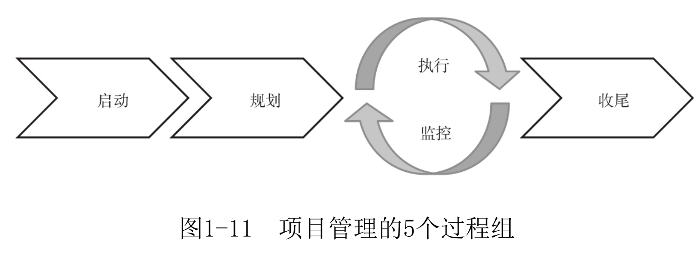
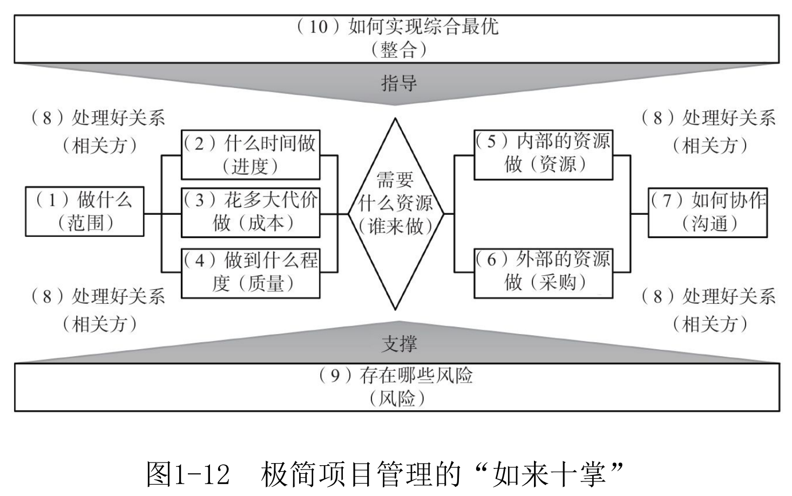
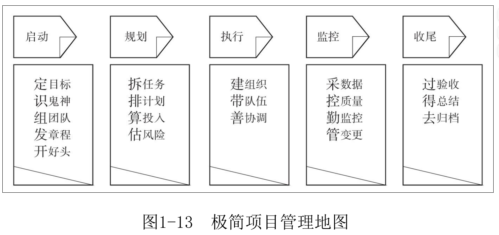
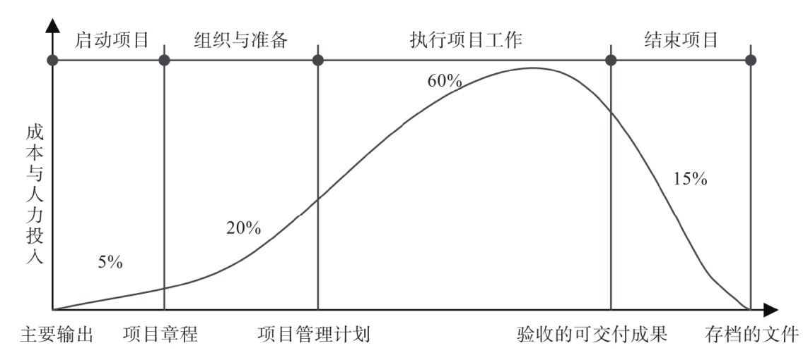
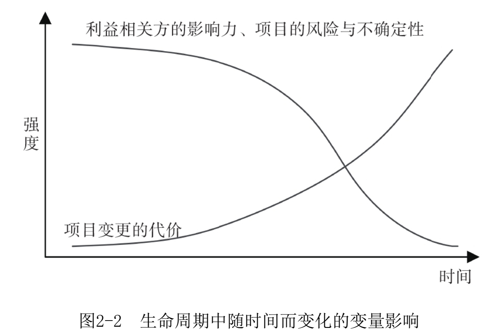
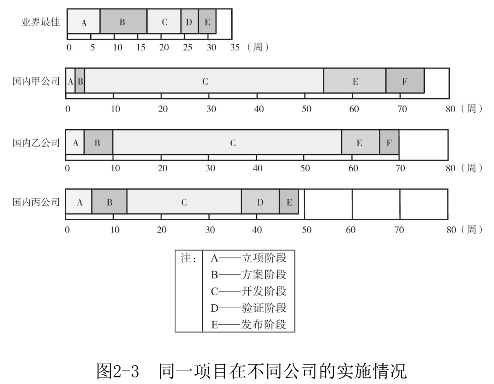

> 项目管理本质上是一种基于战略方向，组织开拓创新和应对变化的学问，其目的在于**调配各方资源**，让它们在**短时间**内形成**合力**，完成突破性的商业**目标**。  

成功的企业创始人不缺乏头脑、胆识和洞察力，他们也的确搭乘国内高速发展的快车，挖到了金子，取得了一定的成绩。遗憾的是，这些成绩多为粗放的、低效的，从某种程度上来说，靠的是街头智慧和冒险精神。2020年春节前，有人调侃自己过去的一年：“过去几年靠运气挣到的钱，今年靠实力基本赔光了！”  

国内经验主义盛行，然而事实证明在项目管理这个行当中，过度相信经验，效果并不好。**经验仅代表过去，依托于传统要素和经验的管理方法越来越难以适应当下的行业发展需求。更有甚者，这些成功的经验成了进一步前进的桎梏。**因此，切记不要过分迷信自己的经验，经过众人验证的科学方法不同于个人经验，无论个人经验怎样有效，都无法代替被众人验证过的科学方法。  

> 创业者需要具备完整的知识体系，但更需要快速地学习与实践，他们不需要先集中学完一整套知识，而是应根据自己所处的创业阶段和当前的关键问题，有针对性地学习、实践和反馈。  

第一部分介绍项目管理的基础知识，为后续的学习和交流打好基础。

第二部分介绍实施极简项目管理的五大过程，这部分也是全书的重点。为方便项目的实施和落地，这些过程可以被分解为19个步骤，即极简项目管理地图，也称为“三字经”。

第三部分着眼于项目管理者的成长问题。项目管理者可以说是项目的灵魂人物，一方面要选择合适的人管理项目，另一方面要把合适的人培养好，二者都很重要。  

# 第一部分 认识项目管理  

## 第1章 极简项目管理基础  

> 用户根本不知道自己需要什么，直到你把它摆在他面前。——史蒂夫·乔布斯  

> 我确实说不清我想要的东西是什么样子的，但我能说清的是你给我的东西不是我想要的。  ——客户

### 1.1 项目是独特的一次性事业  

> 通过开展持续的活动来生产同样的产品或提供重复的服务的工作就是运营，而为创造**独特的产品、服务或成果**而进行的**临时性的工作**则是项目。  ——项目管理知识体系指南（PMBOK® 指南）  

人类总会犯一个错误：人总是用之前见过的东西，来描述一个未曾出现过的东西  

在没看到成果之前，客户也提不出具体要求，而把成果交到客户面前时，这个结果就能刺激客户进行思考：客户拿着这个结果与头脑中的想象做比较时就会发现差距，于是不断提出修改意见。

#### 1.1.1 项目开始时总存在说不清的成分  

可见，项目在开始时总存在说不清的成分，这就会导致一个问题——**频繁的变更**。说白了，这种频繁的变更是由项目工作本身的性质决定的。很多人不懂这个道理，总是追着客户，要求客户说清楚之后再干。这些人会让客户签字——你不是想要“马”吗？那你签个字我再干。到最后，他们发现**签字并没有改变频繁变更的状况，反而为后续与客户意见不合造成了隐患。我并不反对签字，因为不签字客户要求的变更会更随意，但我反对把签字当成与客户意见不合时，进而“扯皮”的依据**。

现在，如果再看到有人逼着客户在项目开始时把所有问题都说清楚，你也可以怼他一句：“孩子没出生之前，你能把孩子长什么样说清吗？”  

#### 1.1.2 项目是一个业务过程，而非技术过程

如果不盯着技术指标，问题也许还能解决，但若只盯着技术指标，往往就容易沉浸在细节里面出不来了。这不仅使得问题得不到解决，还会把自己搞得狼狈不堪。  

那正确的方法应该是什么呢？建议你要求客户说明他们为什么会提出这些要求。通过不断地提问，你最终会知道问题的根源。实际上，**针对业务的解决方案才是客户的真实需求**。  

> 比如客户想知道VHF射频的模块状态，我就可以追问为什么想知道，是模块经常坏还是导致业务做不起来，了解更深层次的需求

具体而言，面对客户所说的“想要一匹跑得更快的马”这个问题，我们从开始就不要盯着马本身提问，而是应该去问客户业务问题。这些问题可以是：你要马干什么呀？想解决什么问题呀？你要的这匹马要在什么情况下使用呢？使用时会遇到什么困难呀？总之，围绕使用的背景、环境、目的等业务问题进行提问，而不是围绕“对马详细描述”的技术问题进行提问。在这里，我要提醒你，遇到问题以后不要试图仅仅解决问题本身，还要去解决问题所在环境的问题  

> 搞清楚WHY比搞清楚WHAT更重要

事实上，系统工程的一个基本原理就是超越系统本身解决问题，即**N维系统产生的问题只有在N+1维系统中才能解决**。用我们老祖宗的话来说，叫“不识庐山真面目，只缘身在此山中”。  

> 请务必记住：项目是一个业务过程，而不是技术过程。  

项目管理者也应该是一个业务层面的管理者。项目的业务思维方式，能帮助你快速理解客户的痛点，明白客户“真正的需求”，在此基础上你再给出专业的反馈，并提供解决方案。  

可见，要能把需求确认落地，实施者必须有很好的业务建模能力，并以咨询方式展开，也就是要推出自己的方案，快速地给客户展示合理的样例。一方面，这样可以较好地引导客户提出合理的需求，把他们的思路控制在可执行的范围内。另一方面，通过逆向反馈，推动客户确认需求，可以较大程度地避免理解上的偏差。  

多年的经验告诉我，对于项目，一定要给客户看到“样板房”，如样品、模型、照片、软件的基本界面等，否则很可能会出问题！  

#### 1.1.3 拥抱变更：无关人品，项目使然  

客户每一次提出新的要求，都是在帮我们逐步逼近事实真相。  

问题是，在没有看到最终结果之前，客户怎么知道这是不是最后一次呢？  

更严重的是，有的人在面对变更时，不是去消灭新需求，而是去消灭提出新需求的人。于是，因为变更导致的冲突、打架事件层出不穷。  

实际上，只要理解项目的不确定性，就很容易明白绝大多数变更不是人的问题，而是项目属性所决定的。在频繁变更这件事上，无论谁做项目都不可避免，**因此唯一需要调整的就是我们面对变更的态度**。  

> 时刻记住，变更来源于项目属性，与人无关。  

所以，我们今后在与人沟通变更时，应注意改变态度，少一些抱怨和吐槽，而要说：“谢谢你让我离真相又近了一步。”

关于变更，请务必记住：无关人品，项目使然！一句话：在项目中拥抱变更（注意是“拥抱”而非“接受”）。  

### 1.2 项目的特点  

项目在本质上是独特的、临时的非重复性工作，要求使用有限的资源，在有限的时间内为特定的人（或组织）完成某种特定目标（产品、服务或成果）  

首先，定义明确了项目的目的是给出产品、服务或成果，对于结果强调了其“独特性”；

其次，对于工作时限强调了其“临时性”。独特性说明项目所创造的成果存在与众不同的地方，即成果的不重复性。同样，为创造独特成果而开展工作的过程不仅具有临时性，也具有不重复性。这种“不重复性”会给人们在认识项目的过程中带来很多不确定因素，这就是项目的风险来源。该如何认识“复杂、不确定”的项目呢？答案就是渐进明细 。

**独特性、临时性和渐进明细性**，是项目最显著的三大特性，其中独特性和临时性是最基本的特性，渐进明细性是在这个基础上衍生出来的  

#### 独特性

知识仅是对现实世界的近似描述，人不可能掌握任何事物的全部知识。不能认知和掌握的事物会显得比较复杂，对于复杂的事物，人们无法一开始就掌握完备的认识，需要循序渐进，而没有掌握完备的知识，往往就会犯错误。已经发生的错误称作问题，可能发生的错误称作风险，我们应该通过完善的程序来管理这些错误（问题和风险）。

当然独特性也提升了项目工作的挑战性，项目工作中的一个重要部分就是化解复杂性，使之更明确、更可控

#### 临时性

快速变化的环境会使过去赚钱的产品很快变成明日黄花，未及时交付的项目成果将失去商业价值。

临时性会造成项目管理者的权限不足。因为项目的临时性，在组建项目团队时可能会遇到“招不到合适成员”的情况。大多数情况下，项目经理可能会在管理团队成员时感到“权力不足”。在常见的矩阵组织结构中，项目经理和团队成员之间是单次博弈，而职能经理和团队成员之间是多次博弈，职能经理决定成员的工资、奖金和晋升，而非项目经理。

#### 渐进明细性

渐进明细性是指逐渐细化，意味着项目是在连续积累中分步骤实现的，即逐步明确项目的细节特征（见图1-3）。由于项目在实施过程中可能发生变化，因此应该在整个项目生命周期中反复开展计划工作，对工作进行逐步修正。

在项目中，需要渐进明细的方面包括：

- 项目目标。开始只有方向性的大目标，然后逐渐细化出具体的、可测量的、可实现的小目标。
- 项目范围。开始只有粗略的范围说明书，然后细化出工作分解结构（work breakdown structure，WBS）和工作分解结构词典。
- 项目计划。开始只有控制性的计划，然后逐渐明细，制订具体的实施计划。

渐进明细是正常的，项目范围不可能在开始的时候就非常清晰，需要不断地补充、细化、完善，这是客观规律。范围蔓延是不正常的、危险的、失控的，应该在项目实施过程中控制好这个问题。

> 其实就是产品定位的问题，像OP就是定位模糊，什么都想往里面塞，最后成了四不像

实现渐进明细的方式有两种：

- 化大为小，逐步推进。将项目划分成几个阶段，在不同的阶段执行不同的项目活动，最终分阶段完成项目的所有活动。

- 剥洋葱式，逐层深入。首先解决当前能够解决的问题，再逐层深入，每个层次上以不同的完整程度进行项目活动，最后彻底完成项目。

#### 总结

从项目的临时性、独特性和渐进明细性这三种特性方面讲，任何一项工作，如果你更看重它的临时性、独特性和渐进明细性，它就是项目；如果你更看重它的重复性，与其他工作的相似性，且一开始就能明确大部分细节，它就是运营。从这个意义上讲，组织中的许多工作都可以被看作项目，可以进行“项目化管理”。

### 项目的价值在于驱动变革

项目管理类工作的最下面一层是项目管理。项目组合管理从投资视角解决了资源分配问题，项目集管理站在资源效率角度解决了项目之间的协同问题。而每个项目的执行问题就交给了最下面一层的项目管理。项目目标定下来以后，工作重点就是在一定的约束（范围、进度、成本、质量等）下完成既定工作。

Standish Group的调查数据显示，[1]截至2018年，项目按期、按预算和范围完成的比率不足40%，而具有很高价值的项目（按5分制对1000个组织进行的调查）仅为8%，让人很满意的项目仅为12%。

对项目失败原因进行调查，其结果如图1-7所示，项目很少由于技术和“硬”实力方面的不足而失败，却常常因为组织、人力等管理方面的“软”实力不足而失败（见图1-8）。可见，管理是否有效对于项目的成败十分重要

### 极简项目管理：用结构化降低项目难度

以后遇到问题一定要运用结构化思维，试着从三个方面去解决问题：问题本身、问题的所在环境、问题解决的主体。问题本身、环境、解决主体这三个维度组成了理解和分析问题的空间结构，

我建议在遇到问题后，先把所有的解决方案列出来，然后再分析每一个方案的优缺点并进行排序，最后选择代价最小的方案去实施。

项目管理的过程就是将复杂问题简单化并予以解决的过程，降低复杂度的一个重要方法就是结构化。

事实上，极简项目管理的过程就是用结构化思维解决问题的过程，具体如下：

（1）按所需开展的管理工作将项目过程分为5个过程组：启动、规划、执行、监控、收尾。

（2）按需要解决的问题将项目管理分为10个知识领域，我将其称为项目管理的“如来十掌”。

（3）为实现项目目标，将上述两个维度的问题进一步分解为19个步骤，我将这些步骤统一用三个字来表达，为方便记忆我将其称为极简项目管理的“三字经”。

#### 五大过程组

根据《项目管理知识体系指南》，项目的生命周期共包括5个部分，因为每个部分都会包含至少两个相对独立又相互联系的过程，所以又称“过程组”。项目管理的5个过程组如图1-11所示。

每个过程组的主要工作如下：

- 启动：确立项目的合法地位和总体要求（目标），宣布项目正式立项（上马）。

- 规划：编制项目计划，把项目目标具体化，制订达到目标的路线图。

- 执行：按计划开展项目活动，把纸面上的成果变成实实在在的成果。

- 监控：把实际情况与计划要求进行比较，发现偏差，分析偏差，并在必要时进行变更（包括调整计划或对执行纠偏）。

- 收尾：按序开展收尾工作，把项目正式关门。

这五大过程组之间彼此独立，界限清晰。但是，在实践中，它们会以无法详述的方式相互重叠、交叉、循环，所以它们之间的关系不是纯直线式的，不能用简单的线形思维去看待各过程组及其过程之间的关系。

5大过程组是一个PDCA循环的过程。因为项目有始有终，需要开始和结束，所以与普通的戴明环相比增加了启动和收尾这两个步骤

> PDCA循环的含义是将质量管理分为四个阶段，即Plan（计划）、Do（执行）、Check（检查）和 Act（处理）。在质量管理活动中，要求把各项工作按照作出计划、计划实施、检查实施效果，然后将成功的纳入标准，不成功的留待下一循环去解决。

#### 如来十掌

项目是一个复杂的系统过程，其管理思路可以概括为以下几个方面。

（1）明确项目目标（要什么）。

（2）确定需要完成什么（需要得到的结果）。

（3）制订需要做什么和怎么做的步骤（计划）。

（4）构建考核的基准（范围、进度、成本），组织好实施人员（管理人员），并在项目过程中通过绩效考核（管理绩效）以确保项目的完成

上述思路可以进一步明确为项目过程中面对的十个知识领域，也就是项目的十个相互关联的问题。我将其称为极简项目管理的“如来十掌”，其逻辑关系如图1-12所示

（1）确定项目的工作内容（范围管理）。

（2）确定这些工作要在什么时间完成（进度管理）。

（3）确定这些工作要花多大代价完成（成本管理）。

（4）确定这些工作做到什么程度才可以接受（质量管理）。

（5）弄清需要谁、使用哪些资源来完成项目（资源管理）。

（6）如果没有足够的资源，需要外包一些工作给其他公司或个人（采购管理）。

（7）项目所涉及的内外部人员之间需要进行有效沟通，才能较好地相互协调（沟通管理）。

（8）如何实现各相关人员有效参与和期望控制并获得其对项目的满意（相关方管理）。

（9）识别哪些不确定性因素会促进或妨碍项目成功，并积极加以管理（风险管理）。

（10）在上述9个相互竞争的目标下，如何实现最优（整合管理）。

> 特别说明，请务必熟记“如来十掌”。

#### 三字经

以五个过程组和“如来十掌”为框架，进一步展开为19个步骤，就形成了极简项目管理地图，如图1-13所示。我将这个地图称为极简项目管理的“三字经”。

# 第二部分 极简项目管理过程  

> 在过程中打败自己，在结果上打败对手。  

## 第2章 启动：师出有名，名正言顺  

> 项目不是在结束时失败，而是在开始时失败。  

### 生命周期模型是项目管理的工具  

无论项目涉及什么具体工作，生命周期模型都能为项目管理提供基本框架。  

在实践中，项目生命周期通常是按顺序排列，有时又相互交叉的各项目阶段的集合。  

#### 项目生命周期的特征

##### 1.生命周期为管控项目提供框架  

（1）成本与人力投入在开始时较低，在工作执行期间达到最高，在项目快要结束时迅速回落。这种典型的走势如图2-1所示  

（2）利益相关方的影响力、项目的风险与不确定性在项目开始时最大，并在项目的整个生命周期中随时间推移而递减，如图2-2所示。  

（3）在不显著影响成本的前提下，改变项目产品最终特性的能力在项目开始时最大，随项目进展而减弱。变更和纠正错误的成本在项目接近完成时通常会显著增高。  

> 假如某业主家里装修房子项目的计划工期是6个月，现在是第一个月，业主正在单位上班，突然接到施工人员从现场打来的电话：“业主，你家的开关面板装不平，请问怎么办？”如果是我，我会直接回他：“我不想听这些没用的，给我想办法装好！”你可能会问，我为什么这么强势呢？因为项目刚开始，人对项目的影响、改变的能力很强，而变更和纠正错误的成本很低。
>
> 假如装修公司在装修的第三个月反映开关面板装不平的问题，我会说：“你给我提供三种方案，告诉我每种方案的优点、缺点，让我从里面选一种。”这时候，我不会像一开始那么强势了，因为人对项目的影响、改变的能力都在降低，而变更的成本却在增加。
>
> 如果开关面板装不平的问题发生在装修项目的第8个月（已经延期了2个月），怎么办？我经常听到有人说：“装不好就扣钱！”事实上，拿扣钱相要挟的甲方，算不上一个成熟的甲方。正确的做法是告诉人：“先把美观放一边，无论如何都要保证好用！”此时人对项目的影响、改变的能力很弱，而变更和纠正错误的成本却很高。  

实际上，站在项目实施方（乙方）的角度来说，在项目生命周期中问题的处理原则如下。  

（1）项目早期的变更原则上应倾向于接受（我称之为“让怎么干就怎么干”）。  

（2）项目中期，要先分析变更的影响，原则上尽可能与相关人员沟通，取消变更（我称之为“要变更，先谈谈”）。  

（3）项目后期，变更成本太高，原则上应尽可能不变更。遇到大的变更时可以考虑启动一个新的项目，遇到小的变更也要到售后服务时再做。当务之急是先验收，将项目收尾。（我称之为“生米已成熟饭——吃，是这盘菜；不吃，还是这盘菜！”）  

总之，站在实施方（乙方）的角度，项目过程就是“**绑架客户上贼船的过程**”。当然，如果站在委托方（甲方）的角度，项目过程则是“**逐步移交主动权的过程**”。  

> 以培养一个孩子为例（显然这是最复杂的项目之一）。
>
> 幼儿时，父母要求孩子学什么他就学什么，父母影响孩子的能力很强。
>
> 孩子上小学后，父母的影响力减小了，如果提的要求过多，孩子就会叛逆。
>
> 孩子上中学后，父母再提太多的要求，某些孩子就会不回家吃饭，以此威胁父母。
>
> 当孩子大学毕业了，父母还敢提要求吗？不提要求人家都不回家吃饭，父母只能期望孩子能“常回家看看”！  

##### 2.没有时间把事情做对，却总是有时间返工  

启动阶段（图2-1中的启动项目阶段）的项目工作最重要，但是很多人把更多精力花在了中间的执行阶段（图2-1中执行项目工作的阶段）。前期策划还没有做好就已经仓促上了路，这就时常导致错误的结果——试错、返工。同一个项目在不同公司实施的情况如图2-3所示。很明显，在立项和方案阶段花的时间越长，项目的周期越短。可见，在项目的早期投入精力是非常划算的。  

> 如果你想要一块更好的石头（或斧头），你会在磨刀上花费一整天的时间

很多项目一开始就埋下了失败的隐患，当这些隐患积攒到项目的后期爆发出来时，项目经理已无力回天。据统计，当一个项目已实际使用10%的预算时，将会锁定项目90%的最终成本。因此，如果在项目前期不能妥善处理隐患，将会浪费实现项目最佳成果的机会。  

> 这是一个痛苦的过程，很多人容易失去耐心，可能倾向于放弃这个过程，“先干起来再说”是常听到的话。  

**现实总是如此，人们总是没有时间把事情做对，却总是有时间返工**  
