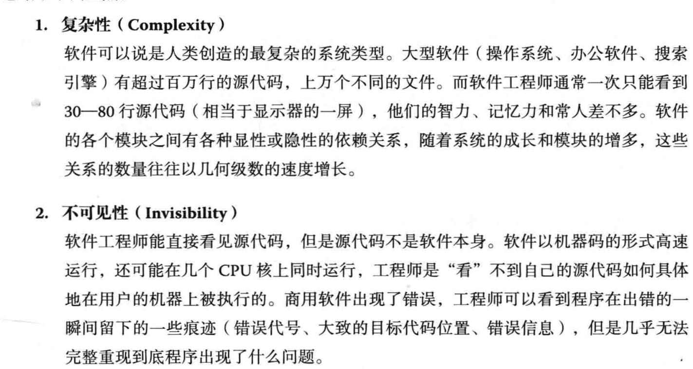
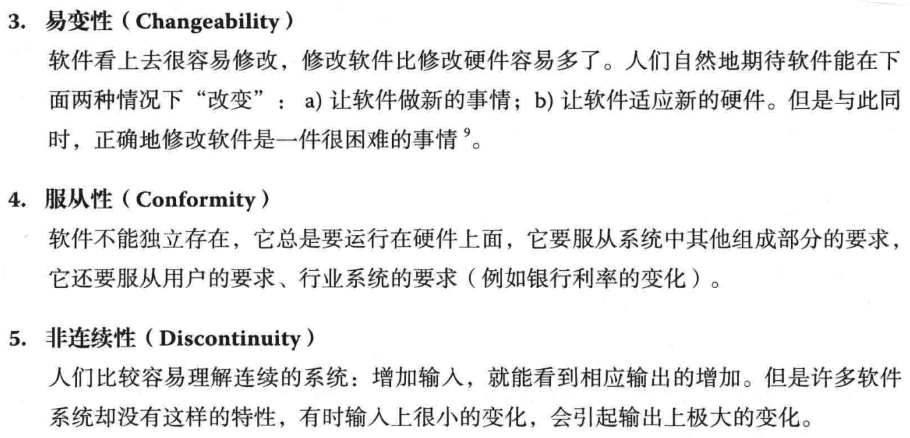
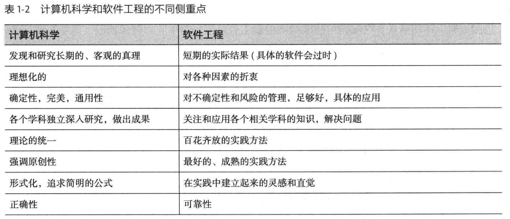

# 概论

需求从一个简单的程序，扩展到一个满足各种功能的应用软件，再扩展到一个能保证维修的软件服务。

程序，在这里指的是源代码，就是一行行的代码。

软件不同的版本->源代码管理（源代码管理）->保证程序正确性的工具和程序(质量保障)->验证过程（软件测试）

软件开发活动（构建管理、源代码管理、软件设计、软件测试、项目管理）相关的内容是软件工程的核心部分。广义上的软件工程也包括用户体验、用户界面设计等。所以，一个推论是：

软件=程序+软件工程

一个扩展的推论是：

软件企业=软件+商业模式

程序是基本功，但是在算法和数据结构之上，软件工程决定了软件的质量，商业模式决定了一个软件企业的成败，软件从业人员和软件企业的道德操守会极大地影响软件用户的利益。

## 软件工程是什么

软件工程是把系统的、有序的、可量化的方法应用到软件的开发、运营和维护上的过程。

软件工程包括下列领域：软件需求分析、软件设计、软件构建、软件测试和软件维护。

人们在开发、运营、维护软件的过程中有很多技术、做法、习惯和思想体系。软件工程把这些相关的技术和过程统一到一个体系中，叫“软件开发流程”。软件开发流程的目的是为了提高软件开发、运营、维护的效率，并提高软件的质量、用户满意度、可靠性和软件的可维护性。

> 软件开发过程为什么难？

## 软件工程的目标——创造“足够好”的软件

软件工程的一个重要任务，就是要决定一个软件在什么时候能“足够好”，可以发布。

- 研发出符合用户需求的软件：要通过实际的工作收集、推导、提炼需求，并在软件发布后通过实际数据验证需求的确被满足了。需求来自于实际，而不是自己想象出来的“需求”或者人云亦云的需求。
- 通过一定的流程管理，在预计的时间内发布“足够好”的软件：这个软件不是期末前两天由两三个同学熬通宵赶出来的急就章，而是经历了一定的软件流程，通过全体团队成员的努力，在一个学期内逐步完成的。
- 并通过数据和其他方式展现所开发的软件是可以维护和继续发展的：例如，对用户需求有详细的分析，包括对将来这类软件发展的趋势的分析。主要功能都有设计文档，源代码完整，有修改记录，并有最后版本。关键模块有可以执行的单元测试、压力测试脚本等等。对于已知的bug和将来的工作都有详细的记录。

能做到这三点，就是初步学会了软件工程。

# 个人技术和流程

