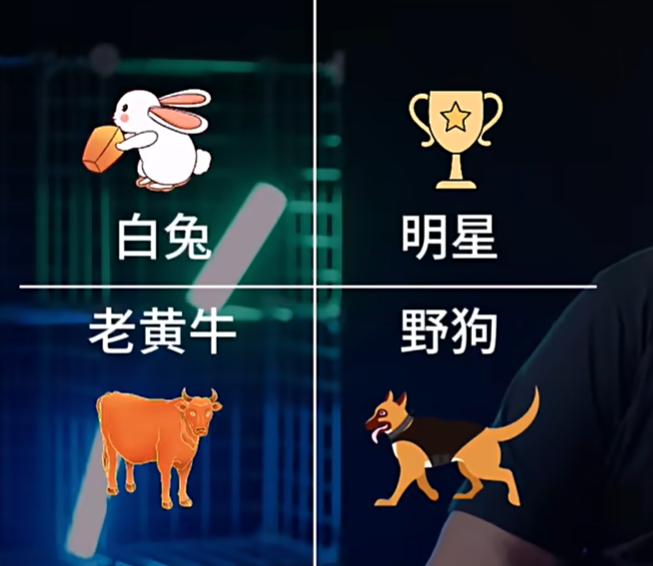

收集的一些职场/项目管理TIP，持续更新

# 职场生存法则：这类员工最容易被企业淘汰！

- 明星：什么都好，上进心，有能力，业绩都好
- 野狗：业绩好，但道德感差，不为团队服务，只为自己服务，会违反红线，对团队气氛造成很大的影响，跟他一起合作没法干，比较适合放在单独一个人打的那种事情上，可能中小公司可以，大公司一般看到这种人也是不要
- 黄牛：其实是一个恨其不争的说法，黄牛才是中坚力量，也是271的中间绝大部分人，主要问题是**意识水平没上去，汇报能力比较弱**，加上他老是被动地接受事情，让他主动思考，主动提出一个方法，他想不出来或者没怎么想过，他只是说你们想好了跟他安排，他来把事情搞定这样子，所以我们一定要守住黄牛并且在中间指导他们和激发他们，让他们有机会变成明星
- 白兔：不干活，没能力，只会耍嘴皮子，一问细节就没了（很多流转于各个项目各个部门的人很有可能就是这种人，因为每个项目每个部门都发现这个人不合适）繁殖力强，会把黄牛侵染成白兔，必须开除

这里的问题就是，黄牛和白兔的区分问题，黄牛汇报少，干活多，白兔汇报多，干活少，管理者很有可能会把黄牛当白兔，把白兔当黄牛，这只能怪黄牛自己，因为管理者有管理惰性，所以也要避免管理者“一言堂”，说谁是白兔谁就是白兔，应该有第三方视角来判断。

# 工作太难不知从何下手？原来还能这么解！

愚公的例子就是一个很好的拆分问题的例子，他只是一个农民，但是他却在解决移山的问题，这不完全是坚持的事情，而是逻辑的事情。

当我们要解决一个问题的同时，我们别的路径也要走，那我们解决这个问题可能不是一蹴而就的，而是分阶段的，要拆解目标，我要搞清楚我的资源（比如愚公移山时，用铁锹？用锤子？用手？自己打造，还是找别人借，还是买）这样就把问题的脉络拆解出来了。

不要把问题看成一个混沌，要把它拆出来（比如我最近的一个例子，我想自学分布式微服务，但是一直觉得找不到头绪和思路，那么我们把这个问题拆分一下，学习技术无非是理论加实践，理论可以从书籍资料里获取，实践需要项目做支撑，那么这个问题就变成了我需要找靠谱的学习资料和实战项目，然后学习资源怎么找，去社区里找大家认同度比较高的资料，实战项目怎么找，去github上找star比较高的项目，然后项目和学习资料相结合，就可以把技术学好，当然如果有学习资料和项目实战都有各自的顾问/老师/前辈答疑解惑就更好）。

任何一个大的问题都可以拆解成很多小的问题，小的问题组装起来就可以解决大的问题。

拆解以后就是评估，评估了以后再去找老板聊（能力问题，时间问题，资源问题等），不要怕。所以评估很重要，所以接了不代表开始做了，接了只代表我愿意试试。所以要有说服老板的能力，要有必要性和物理性，以及跟他有关联的方面说服他，而不是说“老板，我觉得我不会我能力不行”。

所以核心是**拆解、评估/了解，交流**。交流才是核心的武器。

# 管理反面教材：下属不配合，也许是因为这三点！

如果有人提出否定，往往出于以下三种：

经验习惯主义：出于以往的经验而进行反对，所以我们可以搭建一个相似性的环境，但是相对保证一定的安全性，我们再做

没有信任关系：他不清楚你的想法，我们可以先不让他做这么激进的事情，先让他做一些常规的他自己信得过的事情，还给他一些夸奖（现有的管理者总是严父严母型管理者，只指出错误而不赞美和表扬），所以当和一个下属沟通的时候，标准动作一定要做，就是信任建立和先让他在一些他自己可以接受的事情上先接受了再来提新的要求，有接受度再提要求（新观点新目标很容吓坏人，只是有的人装作没有被吓倒）

只给方向不给路径：管理者往往忽略了自己身上的特质，和下属讨论事情时必须降维到和下属一样的认知水平和一样的权限范围才能讨论这个事情，而不能站在自己的角度讨论，或者说明确表明自己的权限和资源可以赋予下属

> 所以跟老板确定自己的做法和方案很重要

第三点引申：为什么觉得管理就必须把专业落下？为什么觉得把专业落下是能做好管理的呢？对一线的情况脱钩了之后为什么会觉得自己能管好？因为你已经无法和下属共情了，成功的管理者不会脱离一线的，纯管理的职业经理人正在被干掉，因为这种人只能在传统稳定SOP标准流程下的管理团队里面负责做标准的监督，是做不了任何创新发展和面对复杂局势的演变的事情的。

# 总是忍不住陷入精神内耗，怎么办？

你这个阶段不懂是正常的，但是没有人告诉过你，所以导致自己对自己不自信了，总是怀疑自己。

内耗就是想不通嘛，就是停滞嘛。

但其实大多都是能力问题，能力没到就没到，修炼一下就好了，能力是要修炼的，能力是要慢慢培养的，所以我们审视问题之后无非就是修炼嘛，加深认知，多看书嘛。

犯个错有什么了不起，那么在乎这点东西干啥，因为没用啊，回不去了，下一次做得更好就行了。

所以其实说很多问题，你去找别人，别人只能帮你梳理思路并不能直接解决问题，可能真的需要你自己去提升认知去解决问题。

# ⚠️千万别活干了，钱还拿不着！

- 取消福利

- 抓绩效，抓考勤

- 没有战略/方向/计划

- headcount冻结：减少招聘

- 全员降薪

# 作为新员工，你敢给老板提专业建议吗？

不要在大会上和老板怼就可以了，在大会上和老板怼就等于说不是在讨论问题了，是在削弱你的上级在团队管理的威信，影响他的威信就是影响他的前途，明天你就完蛋。

专业上的问题私下跟他聊，但不要说什么我过去的公司怎么做的，这不叫专业这叫经验主义，经验主义在不同的公司是不一样的，是没有办法直接套用的，所以不要把经验当专业…最大的问题就是你可能根本不了解你在的公司，有一些高层的因素你根本看不到，所以你的考量可能并没有老板那么全面。

> 但是专业不就是从经验沉淀下来的吗…应该是说量级的问题

还有个问题，就是老板对你的需求度，如果你是他招进来的，他对你有需求那么他对你的容忍度就会高一些。

如果跟自己不那么熟悉的老板汇报，现在一些小的地方证明自己，或者让老板知道你对他是足够信任的。

要让别人接受你的想法这件事本身就是很艰难的。

- 信任建立

- 双方把信息管道打开

- 选择措辞和选择比较好的输入方式

- check，确认对方是否接收到（这一步往往大多数人都没做到，我也要注意）

不能光靠嘴皮子，要证明自己对公司的价值

# 想让老板加工资？这个绝招我屡试不爽！

职场是价值交换，你想涨薪那么就拿价值去跟他换，多想想老板可能需要什么？

比如你在核心岗位，你卡住了公司的咽喉，你看了一眼外面市场上同等职位同等年限的岗位薪酬比你高，那么就可以去跟老板聊。

先聊事，先聊给予——”老板你看，我感觉我现在在我的岗位上做的还行，您还有什么建议或者觉得我们这边做得怎么样“。

# 如何从面试看出这个老板值不值得跟？

- 能够沟通，不是一言堂，能够让你提问和反馈
- 能够分钱，如果是那种你稍微一谈钱，他就好像不太想聊的那种，说白了就是不太在意你们的利益上面的东西，他只在意事，就是属于”初阶管理者“或者是比较稚嫩的管理者出现的情况，可以假装问一下”那么薪酬这一块是怎么回事“，其实你知道应该问HR，但是要看看他的反应
- 如果是高阶，要check的就是管理者对行业的认知，而不是管理能力了，

# 不会聊天？总得罪人？沟通黄金法则在这里！

核心是因为你从来没有想过，也不知道对方要什么。

人性不喜欢被定义，给个开放式的让对方有机会跟你对话的那种对话，就是向对方传递信息并且给对方反馈的机会。

人性不喜欢被挑战，你在描述对方的东西的时候，你要先说点让别人开心一点的话，再来讲一些可能优点尖锐的话。尽量讲中立和客观的东西，尽量给正向价值的这种情绪输出，而不要太多负面，我们可以讲对方的问题，但不要揣测别人的动机。

比如说抓包打游戏，可以这么说”今天我看到大家都在工作你在打游戏，其他同学也看到了还跟我反馈，我们今天是什么节日吗？或者什么情况，或者说你是刚好把工作做完了想休息一下是吧“这样是一个正向的想法。

当他已经在反省已经承诺不会再犯的时候，你的目的就已经达到了，不需要再追加其他信息了，反而应该鼓励他”其实有时候累了放松一下是可以的，只是在公司里面当然你懂的，大家都看着呢，大家就没法工作了。所以你想休息的时候就找个休息室自己休息一会，至于你是想看看手机还是打打游戏，我是不在意的，但是尽量不要影响到其他人。“

所以核心就是沟通要围绕你沟通的目的进行，不要发散，第二就是传递信息要有效。

人性不接受自己是坏人，在他的世界里他觉得他做得不算特别对，但起码也还好的。

有时候，也有夏虫不可语冰的人，你正向沟通都没有用，他反倒来揣测你的动机，那就直接放弃，花更多精力跟一个无法对话的人对话，就是耗散精力，情商再高也不可能搞定所有人！

# 老板让我看着办，我能按照自己想法办吗？

两种情况，一种是你做的这种事不重要。

还有可能就是你们已经讨论得比较清晰，大的方向已经确定了，没有必要花时间去check了。但事情是自己负责的，自己得花精力去推，推了之后要有实际的东西给老板反馈，比如说可见的结果和文档等，然后告诉他你下一步的打算，然后问他ok不ok，他如果不反对就是默认了。但不要变成了你一定要等他确认你才能做，除非是你资源方这边必须是等老板审批了你才能批，那你就得催老板。

如果是第一种情况，那么建议别做了。那就跟老板说那先放一放吧，我们先做别的吧。

如果是第二种，那就等出结果了有思路了就跟老板说，不是说有方案A和方案B，老板你决策…而是我决定要这样做，老板我跟你打个招呼，你有意见的话随时跟我说，如果老板觉得他有必要介入就会跟你说“我看一下”，如果没必要他就不会说什么了。

如果什么都让老板确认的话，那就等于说你自己没有责任，事情都是老板的不是自己的，挣得就是个帮忙的钱，让别人开心的钱。

”老板我决定往这个方向走了，您看您要不要审一下，需要的话我就组个会，不需要的话就直接推进了，您觉得怎么样“

# 跨部门沟通，怎么让同事愿意听我的？

当你去提出一个需求或者希望别人做某事的时候，一个是你公司/组织/部门的价值，第二个就是他们的手上是不是有别的事情在干，或者他们的资源是不是已经被占满了，而你的这个事的优先级或价值比别人的高吗？或者你造成人家这个事停下来造成的损失你这个事的价值能够覆盖吗？

所以要先跟对方说明自己这个事的重要性和优先级，稍微对别人客气点，礼貌一点。即使别人空出档来，也有别的事排优先级，所以他不帮你是本分，帮你就是当关系好一点，关系不好就完了，他不会帮你的。

总的来说就是衡量你的这个事的背景，意义和目标，把它拆解以后换算成一种能够说服人的东西。

如果最后的最后还是定不下来，那就尽快上升让大老板来拍。

# 工作倦怠，厌烦职场？先别急着辞职！

- 知行合一：你以为的知，当你没有行动的时候，都是扯淡，知行是一体的，所以当你没有行的时候其实就是没有知，就是在胡思乱想，所以如果你真的认为自己在知这件事上想得很透的话，那么你一定是一个行动力很强的人，但是如果你不行动只有知其实就是胡思乱想，胡思乱想没有任何意义，因为意义是靠”做“出来的，所以不管你做啥，扫扫地都行，先做起来，不要躺在那啥也不干，因为做会引发变化，对世界造成影响，然后你就慢慢走出倦怠期了。就是说你越参与这个真实的世界越多，你越会减少浪费你的精力和时间在胡思乱想
- 啥也不想干那就啥也不干：作就行了，任由自己这个状态，继续作一个月两个月，因为他厌恶了那个无所事事的自我，他才会真正开始行动去做点什么，

# 老板让我反省，我觉得自己没错，咋办？

老板说出了问题先从你自己身上找原因，这句话本身没问题，但是这句话并不是说出了问题都是你的责任，就是先从自己跟这件事的关联的角度去思考这个事情——我在这件事上的责任是什么，我可能更多的能做的是什么。

就是你在一件事上的对还是不对，不是由自己主观认定的，而是像做X光一样，放出一个波（调查/问卷的感觉），然后收到真实的反馈，形成的客观结论。所以很多人都是主观觉得自己没问题，觉得别人冤枉你。

所以如果你的目标是在真实的世界中和别人协作取得成功的话，你一定要聆听别人真诚的反馈，然后在求同存异。

然后有的人就是不能接受异的这个部分，他的框架很硬，所以问题是你的目标到底是要把这件事做成，还是要让自己成为白莲花，你的目标是什么，如果你的目标是成为白莲花，你可以继续坚持，但你就不要和别人合作了，因为你跟别人只要一协作就肯定由求同存异的部分，但是如果你的目标是把事情做好，那么只要事情能做好，业绩会掩盖一切的错误，就算你出了很多错，大家也都无所谓了。

人类社会本身就是个协作机制的一个状态，它并不完美，它有很多瑕疵，但是它能够延续演化至今，就是因为我们能够通过一些方式消解掉大家互相之间的不完美，不理解。

我们在复盘的时候，我们只有先真诚地指出自己的问题，大家才能跟你讲他们有什么问题，如果你一上来就指责别人，那就…

有的时候被人冤枉了误会了，但如果是小事不太重要的问题的话，背个锅就背了，无所谓，因为我知道自己的目标是什么，这些人对我也只是个过程而已。

“好的老板，我一定先从自己身上找原因”然后再去找其他部门列出一些具体的改进意见，然后去跟老本汇报。汇报的时候先讲“老板这个事我们已经复盘完了。我我先讲我们部分在这个事情上，可能存在的一些问题。其他部门也是很真诚地分析了一下可以改进地部分，我们最后把要改进的事情汇总成这个东西，下一步我们会就这些事情中最重要和优先级的部分开始做改进，大概在什么时间点我们可能会完成一些改进，到时候希望您再给我们一些建议…”

# 新手带团队能不能成功，这3点很重要！

你管理的人，相当于原来就是你的平级同事，他们兴致不高，基本上是由于：

- 平时没觉得你比他们好，但你被提拔了，他们心理有一点膈应，但他们知道事情还是要做，但是情绪上还没适应过来，加上你也只是在分配工作，没有跟他们说啥，让他们觉得有一点难受
- 他们担心自己在公司的发展和前途啊，或者做的事情的价值这些东西有没有能落地的东西，==管理者最核心的价值不只是分配工作，那就只是个监工而已，真正的核心管理者是帮助大家一起搞清楚方向和解决问题，就是这些人遇到了什么问题，我作为管理者我要带领他们去解决，让大家不要有困惑，让你的下属觉得跟着你干有发展前景，比如你会指导他们培养他们，给他们铺路让他们能升职加薪，会给他们奖励，争取一些奖金啊优秀员工啊，而不是说一个位置上的管理者，所以你需要和他们做一些沟通，比如one on one的沟通，或者小范围的聊天，跟你自己关系近一些好一些的人聊一聊，听一听他们现在对你的想法，你作为管理者就需要去解决这些问题，该许诺许诺，该争取争取，该站出来说话就要说话，该帮他们摆平的就帮他们摆平，作为管理者不能帮你的下属摆平事，当什么管理者==
- 缺少感情建立的纽带（团建啊活动啊吃饭啊）整天就是干活，因为人类的情绪就是被这种消遣的东西调动的，该团建团建该自己掏点钱请大家吃饭或者去一起去搞个活动，或者让活跃的人组织你去支持他，

有一个好的有凝聚力的有战斗力的团队是所有人要去实现的一个结果。

# 你现在的老板，到底值不值得跟？

不信守承诺，一个生意人最核心的素质就是重承诺，好的高管和老板都是重视自己在行业里的名誉的，装也得装出一个重承诺的样子。

不会分钱，把你当个工具人，有很多老板以前也是个铁公鸡，但到了一定阶段后就想通了，如果不把钱分配好公司肯定是做不大，当然太大手大脚也别跟。

# 不狠做不了项目管理？牢记这8个字

项目一般来讲都是多人协作，多部门合作，一个人只能叫任务。

项目是支撑公司某个重要方向或重要战略基本的拆解框架，项目的前提就是一定要有交代/结果。

**胆大 心细 六亲 不认**

没有一帆风顺的项目，胆子不大怎么去要资源，去突破原有框架做一些开创性的事，为了达成目标，==流程重要吗？流程是人为设计的，设计的目标是为了保障项目能够正常运转，但如果我都无法保证项目正常运转，流程就不重要了==。

==但是领导同事肯定会跟你说还是按照流程来，因为他要是默许你可以调整流程，这个事就变成他的责任了，但是如果你只是按流程来，你就是个胆小鬼，你事情就有可能做不成，因为你不知道如何突破框架，也不知道框架从何而来==。

# 技术研发能力强，升职却不快，怎么办？

早期晋升就是技术能力强，但是升到一定程度以后，技术能力强它有很多层面啊，比如架构师要设计和维护一个复杂系统，架构是跟业务架构相关联，架构师是研发序列里面更往上走的一个可能性，相当于你要对全方位的东西都要有了解，比如前端后端coding实施测试啊都要了解才能做架构，再往上就是要具有行业性的视野了，再往上就是要具备一个开创性或者是领先性的，还要具备影响力（老板们是不懂技术的，你需要一个强大的影响力来说服老板们投资你，比如你是XX博士，发表过XX论文，和谁一起干过什么，还有人脉上的东西）。

当然还有一条线叫转业务，做到一定程度后开始带着销售带着商务去谈判，变成业务操盘了，你开始帮助公司将业务商业化。只要你不是说想扎根技术，那么转业务啊转产品转项目管理啊都是很顺其自然的事。

所以说早期选择少，中期以后选择多，到了后期无限选择，但其实就是说你的核心价值的产生方法是什么。

- 早期——解决问题
- 中期——帮助大家解决问题
- 后期——提供独特价值

# 一线员工想要晋升管理，需要拥有那些能力

先在任何一件跟管理沾边的事情上，拼了命地去尝试沾点边，比如说带新人，比如说有一些项目管理的事情，没有人牵头，你愿不愿意去帮忙管一下，有一些跨部门协作的事情需要有人牵头，你能不能去牵个头，前面是带人相关的，后者是协调相关的，一个管理者的核心职责就是干这两方面的事情——管人再就是协调事。

这些事做得多了做得长了，你就具备了一些基本的素质，然后提拔你就成了顺理成章的事，因为本来这些事就是你在干。

然后就是表达意愿，向老板表达自己的意愿。

# 老板都不知道的事！我怎么知道？！

别急着做老板要求的事，也不要问他想要什么样子，你要问的是这个事情的背景是什么，解决什么问题，要为谁解决问题。（背景和意义，我们主攻哪个方向，解决什么问题呢）

等你知道事情的起因，以及大概的方向了，你就可以不用再去问他了，你问他也没意义，他也说不出来，他是指方向的人，他是给你弄资源的人，而不是告诉你怎么做的人。

等你分析完，然后你把你的分析跟老板check一下，“我分析了一下，我的感觉是这个样子，然后A B C，您更偏向于A或B或C一点”，不要问他是不是，他肯定会说不是，因为你没有办法100%搞清楚他的脑海里想的到底是个什么样子的东西，不要让他做对错，让他做选择。

所有的工作都能做几种方案出来，一种是完美方案，能解决所有问题但是耗时很长，一种是临时方案，临时方案就是随便搞搞，但是扩展性应用性不够，只能临时解决，还有一种就是折中方案，它不是特别完美，但是好歹还有是有一点扩展性，能撑个一两年。

说白一点就是抓住的就是快速的出个东西让他拍，他说对也好，不对也好，赶紧改，这个是核心。

每推进一部分就去找他汇报一下，不要等着我们全做完了再找他聊，聊的时间不会太长，把做的东西给他看一看，有反馈就改没反馈就没反馈，就是一直保持这个事情在他的视野里面，保持这个事情在可控范围内。不会到最后的时候突然你们崩了，也不会前面你在那胡思乱想我怎么给老板交付一个特别完美的方案，我去想2个月再说，这不是做事的方式，哪怕你中间这个方案错了也没关系。

我们不能保证我们做的每次决策和每次选择都是对的，我们也不能保证老板对所有的东西无比清晰，不要有这个奢望和幻想。

把老板当人好吧，不要把他当机器当神，所以你一定要有这种控制事态，控制事情的方式和能力。

# 干得好不如会汇报？记住这5点就行了！

对于所有的管理者来讲，所谓的好是：

- 交代的所有的事，我要去识别这些事情的重要性和优先级，确定哪些事情是最重要的；

- 在执行过程中，要对所要做的事情建立起一个认知框架，比如说收集信息，难易度的节点在哪里，建立必要的资源需求和里程牌，并且对结果目标有量化——==接收任务和发布任务的6要素（收集信息）：为什么要做，做什么，做到什么程度（结果量化），什么时候交付（里程牌），准备怎么做，可能遇到的问题（难易度，资源需求）==

- 在执行过程中，你要让你的上级和你的合作伙伴认为我们都在正确的道路上，有风险提前预警，并且不会让事情因为偶发性原因掉地上；

- 除了主计划外，你应该有Plan B计划，比如说你们的时间会拖长你该怎么办；有个资源突然被调走你该怎么办，比如说老板突然方向变了怎么办

- 结果上做的还不错

但一般员工认为的好是什么，是“加班”，是“所有事情都努力做”，“老板说啥就做啥”，“尽量把事情做到位”，“万一掉地上也不关我的事”，”也不需要跟老板汇报“，”埋头干，干个大的，给老板个surprise“。

而有的同事，虽然做得事情少一点，但是人家有重点，有过程，有汇报，让老板有安全感，所以他受到老板的重视是理所当然的。

想清楚这三点：

- 你打算多长时间给老板汇报一次
- 你怎么去梳理你事情的优先级
- 你觉得什么样水平的问题，困难和风险必须要给老板知道，然后你去跟老板讲的时候你把你的后续方案和行动是什么

# 能力越强活越多，干崩溃了，怎么办？

跟上级阐明自己在其他工作上的重要性和优先级，来告诉老板我没有办法来接更多。

你自己有一个自己手上的工作优先级的表格，然后你的老板要跟你讨论工作，讨论工作饱和度的时候，你就拿这个表跟他讨论，这张表里面有你自己需要做的事情和事情的优先级。

然后你的上级来跟你对话的时候，他要增加一个工作对不对，然后你就要跟他聊，你说那我现在手上这三件事情也是最重要的，是之前也跟您对过的，如果我现在要增加一项，那我其他那三项里面，有没有哪一项能拿出来，因为我最多同时并行2-3项，这是一个人的极限，我也不是机器人，然后我们可以聊，每一个工作的工作量和大概什么时间需要，来保证这些事情之间能穿插，但是我自己要给自己留点余地，因为很难去评估一件事情到最后一定会是什么样子，开始的时候觉得简单，中间一下子变得很复杂了，一个本来比较简单的流程，因为谁休假了，导致延期了两天是很正常的，所以你自己要学会给自己留buffer，给自己留一个宽度出来，你才能够让工作变得游刃有余，而不是因为你的责任感，因为你感觉害怕自己拒绝别人会让别人难受，你就不拒绝别人，那你只会把自己压死。

所以在靠谱这件事情上，我们去看一个同学靠谱不靠谱，不是用你能接多少活，和你是不是能把每个事情做到事无巨细，而是看你是不是能够遵守你的承诺，定期地告诉我有什么风险和问题，就是下属如果让我觉得不安全感很强，我就觉得他不靠谱，我的下属让我觉得安全感很高，我就觉得他挺靠谱。

上级跟你说啥你先不要说不行，你说行但是行不代表你要做，你把那张表拿出来，说我现在手上还有其他几个事，这个事怎么怎么需要，那个事什么什么时候能搞定，还挺重要的，你看我要不要把这个事情和那个事情往后放一放来做您这件事，如果他说那两件事也挺重要的，那你就说那等我把这两件事做完再做您那件事好不好，他说那不行那不行这个事也挺重要的，你说好那我今天加个班把这个事做了，但是如果因为有一些我自己精力上顾不过来，您能不能再请一个同学来帮我一起做，我把这个事分给他，我来教教他…如果老板还是那不行不行，那你就可以离职了，这个人是神经病。

如果老板还是说哎呀你帮我怎么把这个事再搞一下，那你就说要不老板您自己把这个框架梳理一下然后我来填后面的内容，或者我来梳理有一些内容您来填，老板总得干点事情吧，老板就只会发号施令吗？我加班，然后我还要并行4个事情，我是你核心员工然后你这么用我是吧，那我明天就走人了你能接受吗。我抱着笔记本就出去了，说今天不聊了不聊了，然后老板私底下给我道歉…

其实就是说你要有自己的工作框架，其实就是梳理你的工作框架和边界，并且让他知道什么时候是可以打扰你的，什么时候是不能打扰你的，什么时候是必须按你的想法来的，什么时候是它可以有空间发展的，这个就是向上管理的精髓，不是像你这个样子，别人要你干嘛你就干嘛。

当烂好人是不会有人在乎你的，你只有跟别人公平和对等的对话，别人才会高看你一眼。

# 在职场中这样的人晋升比较快

# 连合理的拒绝都不会，还怎么在职场混？

你如果只知道找技术施压，你就别做产品经理。

首先第一呢，人跟人在进行真实的信息的传递的时候，有信任关系，你才能传递，哪怕你说了个假话，他也会信。但是你要是没有任何信任关系，你跟他说了个真话，他也觉得你是骗他的。

所以现在你刚才跟我说什么，你说老板跟我说要三天，我就跟那个技术说要三天，技术说三天肯定搞不定，要五天，而且你凭什么说三天，然后你就说啊老板说你要三天啊，老板来，你给我打一个字，我给你截图三天，发给他们技术说，看是不是老板说了三天。

实际上就是那个技术跟你之间，没有建立任何的信任，他既不相信你说老板说三天，他也不相信你对技术的工作有什么理解，他认为你完全不了解技术的工作流程，你现在需求还有三个东西没有，我怎么跟你估时间，你跟我说，老板说要三天，老板要三天的原因是什么呢，你也没说，你就要三天。

你在过去跟他沟通的过程中，你彰显过什么威慑力或者价值吗，就是只要没按你说的做可能会有什么后果，你彰显过吗，别人不鸟你也没问题，你发现没有，你说三天，他说五天，你说不行，他说不行，你自己随便，你就回去生闷气去了，然后过来问我怎么办

你敢不敢去跟他的上级投诉啊，嗯你说也可以啊，我问你，你去跟他的上级投诉，你说什么呢，你说你看这个小A呀，我跟他说我要做这个东西啊，三天，他非要跟我说三天搞不定，那我就不把你骂一顿，你知道是吧，为什么你没有道理啊，你如果自己真的知道这个流程，你就不会这么无脑吗，你太无脑了，以至于别人只能怼你了，然后你还来问我为什么，因为你你没有去了解过别人的流程，你不知道，你只知道在那里当个传话筒，你这个传话筒你有没有权利，你有没有威慑力，别人根本就不吊你，那威慑力和权力来自于哪里，很多人肯定要跟我说啊，来自于授权老板指挥了，说我就是项目负责人，我说三天就三天，狗屁

威慑利益和权益来自哪,来自于专业能力和沟通能力,很多人没有那个权限,无冕之王,他都能摆平很多人事,有的人顶这个抬头,啥也干不成,最后被老板干掉,原因就是因为真正的说服对方的能力，是来自于专业，来自于沟通能力，来自于信息的这个整理和输出，讲逻辑，讲道理，别人才会信任你。

比如现在老板跟你说三天，你先不要找技术，你先跟老板问一下，你说老板这个事儿，我大概看了一下，其实复杂度还是有点高的，我可以先去找研发去估一下时间，但是我看以前做类似的项目的经验来看，三天还是有点赶的，我们原来我记得有一次，我们加班干这种类似的项目，好歹也干了他4天多，如果只要三天就要干出来呢，我觉得只有一种可能，就是我跟研发那边去看看能不能加资源，可能能提升一天，所以您能不能给我讲一下这个事，就是为啥这么着急，或者说有没有机会，比如说再缓个两天，我再跟他们去拉扯一下

那如果这个老板知道之前你们做过这些东西，并且知道你说的都是真的，他就会说唉呀，这个项目是这样的，之前我们承诺那个公司嘛，然后他们跟我讲说，如果那天不做了，我们就不能收款了，说哎呀，那确实是这样吧，我把这个事情提到我们第一优先级，要把别人放在我们看看资源能不能保障，你把这个信息得到以后，老板也打好了铺垫，再去跟技术说

你跟技术说的时候，你就要分辨，第一呢如果是一个不近情理的事,你就不要跟一线研发沟通了,直接找组长讲完以后再跟那个同学,这样他才有能力协调资源,因为那个一线没有人力协调资源,他只能拒绝你。

然后如果这个事没有那么急，你就说最好您跟研发那边老大说一声，我肯定尽力，反正还是三天内搞定，然后你再跟那个研发那边去沟通，你说哎呀，有点不好意思啊，这里有个紧急的项目，今天早上的老板到我们拉去开了个会，这个项目呢涉及到对方公司，要跟我们回款的问题，然后我周三我们还搞不定那个回款期就过了，他们的结算期只能到下个周期了，你们的奖金都有可能发不出来的，所以您看我们这个有没有机会，大家一起努努力把这个东西做三钱搞定，我看看你手上还有没有其他的事情，我们就把它放一放，你放心啊，又升级的东西我来搞定，你看行不行，他那边就是说啊，那我看看吧，我起码有个大半天时间先评估一下嘛，你就说行，那你评估一下那个，因为老板已经跟你们技术老板也打招呼了，你要不然跟他也问一下，他就说啊，行行行，那这样大概你什么时候要，我说他这样的三天后要交嘛，明天你给我一个技术实施的方案的那个结论，然后你就开始干那边的东西，我跟他们打招呼，优先级我来安排。

然后周三的上午第一版出来以后，我们俩一起去验收，如果有些小bug什么的，看看哪些bug需要修，不影响我们整个流程的，我们就放到二期，这一期我们就按这个方式上，你看我不给他说没问题，技术这个交流过程是一个完整跟完善的过程，他一定不会再拒绝你，你要有这个协调能力。

# 体制内没有尴尬症者的空间

体制内一定要脸皮厚，厚到让自己都觉得我靠，我脸皮怎么这么厚

脸皮厚度和竞争力基本成正比。当然光靠脸皮厚肯定不够，我们还真的有两下子，我先捋一下，有可能会遇到的看起来尴尬的事情，然后再说怎么操作。

- 你可能一路试图高歌，33岁就正处了，当你开始憧憬自己，有可能成为本省有史以来最年轻的政局时，结果你在正处蹲了13年没动之前，比你提正处慢的人，反倒先你一步，副局周围人都在八卦，你是不是不是不行了，没人捧你了，到顶了，搞不好哪天实职正处都没有了
- 极有干劲的，顶着各种非议，打了无数个电话沟通，组织跑了无数次，领导办公室，终于组织了一个全区体育教师教学技能竞技赛，马上都要举行了，已经规划到本年度亮眼工作成绩了，结果省里突然下了个文件，主题是中小学一线授课教师减负，帮你组织的大招被叫停了，白忙活，周围人都在八卦，你天天琢磨整活,这回白折腾了吧
- 你很不擅长演说，辩论，但为了前途，你硬着头皮上了，结果到了现场被其他几位竞聘者完爆，背后人家都笑话
- 上级让你组织全市七个区三个代是调查社会面，中高龄人群的就业收入情况，给你两个礼拜，你忙得脚打后脑勺，结果因为一个县反复更改补充数据，导致你一直没有办法交差，领导嫌你进度办，开会的时候，当着好几个部门领导的面把你给批了一顿，走廊外面都能听见
- 你们新来的局长很年轻，是组织部的重点培养对象，天天的跟一个比你小十岁的领导请示汇报，你们哥几个原来都是前后脚进的单位，又差不多一起升了，都认识十几年了，结果一个哥们儿比你更快的升为副处
  成了你的领导，另外一个哥们儿也外调到其他部门成为副处，就你原地不动，开会的时候，你坐在下面，整个你的白头发都比之前多了

脸皮太薄，你是活不下去，脸皮薄，你就会过度的去折磨别人的话，你就没有办法集中精力工作，轻则效率慢，重则出错，更糟糕的是，你会错过难得的业绩，会陷入恶性循环，最终你变成了单位里的怪叔叔，怪阿姨，上班对你来说像上刑，痛苦的熬到退休之后，退休之后还会过得神经兮兮。

那怎么办，行动啊，何以解忧，唯有行动，厚脸皮加上疯狂的行动力，你就是无敌的。

刚才第一个尴尬，那个在正处蹲了13年的年轻干部，你不能放挺，你精神状态要像刚接到前女友的微信，问你要不要复合，你这时候有点倍儿自信，你的眼神可以不放光，但是要非常犀利的像个公安，你仍然要高水准的完成安排给你的每一个工作，仍然要积极以主动的创新工作创造业绩，要更积极的能和影响你师徒的领导保持沟通，你要像一个终结者一样，就算断了胳膊断了腿，仍然要坚持追击目标去完成任务，这样别人就会从暗中笑话你，到畏惧你，到尊敬你，你的这种终结者状态会震撼他们，他们不会再敢对你不敬，因为随便某个平平无奇的日子，你可能就突然试图复活了

第二个你也没有什么可尴尬的，你的思路是对的，你要继续联系各个学校，告诉他们这个活动是暂停，而不是取消，肯定有愿意参加这种比赛的单位和教师，人家还等着这种展示的机会呢，还要靠这个火出圈呢，再等个半年，你再摸个底儿，以各单位主动申请的模式再重新制定活动计划，报定到审批，说不少单位也希望通过这样的竞赛活动，实现促教促学，促管理，促宣传，那打入冷宫的事他就解冻了，尴尬就没有了，你需要的是厚脸皮加耐心，有耐心不一定成功，但没耐心一定会输的很惨

公开竞聘输了的那个，体制内不是靠竞聘运转，又不是所有岗位都需要竞聘上岗，又不是所有的岗位都一定需要这种竞聘型人才，又不是所有的领导都倾向于使用竞聘型人才，你肯定有你的长处，你要深耕人脉，深耕你的优势圈，比之前更的更深，机会不会比夏天的雷阵雨少

那个被一个县翻来覆去改数据拖累的干部，说实话，这个你应该先反省你自己，这个县交不上数据，你就不要打电话催了，立刻派人赶到这个县去坐镇，数据不出来，谁也不要回家，你要反省自己，还是给他们的压迫感不够，反省完了好好写个检讨，下个活就不要出这种乱子了，这事不就过去了吗，你要是一尴尬，然后一赌气闹情绪，那你可真是没出息，活该。

那个领导，比你年纪轻的，有什么好尴尬的，年轻的领导多了去了，你见一个尴尬一个，你还活不活了，给年轻领导面子，公开时候支持他，他对你一定客气，年轻领导的人情世故都很明白，他最忌讳的就是怕别人说他飘起来了，对老同志不尊重，你只要给他面子，行动配合他，他一定给你面子，放权给你，让你在你的下属面前有面子，你越是让年轻领导下不来台，你就越尴尬，大家就会觉得你已经破防了，你跟年轻领导相敬如宾，大家才会觉得你这个人涵养高，耐力高，搞不好还能进去

家里的事给你造成的尴尬，最好的办法跟刚才是一样的，厚着脸皮更强劲的工作，更积极地和领导去交流，领导看你家里这么不省心，同情异于上来会给你点容易出成绩的事，工作上的成绩就是最好的缓解这类尴尬的手段，类似于一个男生刚被女友甩了，大家正想去看热闹呢，结果他突然考了个年级第一，或者获得了一个名校研究生的offer，或者进了一个地位很硬的单位，这样尴尬就缓解了，大家会觉得他很有可能会遇到更好的

体制内，不要怕尴尬，厚起脸皮，积极积累工作业绩，绝对不要放弃谋求升职，哪怕5年，哪怕10年，哪怕15年，体制内没有尴尬症者的空间

# 怎么做好和下属的1V1

## 确认目标Goal

业务和环境是在不断变化的，目标是需要不断更新和共识的，为了让团队的每个成员都能跟上环境的变化

## 理清现状reality

### 1. 你对完成目标的信息指数是多少

### 2. 阻碍你完成目标的最大卡点是什么

### 3. 造成这个卡点的原因又是什么

这3个问题并不是说你要帮他解决问题，问题依旧是他的，但是你可以帮他梳理问题来了解你可以从哪些方面帮他。

> 开会的目的是什么？你为什么叫这些人来开会？
>
> 你希望他们扮演什么角色？
>
> 为什么这些人没有实现他们角色应该承担的责任？
>
> 

## 解决方案options

## 强化意愿will
