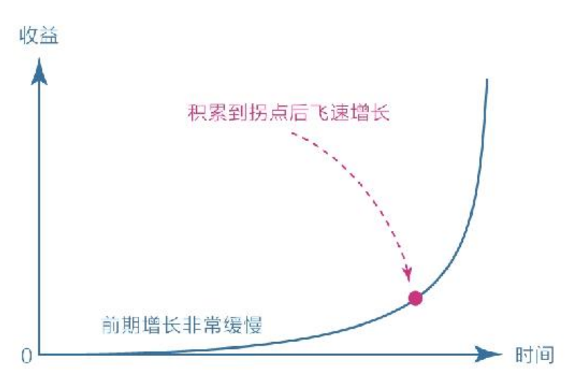

# 大脑——一切问题的起源

## 重新认识你自己

大多数时候我们以为自己在思考，其实都是在对自身的行为和欲望进行合理化

而==成长就是克服天性的过程==

如果我们习惯感情用事、不假思索，那感性思维就会占据主导；而若是习惯经常思考、时常反思，那理性思维便会占据上风。

习惯之所以难以改变，就是因为它是自我巩固的——越用越强，越强越用。要想从既有的习惯中跳出来，最好的方法不是依靠自制力，而是依靠知识，==因为单纯地依靠自制力是非常痛苦的事，但知识可以让我们轻松产生新的认知和选择。==

> 需要提醒的是，让理智脑变强大并不意味着要抹杀本能脑和情绪脑，事实上也抹杀不了，它们三位一体，缺一不可。换一个角度看，也没有必要抹杀，因为本能脑强大的运算能力和情绪脑强大的行动能力，都是不可多得的宝贵资源，只要去深入了解、循循善诱，就能为己所用，甚至这些力量还是成就我们的关键。
>
> 同样，让理智脑变强也不是为了对抗或取代本能脑和情绪脑，因为用力量对抗无异于用一方的短板去挑战另一方的强项，注定是没有出路的。很多人在成长的过程中感到极度痛苦，就是因为他们总是用意志力去对抗本能和情绪，最后把自己搞得精疲力竭，却收效甚微。

==理智脑不是直接干活的，干活是本能脑和情绪脑的事情，因为它们的“力气”大；上天赋予理智脑智慧，是让它驱动本能和情绪，而不是直接取代它们。==

就像我们大脑里的那位经理，他的职责既不是开除两位员工，也不是与他们对抗，更不是亲自上阵、包揽一切，而是学习知识，提升认知，运用策略，对两位老员工既尊重、包容又巧妙驱动，通过各种办法让他们开开心心地把活干了，最终使大脑这个“公司”团结和谐，欣欣向荣。

## 焦虑的根源

无论个体还是群体，人类的安全感都源于自己在某一方面拥有的独特优势：或能力，或财富，或权力，或影响力。

> 再抬头看，与一些同龄人的差距早已遥不可及，甚至一些比自己还年轻的人也已成就满满，而自己还得从零开始。这种情况让我变得烦躁和焦虑，情绪一度低落，那段时间我心里总是回响着一句话：来不及了，太晚了，一切都太晚了……

==做总比不做强！==

所以我不应该跟那些所谓的成功人士比现状，如果非要比，也应该跟他们刚起步时的状况比。事实上我更应该跟自己的过去比，哪怕好那么一点点，也是值得的！

焦虑的几种形式：

- 第一，完成焦虑。总是把自己的日程安排得太满，每天都活在截止期限（Deadline）面前，比如同时想学很多东西，但时间根本不够用；每天要例行完成的事情太多，耽误一天就觉得喘不过气来；随意承诺他人，日程安排总被不重要的事情打乱……总之，只要内在欲望涉及面太广或外在日程安排过紧，我就很难做到深入和从容。
- 第二，定位焦虑。如果在零基础阶段就直视该领域的能人们现在的所作所为，不焦虑都不可能：某某这么年轻就有如此大的影响力了！他们已经抓住风口、占据先机，我何年何月才能这样？原以为这个绝妙的点子只有自己能想到，没想到人家居然把产品都做出来了……错误的定位只会让人觉得一切都来不及了，事实上，这根本就是错误的对标。
- 第三，选择焦虑。有时选择太多也会让人陷入焦虑，比如突然有一段自由时间，却因为想做的事情太多，最后把时间都浪费在了摇摆不定上，静不下心做最重要的事，或者说根本不知道最重要的事情是什么。
- 第四，环境焦虑。有时我们不得不面对一些外在环境的限制，比如因家庭、工作的影响，有些事想做却做不了，还有些事不想做却必须花大量的时间去做。这种低效或无力有时也会让人抓狂。
- 第五，难度焦虑。有些书就是很难读，有些文章就是很难写，有些知识就是很难懂，有些技能就是很学……真正能让你变强的东西，其核心困难是无法回避的，不下决心与之死磕，始终在周围打转，时间越长越焦虑。

==归结起来，焦虑的原因就两条：想同时做很多事，又想立即看到效果。==

王小波说：人的一切痛苦，本质上都是对自己无能的愤怒。焦虑的本质也契合这一观点：自己的欲望大于能力，又极度缺乏耐心。焦虑就是因为欲望与能力之间差距过大。

我们已经知道人类的天生属性是避难趋易和急于求成，也就是说，在我们内心深处早就埋下了这样的种子：==急于求成，想同时做很多事；避难趋易，想不怎么努力就立即看到效果。==

这才是焦虑真正的根源！焦虑是天性，是人类的默认设置。千百年来，所有的人都一样，只是进入信息社会之后，由于节奏变快、竞争更强，这种天性被放大了。所以，我们没有必要自责或愧疚，也没有必要与天性较劲，而应想办法看清背后的机理并设法改变。当然，最简单的方法是反着来，比如：

- 克制欲望，不要让自己同时做很多事；

- 面对现实，看清自己真实的能力水平；

- 要事优先，想办法只做最重要的事情；

- 接受环境，在局限中做力所能及的事；

- 直面核心，狠狠逼自己一把去突破它。

耐心可以说是人类最珍贵的品质之一了，它直指我们急于求成、避难趋易的天性，可谓得耐心者得天下，所以我们不妨从耐心这个关键词开始谈起。

## 得耐心者得天下

# 第五章 学习力——学习不是一味地努力

## 第一节 匹配：舒适区边缘，适用于万物的方法论

因为我们想要做成

一件事的时候，通常都会告诉自己要很努力、很拼，会给自己设定一

个很高的标准，还会经常给自己“打鸡血”，告诉自己坚持就是胜

利。这是我们默认的思考模式，只是默认的不代表就是科学的。那么

科学的模式是什么呢？

回忆图1-4的内容，它告诉我们，最佳的学习区域在拉伸区内、舒

适区边缘，在这个区域，我们既有成就又有挑战，进步最快。事实

上，它就是难易匹配的意思：既不要太难，也不要太容易，难易适中

的地带才是学习的心流通道。

知道了这个原理以后，我们就应该花大量的时间去梳理哪些内容

处在自己的拉伸区，即梳理那些==“会做但特别容易错或不会做但稍微努力就能懂”==的内容，然后在这个区域内努力。如果你已经为人父

母，那就应该花大量的时间探寻孩子的拉伸区，然后指导他们在舒适

区的边缘努力，而不是看到孩子考不好就一味冲着他们发脾气，说别

人家的孩子如何如何，对标优等生，给孩子加学习量、加难度，这样

做往往会适得其反。

> 在一次聚会中，我正好与宋兄临座，
>
> 于是试探地问：“你在孩子的学习上有没有采取什么特别的方法？”
>
> 没想到他干脆地说：“有的！”我竖起耳朵继续听，他说：“就两
>
> 条，一是像对待考试一样对待家庭作业；二是有问题只找主观原
>
> 因。”
>
> 我听后有些发懵，心想：这就是所谓学霸的秘密吗？尤其是第一
>
> 条，我竟然抓不到要领。后来才明白，“像对待考试一样对待家庭作
>
> 业”就是让孩子保持合适的学习节奏。因为大多数孩子在家里写作业
>
> 的时候都会因缺少限制而漫不经心，一会儿上厕所，一会儿喝水，遇
>
> 到不会的就卡在原地发呆或马上求助，这种状态看起来像一直在学
>
> 习，实际上是在舒适区内磨洋工，不仅效率低，还特别容易出错。而
>
> 要求像考试一样，他们就必须逼迫自己集中注意力，在最短的时间内
>
> 做最多的题，并且还要做正确，于是他们不自觉地把自己推到了舒适
>
> 区的边缘。在这种状态下，孩子必然会极度专注，学习效率和成绩自
>
> 然会提升。

==做选择是一件极为耗能的事情==，如果没有与

之匹配的清醒和定力，绝大多数人最终都会被强大的天性支配，去选

择娱乐消遣。在有约束的环境下我们反而效率更高，生活更充实。

==逼迫自己获取高质量的知识以及深度缝接新知识，再用自己的语言或文字教授他人，是为深度学习之道。==

深度学习有以下3个步骤：

（1）获取高质量的知识；

（2）深度缝接新知识；

（3）输出成果去教授。

> 我从2017年2月开始坚持每天写复盘反思，有
>
> 时几句话，有时上千字。通过持续反思，很多没想明白的事情想清楚
>
> 了，很多模糊的概念变清晰了，很多看似并无关联的事情居然有了底
>
> 层的联通。持续反思让我对生活细节的感知能力变得越来越强，从生
>
> 活中获得的东西也越来越多。这部分内容的立意与构思也来自平日的
>
> 反思。==如果让我推荐一个不可或缺的习惯，我必推每日反思。==
