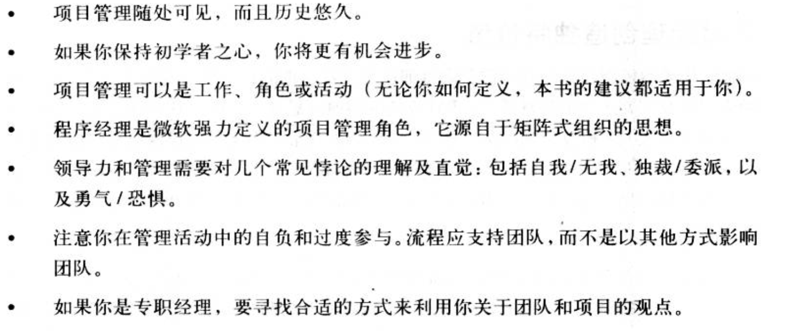
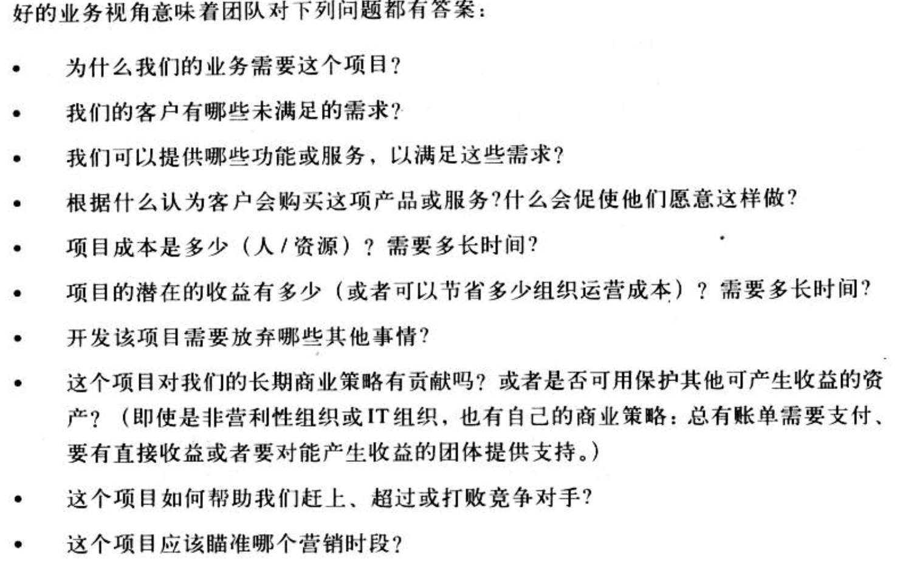
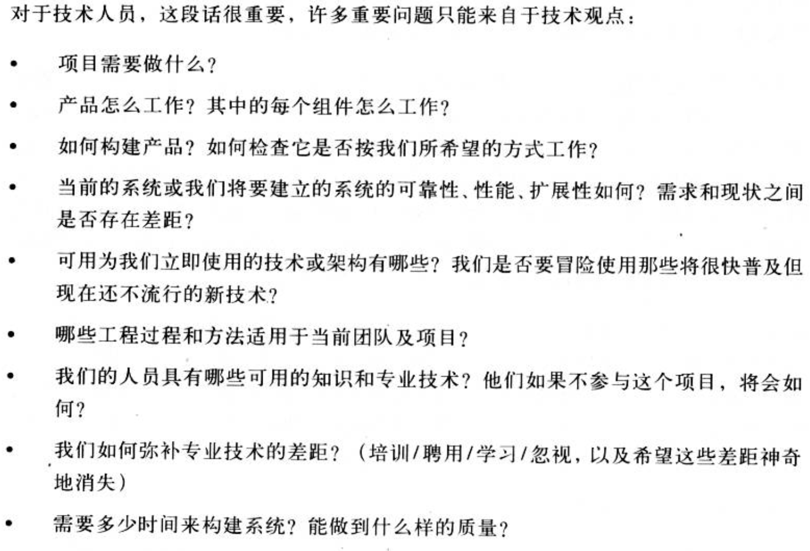
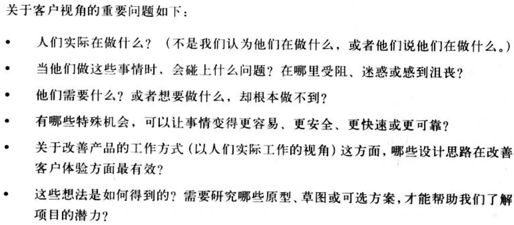
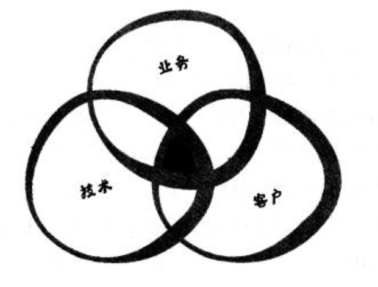

> 技术和技能可能会改变，但那些造成工程难题的关键挑战依然存在。——项目管理之美

时代和技术发展至今，我们使用的编程语言和技术框架日新月异，使用门槛越来越低（随着AI的普及，甚至可能会出现近似自然语言的编程语言），可是我们的项目依然在延期，我们的产品依然有改不完的bug，我们的产品依然无法很好地满足用户的需求，我们的工程师依然在无休止地加班…这些问题在每个时代都出奇地一致，这一定不是偶然，这说明我们面临的问题过去的人早就遇到过了，那么我们就需要从已有的经验里去学习去反思，这并不是说我们需要使用多么新颖的技术和能力，而是认知方面需要革新！

> 保持求知和开放的态度才能取得进步，同时还需要实践来维持这种心态。——项目管理之美
>
> 简单并不等于容易。——项目管理之美

要记住，简单并不等于容易。例如，跑马拉松是个简单的事。你开始跑，跑了26.2英里后就停下来。有什么比这更简单的？但跑完马拉松很困难这个事实并无损其简单性。领导力和管理也很困难，但其本质是很简单的，就是以特定方式朝特定目标把事情做好。

> 人类是万物之灵，有能力学习他人的经验。却也最容易对他人经验视若无睹——Douglas Adams

> 如果没有失败，我们就会变得骄傲，忘记了我们对事物的了解实际上并不像我们所想象的那样周全。——项目管理之美

只要我们有勇气仔细检查发生过的事情，从失败中学得的实践知识将是我们取得进步的最有力的源泉。

这就是为什么波音公司——全球最大的飞机设计与制造公司之一，会留着一本黑皮书，来记载从过去的设计和制造失败中获取的经验教训。自从波音公司成立之后，就一直保存着这份文件，用来帮助现代设计师，从过去的经验中吸取经验。

# 项目管理简史

## 项目管理到底是什么，谁来做

任何人在第一次看到发生在忙碌得专业厨房中所采取得快速得任务管理和协调后，都可能会重新思考自己的工作到底有多难。

烹饪时，通常要同时应付数个油炸中得平底锅，它们有着不同得先后次序和完成状态；同时，还得在厨房各角落得炉火间四处穿梭；此外，侍者进进出出，传达客户更改的菜单和各类问题。

这一切都发生在窄小拥挤的厨房内，乍看起来似乎一团混乱，但是“伟大的”厨房却以一种紧张而精确的方式运作着，大多数开发团队都做不到。

注意查看怎么下菜单，怎么跟踪菜单、怎么烹饪菜肴以及怎么上菜。如果你选择忙碌的一天去，那么对于如何发现、如何跟踪以及如何修复软件Bug这些问题，你就会有不同的想法。

> 项目管理可视为一种专业、一种工作、一种角色或一项活动。

只要每个成员都愿意承担工作职责之外的、协调整个项目的额外责任，分担应该由专职项目经理为团队承担的任务，团队就不需要增加人员，而且保持效率和简单都很好。

但是，有时没有项目经理会造成困难。如果没有专职控制整体项目和，个人的偏见和利益考虑会影响团队的方向。技术人员和业务人员之间会形成很大的矛盾，使得进度落后，并影响每个参与人员的心情。

如果没有明确的人负责专门分类Bug，或者没有专人检查项目进度和标识的重要问题，这些任务可能会被危险地延迟。落后于以编程为中心的活动。

他必须乐于把时间花在各种人物上，例如编写规格说明书，检查市场计划，指定项目进度表，领导团队，作策略计划，进行Bug分类，培养团队士气以及做好任何需要做但没有人正在做的事情。微软把这个新角色称为程序经理（program manager）。

## 项目管理的平衡之道

> 很难找到好的项目经理，因为他们需要保持态度的平衡。

这些矛盾的态度，因为不同的环境需要不同的做法。这意味着，项目经理不仅要有这些特点，还要具有在特定时期应该采取何种行动的直觉。这就是项目管理被视为艺术的原因：他需要直觉、判断以及经验，并有效运用这些力量。

- 自我/无我：投入极大的个人感情但要避免把个人利益放在项目利益之前，他们必须愿意把重要或者有趣的任务分配出去，和整个团队共享成功。
- 独裁/委派：有自信，有足够的魄力控制并强迫团队执行特定行动，但管理良好的项目应该建立一种环境，使得工作可被委派出去，同时又能互相有效合作
- 口头/书面：总要有开会、协商、闲暇讨论以及头脑风暴他欧尼，在面对面了解和沟通想法方面必须有效率。但组织或项目规模越大，抒写技巧就越重要。他必须认识到书写或口头沟通在特定时刻哪个更有效。
- 承认复杂/拥护简单：要认识到由哪个项目观点对解决当前问题或作决策最有用，同时，还要能在两者间自由转换，或者同时记在心中。项目经理必须有足够说服力，让目标简单化，但不要忘记编写优良可靠的程序代码的复杂性。
- 不耐烦/有耐心：知道何时该推动问题，何时该退让一步让事情发生，是项目经理必须培养的能力
- 勇气/恐惧：项目经理必须对所有可能做错的事情保持适度重视，把这些事视为完全可能发生，同时也必须要要有接受挑战的勇气来面对这些风险
- 相信/怀疑：热情地提问，挑战他人地假设，但绝不动摇团队对所做事情地信念

## 关于压力

我见过很多经理人回避施展领导力地时机(例如团队或项目需要有人采取果断行动地时候)，退缩到只是追踪其他人地绩效，而不是为他们的工作带来便利或是参与其中。如果某人所做的事就是记录分数和站在边界线上看，他也许比较适合财务部门。如果某人担任领导角色，对压力的反应是避开争论，那么他不是在领导，而是在逃避。

## 关于流程与目标相混淆

他们把焦点放在次要且容易做的事情上（电子表格或报告），而不是重要且有挑战性的事情上（编程成果或进度），他们也许会自欺地说，如果照着特定流程执行，做好检查列表上的事，就剋保证项目成功（或者比较讽刺地说，对于任何可能发生地失败，严格意义上都不是他们的错）。

作者制作了一个细致的电子表格，以各种形式显示数据。上司发现他虎仔检查列表和流程的时间超过他与团队相处的时间。“你的项目是你的团队，管理好团队，而不是检查列表，如果检查列表有助于管理团队，那非常好，但如果你这样下去，不久之后，你就需要你的团队来帮助你管理检查列表”。

所以，项目经理不应把焦点放在流程和方法上，应该把焦点放在他们的团队上。计划和跟踪应该支持团队达成项目目标，而不是阻碍它。

对方法和流程保守的原因是，不必要的事情会像滚雪球般地越来越多，把团队拖进举步艰难地焦油坑——正如人月神话一书中所说地那样。如果管理流程也需要流程，那就很难知道实际的工作在哪里。通常，正是团队领导或项目经理推动了团队的官僚主义，或者更为讽刺地，把团队送进永无止境地过程和会议讨论的也是这些人。

## 适度参与

> 就像棒球教练那样，经理的出现应该贡献一些有别于增加另外一名球员所获得的东西

由于这些贡献难以估量，很多PM都为所处角色的模糊而挣扎。作为经理，他们很容易成为责难的对象，而且没什么地方可躲。作为团队领导者，必须将信念、自信和自觉结合起来，以同时获得效率和快乐。

## 利用好你的观点

PM的职责使他会花比其他人更多的时间，来和团队中不同的人相处，因此可以有更多的信息来源，并对项目有更广阔的视野。PM会同时熟悉项目的业务视角以及技术视角，在需要时可以协助这两个团队进行沟通。这种广阔的视角，使得在适当实际将重要信息传送给适当的人称为可能。

作为习惯，可以在走廊上走来走去，随便聊聊，尽量让他们为某事发笑，并让他们为我展示他们正在做的工作成果。

优秀项目经理的职责就是要知道关于团队状态、关于环境状态的所有有用的事情，并将其应用于其他场合，协助他人完成工作。没有任何项目或Bug跟踪系统能够完全替代人员彼此交谈关于项目的进展，因为社会网络总是强于科技网络（有时候会更快）。

知识和信息如果能够轻易在团队中流通，将对这些挑战产生积极的影响。关于能否顺畅地流通，项目经理扮演了关键地角色。

有一个简单明了的事实：项目经理或领导者与他人相处的时间多于任何人，他们需要开更多的会议，进入更多的办公室，和成员进行更多的会谈。如果项目经理高兴，难过，积极或失望，那么这些情绪多少会影响他每天遇到的每个人。PM带给项目的东西，无论好坏，都会传播给团队的其他人。

## 总结

# 进度表的原理

> 人们总是倾向于迟到。

进度表有三项功能

# 如何指导该做什么

> 制作软件系统最困难的一个部分是决定要构建什么样的系统，在概念性工作中，建立详细的技术需求是最困难的。其中包括对人、对机器以及对其他软件系统的接口。没有其他工作像这项工作这样，一旦做错，将对结果造成极大的伤害。也没有其他工作像这项工作这样难以修正。因此，软件制造者需要执行的对客户最重要的事情就是反复精炼产品需求。——Fred Brooks

> 文档的意义是在于减少人与人之间的沟通成本，所以越是多人参与的项目，越是需要对文档精益求精，越是人少的项目，这个需求越不明显（但是即使是单人的项目，也可以从规范的文档中获益）。——我

跟中华说的人员是否固定没有关系。

> 如果我有6个小时砍树，我将花4个小时来把斧头磨离。——精明的准备可以把工作量降至最小。

规划回答两个问题

- 我们需要做什么？——需求搜集
- 我们要怎么做？——设计或详细说明

> 业务规划负责人员的重要性就在于他可以帮助他人从业务角度了解项目存在的原因。

应该从尽量发挥每种视角价值的角度来考虑，制定明智的策略。

实现这个目标的一种方式是今早建立这样的想法：总是存在伟大的却对业务或客户无益的技术想法，同时，也总是存在伟大的可以帮助客户的想法，但却对业务不可行或当前的技术不可能实现。

我确信，宽广的视角有助于每个人。如果我们共享彼此的知识，而不是互相抵制，那么是可能发现互利的妥协点的。

有时候，你需要做点牺牲。但是如果你能做这些牺牲，就可以赢得信任和真诚，这些有助于使其他人也如此做事。然后你就可以要求其他人放下他们喜爱的想法，寻求对项目最有利的想法。

