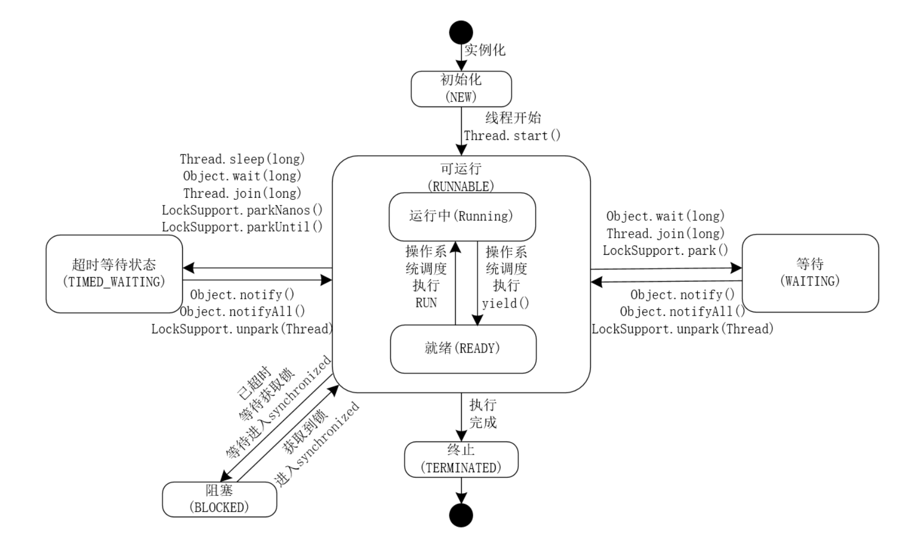
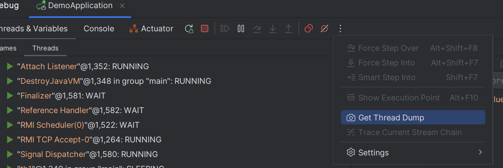
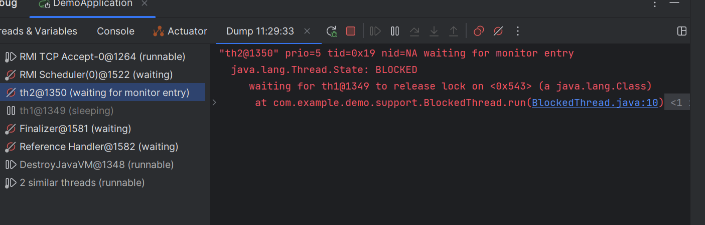
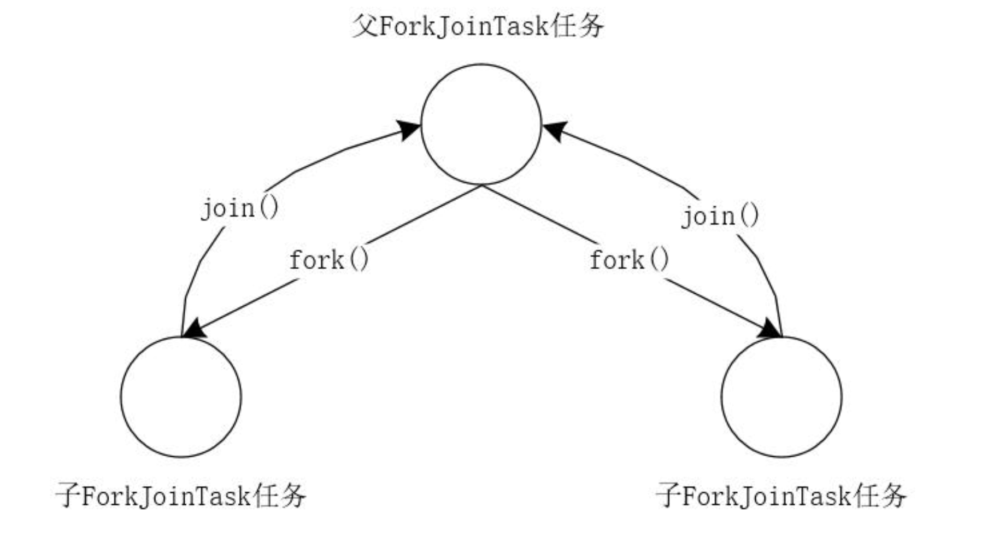
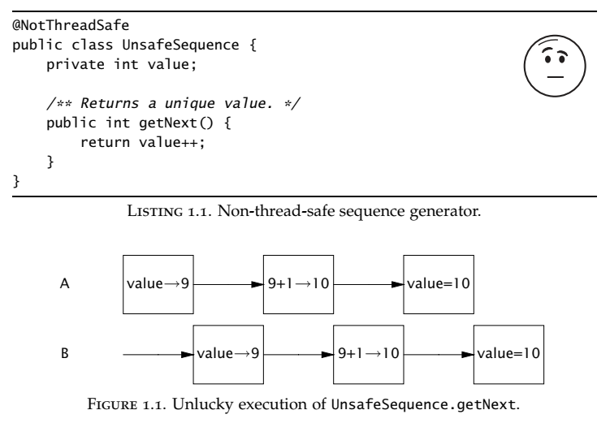
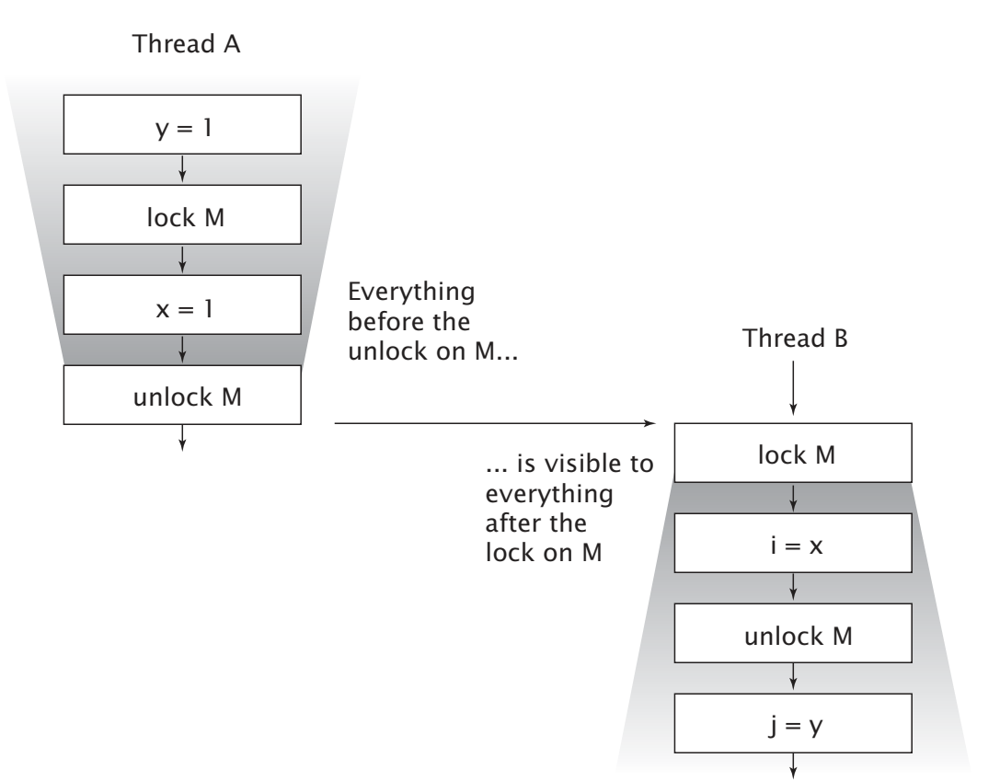
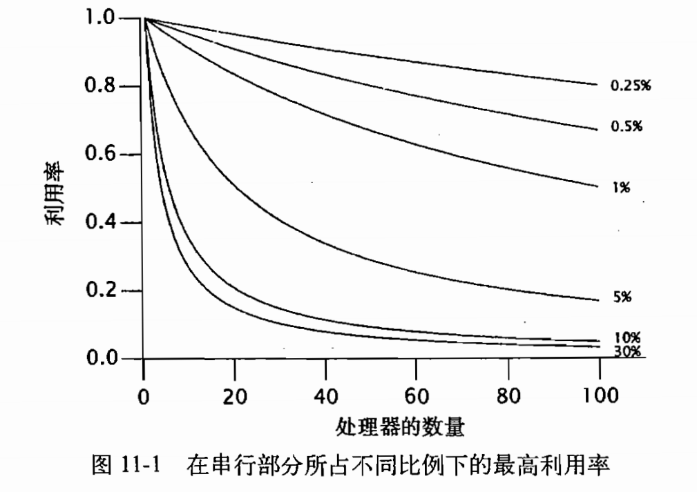
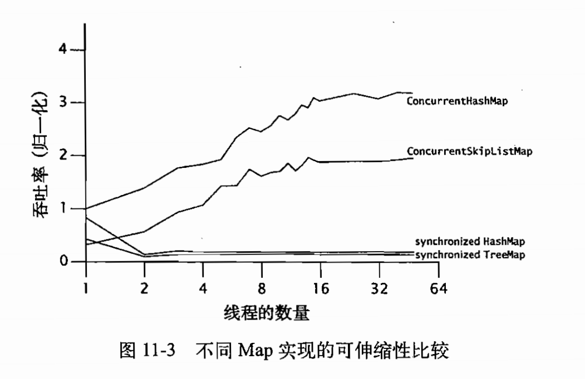
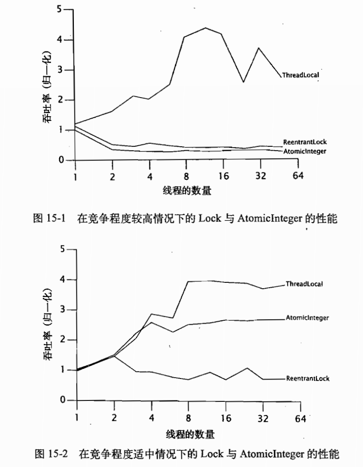

# 线程

## 线程的生命周期



- NEW：初始状态，线程被构建，但是还没有调用start()方法。

- RUNNABLE：可运行状态，可运行状态可以包括：运行中状态和就绪状态。  

- BLOCKED：阻塞状态，处于这个状态的线程需要等待其他线程释放锁或者等待进入synchronized。

- WAITING：表示等待状态，处于该状态的线程需要等待其他线程对其进行通知或中断等操作，进而进入下一个状态。

- TIME_WAITING：超时等待状态。可以在一定的时间自行返回。

- TERMINATED：终止状态，当前线程执行完毕。  

  





> TimeUnit.SECONDS.sleep(seconds); // 也可以这么进行睡眠

> new Thread(new WaitingTime(), "WaitingTimeThread").start();  //也可这么赋值线程名


### 利用命令行查询线程状态

```bash
c:\>jps
21584 Jps
17828 KotlinCompileDaemon
12284 Launcher
24572
28492 ThreadState
```

```bash
c:\>jstack 28492
2020-02-15 00:27:08
Full thread dump Java HotSpot(TM) 64-Bit Server VM (25.202-b08 mixed mode):
"DestroyJavaVM" #16 prio=5 os_prio=0 tid=0x000000001ca05000 nid=0x1a4 waiting on condition
[0x0000000000000000]
java.lang.Thread.State: RUNNABLE
"BlockedThread-02" #15 prio=5 os_prio=0 tid=0x000000001ca04800 nid=0x6eb0 waiting for monitor entry
[0x000000001da4f000]
java.lang.Thread.State: BLOCKED (on object monitor)
at io.binghe.concurrent.executor.state.BlockedThread.run(BlockedThread.java:28)
- waiting to lock <0x0000000780a7e4e8> (a java.lang.Class for
io.binghe.concurrent.executor.state.BlockedThread)
at java.lang.Thread.run(Thread.java:748)
"BlockedThread-01" #14 prio=5 os_prio=0 tid=0x000000001ca01800 nid=0x6e28 waiting on condition
[0x000000001d94f000]
java.lang.Thread.State: TIMED_WAITING (sleeping)
at java.lang.Thread.sleep(Native Method)
at java.lang.Thread.sleep(Thread.java:340)
at java.util.concurrent.TimeUnit.sleep(TimeUnit.java:386)
at io.binghe.concurrent.executor.state.WaitingTime.waitSecond(WaitingTime.java:36)
at io.binghe.concurrent.executor.state.BlockedThread.run(BlockedThread.java:28)
- locked <0x0000000780a7e4e8> (a java.lang.Class for
io.binghe.concurrent.executor.state.BlockedThread)
at java.lang.Thread.run(Thread.java:748)
"WaitingStateThread" #13 prio=5 os_prio=0 tid=0x000000001ca06000 nid=0x6fe4 in Object.wait()
[0x000000001d84f000]
java.lang.Thread.State: WAITING (on object monitor)
at java.lang.Object.wait(Native Method)
- waiting on <0x0000000780a7b488> (a java.lang.Class for
io.binghe.concurrent.executor.state.WaitingState)
at java.lang.Object.wait(Object.java:502)
at io.binghe.concurrent.executor.state.WaitingState.run(WaitingState.java:29)
- locked <0x0000000780a7b488> (a java.lang.Class for
io.binghe.concurrent.executor.state.WaitingState)
at java.lang.Thread.run(Thread.java:748)
"WaitingTimeThread" #12 prio=5 os_prio=0 tid=0x000000001c9f8800 nid=0x3858 waiting on condition
[0x000000001d74f000]
java.lang.Thread.State: TIMED_WAITING (sleeping)
at java.lang.Thread.sleep(Native Method)
at java.lang.Thread.sleep(Thread.java:340)
at java.util.concurrent.TimeUnit.sleep(TimeUnit.java:386)
at io.binghe.concurrent.executor.state.WaitingTime.waitSecond(WaitingTime.java:36)
at io.binghe.concurrent.executor.state.WaitingTime.run(WaitingTime.java:29)
at java.lang.Thread.run(Thread.java:748)
"Service Thread" #11 daemon prio=9 os_prio=0 tid=0x000000001c935000 nid=0x6864 runnable
[0x0000000000000000]
java.lang.Thread.State: RUNNABLE
"C1 CompilerThread3" #10 daemon prio=9 os_prio=2 tid=0x000000001c88c800 nid=0x6a28 waiting on condition
[0x0000000000000000]
java.lang.Thread.State: RUNNABLE
"C2 CompilerThread2" #9 daemon prio=9 os_prio=2 tid=0x000000001c880000 nid=0x6498 waiting on condition
[0x0000000000000000]
java.lang.Thread.State: RUNNABLE
"C2 CompilerThread1" #8 daemon prio=9 os_prio=2 tid=0x000000001c87c000 nid=0x693c waiting on condition
[0x0000000000000000]
java.lang.Thread.State: RUNNABLE
"C2 CompilerThread0" #7 daemon prio=9 os_prio=2 tid=0x000000001c87b800 nid=0x5d00 waiting on condition
[0x0000000000000000]
java.lang.Thread.State: RUNNABLE
"Monitor Ctrl-Break" #6 daemon prio=5 os_prio=0 tid=0x000000001c862000 nid=0x6034 runnable
......
```

注意：使用jps结合jstack命令可以分析线上生产环境的Java进程的异常信息。  

### 线程的执行顺序是不确定的

调用Thread的start()方法启动线程时，线程的执行顺序是不确定的。也就是说，在同一个方法中，连续创建多个线程后，调用线程的start()方法的顺序并不能决定线程的执行顺序。

可以使用Thread类中的join()方法来确保线程的执行顺序。    

```
thread1.start();
//实际上让主线程等待子线程执行完成
thread1.join();  
```

> 需要注意的是，调用子线程的join()方法，会阻塞main()方法的执行，当子线程执行完成后，main()方法会继续向下执行，启动第二个子线程，并执行子线程的业务逻辑，以此类推。  


## 两种异步模型与深度解析Future接口

### 无返回结果的异步模型

略  

### 有返回结果的异步模型

使用Future接口往往配合线程池来获取异步执行结果  

```java
ExecutorService executorService = Executors.newSingleThreadExecutor();
Future<String> future = executorService.submit(new Callable<String>() {
    @Override
    public String call() throws Exception {
    	return "测试Future获取异步结果";
    }
});
System.out.println(future.get());
```

使用FutureTask类获取异步结果  

```java
FutureTask<String> futureTask = new FutureTask<>(new Callable<String>() {
    @Override
    public String call() throws Exception {
    	return "测试FutureTask获取异步结果";
    }
});
new Thread(futureTask).start();
```

```java
ExecutorService executorService = Executors.newSingleThreadExecutor();
FutureTask<String> futureTask = new FutureTask<>(new Callable<String>() {
    @Override
    public String call() throws Exception {
    	return "测试FutureTask获取异步结果";
    }
});
executorService.execute(futureTask);
System.out.println(futureTask.get());
```

可以看到使用Future接口或者FutureTask类来获取异步结果比使用回调接口获取异步结果简单多了。注意：实现异步的方式很多，这里只是用多线程举例。  

### 深度解析Future接口

#### Future接口 

```
cancel(boolean)
取消任务的执行，接收一个boolean类型的参数，成功取消任务，则返回true，否则返回false。当任务已经完成，已经结束或者因
其他原因不能取消时，方法会返回false，表示任务取消失败。当任务未启动调用了此方法，并且结果返回true（取消成功），则当
前任务不再运行。如果任务已经启动，会根据当前传递的boolean类型的参数来决定是否中断当前运行的线程来取消当前运行的任
务  

isCancelled()
判断任务在完成之前是否被取消，如果在任务完成之前被取消，则返回true；否则，返回false。
这里需要注意一个细节：只有任务未启动，或者在完成之前被取消，才会返回true，表示任务已经被成功取消。其他情况都会返回
false。

isDone()
判断任务是否已经完成，如果任务正常结束、抛出异常退出、被取消，都会返回true，表示任务已经完成。

get()
当任务完成时，直接返回任务的结果数据；当任务未完成时，等待任务完成并返回任务的结果数据。

get(long, TimeUnit)
当任务完成时，直接返回任务的结果数据；当任务未完成时，等待任务完成，并设置了超时等待时间。在超时时间内任务完成，则
返回结果；否则，抛出TimeoutException异常。
```

#### FutureTask类  

```
private volatile int state;
private static final int NEW = 0;
private static final int COMPLETING = 1;
private static final int NORMAL = 2;
private static final int EXCEPTIONAL = 3;
private static final int CANCELLED = 4;
private static final int INTERRUPTING = 5;
private static final int INTERRUPTED = 6;
```

```
NEW -> COMPLETING -> NORMAL
NEW -> COMPLETING -> EXCEPTIONAL
NEW -> CANCELLED
NEW -> INTERRUPTING -> INTERRUPTED
```

```
public boolean isCancelled() {
	return state >= CANCELLED;
} 
public boolean isDone() {
	return state != NEW;
}
```

这两方法中，都是通过判断任务的状态来判定任务是否已取消和已完成的。为啥会这样判断呢？再次查看FutureTask类中定义的状态常量发现，其常量的定义是有规律的，并不是随意定义的。其中，大于或者等于CANCELLED的常量为CANCELLED、INTERRUPTING和INTERRUPTED，这三个状态均可以表示线程已经被取消。当状态不等于NEW时，可以表示任务已经完成。

通过这里，大家可以学到一点：以后在编码过程中，要按照规律来定义自己使用的状态，尤其是涉及到业务中有频繁的状态变更的操作，有规律的状态可使业务处理变得事半功倍，这也是通过看别人的源码设计能够学到的，这里，建议大家还是多看别人写的优秀的开源框架的源码。  

```
protected void done() { }
```

可以看到，done()方法是一个空的方法体，交由子类来实现具体的业务逻辑。当我们的具体业务中，需要在取消任务时，执行一些额外的业务逻辑，可以在子类中覆写done()方法的实现。

手动设置返回值和异常。  

```
protected void set(V v) {
    if (UNSAFE.compareAndSwapInt(this, stateOffset, NEW, COMPLETING)) {
        outcome = v;
        UNSAFE.putOrderedInt(this, stateOffset, NORMAL); // final state
        finishCompletion();
    }
} 
protected void setException(Throwable t) {
    if (UNSAFE.compareAndSwapInt(this, stateOffset, NEW, COMPLETING)) {
        outcome = t;
        UNSAFE.putOrderedInt(this, stateOffset, EXCEPTIONAL); // final state
        finishCompletion();
    }
}
```

set()方法与setException()方法整体逻辑几乎一样，只是在设置任务状态时一个将状态设置为NORMAL，一个将状态设置为EXCEPTIONAL。  


# 高并发系统实战

##  高并发关键指标

QPS（一秒内处理多个请求，主要用来表示读请求，我们的系统可能大多是**写请求**）根据二八原则。80%的流量是在20%的时间段产生的。

例如每天有500w个请求，预估QPS=（500w*0.8）/（12(只算白天)\*60\*60\*0.2）=462，即当前系统每天QPS为462，当然为了保险起见预留20%也是可以的。**一般还需要计算当天最高QPS，这样对系统的掌握了最强。**

简单的算的话，系统最高QPS可以通过系统平均QPS的倍数计算出来，例如**分析得出**（怎么分析啊啊啊，只能说根据实践经验）最高QPS大概是平均QPS的2倍，则当前系统峰值QPS为924左右。

在预估出QPS后，机器数=峰值QPS/单台机器最高可承受的QPS，其中单台最高可承受的QPS可以通过压测来得出。

一个TPS可能包含多个QPS，例如访问一个页面会请求服务器3次，所以产生1个TPS，3个QPS。

## 分布式的弊端

不仅仅是技术上的复杂度增加，而且也有可能会出现重复造轮子的情况。

## 微服务

架构分层很重要，业务服务（面对应用功能），基础服务（面对可重用功能），系统服务（基础设施或中间件提供）

### 微服务的问题

1. 增加了复杂度
2. 服务间的通信会变得复杂

```
RESTful和RPC（远程过程调用）是两种不同的通信协议和设计风格，具有以下区别：

1. 协议和传输方式：
   - RESTful（Representational State Transfer）：基于HTTP协议，使用标准的HTTP方法（如GET、POST、PUT、DELETE）进行通信，并使用URL作为资源的唯一标识。
   - RPC（Remote Procedure Call）：可以使用多种传输协议，如HTTP、TCP、UDP等，其关注的是通过远程过程调用来实现不同服务之间的通信。

2. 接口风格：
   - RESTful：采用资源导向的设计理念，将服务视为一组资源，通过URL对资源进行操作。使用HTTP方法来表示对资源的不同操作，如GET用于获取资源，POST用于创建资源，PUT用于更新资源，DELETE用于删除资源。通过不同的HTTP状态码来表示操作的结果。
   - RPC：更加面向过程的风格，将远程服务看作是一个可调用的过程或函数，提供具体的方法调用和参数传递。

3. 数据交互方式：
   - RESTful：使用各种不同的数据格式进行交互，如JSON、XML等。可以通过HTTP的请求头中的Content-Type字段指定数据格式。
   - RPC：通常使用二进制数据格式进行传输，从而减少数据的大小和网络传输的开销。

4. 设计哲学和通信效率：
   - RESTful：强调可伸缩性、可扩展性和松耦合。通过明确的URL和HTTP方法，使得服务端和客户端之间的接口更清晰可见。由于基于HTTP协议，通信效率比较低，但具有更好的可读性和可理解性。
   - RPC：追求高效通信和低延迟。可以使用二进制传输协议，减少数据的大小和传输的开销，从而提高通信效率。

总体而言，RESTful更加注重资源和状态的抽象，适用于构建面向资源的互联网应用，而RPC更加注重方法调用和传输效率，适用于构建分布式系统和服务之间的调用。具体选择RESTful还是RPC要根据具体的项目需求、场景和技术栈来进行评估和选择。
```

3. 微服务边界的划分增加了实现的复杂度

微服务边界划分是微服务设计的难点，划分的好坏直接决定了整个微服务架构的好坏，会影响整个产品的推进进度：

- 如果服务颗粒度分得过粗，则随着业务复杂度的上升，系统又会是一个个庞大的单体应用
- 如果过细，会出现数量很多的服务，增加运维和监控的成本，增加调用链的复杂度，影响系统性能
- 重新划分分组的工作量巨大且风险很高

4. 保持数据一致性非常复杂
5. 对运维提出了更高的要求
6. 建议采用敏捷开发模式而不是瀑布

```
微服务架构和敏捷开发模型有很好的契合度，可以提供更高的灵活性和快速的迭代开发。以下是为什么建议微服务架构采用敏捷开发模型而不是瀑布模型的几个原因：

1. 快速迭代和部署：微服务架构的特点是将一个大型的应用系统拆分成多个小的、自治的服务。每个服务都可以独立开发、部署和扩展。而敏捷开发模型强调快速迭代和灵活的开发过程，能够更好地支持微服务的快速开发和部署需求。

2. 灵活性和可变性：在微服务架构中，各个服务是相互独立的，并且可以使用不同的技术栈和编程语言来实现。这种灵活性要求开发团队能够快速适应需求的变化，并迅速调整服务。而敏捷开发模型强调适应变化和快速响应需求的能力，有助于团队在微服务架构中灵活地开发和调整服务。

3. 高效的团队协作：微服务架构需要跨多个服务的团队协作开发，各个服务团队之间需要进行紧密的协调和交流。敏捷开发模型通过迭代开发、持续集成和快速交付，促进了团队成员之间的合作，提高了团队的协作效率。

4. 分布式系统复杂性：微服务架构是一个分布式系统，涉及到多个服务之间的通信和协调。分布式系统的设计和开发相对复杂，需要更加灵活和敏捷的开发模型才能应对系统的复杂性。

总结来说，微服务架构具有灵活性、快速迭代和团队协作的特点，而敏捷开发模型强调快速迭代、灵活性和协作能力，因此更适合微服务架构的开发。而传统的瀑布模型更适用于单体应用开发，无法满足微服务架构下快速迭代和团队协作的需求。
```

```
瀑布模型是一种传统的软件开发方法，其主要特点是按照线性顺序完成各个开发阶段，例如需求分析、设计、编码、测试、部署等。以下是瀑布模型的一些好处和适用场景：

1. 清晰的阶段划分：瀑布模型将软件开发过程分为不同的阶段，每个阶段都有明确的输入和输出，使开发过程可控。这种划分可以更好地组织和调度开发项目，并提供清晰的开发计划。

2. 文档重视和归档：瀑布模型强调详细的文档编写，包括需求文档、设计文档、测试文档等。这有助于记录项目的整个开发历程和结果，并在后续的维护和升级中提供参考。

3. 适用于稳定需求：适用于那些需求变动较小且相对稳定的项目。瀑布模型基于事先完整的需求分析，开发过程中尽量避免大的变更，适合具有明确且稳定需求的项目。

4. 简化团队协作：瀑布模型中的开发过程是线性的，各个阶段有明确的责任分工，团队成员可以更清晰地理解自己的职责，并且可以在每个阶段有明确的验收标准。

适合采用瀑布模型的项目通常包括确定性较强、需求稳定、规模较小且较简单的项目，例如传统的软件产品开发、网站开发等。此外，对于要求强调文档记录和能够明确计划的项目，瀑布模型也相对适用。

需要注意的是，随着软件开发的快速变化和需求的不断演化，瀑布模型在变化频繁的项目中可能不适用。敏捷开发模型和微服务架构更适合此类项目，可以更好地应对需求变更和快速迭代的需求。因此，在选择开发模型时，需要综合考虑项目的特点、需求变更频率和团队的工作方式。
```

## ForkJoin框架

**执行器框架（Executor Framework）将任务的创建和执行进行了分离，通过这个框架，只需要实现Runnable**接口的对象和使用**Executor**对象，然后将**Runnable**对象发送给执行器。执行器再负责运行这些任务所需要的线程，包括线程的创建，线程的管理以及线程的结束。

**Java 7**则又更进了一步，它包括了ExecutorService接口的另一种实现，用来解决特殊类型的问题，它就是**Fork/Join框架**，有时也称**分解/合并框架**。

将**ForkJoinPool**类看作一个特殊的 **Executor** 执行器类型。这个框架基于以下两种操作。

- **分解（Fork）**操作：当需要将一个任务拆分成更小的多个任务时，在框架中执行这些任务；
- **合并（Join）**操作：当一个主任务等待其创建的多个子任务的完成执行。

**Fork/Join框架和执行器框架（Executor Framework）主要的区别在于工作窃取算法（Work-Stealing Algorithm）**。与执行器框架不同，使用Join操作让一个主任务等待它所创建的子任务的完成，执行这个任务的线程称之为**工作者线程（Worker Thread）**。工作者线程寻找其他仍未被执行的任务，然后开始执行。通过这种方式，这些线程在运行时拥有所有的优点，进而提升应用程序的性能。

为了达到这个目标，通过**Fork/Join框架**执行的任务有以下限制。

- 任务只能使用**fork()和join()** 操作当作同步机制。如果使用其他的同步机制，工作者线程就不能执行其他任务，当然这些任务是在同步操作里时。比如，如果在**Fork/Join 框架**中将一个任务休眠，正在执行这个任务的工作者线程在休眠期内不能执行另一个任务。
- 任务不能执行I/O操作，比如文件数据的读取与写入。
- 任务不能抛出非运行时异常（Checked Exception），必须在代码中处理掉这些异常。

**Fork/Join框架**的核心是由下列两个类组成的。

- **ForkJoinPool：**这个类实现了ExecutorService接口和工作窃取算法（Work-Stealing Algorithm）。它管理工作者线程，并提供任务的状态信息，以及任务的执行信息。
- **ForkJoinTask：这个类是一个将在ForkJoinPool**中执行的任务的基类。

**Fork/Join框架**提供了在一个任务里执行**fork()和join()操作的机制和控制任务状态的方法。通常，为了实现Fork/Join**任务，需要实现一个以下两个类之一的子类。

- **RecursiveAction：**用于任务没有返回结果的场景。
- **RecursiveTask：**用于任务有返回结果的场景。

```java
if(任务很小）{
	直接计算得到结果
}else{
	分拆成N个子任务
	调用子任务的fork()进行计算
	调用子任务的join()合并计算结果
}  
```

在Java中，ForkJoin框架与ThreadPool共存，并不是要替换ThreadPool其实，在Java 8中引入的并行流计算，内部就是采用的ForkJoinPool来实现的。例如，下面使用并行流实现打印数组元组的程序。

```java
public class SumArray {
	public static void main(String[] args){
		List<Integer> numberList = Arrays.asList(1,2,3,4,5,6,7,8,9);
		numberList.parallelStream().forEach(System.out::println);
	}
}
```

ForkJoin框架是从jdk1.7中引入的新特性,它同ThreadPoolExecutor一样，也实现了Executor和ExecutorService接口。它使用了一个无限队列来保存需要执行的任务，而线程的数量则是通过构造函数传入，如果没有向构造函数中传入指定的线程数量，那么当前计算机可用的CPU数量会被设置为线程数量作为默认值。  

当使用ThreadPoolExecutor时，使用分治法会存在问题，因为ThreadPoolExecutor中的线程无法向任务队列中再添加一个任务并在等待该任务完成之后再继续执行。而使用ForkJoinPool就能够解决这个问题，它就能够让其中的线程创建新的任务，并挂起当前的任务，此时线程就能够从队列中选择子任务执行。  

那么使用ThreadPoolExecutor或者ForkJoinPool，性能上会有什么差异呢？首先，使用ForkJoinPool能够使用数量有限的线程来完成非常多的具有父子关系的任务，比如使用4个线程来完成超过200万个任务。但是，使用ThreadPoolExecutor时，是不可能完成的，因为ThreadPoolExecutor中的Thread无法选择优先执行子任务，需要完成200万个具有父子关系的任务时，也需要200万个线程，很显然这是不可行的，也是很不合理的！！  

### 工作窃取算法

假如我们需要做一个比较大的任务，我们可以把这个任务分割为若干互不依赖的子任务，为了减少线程间的竞争，于是把这些子任务分别放到不同的队列里，并为每个队列创建一个单独的线程来执行队列里的任务，线程和队列一一对应，比如A线程负责处理A队列里的任务。但是有的线程会先把自己队列里的任务干完，而其他线程对应的队列里还有任务等待处理。干完活的线程与其等着，不如去帮其他线程干活，于是它就去其他线程的队列里窃取一个任务来执行。而在这时它们会访问同一个队列，所以为了减少窃取任务线程和被窃取任务线程之间的竞争，通常会使用双端队列，被窃取任务线程永远从双端队列的头部拿任务执行，而窃取任务的线程永远从双端队列的尾部拿任务执行。

- 工作窃取算法的优点：充分利用线程进行并行计算，并减少了线程间的竞争。  
- 工作窃取算法的缺点：在某些情况下还是存在竞争，比如双端队列里只有一个任务时。并且该算法会消耗更多的系统资源，比如创建多个线程和多个双端
  队列。  

- Fork/Join框架局限性：对于Fork/Join框架而言，当一个任务正在等待它使用Join操作创建的子任务结束时，执行这个任务的工作线程查找其他未被执行的任务，并开始执行这些未被执行的任务，通过这种方式，线程充分利用它们的运行时间来提高应用程序的性能。为了实现这个目标，Fork/Join框架执行的任务有一些局限性。  

ForkJoinPool 框架中涉及的主要类如下所示。

1. ForkJoinPool类
   实现了ForkJoin框架中的线程池，由类图可以看出，ForkJoinPool类实现了线程池的Executor接口。

   其中，可以使用Executors.newWorkStealPool()方法创建ForkJoinPool。  

   ForkJoinPool中提供了如下提交任务的方法。  

   ```java
   public void execute(ForkJoinTask<?> task)
   public void execute(Runnable task)
   public <T> T invoke(ForkJoinTask<T> task)
   public <T> List<Future<T>> invokeAll(Collection<? extends Callable<T>> tasks)
   public <T> ForkJoinTask<T> submit(ForkJoinTask<T> task)
   public <T> ForkJoinTask<T> submit(Callable<T> task)
   public <T> ForkJoinTask<T> submit(Runnable task, T result)
   public ForkJoinTask<?> submit(Runnable task)
   ```

2. ForkJoinWorkerThread类
      实现ForkJoin框架中的线程。
      
3. ForkJoinTask类
   
     ForkJoinTask封装了数据及其相应的计算，并且支持细粒度的数据并行。ForkJoinTask比线程要轻量，ForkJoinPool中少量工作线程能够运行大量的ForkJoinTask。
     ForkJoinTask类中主要包括两个方法fork()和join()，分别实现任务的分拆与合并。fork()方法类似于Thread.start()，但是它并不立即执行任务，而是将任务放入工作队列中。跟Thread.join()方法不同，ForkJoinTask的join()方法并不简单的阻塞线程，而是利用工作线程运行其他任务，当一个工作线程中调用join()，它将处理其他任务，直到注意到目标子任务已经完成。 
     
      

ForkJoinTask有3个子类：  

- RecursiveAction：无返回值的任务。无返回结果的ForkJoinTask实现Runnable。  

- RecursiveTask：有返回值的任务。有返回结果的ForkJoinTask实现Callable。  

- CountedCompleter：完成任务后将触发其他任务。 在任务完成执行后会触发执行一个自定义的钩子函数。   

### ForkJoin示例程序

```java
package io.binghe.concurrency.example.aqs;
import lombok.extern.slf4j.Slf4j;
import java.util.concurrent.ForkJoinPool;
import java.util.concurrent.Future;
import java.util.concurrent.RecursiveTask;
@Slf4j
public class ForkJoinTaskExample extends RecursiveTask<Integer> {
	public static final int threshold = 2;
	private int start;
	private int end;
	public ForkJoinTaskExample(int start, int end) {
		this.start = start;
    	this.end = end;
	} 
    
    @Override
	protected Integer compute() {
		int sum = 0;
		//如果任务足够小就计算任务
		boolean canCompute = (end - start) <= threshold;
		if (canCompute) {
			for (int i = start; i <= end; i++) {
				sum += i;
			}
		} else {
			// 如果任务大于阈值，就分裂成两个子任务计算
			int middle = (start + end) / 2;
			ForkJoinTaskExample leftTask = new ForkJoinTaskExample(start, middle);
			ForkJoinTaskExample rightTask = new ForkJoinTaskExample(middle + 1, end);
			// 执行子任务
			leftTask.fork();
			rightTask.fork();
			// 等待任务执行结束合并其结果
			int leftResult = leftTask.join();
			int rightResult = rightTask.join();
			// 合并子任务
			sum = leftResult + rightResult;
		} 
        return sum;
	} 
    
    public static void main(String[] args) {
		ForkJoinPool forkjoinPool = new ForkJoinPool();
		//生成一个计算任务，计算1+2+3+4
		ForkJoinTaskExample task = new ForkJoinTaskExample(1, 100);
		//执行一个任务
		Future<Integer> result = forkjoinPool.submit(task);
		try {
			log.info("result:{}", result.get());
		} catch (Exception e) {
			log.error("exception", e);
		}
	}
}
```


# java-concurrency-in-practice

## Preface  

Indeed, developing, testing and debugging multithreaded programs can be extremely difficult because concurrency bugs do not manifest themselves predictably. And when they do surface, it is often at the worst possible time—in production, under heavy load.  

> 测试和debug往往很难发现并发问题，他们总在最坏的时候出现——生产上，高负载下

One of the challenges of developing concurrent programs in Java is the mismatch between the concurrency features offered by the platform and how developers need to think about concurrency in their programs. The language provides low-level mechanisms such as synchronization and condition waits, but these mechanisms must be used consistently to implement application-level protocols or policies. Without such policies, it is all too easy to create programs that compile and appear to work but are nevertheless broken. Many otherwise excellent books on concurrency fall short of their goal by focusing excessively on low-level mechanisms and APIs rather than design-level policies and patterns.  

> 并发机制的底层机制与实际业务的复杂度是并发编程的难点

## How to use this book  

it offers practical design rules to assist developers in the difficult process of creating safe and performant concurrent classes.   

> 本书不会介绍API，而是介绍设计理念

基础部分（很重要）Chapters 2 (Thread Safety) and 3 (Sharing Objects) form the foundation for the book.   

构建并发应用Chapter 7 (Cancellation and Shutdown) deals with techniques for convincing tasks and threads to terminate before they would normally do so; how programs deal with cancellation and shutdown is often one of the factors that separates truly robust concurrent applications from those that merely work.  

> 如何实现取消和关闭等操作，往往是区别好的并发和坏的并发的关键

**完整代码示例：http://www.javaconcurrencyinpractice.com**  

## 线程的风险

The problem with UnsafeSequence is that with some unlucky timing, two threads could call getNext and receive the same value. Figure 1.1 shows how this can happen. The increment notation, someVariable++, may appear to be a single operation, but is in fact three separate operations: **read the value, add one to it, and write out the new value**. Since operations in multiple threads may be arbitrarily interleaved by the runtime, it is possible for two threads to read the value at the same time, both see the same value, and then both add one to it. The result is that the same sequence number is returned from multiple calls in different threads  



Like most concurrency bugs, bugs that cause liveness failures can be elusive because they depend on the relative timing of events in different threads, and therefore do not always manifest themselves in development or testing  

> 死锁问题同样难以在开发和测试中发现。

In well designed concurrent applications the use of threads is a net performance gain, but threads nevertheless carry some degree of runtime overhead. Context switches—when the scheduler suspends the active thread temporarily so another thread can run—are more frequent in applications with many threads, and have significant costs: saving and restoring execution context, loss of locality, and CPU time spent scheduling threads instead of running them.   When threads share data, they must use synchronization mechanisms that can inhibit compiler optimizations, flush or invalidate memory caches, and create synchronization traffic on the shared memory bus. All these factors introduce additional performance costs;   

> 多线程本身就会带来一些额外开销：保存和恢复线程上下文，局部性的损失、CPU额外的线程调度耗时而不是执行耗时，以及同步机制（会导致禁止编译器优化，使线程缓存失效，增加内存总线的同步流量）

> 在多线程编程中，"loss of locality"（局部性的损失）指的是由于多个线程同时访问不同的数据或资源，导致数据访问的局部性减弱的情况。
>
> 当多个线程同时访问不同的数据或资源时，这些数据或资源可能被散布在内存的不同位置上。而处理器(CPU)访问内存的速度远远低于访问内部缓存的速度。因此，当线程在不同的内存位置上并发地访问数据时，频繁地从内存中加载数据到处理器缓存或进行写回动作，会导致较低的缓存命中率和较高的缓存争用，从而降低程序的性能。

When concurrency is introduced into an application by a framework, it is usually impossible to restrict the concurrency-awareness to the framework code, because frameworks by their nature make callbacks to application components that in turn access application state. Similarly, the need for thread safety does not end with the components called by the framework—it extends to all code paths that access the program state accessed by those components. Thus, the need for thread safety is contagious.  

Frameworks introduce concurrency into applications by calling application components from framework threads. Components invariably access
application state, thus requiring that all code paths accessing that state be thread-safe.  

> 框架引发的并发问题具有传染性

## 线程安全

Writing thread-safe code is, at its core, about managing access to state, and in particular to shared, mutable state  

The primary mechanism for synchronization in Java is the synchronized keyword, which provides exclusive locking, but the term “synchronization” also includes the use of volatile variables, explicit locks, and atomic variables.  

> 主流的四种锁或原子操作，synchronized 、volatile 、lock、atomic ，且synchronization包括了volatile变量，显示锁和原子变量的用途

If multiple threads access the same mutable state variable without appropriate synchronization, your program is broken. There are three ways to
fix it:

• Don’t share the state variable across threads;

• Make the state variable immutable; or

• Use synchronization whenever accessing the state variable.  

> 不跨线程共享变量、将变量设为不可变，或对于任何用到状态值的地方使用同步机制

Sometimes abstraction and encapsulation are at odds with performance—although not nearly as often as many developers believe—but it is always a good practice first to make your code right, and then make it fast. Even then, pursue optimization only if your performance measurements and requirements tell you that you must, and if those same measurements tell you that your optimizations actually made a difference under realistic conditions.

> 非必要不优化，先写对的，再写快的，有时候对于一些不常执行的代码一些小的性能提升会带来一些bug，先保证对再说

### 什么是线程安全性

a class is thread-safe when it continues to behave correctly when accessed from multiple threads.  

> 不太正式的定义

A class is thread-safe if it behaves correctly when accessed from multiple threads, regardless of the scheduling or interleaving of the execution of
those threads by the runtime environment, and with no additional synchronization or other coordination on the part of the calling code.  

> 这个定义不错，线程安全的类是不需要额外的同步或者协作机制的…所以我们编写的大部分类都是线程不安全的

If an object is correctly implemented, no sequence of operations—calls to public methods and reads or writes of public fields—should be able to violate any of its invariants or postconditions. No set of operations performed sequentially or concurrently on instances of a thread-safe class can cause an instance to be in an invalid state.  

> 只要正确实现了一个类，任何函数调用或者读写public值都不会违背不可变性或后置条件，串行或者并发操作不会让类处于不可用状态。

Thread-safe classes encapsulate any needed synchronization so that clients need not provide their own.  

Stateless objects are always thread-safe.  

The fact that most servlets can be implemented with no state greatly reduces the burden of making servlets thread-safe. It is only when servlets want to remember things from one request to another that the thread safety requirement becomes an issue.  

> 事实上，大多数servlet都可以在没有状态的情况下实现，这大大减轻了使servlet线程安全的负担。只有当servlet希望记住从一个请求到另一个请求的内容时，线程安全要求才会成为问题。

### 原子性

#### 竞态状态

基于一种可能失效的观察结果来做出判断或者执行某个计算

#### 复合操作

Where practical, use existing thread-safe objects, like AtomicLong, to manage your class’s state. It is simpler to reason about the possible
states and state transitions for existing thread-safe objects than it is for arbitrary state variables, and this makes it easier to maintain and verify
thread safety.  

> 在实际情况下，尽可能使用现有的线程安全对象，如AtomicLong，来管理类的状态。与任意状态变量相比，推断现有线程安全对象的可能状态和状态转换更简单，这使得维护和验证线程安全性更容易

### 加锁机制

> 要保持状态地一致性，就需要在单个原子操作中更新所有相关的状态变量。

#### 内置锁

A synchronized method is a shorthand for a synchronized block that spans an entire method body, and whose lock is the object on which the method is being invoked. (Static synchronized methods use the Class object for the lock.)  

> synchronized（）锁的是调用对象，静态synchronized方法锁的是class

The machinery of synchronization makes it easy to restore thread safety to the factoring servlet. Listing 2.6 makes the service method synchronized, so only one thread may enter service at a time. SynchronizedFactorizer is now thread-safe; however, this approach is fairly extreme, since it inhibits multiple clients from using the factoring servlet simultaneously at all—resulting in unacceptably poor responsiveness. This problem—which is a performance problem, not a thread safety problem  

```java
@ThreadSafe
public class SynchronizedFactorizer implements Servlet {
	@GuardedBy("this") private BigInteger lastNumber;
	@GuardedBy("this") private BigInteger[] lastFactors;
	public synchronized void service(ServletRequest req, ServletResponse resp) {
		BigInteger i = extractFromRequest(req);
		if (i.equals(lastNumber))
			encodeIntoResponse(resp, lastFactors);
		else {
			BigInteger[] factors = factor(i);
			lastNumber = i;
			lastFactors = factors;
			encodeIntoResponse(resp, factors);
		}
	}
}
```

#### Reentrancy(重入锁)

When a thread requests a lock that is already held by another thread, the requesting thread blocks. But because intrinsic locks are reentrant, if a thread tries to acquire a lock that it already holds, the request succeeds. Reentrancy means that locks are acquired on a per-thread rather than per-invocation basis.7 Reentrancy is implemented by associating with each lock an acquisition count and an owning thread. When the count is zero, the lock is considered unheld. When a thread acquires a previously unheld lock, the JVM records the owner and sets the acquisition count to one. If that same thread acquires the lock again, the count  

> 如果锁已经由一个线程持有，那么该线程一直请求这个锁都会成功

```java
public class Widget {
	public synchronized void doSomething() {
		...
	}
}
public class LoggingWidget extends Widget {
	public synchronized void doSomething() {
		System.out.println(toString() + ": calling doSomething");
		super.doSomething();
	}
}
```

### Guarding state with locks（用锁来保护状态）

**如果用同步来协调对某个变量的访问，那么在访问这个变量的所有位置上都需要使用同步，而且，当使用锁来协调对某个变量的访问时，在访问变量的所有位置上都要使用同一个锁。**

一种常见的错误是认为，只有在写入共享变量时才需要使用同步，然而事实并非如此。

对于可能被多个线程同时访问的可变状态变量，在访问它时都需要持有同一个锁，在这种情况下，我们称状态变量是由这个锁保护的。

> 一处是synchronized，处处都要是synchronized

每个共享的和可变的变量都应该只由一个锁来保护，从而使维护人员知道是哪一个锁。

一种常见的加锁约定是，将所有的可变状态都封装在对象内部，并通过对象的内置锁对所有访问可变状态的代码路径进行同步，使得在该对象上不会发生并发访问。

> 我理解就是把涉及到并发的共享变量封装在某个类里，然后所有访问共享变量的方法都需要获取这个类的锁，从而避免直接引用导致线程安全问题。

当类的不变性条件涉及多个状态变量时，那么还有另外一个需求：**在不变性条件中的每个变量都必须由同一个锁来保护**，因此可以在单个原子操作中访问或更新这些变量，从而确保不变性条件不被破坏。

### 活跃性与性能

幸运的是，通过缩小同步代码块的作用范围，可以做到线程安全又有一定的性能，要确保同步代码块不要过小，并且不要将本应是原子的操作拆分到多个同步代码块中，应该尽量将不影响共享状态且执行时间较长的操作从同步代码块中分离出去，从而在这些操作的执行过程中其他线程可以访问共享变量。

```java
@ThreadSafe
public class CachedFactorizer implements Servlet {
	@GuardedBy("this") private BigInteger lastNumber;
	@GuardedBy("this") private BigInteger[] lastFactors;
	@GuardedBy("this") private long hits;
	@GuardedBy("this") private long cacheHits;
	public synchronized long getHits() { return hits; }
	public synchronized double getCacheHitRatio() {
		return (double) cacheHits / (double) hits;
	}
	public void service(ServletRequest req, ServletResponse resp) {
		BigInteger i = extractFromRequest(req);
		BigInteger[] factors = null;
		synchronized (this) {
			++hits;
			if (i.equals(lastNumber)) {
				++cacheHits;
				factors = lastFactors.clone();
			}
		}
		if (factors == null) {
			factors = factor(i);
			synchronized (this) {
				lastNumber = i;
				lastFactors = factors.clone();
			}
		}
		encodeIntoResponse(resp, factors);
	}
}
```

CachedFactorizer no longer uses AtomicLong for the hit counter, instead reverting to using a long field. It would be safe to use AtomicLong here, but there is less benefit than there was in CountingFactorizer. Atomic variables are useful for effecting atomic operations on a single variable, but since we are already using synchronized blocks to construct atomic operations, using two different synchronization mechanisms would be confusing and would offer no performance or safety benefit.  

对于单个变量上实现原子操作来说，原子变量（atomic类）是很有用的，但由于我们已经使用了同步代码块来构造原子操作，而使用两种不同的同步机制不仅会带来混乱，也不会在性能或安全性上带来任何好处，因此在这里不使用原子变量。

在获取和释放锁等操作上都需要一定的开销，因此如果将同步代码块分解得过细通常不好（比如将++hints分解到它自己得同步代码块中）

要判断同步代码块得合理大小，需要在各种设计需求之间进行权衡，包括安全性（必须满足）、简单性和性能。有时候简单性和性能之间会发生冲突，但通常能够找到某种合理得平衡。

There is frequently a tension between simplicity and performance. When implementing a synchronization policy, resist the temptation to prematurely sacrifice simplicity (potentially compromising safety) for the sake of performance.  

**当使用锁时，应该清楚代码块实现的功能，以及执行该代码块时是否需要很长的时间，无论是计算密集的操作还是执行某个可能阻塞的操作，如果持有锁的时间过长，那么就会带来活跃性或性能问题。**

## 对象共享

We have seen how synchronized blocks and methods can ensure that operations execute atomically, but it is a common misconception that synchronized is only about atomicity or demarcating “critical sections”. Synchronization also has another significant, and subtle, aspect: memory visibility. We want not only to prevent one thread from modifying the state of an object when another is using it, but also to ensure that when a thread modifies the state of an object, other threads can actually see the changes that were made. But without synchronization, this may not happen. You can ensure that objects are published safely either by using explicit synchronization or by taking advantage of the synchronization built into library classes.   

> 我们不仅希望防止某个线程正在使用对象状态而另一个线程在同时修改该状态，而且希望确保当一个线程修改了对象状态后，其他线程能够看到发生的状态变化。

### 可见性

```java
public class NoVisibility {	
	private static boolean ready;
	private static int number;
	private static class ReaderThread extends Thread {
		public void run() {
			while (!ready)
				Thread.yield();
			System.out.println(number);
		}
	}
	public static void main(String[] args) {
		new ReaderThread().start();
		number = 42;
		ready = true;
	}
}
```

NoVisibility could loop forever because the value of ready might never become visible to the reader thread. Even more strangely, NoVisibility could print zero because the write to ready might be made visible to the reader thread before the write to number, a phenomenon known as reordering.   

> 有可能ready的值的变化永远不会被ReaderThread知晓（虽然我没复现，反正意思就是static也不能保证可见性）…更奇怪的是（有可能），由于重排序，会输出0，因为ready的变化被知晓但number的变化没有被知晓。

Fortunately, there’s an easy way to avoid these complex issues: always use the proper synchronization whenever data is shared across threads.  

#### 失效数据

```java
@NotThreadSafe
public class MutableInteger {
	private int value;
	public int get() { return value; }
	public void set(int value) { this.value = value; }
}
```

MutableInteger不是线程安全的，因为get和set都是在没有同步的情况下访问value的。如果某个线程调用了set那么另一个正在调用get的线程可能会看到更新后的value值，也可能看不到。

> 很多地方我们都是这么用的，所以一定要确保这些类不会被多个线程访问

```java
@ThreadSafe
public class SynchronizedInteger {
	@GuardedBy("this") private int value;
	public synchronized int get() { return value; }
	public synchronized void set(int value) { this.value = value; }
}
```

#### Nonatomic 64-bit operations（非原子的64位操作）

Out-of-thin-air safety applies to all variables, with one exception: 64-bit numeric variables (double and long) that are not declared volatile (see Section
3.1.4). The Java Memory Model requires fetch and store operations to be atomic, but for nonvolatile long and double variables, the JVM is permitted to treat a 64-bit read or write as two separate 32-bit operations. If the reads and writes occur in different threads, it is therefore possible to read a nonvolatile long and get back the high 32 bits of one value and the low 32 bits of another.3 Thus, even if you don’t care about stale values, it is not safe to use shared mutable long and double variables in multithreaded programs unless they are declared volatile or guarded by a lock.  

> 63位变量（long或者double）如果不采用同步机制有可能会读到不同线程的高32位和低32位。（以前的32位jdk和操作系统）
>
> 在一般情况下，64位JDK和操作系统上的JVM会直接进行64位的读写操作，以提高性能和效率

#### 加锁和可见性

When thread A executes a synchronized block, and subsequently thread B enters a synchronized block guarded by the same lock, the values of variables that were visible to A prior to releasing the lock are guaranteed to be visible to B upon acquiring the  lock. In other words, everything A did in or prior to a synchronized block is visible to B when it executes a synchronized block guarded by the same lock. Without synchronization, there is no such guarantee.  



> 有了同步块（同一个锁），后一个线程就能看到前一个线程在同步块内所有的数据变更

加锁的含义不仅仅局限于互斥行为，还包括内存可见性，为了确保所有线程都能看到共享变量的最新值，所有执行读操作或者写操作的线程都必须在同一个锁上同步。

#### volatile变量

当把变量声明位volatile后，编译器和运行时都会注意到这个变量是共享的，因此不会将该变量上的操作与其他内存操作一起重排序，volatile变量不会被缓存在寄存器或者其他对处理器不可见的地方，**因此在读取volatile变量时总会返回最新写入的值**。

> 相反的，如果不是volatile的则有可能读的是线程中已读的值，但是写入的时候还是会覆盖彼此的值

可以将他们的行为想象成SynchronizedInteger的类似行为，并将volatile变量的读操作和写操作分别替换为get方法和set方法。然而在访问volatile变量时并不会执行加锁操作，因此也就不会使执行线程阻塞，因此volatile变量是一种比synchronized关键字更轻量级的同步机制。

```java
@ThreadSafe
public class SynchronizedInteger {
	@GuardedBy("this") private int value;
	public synchronized int get() { 	return value; }
	public synchronized void set(int value) { this.value = value; }
}
```

So from a memory visibility perspective, writing a volatile variable is like exiting a synchronized block and reading a volatile variable is like entering a synchronized block.   However, we do not recommend relying too heavily on volatile variables for visibility; code that relies on volatile variables for visibility of arbitrary state is more fragile and harder to understand than code that uses locking  

> 从内存可见性角度看，写volatile相当于退出synchronized块，读相当于进入synchronized块，然而并不建议过度依赖volatile变量，通常比使用锁的代码更加脆弱也更加难以理解

Use volatile variables only when they simplify implementing and verifying your synchronization policy; avoid using volatile variables when veryfing correctness would require subtle reasoning about visibility. Good uses of volatile variables include ensuring the visibility of their own state, that of the object they refer to, or indicating that an important lifecycle event (such as initialization or shutdown) has occurred.  

below illustrates a typical use of volatile variables: checking a status flagto determine when to exit a loop. In this example, our anthropomorphized thread is trying to get to sleep by the time-honored method of counting sheep. For this example to work, the asleep flag must be volatile. Otherwise, the thread might not notice when asleep has been set by another thread.6 We could instead have  

```java
volatile boolean asleep;
...
while (!asleep)
countSomeSheep();
```

> 反正就是少用volatile，所以yw程序里的detectcompleted应该是volatile的，但不应该用于计数…详见下面的分析。或者直接用atomicBoolean

volatile变量很方便但也存在一些局限性，volatile变量通常用作某个操作完成，发生中断或者状态的标志，尽量volatile变量也可以用作表示其他的状态信息但在使用时要非常小心，例如volatile的语义不足以确保递增操作的原子性，除非能确保只有一个线程对变量执行写操作，

Locking can guarantee both visibility and atomicity; volatile variables can only guarantee visibility.

You can use volatile variables only when all the following criteria are met:

• Writes to the variable do not depend on its current value, or you can ensure that only a single thread ever updates the value;

• The variable does not participate in invariants with other state variables;

• Locking is not required for any other reason while the variable is being accessed.  

> 锁能保证可见性和原子性，但volatile只能保证可见性。只有满足以下几个条件时volatile变量才可以被使用
>
> - 写入并不依赖当前值，或者你可以保证只有一个线程更新这个值
> - 变量不会参与其他状态变量的不变性
> - 当变量被读时没有任何理由加锁

### 发布和逸出

This is a compelling reason to use encapsulation: it makes it practical to analyze programs for correctness and harder to violate design constraints accidentally.  

> 这正是使用封装的原因：封装使得对程序的正确性分析变得可能，并使得无意中破坏涉及约束条件变得更难——我们的数据源不应该直接暴露给外部而是应该封装起来，比如网管的缓存静态类

If someone steals your password and posts it on the alt.free-passwords newsgroup, that information has escaped: whether or not someone has (yet) used those credentials to create mischief, your account has still been compromised. Publishing a reference poses the same sort of risk.    

#### 安全的对象构造过程

不要在构造器里使this溢出

```java
public class ThisEscape {
	public ThisEscape(EventSource source) {
		source.registerListener(
			new EventListener() {
				public void onEvent(Event e) {
					doSomething(e);
				}
			});
	}
}
```

常见的使this溢出的错误就是：从构造器启动了一个线程。当想在其构造函数中创建一个线程时，无论是显式创建（通过将它传给构造函数）还是隐式创建（由于Thread或Runnable是该对象的一个内部类），this引用都会被新创建的线程共享。在对象尚未完全构造之前，新的线程可以看见它，在构造函数中创建线程并没有错误，但最好不要立即启动它，而是通过一个start或initialize方法来启动。在构造函数中调用一个可改写的实例方法时（既不是private也不是final）同样会导致this引用在构造过程中逸出。

如果想在构造函数中注册一个事件监听器或启动线程，那么可以使用一个私有的构造函数和一个公共的工厂方法（Factory Method），从而避免不正确的构造过程

```java
public class SafeListener {
    private final EventListener listener;
    private SafeListener() {
        listener = new EventListener() {
        	public void onEvent(Event e) {
        		doSomething(e);
    		}
    	};
    }
    public static SafeListener newInstance(EventSource source) {
        SafeListener safe = new SafeListener();
        source.registerListener(safe.listener);
        return safe;
    }
}
```

具体来说，只有当构造函数返回时，this引用才应该从线程中逸出。像这里应该直接调用newInstance方法

### 线程封闭

当访问共享的可变数据时，通常需要使用同步。一种避免使用同步的方式就是不共享数据，如果仅在单线程内访问数据，就不需要同步，这种技术称为线程封闭，是实现线程安全性的最简单方式之一。当某个对象封闭在一个线程中时，这种用法将自动实现线程安全性，即使被封闭的对象本身不是线程安全的。

比如常见应用是JDBC的Connection对象。JDBC规范并不要求Connection对象必须是线程安全的。由于大多数请求都是由单个线程采用同步的方式来处理，并且在Connection对象返回之前，连接池不会再将它分配给其他线程，因此这种连接管理模式再处理请求时隐含地将Connection对象封闭再线程中。

#### ThreadLocal类

维持线程封闭性的一种更规范方法是使用ThreadLocal，这个类能使线程中的某个值与保存值得对象关联起来。

假设你需要将一个单线程应用程序移植到多线程环境中，通过将共享全局变量转换为threadlocal对象，可以维持线程安全性。

开发人员经常滥用Threadlocal，例如将所有全局变量都作为threadlocal对象，或者作为一种“隐藏”方法参数的手段。threadlocal变量类似于全局变量，它能降低代码的可重用性，并在类之间引入隐含的耦合性，因此在使用时要格外小心。

### 不可变性

虽然在java语言规范和java内存模型中都没有给出不可变性的正式定义，但不可变性并不等于将对象中所有的域都声明为final类型，即使对象中所有的域都是final类型的，这个对象也仍是可变的，因为在final类型的域中可以保存对可变对象的引用。

> since final fields can hold references to mutable objects.  

当对象满足以下条件时才是不可变的：

- 对象创建以后其状态不能修改
- 对象的所有域都是final的（从技术上说，不可变对象并不需要将其所有的域都声明为final类型，例如String就是这种情况）
- 对象是正确创建的（在对象创建期间，this引用没有逸出）

```java
@Immutable
public final class ThreeStooges {
    private final Set<String> stooges = new HashSet<String>();
    public ThreeStooges() {
        stooges.add("Moe");
        stooges.add("Larry");
        stooges.add("Curly");
    }
    public boolean isStooge(String name) {
    	return stooges.contains(name);
    }
}
```

While the Set that stores the names is mutable, the design of ThreeStooges makes it impossible to modify that Set after construction. The stooges reference is final, so all object state is reached through a final field.   

> stooges的内容可变，但是引用不可变

#### Final域

It is the use of final fields that makes possible the guarantee of initialization safety (see Section **3.5.2**) that lets immutable objects be freely accessed and shared without synchronization.  

> 但是实验表明，就算将field设置为final在构造器里也会出现并发问题，这个问题在看了3.5.2之后再看看

除非需要更高的可见性，否则应将所有的field都声明为private，除非需要某个field是可变的，否则应将其声明为final域

Race conditions in accessing or updating multiple related variables can be eliminated by using an immutable object to hold all the variables. With a mutable  holder object, you would have to use locking to ensure atomicity; with an immutable one, once a thread acquires a reference to it, it need never worry about another thread modifying its state. **If the variables are to be updated, a new holder object is created**, but any threads working with the previous holder still see it in a consistent state.  

> 我的理解是，代码要修改这个 immutable object时，除了重新new一个并无它法（值的改变被封装在了构造函数里而不是各自单独的函数），再加上是volatile的，也保证了可见性

```java
@Immutable
class OneValueCache {
    private final BigInteger lastNumber;
    private final BigInteger[] lastFactors;
    public OneValueCache(BigInteger i,
        BigInteger[] factors) {
        lastNumber = i;
        lastFactors = Arrays.copyOf(factors, factors.length);
    }
    public BigInteger[] getFactors(BigInteger i) {
        if (lastNumber == null || !lastNumber.equals(i))
        	return null;
        else
        	return Arrays.copyOf(lastFactors, lastFactors.length);
    }
}
```

```java
@ThreadSafe
public class VolatileCachedFactorizer implements Servlet {
    private volatile OneValueCache cache = new OneValueCache(null, null);
    public void service(ServletRequest req, ServletResponse resp) {
        BigInteger i = extractFromRequest(req);
        BigInteger[] factors = cache.getFactors(i);
        if (factors == null) {
            factors = factor(i);
            cache = new OneValueCache(i, factors);
        }
        encodeIntoResponse(resp, factors);
    }
}
```

### 安全发布

#### 不正确的发布：正确的对象被破坏

```java
// Unsafe publication
public Holder holder;

public void initialize() {
	holder = new Holder(42);
}  

public class Holder {
    private int n;
    public Holder(int n) { this.n = n; }
    public void assertSanity() {
        if (n != n)
        	throw new AssertionError("This statement is false.");
    }
}  
```

在未正确发布的对象中存在两个问题，首先，除了发布对象的线程外，其它线程可以看到的Holder是一个失效值，因此将看到一个空引用或者之前的旧值。然而更糟糕的情况是，线程看到Holder引用的值是最新的，但Holder状态的值却是失效的

While it may seem that field values set in a constructor are the first values written to those fields and therefore that there are no “older” values to see as stale values, the Object constructor first writes the default values to all fields before subclass constructors run. It is therefore possible to see the
default value for a field as a stale value.  

> **这里存在疑问——我感觉作者是想表达在Holder被构造器构造期间被读取，这个时候n的值是JVM赋予的默认值0，但是此时构造还没完成应该不会返回对象引用，其他线程是怎么可能读到这个最新的对象引用的**

有可能的是，某个线程在第一次读取域时得到失效的值，而再次读取这个域时会得到一个更新值。

> 补充知识：
>
> **问题：** 在不使用volatile关键字的情况下，有哪些情况会导致线程的工作内存失效，然后必须重新去读取主存的共享变量？
>
> 1、线程中释放锁时
>
> 2、线程切换时
>
> 3、CPU有空闲时间时（比如线程休眠时）

```java
public class Test01 implements Runnable {

	private int count = 10;

	@Override
	public /*synchronized*/ void run() {
		count--;
        //下面的语句涉及到IO操作，所以会导致线程切换，从而重新去主存读取count值
		System.out.println(Thread.currentThread().getName() + " count = " + count);
	}

	public static void main(String[] args) {
		Test01 t = new Test01();
		for (int i = 0; i < 5; i++) {
			new Thread(t).start();
		}
	}
}

```

> Thread-0 ount = 7
> 		Thread-3 ount = 5
> 		Thread-4 ount = 6
> 		Thread-1 ount = 7
> 		Thread-2 ount = 7

这个结果不是固定的。造成这个问题的原因是，同时开启了五个线程，五个线程把主存中的值拷贝到线程的工作内存中，然后执行 run() 方法在该方法中对count进行减一。遇到 System.out.println语句后引起线程切换。导致了将工作内存中的count刷写回主存，然后执行 System.out.println时重新从主存中读取值。如果对run方法加锁即可解决该问题

#### 不可变对象与初始化安全性

Immutable objects can be used safely by any thread without additional synchronization, even when synchronization is not used to publish them.  

This guarantee extends to the values of all final fields of properly constructed objects; final fields can be safely accessed without additional synchronization. However, if final fields refer to mutable objects, synchronization is still required to access the state of the objects they refer to.  

> 所以一种有效的共享变量的方式是将共享变量里的field设置为final并且只能在构造器里对field进行赋值，不不不不，还是有问题，如果整个引用（即被重新构造的话）那么其他线程看到的也会是失效的引用
>
> 所以我理解这里的共享是指对象本身就是final的，一旦被初始化后就不允许重新构造了。

#### 安全发布的常用模式

要安全地发布一个对象，对象地引用以及对象地状态必须同时对其他线程可见，一个正确构造的对象可以通过以下方式来安全地发布：

- 在静态初始化函数中初始化一个对象引用（Initializing an object reference from a static initializer;  ）

- 将对象的引用保存到volatile类型的域或者AtomicReference对象中

- 将对象的引用保存到某个正确构造对象的final类型域中（Storing a reference to it into a final field of a properly constructed
  object ）

- 将对象的引用保存到一个由锁保护的域中

The internal synchronization in thread-safe collections means that placing an object in a thread-safe collection, such as a **Vector** or **synchronizedList**, fulfills the last of these requirements.   

> 线程安全的容器类满足最后一个条件

- Placing a key or value in a **Hashtable**, **synchronizedMap**, or **ConcurrentMap** safely publishes it to any thread that retrieves it from the Map (whether directly or via an iterator);
- Placing an element in a **Vector, CopyOnWriteArrayList, CopyOnWriteArraySet, synchronizedList, or synchronizedSet** safely publishes it to
  any thread that retrieves it from the collection;
- Placing an element on a **BlockingQueue or a ConcurrentLinkedQueue** safely publishes it to any thread that retrieves it from the queue.  

Other handoff mechanisms in the class library (such as Future and Exchanger) also constitute safe publication; we will identify these as providing safe publication as they are introduced.  

Using a static initializer is often the easiest and safest way to publish objects that can be statically constructed:

```java
public static Holder holder = new Holder(42);  
```

如果要发布静态共享变量的话，直接在class里就将静态变量holder进行了初始化是比较好的方法，由JVM在类的初始化阶段执行，由于JVM内部存在着同步机制，因此通过这种方式初始化的任何对象都可以被安全地发布。

#### 事实不可变对象

The safe publication mechanisms all guarantee that the as-published state of an object is visible to all accessing threads as soon as the reference to it is visible, and if that state is not going to be changed again, this is sufficient to ensure that any access is safe.  

> 安全发布机制能确保当对象的引用对所有访问该对象的线程可见时，对象发布时的状态对于所有线程也将是可见的

For example, Date is mutable, but if you use it as if it were immutable, you may be able to eliminate the locking that would otherwise be required when sharing a Date across threads. Suppose you want to maintain a Map storing the last login time of each user:

```java
public Map<String, Date> lastLogin = Collections.synchronizedMap(new HashMap<String, Date>());
```

If the Date values are not modified after they are placed in the Map, then the synchronization in the synchronizedMap implementation is sufficient to publish the Date values safely, and no additional synchronization is needed when accessing them.  

> 注意这里还是用了synchronizedMap（使用了synchronizedMap之后还是需要使用synchronized来锁住lastLogin），但是Date本身不需要再使用同步机制

#### 可变对象

- Immutable objects can be published through any mechanism;
- Effectively immutable objects must be safely published;
- Mutable objects must be safely published, and must be either threadsafe or guarded by a lock.  

#### 安全地共享对象

When you publish an object, you should document how the object can be accessed.  

The most useful policies for using and sharing objects in a concurrent program are:

- Thread-confined. A thread-confined object is owned exclusively by and confined to one thread, and can be modified by its owning thread.
- Shared read-only. A shared read-only object can be accessed concurrently by multiple threads without additional synchronization, but cannot be modified by any thread. Shared read-only objects include immutable and effectively immutable objects.
- Shared thread-safe. A thread-safe object performs synchronization internally, so multiple threads can freely access it through its public
  interface without further synchronization.
- Guarded. A guarded object can be accessed only with a specific lock held. Guarded objects include those that are encapsulated within other thread-safe objects and published objects that are known to be guarded by a specific lock.  

> 最后两条：
>
> 线程安全共享。线程安全的对象在其内部实现同步，因此多个线程可以通过对象的公有接口来进行访问而不需要进一步的同步。
>
> 保护对象。被保护的对象只能通过持有特定的锁来访问，保护对象包括封装在其它线程安全对象中的对象，以及已发布的并且由某个特定锁保护的对象。

## 对象的组合

### 设计线程安全的类

在设计线程安全的类的过程中，需要包含以下三个基本要素：

- Identify the variables that form the object’s state;（找出构成对象状态的所有变量）
- Identify the invariants that constrain the state variables;（找出约束状态变量的不变性条件）
- Establish a policy for managing concurrent access to the object’s state（建立对象状态的并发访问管理策略）

An object’s state starts with its fields. If they are all of primitive type, the fields comprise the entire state.   

> 如果对象中所有的域都是基本类型的变量，那么这些域将构成对象的全部状态。

If the object has fields that are references to other objects, its state will encompass fields from the referenced objects as well. For example, the state of a LinkedList includes the state of all the link node objects belonging to the list.  

如果在对象的域中引用了其他对象，那么该对象的状态将包含被引用对象的域，例如LinkList的状态就包括该链表中所有节点对象的状态。

```java
@ThreadSafe
public final class Counter {
    @GuardedBy("this") private long value = 0;
    public synchronized long getValue() {
    	return value;
    }
    public synchronized long increment() {
        if (value == Long.MAX_VALUE)
        	throw new IllegalStateException("counter overflow");
        return ++value;
    }
}
```

> 如果没有synchronized，那么在多个线程都进行increment修改时就会导致并发问题，当然如果只有一个线程进行修改，那么synchronized也可以不加

#### 收集同步需求

Constraints placed on states or state transitions by invariants and postconditions create additional synchronization or encapsulation requirements. If certain states are invalid, then the underlying state variables must be encapsulated, otherwise client code could put the object into an invalid state. If an operation has invalid state transitions, it must be made atomic. On the other hand, if the class does not impose any such constraints, we may be able to relax encapsulation or serialization requirements to obtain greater flexibility or better performance.  

> 状态变量的合法性由封装保护，合法的状态转换由原子性保护，如果一个类没有强加这么多限制，可以方法封装和序列化需求以获得更好的灵活性和性能。

You cannot ensure thread safety without understanding an object’s invariants and postconditions. Constraints on the valid values or state transitions for state variables can create atomicity and encapsulation requirements.  

> 如果不了解对象的不变性条件和后置条件，那么就无法保证线程安全性（简单的说就是你要了解对象变量有哪些限制和相互约束以满足你的业务场景），对于状态变量的合法值和状态转换会产生原子性和封装需求。

#### 依赖状态的操作

如果在某个操作中包含有基于状态的先验条件，那么这个操作就称为依赖状态的操作。在并发程序中要一直等到先验条件为真时，然后再执行该操作。

要想实现某个等待先验条件为真时才执行的操作，一种更简单的方法是通过现有库中的类（例如Blocking Queue或信号量Semaphore）来实现依赖状态的行为。

### 实例封闭

**将数据封装在对象内部，可以将数据的访问限制在对象的方法上，从而更容易确保线程在访问数据时总能持有正确的锁。**

实例封闭是构建线程安全类的一个最简单方式，它还使得在锁策略的选择上拥有了更多的灵活性，但对于其他形式的锁来说，只要自始至终都使用同一个锁，就可以保护状态。实例封闭还使得不同的状态变量可以由不同的锁来保护。

Collections.synchronizedList可以用来生成一个线程安全的List，类似的还有Collections.synchronizedSet(Set<T> set)，Collections.synchronizedMap(Map<K, V> map)，Collections.synchronizedCollection(Collection<T> collection)

当发布其他对象时，例如迭代器或内部的类实例，可能会间接地发布被封闭对象，同样会使被封闭对象逸出。

> Confined objects can also escape by publishing other objects such as iterators or inner class instances that may indirectly publish the confined objects  

Confinement makes it easier to build thread-safe classes because a class that confines its state can be analyzed for thread safety without having to
examine the whole program.  

#### java监视器模式

java监视器模式仅仅是一种编写代码的约定，对于任何一种锁对象，只要自始至终都是用该锁对象，都可以用来保护对象的状态。

```java
public class PrivateLock {
    private final Object myLock = new Object();
    @GuardedBy("myLock") Widget widget;
    void someMethod() {
        synchronized(myLock) {
        // Access or modify the state of widget
        }
    }
}  
```

使用私有的锁对象而不是对象的内置锁（就是锁class，**因为客户代码也可以锁class但不能锁这个class里面的private**）（或任何其他可通过公有方式访问的锁）有许多优点，私有的锁对象可以将锁封装起来，使客户代码无法得到锁，因为如果客户代码可以通过公有方法来访问锁，那么就可以（正确或者不正确地）参与到它地同步策略中。**如果客户代码错误地获得了另一个对象的锁，那么可能会产生活跃性问题**。此外，要想验证某个能被公共访问的锁在程序中是否被正确的使用，则需要检查整个程序，而不是单个的类。

#### 示例

在某种程度上，这种实现方式（以下代码）是通过在返回客户代码之前复制可变的数据来维持线程安全性的，通常情况下，这并不存在性能问题，但在车辆容器非常大的情况下将极大地降低性能，此外由于每次调用getLocation就要复制数据，因此将出现一种错误——the contents of the returned collection do not change even if the underlying locations change.  这种情况是好是坏要取决于你的需求。

```java
@ThreadSafe
public class MonitorVehicleTracker {
    @GuardedBy("this")
    private final Map<String, MutablePoint> locations;
    public MonitorVehicleTracker(Map<String, MutablePoint> locations) {
    	this.locations = deepCopy(locations);
    }
    public synchronized Map<String, MutablePoint> getLocations() {
    	return deepCopy(locations);
    }
    public synchronized MutablePoint getLocation(String id) {
        MutablePoint loc = locations.get(id);
        return loc == null ? null : new MutablePoint(loc);
    }
    public synchronized void setLocation(String id, int x, int y) {
        MutablePoint loc = locations.get(id);
        if (loc == null)
        	throw new IllegalArgumentException("No such ID: " + id);
        loc.x = x;
        loc.y = y;
    }
    private static Map<String, MutablePoint> deepCopy(Map<String, MutablePoint> m) {
        Map<String, MutablePoint> result =new HashMap<String, MutablePoint>();
        for (String id : m.keySet())
        	result.put(id, new MutablePoint(m.get(id)));
        return Collections.unmodifiableMap(result);
    }
}

@NotThreadSafe
public class MutablePoint {
    public int x, y;
    public MutablePoint() { x = 0; y = 0; }
    public MutablePoint(MutablePoint p) {
        this.x = p.x;
        this.y = p.y;
    }
}
```

### 线程安全性的委托

#### 基于委托的车辆追踪器

```java
@Immutable
public class Point {
    public final int x, y;
    public Point(int x, int y) {
        this.x = x;
        this.y = y;
    }
}
```

由于Point类是不可变的，因而它是线程安全的，不可变的值可以被自由地共享与发布，因此在返回locations不需要复制。

```java
@ThreadSafe
public class DelegatingVehicleTracker {
    private final ConcurrentMap<String, Point> locations;
    private final Map<String, Point> unmodifiableMap;
    public DelegatingVehicleTracker(Map<String, Point> points) {
        locations = new ConcurrentHashMap<String, Point>(points);
        unmodifiableMap = Collections.unmodifiableMap(locations);
    }
    public Map<String, Point> getLocations() {
    	return unmodifiableMap;
    }
    public Point getLocation(String id) {
    	return locations.get(id);
    }
    public void setLocation(String id, int x, int y) {
        if (locations.replace(id, new Point(x, y)) == null)
        	throw new IllegalArgumentException("invalid vehicle name: " + id);
    }
}
```

需要注意地是我们稍微改变了车辆追踪器地行为，在使用监视器模式的车辆追踪器中返回的是车辆位置的快照，而在使用委托的车辆追踪器中返回的是一个不可修改但却实时的车辆位置视图，这意味着如果线程A调用getLocations而线程B在随后修改了某些点的位置，那么在返回给线程A的Map中将反映出这些变化。在前面提到过这可能是一种优点也可能是一种缺点。

如果需要一个不发生变化的车辆视图，那么getLocations可以返回对lications这个Map对象的一个浅拷贝，比如

```java
public Map<String, Point> getLocations() {
    //new HashMap<String, Point>(locations)只会复制当前时刻的数据，之后locations的变化不会反映在返回值中
	return Collections.unmodifiableMap(new HashMap<String, Point>(locations));
}
```

#### 当委托失效时

If a class is composed of multiple independent thread-safe state variables and has no operations that have any invalid state transitions, then it can delegate thread safety to the underlying state variables.  

如果一个类由多个独立且线程安全的状态变量组成，且在所有操作中不存在往无效状态的转换，那么可以将线程安全性委托给这些底层的状态变量。

#### 示例：发布状态的车辆追踪器

```java
@ThreadSafe
public class SafePoint {
    @GuardedBy("this") private int x, y;
    private SafePoint(int[] a) { this(a[0], a[1]); }
    public SafePoint(SafePoint p) { this(p.get()); }
    public SafePoint(int x, int y) {
        this.x = x;
        this.y = y;
    }
    public synchronized int[] get() {
    	return new int[] { x, y };
    }
    public synchronized void set(int x, int y) {
        this.x = x;
        this.y = y;
    }
}
```

```java
@ThreadSafe
public class PublishingVehicleTracker {
    private final Map<String, SafePoint> locations;
    private final Map<String, SafePoint> unmodifiableMap;
    public PublishingVehicleTracker(Map<String, SafePoint> locations) {
        this.locations= new ConcurrentHashMap<String, SafePoint>(locations);
        this.unmodifiableMap= Collections.unmodifiableMap(this.locations);
    }
    public Map<String, SafePoint> getLocations() {
    	return unmodifiableMap;
    }
    public SafePoint getLocation(String id) {
    	return locations.get(id);
    }
    public void setLocation(String id, int x, int y) {
    	if (!locations.containsKey(id))
    		throw new IllegalArgumentException("invalid vehicle name: " + id);
    	locations.get(id).set(x, y);
    }
}
```

Map中的元素改成了线程安全且可变的SafePoint，而并非之前不可变的Point。getLocations返回Map对象的一个不可变副本，调用者不能增加或删除车辆，但却可以通过修改返回Map中的SafePoint值来改变车辆的位置。

PublishingVehicleTracker is thread-safe, but would not be so if it imposed any additional constraints on the valid values for vehicle locations.   

> 如果PublishingVehicleTracker对未知添加了其他限制时那么就不是线程安全的，因为无法避免客户代码修改位置信息，除非直接在SafePoint添加限制

### 在现有的线程安全类中添加功能

要添加一个新的原子操作，最安全的方法是修改原始的类，这需要理解代码中的同步策略，这样增加的功能才能与原有的涉及保持一致。

另一种方法是扩展这个类，“扩展”方法比直接将代码添加到类中更加脆弱，因为同步策略被分布到多个单独维护的源代码文件里。如果底层的类改变了同步策略，那么子类会被破坏，因为在同步策略改变后无法再使用正确的锁来控制对基类状态的并发访问。

#### 客户端加锁机制

The documentation for Vector and the synchronized wrapper classes states, albeit obliquely, that they support client-side locking, by using the intrinsic lock for the Vector or the wrapper collection (not the wrapped collection). Listing 4.15 shows a putIfAbsent operation on a thread-safe List that correctly uses client-side locking.  

```java
@ThreadSafe
public class ListHelper<E> {
    public List<E> list = Collections.synchronizedList(new ArrayList<E>());
    ...
    public boolean putIfAbsent(E x) {
        synchronized (list) {
            boolean absent = !list.contains(x);
            if (absent)
            	list.add(x);
            return absent;
        }
    }
}
```

If extending a class to add another atomic operation is fragile because it distributes the locking code for a class over multiple classes in an object hierarchy, client-side locking is even more fragile because it entails putting locking code for class C into classes that are totally unrelated to C. Exercise care when using client-side locking on classes that do not commit to their locking strategy.  

客户端加锁机制与继承类机制有许多共同点，两者都是将派生类的行为与基类的实现耦合在一起，正如继承会破坏实现的封装性，客户端加锁也会破坏同步策略的封装性。

#### 组合

There is a less fragile alternative for adding an atomic operation to an existing class: composition. ImprovedList in Listing 4.16 implements the List operations by delegating them to an underlying List instance, and adds an atomic putIfAbsent method.   

```java
@ThreadSafe
public class ImprovedList<T> implements List<T> {
    private final List<T> list;
    public ImprovedList(List<T> list) { this.list = list; }
    public synchronized boolean putIfAbsent(T x) {
        boolean contains = list.contains(x);
        if (contains)
        	list.add(x);
        return !contains;
    }
    public synchronized void clear() { list.clear(); }
    // ... similarly delegate other List methods
}
```

ImprovedList adds an additional level of locking using its own intrinsic lock. It does not care whether the underlying List is thread-safe, because it provides its own consistent locking that provides thread safety even if the List is not thread-safe or changes its locking implementation. While the extra layer of synchronization may add some small performance penalty,7 the implementation in ImprovedList is less fragile than attempting to mimic the locking strategy of another object. In effect, we’ve used the Java monitor pattern to encapsulate an existing List, and this is guaranteed to provide thread safety so long as our class holds the only outstanding reference to the underlying List.  

> 好处是无论底层是否线程安全，因为唯一持有底层实例，并且用监视器模式重载了所有方法，所以一定是线程安全和健壮的，缺点是工作量喝一点点加解锁的性能消耗

### 同步策略文档化

在维护线程安全性时，文档时最强大的工具之一。可以通过查阅文档来判断某个类是否是线程安全的，也可以用来理解同步策略，避免破坏安全性，然而现实中人们从文档中获取的信息却是少之又少。

## 基础构建模块

### 同步容器类

同步容器类包括Vector和Hashtable，这些同步的封装器类是由Collections.synchronizedXXX等工厂方法创建的。这些类实现线程安全的方式是：将它们的状态封装起来，并对每个公有方法都进行同步，使得每次只有一个线程能访问容器的状态。

#### 同步容器类的问题

The synchronized collection classes guard each method with the lock on the synchronized collection object itself.  

其实就是说，虽然同步容器类是线程安全的，但是如果要扩展复合操作的话，还是需要遵从同步容器类的同步策略

#### 迭代器与ConcurrentModificationException

ConcurrentModificationException的实现方式是将计数器的变化和容器关联起来，如果在迭代期间计数器被修改，那么hasNext或next将抛出ConcurrentModificationException，然而这种检查是在没有同步的情况下进行的，因此可能会看到失效的计数值，而迭代器可能并没有意识到已经发生了修改。这是一种设计上的权衡，从而降低并发修改操作的检测代码对程序性能带来的影响。

如果不希望再迭代期间对容器加锁，那么一种替代方法就是克隆容器，并在副本上进行迭代。由于副本被封闭在线程内，因此其他线程不会再迭代期间对其进行修改，这样就避免了抛出ConcurrentModificationException（在克隆过程中仍然需要对容器加锁）。在克隆容器时存在显著的性能开销，这种方式的好坏取决于多个因素，包括容器的大小，在每个元素上执行的工作，迭代操作的调用频率，以及在响应时间和吞吐量等方面的需求。

#### 隐藏迭代器

```java
public class HiddenIterator {
    @GuardedBy("this")
    private final Set<Integer> set = new HashSet<Integer>();
    public synchronized void add(Integer i) { set.add(i); }
    public synchronized void remove(Integer i) { set.remove(i); }
    public void addTenThings() {
        Random r = new Random();
        for (int i = 0; i < 10; i++)
        	add(r.nextInt());
        System.out.println("DEBUG: added ten elements to " + set);
    }
}
```

打印set会隐式调用迭代，因此addTenThings方法可能会抛出ConcurrentModificationException，因为在生成调试消息的过程中，toString对容器进行迭代。

The real lesson here is that the greater the distance between the state and the synchronization that guards it, the more likely that someone will forget to use proper synchronization when accessing that state.   

> 状态和同步之间隔得越远，越容易忽视同步的使用

容器的hashCode和equals等方法也会间接地执行迭代操作，当容器作为另一个同期地元素或键值时，就会出现这种情况（触发容器的hashCode和equals等方法）。同样，containsAll，removeAll和retainAll等方法以及把容器作为参数的构造函数，都会对容器进行迭代。

### 并发容器

同步容器类的代价是严重降低并发性，当多个线程竞争容器的锁时，吞吐量将严重降低。

> 通过并发容器来代替同步容器，可以极大地提高伸缩性并降低风险

**ConcurrentHashMap**, a replacement for synchronized hash-based Map implementations  

**CopyOnWriteArrayList**, a replacement for synchronized List implementations for cases where traversal is the dominant operation  

**Queue** and **BlockingQueue**. A **Queue** is intended to hold a set of elements temporarily while they await processing.  Several implementations are provided, including **ConcurrentLinkedQueue**,  and **PriorityQueue**, a (non concurrent) priority ordered queue.  **Queue** operations do not block; if the queue is empty, the retrieval operation returns null ，你可能会觉得可以用List代替Queue，事实上LinkedList也确实实现了Queue，但Queue还是有必要的，因为它忽略掉了随机access（List的get方法）的需求后可以保证更大的并发效率。

**BlockingQueue**扩展了Queue，增加了可阻塞的插入和获取操作，如果队列为空，那么获取元素的操作将一直阻塞，指导队列中出现一个可用的元素，如果队列已满（有界队列），那么插入元素的操作将一直阻塞，直到队列中出现可用的空间。

Just as **ConcurrentHashMap** is a concurrent replacement for a synchronized hash-based Map, Java 6 adds **ConcurrentSkipListMap** and **ConcurrentSkipListSet**, which are concurrent replacements for a synchronized SortedMap or SortedSet (such as TreeMap or TreeSet wrapped with synchronizedMap).  

#### ConcurrentHashMap

同步容器类在执行每个操作期间都持有一个锁。在一些操作中，例如HashMap.get或List.contains可能包含大量的工作：当遍历散列桶或链表来查找某个特定的对象时，必须在许多元素上调用equals（而equals本身还包含一定的计算量）而其他线程在这段时间内都不能访问该容器。

ConcurrentHashMap使用了分段锁，这种机制中，任意数量的读取线程可以并发地访问Map，执行读取操作地线程和执行写入操作地线程可以并发地访问Map，并且一定数量地写入线程可以并发地修改Map。

尽管有这些改进，但仍然有一些需要权衡的因素，对于一些需要在整个Map上进行计算的方法，例如size和isEmpty，这些方法的语义被略微减弱了以反映容器的并发特性，**由于size返回的结果在计算时可能已经过期了，它实际上只是一个估计值，因此允许size返回一个近似值而不是一个精确值，虽然这看上去有些令人不安，但实际上size和isEmpty这样的方法在并发环境下的用处很小，因为它们的返回值总在不断变化，因此这些操作的需求被弱化了，以换取对其他更重要操作的性能优化**，包括get，put，containsKey和remove等。

在ConcurrentHashMap中没有实现对Map加锁以提供独占访问。在Hashtable和synchronizedMap中，获得Map的锁能防止其他线程访问这个Map，在一些不常见的情况中需要这种功能，例如通过原子方式添加一些映射，或者对Map迭代若干次并在此期间保持元素顺序相同，然而，总体来说这种权衡还是合理的，因为并发容器的内容会持续变化。

与HashTable和synchronizedMap相比，ConcurrentHashMap有着更多的优势以及更少的劣势，因此在大多数情况下，用ConcurrentHashMap来代替同步Map能进一步提高代码的可伸缩性，**只有当应用程序需要加锁Map以进行独占访问时，才应该放弃使用ConcurrentHashMap**。

#### 额外的原子Map操作

Instead, a number of common compound operations such as put-if-absent, remove-if-equal, and replace-if-equal are implemented as atomic operations and specified by the ConcurrentMap interface, shown in Listing 5.7. If you find yourself adding such functionality to an existing synchronized Map implementation, it is probably a sign that you should consider using a ConcurrentMap instead.  

```java
public interface ConcurrentMap<K,V> extends Map<K,V> {
    // Insert into map only if no value is mapped from K
    V putIfAbsent(K key, V value);
    // Remove only if K is mapped to V
    boolean remove(K key, V value);
    // Replace value only if K is mapped to oldValue
    boolean replace(K key, V oldValue, V newValue);
    // Replace value only if K is mapped to some value
    V replace(K key, V newValue);
}
```

> 尽量用ConcurrentMap已有的复合操作，因为你无法对ConcurrentMap进行客户端加锁（你都不知道底层用的什么锁）

#### CopyOnWriteArrayList

**CopyOnWriteArrayList** is a concurrent replacement for a synchronized **List** that offers better concurrency in some common situations and eliminates the need to lock or copy the collection during iteration. (Similarly, **CopyOnWriteArraySet** is a concurrent replacement for a synchronized **Set**.)  

The copy-on-write collections derive their thread safety from the fact that as long as an effectively immutable object is properly published, no further synchronization is required when accessing it. They implement mutability by creating and republishing a new copy of the collection every time it is modified. Iterators for the copy-on-write collections retain a reference to the backing array that was current at the start of iteration, and since this will never change, they need to  synchronize only briefly to ensure visibility of the array contents. **As a result, multiple threads can iterate the collection without interference from one another or from threads wanting to modify the collection. The iterators returned by the copy-on-write collections do not throw ConcurrentModificationException and return the elements exactly as they were at the time the iterator was created, regardless of subsequent modifications**.  

> copy-on-write集合的迭代器在创建的时候内容就固定了，随后的更改（会创建一个新的副本）不会影响迭代器，也不会抛出异常

显然，每当修改容器时都会复制底层数组，这会带来一定的开销，特别是当容器的规模较大时，仅当迭代操作远远多于修改操作时（读大于写）时才应该使用copy-on-write容器。

### 阻塞队列

在构建高可用的应用程序时，有界队列是一种强大的资源管理工具，它们能抑制并防止产生过多的工作项，使应用程序在负荷过载的情况下变得更加健壮。

> Based on these differences, you can choose between ArrayList and LinkedList based on your specific requirements. If you need fast random access and frequently perform insertions or deletions at the beginning or middle of the list, ArrayList may be a better choice. On the other hand, if you frequently perform insertions or deletions at any position in the list and random access is not a priority, LinkedList may be more suitable.
>
> ArrayList擅长任意定位和前半段的插入删除，LinkedList擅长任意位置的插入删除但是任意定位并不在行

在类库中包含了BlockingQueue的多种实现，**LinkedBlockingQueue**和**ArrayBlockingQueue**是FIFO队列，两者分别与LinkedList和ArrayList类似，但比同步List拥有更好的并发性能，**PriorityBlockingQueue**是一个按优先级排序的队列，当你希望按照某种顺序而不是FIFO来处理元素时，这个队列将非常有用。正如其他有序的容器一样，PriorityBlockingQueue既可以根据元素的自然顺序来比较元素（如果它们实现了Comparable方法），也可以使用Comparator来比较。

最后一个BlockingQueue实现是SynchronousQueue，实际上它不是一个真正的队列，因为它不会为队列中元素维护存储空间。与其他队列不同的是，它维护一组线程，这些线程在等待者把元素加入或逸出队列。这种实现队列的方式看似很奇怪，但由于可以直接交付工作，从而降低了将数据从生产者移动到消费者的延迟。仅当有足够多的消费者，并且总是有一个消费者准备好获取交付的工作时，才适合使用同步队列。

#### 双端队列和工作密取

双端队列同样适用于另一种相关模式，即工作密取。如果一个消费者完成了自己双端队列中的全部工作，那么它可以从其他消费者双端队列末尾秘密的获取工作。

工作密取非常适用于既是消费者也是生产者的问题——当执行某个工作时可能导致出现更多的工作。

### 阻塞方法与中断方法

阻塞操作与执行时间很长的普通操作的差别在于，被阻塞的线程必须等待某个不受他控制的事件发生后才能继续执行，例如等待IO操作完成，等待某个锁变成可用，或者等待外部计算的结束。

BlockingQueue的put和take方法会抛出InterruptedException，表明该方法是一个阻塞方法，如果这个方法被中断，那么它将努力提前结束阻塞状态。

Thread提供了interrupt方法，用于中断线程或者查询线程是否已经被中断，每个线程都有一个布尔类型的属性，表示线程的中断状态，当中断线程时将设置这个状态。

**中断是一种协作机制，一个线程不能强制其他线程停止正在执行的操作而去执行其他的操作**。当线程A中断B时，A仅仅是要求B在执行到某个可以暂停的地方停止正在执行的操作——**前提是如果线程B愿意停止下来**。方法对中断请求的响应度越高，就越容易及时取消那些执行时间很长的操作。

当在代码中调用了一个将抛出InterruptedException异常的方法时，必须要处理对中断的响应。有两种选择：

- 传递InterruptedException
- 恢复中断

```java
public class TaskRunnable implements Runnable {
    BlockingQueue<Task> queue;
    ...
    public void run() {
        try {
        	processTask(queue.take());
        } catch (InterruptedException e) {
        	// restore interrupted status
        	Thread.currentThread().interrupt();
        }
    }
}
```

**在出现InterruptedException时不应该做的事是，捕获它但不做出任何响应**。

### 同步工具类

#### 闭锁（latch）

闭锁是一种同步工具类，可以延迟线程的进度知道其到达终止状态。闭锁的作用相当于一扇门：在闭锁到达结束状态之前，这扇门一直是关闭的，并且没有任何线程能通过，当到达结束状态时，这扇门会打开并允许所有的线程通过。

> 闭锁和我们常用的wait-notify机制的优势在于它提供了一个中间过程，await的线程可以等待多个其他的线程的事件就绪而不是单单只能等待一个线程

```java
public class TestHarness {
    public long timeTasks(int nThreads, final Runnable task) throws InterruptedException {
        final CountDownLatch startGate = new CountDownLatch(1);
        final CountDownLatch endGate = new CountDownLatch(nThreads);
        for (int i = 0; i < nThreads; i++) {
            Thread t = new Thread() {
                public void run() {
                try {
                    startGate.await();
                    try {
                    	task.run();
                    } finally {
                    	endGate.countDown();
                    }
                } catch (InterruptedException ignored) { }
                }
            };
            t.start();
        }
        long start = System.nanoTime();
        startGate.countDown();
        endGate.await();
        long end = System.nanoTime();
        return end-start;
    }
}
```

为什么要在TestHarness中使用闭锁，而不是在线程创建后就立即启动？如果在创建线程后立即启动它们，那么先启动的线程将“领先”后启动的线程，并且活跃线程数量会随着事件的推移而增加或减少，竞争程度也在不断发生变化。startGate将使得主线程能够同时释放所有工作线程，而endGate则使主线程能够等待最后一个线程执行完成，而不是顺序地等待每个线程执行完成。

> 其实还是有点问题的，这里依赖于执行startGate.countDown()之前每个线程已经执行到startGate.await()这一步了的这个基础事实（虽然很大概率上确实是这样），但是如果真实业务中在startGate.await()之前有其他业务逻辑的话，会导致有的线程还没走到闭锁阻塞那一步，闭锁就被放开了，实际中用栅栏Barrier还是好一点

#### futuretask

#### 信号量（semaphore）

计数信号量用来控制同时访问某个特定资源地操作数量，或者同时执行某个指定操作的数量。

semaphore中管理着一组虚拟的许可，许可的初始数量可通过构造函数来指定，在执行操作时可以首先获得许可（只要还有剩余的许可），并在使用以后释放许可。如果没有许可，那么acquire将阻塞直到有许可。release方法将返回一个许可给信号量，计算信号量的一种简化形式是二值信号量，即初始值为1的semaphore，二值信号量可以用作互斥体，并具备不可重入的加锁语义，谁拥有这个唯一的许可，谁就拥有了互斥锁。

> 信号量和闭锁相比增加了一个“资源”的概念，这个资源在不可用时会阻塞，不同线程之间存在竞争关系，而闭锁只是一个阀门，线程之间不存在竞争关系。

#### 栅栏（barrier）

栅栏类似于闭锁，它能阻塞一组线程直到某个事件发生。栅栏与闭锁的关键区别在于，所有线程必须都达到栅栏位置（**也就是说先到达栅栏位置的线程会阻塞用于等待其他线程**），才能继续执行。

> 那么前面TestHarness的例子就可以改写为
>
> ```java
> public class TestHarness {
>     public long timeTasks(int nThreads, final Runnable task) throws InterruptedException {
>         //+1是为了让主线程来摧毁最后的栅栏，不然的话有可能直接在for循环里就会把barrier放开了，或者某个线程会阻塞住（因为主线程占用了一个栅栏）
>         final CyclicBarrier startGate = new CyclicBarrier(nThreads+1);
>         final CyclicBarrier endGate = new CyclicBarrier(nThreads+1);
>         for (int i = 0; i < nThreads; i++) {
>             Thread t = new Thread() {
>                 public void run() {
>                 try {
>                     startGate.await();
>                     try {
>                     	task.run();
>                     } finally {
>                     	endGate.await();
>                     }
>                 } catch (InterruptedException ignored) { }
>                 }
>             };
>             t.start();
>         }
>         long start = System.nanoTime();
>         //最后一个barrier达成,各线程开始执行task
>         startGate.await();
>         endGate.await();
>         long end = System.nanoTime();
>         return end-start;
>     }
> }
> ```

另一种形式的栅栏是Exchanger，它是一种两方栅栏，各方在栅栏位置上交换数据。

#### 构建高效且可伸缩的结果缓存

> 看原文，关键点是在ConrrentHashMap里用future代替了值

```java
public interface Computable<A, V> {
	V compute(A arg) throws InterruptedException;
}
public class ExpensiveFunction implements Computable<String, BigInteger> {
    public BigInteger compute(String arg) {
        // after deep thought...
        return new BigInteger(arg);
    }
}
public class Memoizer1<A, V> implements Computable<A, V> {
    @GuardedBy("this")
    private final Map<A, V> cache = new HashMap<A, V>();
    private final Computable<A, V> c;
    public Memoizer1(Computable<A, V> c) {
    	this.c = c;
    }
    public synchronized V compute(A arg) throws InterruptedException {
        V result = cache.get(arg);
        if (result == null) {
            result = c.compute(arg);
            cache.put(arg, result);
        }
        return result;
    }
}
```

> 这就有个问题，因为HashMap不是线程安全的，为了保持并发安全加的内置锁导致同一时间只能有一个线程执行compute函数

```java
public class Memoizer2<A, V> implements Computable<A, V> {
    private final Map<A, V> cache = new ConcurrentHashMap<A, V>();
    private final Computable<A, V> c;
    public Memoizer2(Computable<A, V> c) { this.c = c; }
    public V compute(A arg) throws InterruptedException {
        V result = cache.get(arg);
        if (result == null) {
        	result = c.compute(arg);
        cache.put(arg, result);
    }
    return result;
    }
}
```

> 这里用了ConcurrentHashMap所以不再需要锁compute方法，但是会带来重复计算的问题，有可能同一个key被多次计算

```java
public class Memoizer3<A, V> implements Computable<A, V> {
    private final Map<A, Future<V>> cache = new ConcurrentHashMap<A, Future<V>>();
    private final Computable<A, V> c;
    public Memoizer3(Computable<A, V> c) { this.c = c; }
    public V compute(final A arg) throws InterruptedException {
        Future<V> f = cache.get(arg);
        if (f == null) {
            Callable<V> eval = new Callable<V>() {
                public V call() throws InterruptedException {
                    return c.compute(arg);
                }
            };
            FutureTask<V> ft = new FutureTask<V>(eval);
            f = ft;
            cache.put(arg, ft);
            ft.run(); // call to c.compute happens here
    	}
        try {
            return f.get();
        } catch (ExecutionException e) {
            throw launderThrowable(e.getCause());
        }
    }
}
```

> 这里用了future<V>代替了普通的返回值V，这样就可以阻塞重复的compute函数
>
> 但还是有一个小问题——仍然有一个很小的窗口会导致重复计算（在future被放入cache之前，因为它并没有对于put if absent这个复合操作加锁）

```java
public class Memoizer<A, V> implements Computable<A, V> {
	private final ConcurrentMap<A, Future<V>> cache = new ConcurrentHashMap<A, Future<V>>();
	private final Computable<A, V> c;
	public Memoizer(Computable<A, V> c) { this.c = c; }
    public V compute(final A arg) throws InterruptedException {
        while (true) {
            Future<V> f = cache.get(arg);
            if (f == null) {
                Callable<V> eval = new Callable<V>() {
                    public V call() throws InterruptedException {
                        return c.compute(arg);
                    }
                };
                FutureTask<V> ft = new FutureTask<V>(eval);
                f = cache.putIfAbsent(arg, ft);
                if (f == null) { f = ft; ft.run(); }
            }
            try {
                return f.get();
            } catch (CancellationException e) {
                cache.remove(arg, f);
            } catch (ExecutionException e) {
                throw launderThrowable(e.getCause());
            }
        }
    }
}
```

> 这里用了putIfAbsent函数来避免了复合操作（变成了一个原子操作），这样先放入cache的futuretask才会被执行。
>
> 但是用future会造成缓存污染，如果future任务失败或者异常，cache要能检测到future的异常并删除异常的future。
>
> 进一步的，这个缓存也不存在过期时间，如果要加入过期功能，可以新建futuretask的子类来新增过期时间属性
>
> 同时这个缓存也不存在自动剔除功能（让出空间给其他热点数据或新的数据）

### 第一部分小结

- It’s the mutable state, stupid.1
  All concurrency issues boil down to coordinating access to mutable state. The less mutable state, the easier it is to ensure thread safety.
-  Make fields final unless they need to be mutable.
- Immutable objects are automatically thread-safe.
  Immutable objects simplify concurrent programming tremendously. They are simpler and safer, and can be shared freely without locking or defensive copying.
- Encapsulation makes it practical to manage the complexity.
  You could write a thread-safe program with all data stored in global variables, but why would you want to? Encapsulating data within objects makes it easier to preserve their invariants; encapsulating synchronization within objects makes it easier to comply with their synchronization policy.
- Guard each mutable variable with a lock.
- Guard all variables in an invariant with the same lock.
- Hold locks for the duration of compound actions.
- A program that accesses a mutable variable from multiple threads without synchronization is a broken program.
- Don’t rely on clever reasoning about why you don’t need to synchronize.
- Include thread safety in the design process—or explicitly document that your class is not thread-safe.
- Document your synchronization policy  

## 任务执行

### 在线程中执行任务

#### 串行地执行任务

#### 显式的为任务创建线程

#### 无限创建线程的不足

**线程生命周期的开销非常高**，线程的创建与销毁并不是没有代价的，根据平台的不同，实际的开销也有所不同，但线程的创建过程都会需要时间，导致处理的延迟，而且需要JVM和操作系统的一些操作与活动，如果请求的到达率非常高且请求的处理过程是轻量级的，例如大多数服务器应用程序就是这种情况，那么为每个请求创建一个新线程将消耗大量的计算资源。

**资源消耗**。活跃的线程会消耗系统资源尤其是内存。如果可运行的线程数量多余可用处理器的数量，那么有些线程将闲置，大量空闲的线程会占用许多内存，给垃圾回收器带来压力，而且大量线程在竞争CPU资源时还将产生其他的性能开销，如果你已经拥有足够多的线程使所有的CPU保持忙碌状态，那么再创建更多的线程反而会降低性能。

### Executor框架

Executor基于生产者-消费者模式，提交任务的操作相当于生产者，执行任务的线程则相当于消费者，如果要在程序中实现一个生产者-消费者的设计，那么最简单的方式通常就是使用Executor。

> 这样连队列都不用定义了，线程池一般都自带队列

#### 执行策略

每当看到这种形式的代码时：

> new Thread(runnable).start()

并且你希望获得一种更灵活的执行策略时，请考虑使用Executor来代替Thread。

#### 线程池

- **newFixedThreadPool**. A fixed-size thread pool creates threads as tasks are submitted, up to the maximum pool size, and then attempts to keep the pool size constant (adding new threads if a thread dies due to an unexpected Exception).
- **newCachedThreadPool.** A cached thread pool has more flexibility to reap idle threads when the current size of the pool exceeds the demand for processing, and to add new threads when demand increases, but places no bounds on the size of the pool.
- **newSingleThreadExecutor**. A single-threaded executor creates a single worker thread to process tasks, replacing it if it dies unexpectedly. Tasks are guaranteed to be processed sequentially according to the order imposed by the task queue (FIFO, LIFO, priority order).4
- **newScheduledThreadPool**. A fixed-size thread pool that supports delayed and periodic task execution, similar to Timer. (See Section 6.2.5.)

The newFixedThreadPool and newCachedThreadPool factories return instances of the general-purpose ThreadPoolExecutor, which can also be used
directly to construct more specialized executors  

#### Executor的生命周期

为了解决生命周期的问题，ExecutorService扩展了Executor接口，添加了一些用于生命周期管理的方法。

ExecutorService有三种状态，running，shutting down，和terminated，ExecutorService创建时是running状态，shutdown方法执行平缓的关闭过程（不接受新任务，等待已提交的任务执行完成——即使还没有开始），shutdownNow方法执行暴力关闭，它**尝试**取消所有运行中的任务，并且不再启动队列中尚未开始的任务。

ExecutorService关闭后再执行execute会抛出异常。可以用调用awaitTermination来等待ExecutorService到达terminated状态，或者通过调用isTerminated来轮询ExecutorService是否已经终止，**通常在调用shutdown后会立即调用awaitTermination来产生同步关闭ExecutorService的效果**。

#### 延迟任务与周期任务

Timer存在缺陷——Timer在执行所有定时任务时只会创建一个线程。且Timer线程并不捕获异常，因此当任务抛出未检查的异常时将终止定时线程。Timer也不会恢复线程的执行，而是会错误的认为整个Timer都被取消了。

> 用**ScheduledThreadPoolExecutor**！不要用Timer！

DelayQueue实现了BlockingQueue，为ScheduledThreadPoolExecutor提供调度功能，DelayQueue管理着一组Delayed对象，每个Delayed对象都有一个相应的延迟时间，在DelayQueue中只有某个元素到达指定延时时间后才能从DelayQueue中take出来。

### 找出可利用的并行性

#### 携带结果的任务Callable和Future

在Executor框架中，已提交但尚未开始的任务可以取消，但对于哪些已经开始执行的任务，只有当他们能响应中断时，才能取消。

如果future任务抛出了异常，那么get将该异常封装为ExecutionException并重新抛出，如果任务被取消，那么get将抛出CancellationException。如果get抛出了ExecutionExecption，那么可以通过getCause来获取被封装的初始异常。

> futuretask是future的实现类

#### 在异构任务并行化中存在的局限

只有当大量互相独立且同构的任务可以并发进行处理时，才能体现出将程序的工作负载分配到多个任务中带来的真正性能提升。

#### CompletionService：Execution与BlockingQueue

CompletionService将Executor与BlockingQueue的功能融合在一起，你可以将Callable任务提交给它来执行，然后用类似队列操作的take和poll等方法来获得已完成的结果，而这些结果会在完成时被封装为Future。

> take的时候貌似无法与submit的任务一一对应，先执行完的先进入队列

```java
public class Renderer {
	private final ExecutorService executor;
	Renderer(ExecutorService executor) { this.executor = executor; }
    void renderPage(CharSequence source) {
        List<ImageInfo> info = scanForImageInfo(source);
        CompletionService<ImageData> completionService = new ExecutorCompletionService<ImageData>(executor);
        for (final ImageInfo imageInfo : info)
            completionService.submit(new Callable<ImageData>() {
                public ImageData call() {
                	return imageInfo.downloadImage();
                }
            });
        renderText(source);
        try {
            for (int t = 0, n = info.size(); t < n; t++) {
                Future<ImageData> f = completionService.take();
                ImageData imageData = f.get();
                renderImage(imageData);
            }
        } catch (InterruptedException e) {
        	Thread.currentThread().interrupt();
        } catch (ExecutionException e) {
        	throw launderThrowable(e.getCause());
        }
    }
}
```


#### 为任务设置时限

在使用限时任务时需要注意，当这些任务超时后应该立即停止，从而避免为计算一个不再使用的结果而浪费计算资源。要实现这个功能，可以由任务本身来管理它的限定时间，并且在超时后中止执行或取消任务。此时可再次使用Future，如果一个限时的get方法抛出了TimeOutException，那么可以通过future来取消任务，如果编写的任务是可取消的，那么可以提前中止它，以免消耗过多的资源。

```java
public class FutureRenderer {
    private final ExecutorService executor = ...;
    void renderPage(CharSequence source) {
        final List<ImageInfo> imageInfos = scanForImageInfo(source);
        Callable<List<ImageData>> task = new Callable<List<ImageData>>() {
            public List<ImageData> call() {
                List<ImageData> result = new ArrayList<ImageData>();
                for (ImageInfo imageInfo : imageInfos)
                    result.add(imageInfo.downloadImage());
                return result;
    		}
    	};
        Future<List<ImageData>> future = executor.submit(task);
        renderText(source);
        try {
            List<ImageData> imageData = future.get();
            for (ImageData data : imageData)
            	renderImage(data);
        } catch (InterruptedException e) {
            // Re-assert the thread’s interrupted status
            Thread.currentThread().interrupt();
            // We don’t need the result, so cancel the task too
            future.cancel(true);
        } catch (ExecutionException e) {
        	throw launderThrowable(e.getCause());
        }
    }
}
```

```java
Page renderPageWithAd() throws InterruptedException {
    long endNanos = System.nanoTime() + TIME_BUDGET;
    Future<Ad> f = exec.submit(new FetchAdTask());
    // Render the page while waiting for the ad
    Page page = renderPageBody();
    Ad ad;
    try {
            // Only wait for the remaining time budget
            long timeLeft = endNanos - System.nanoTime();
            ad = f.get(timeLeft, NANOSECONDS);
        } catch (ExecutionException e) {
        	ad = DEFAULT_AD;
        } catch (TimeoutException e) {
            ad = DEFAULT_AD;
            f.cancel(true);
    	}
    page.setAd(ad);
    return page;
}
```

创建n个任务，将其提交到一个线程池，保留n个future并使用限时的get方法通过future串行的获取每个结果，这一切都很简单，但还有个更简单的方法——invokeAll。

invokeAll方法的参数为一组任务并返回一组future，这两个集合有着相同的结构，invokerAll按照任务集合中迭代器的顺序将所有的future添加到返回的集合中，从何使调用者能将各个future与其标识的callable关联起来。当所有任务都执行完毕后，或者调用线程被中断时，又或者超过指定时限时，invokeAll将返回。当超过指定时限后，任何还未完成的任务都会取消。当invokeAll返回后，每个任务那么正常的完成，那么被取消，而客户端代码可以调用get或isCancelled来判断究竟是何种情况。

> 执行异常的任务呢

```java
private class QuoteTask implements Callable<TravelQuote> {
    private final TravelCompany company;
    private final TravelInfo travelInfo;
    ...
    public TravelQuote call() throws Exception {
    	return company.solicitQuote(travelInfo);
    }
}

    public List<TravelQuote> getRankedTravelQuotes(
        TravelInfo travelInfo, Set<TravelCompany> companies,
        Comparator<TravelQuote> ranking, long time, TimeUnit unit)throws InterruptedException {
        List<QuoteTask> tasks = new ArrayList<QuoteTask>();
        for (TravelCompany company : companies)
        	tasks.add(new QuoteTask(company, travelInfo));
        List<Future<TravelQuote>> futures = exec.invokeAll(tasks, time, unit);
        List<TravelQuote> quotes = new ArrayList<TravelQuote>(tasks.size());
        Iterator<QuoteTask> taskIter = tasks.iterator();
        for (Future<TravelQuote> f : futures) {
        	QuoteTask task = taskIter.next();
            try {
            	quotes.add(f.get());
            } catch (ExecutionException e) {
            	quotes.add(task.getFailureQuote(e.getCause()));
            } catch (CancellationException e) {
            	quotes.add(task.getTimeoutQuote(e));
            }
        }
        Collections.sort(quotes, ranking);
        return quotes;
	}
```

## 取消与关闭

java没有提供任何机制来安全地终止线程，但它提供了中断，这是一种协作机制，能够使一个线程终止另一个线程的当前工作。

在编写任务和服务时可以使用一种协作的方式，当需要停止时，它们首先会清除当前正在执行的工作，然后在结束，这提供了更好的灵活性，因为任务本身的代码比发出取消请求的代码更清楚如何执行清楚工作。

生命周期结束的问题会使任务、服务以及程序的设计和实现等过程变得复杂，而这个在程序设计中非常重要的要素却经常被忽略，**一个在行为良好的软件与勉强运行的软件之间的最主要区别就是，行为良好的软件能很完善的处理失败、关闭和取消等过程**。

### 任务取消

如果外部代码能在某个操作正常完成之前将其置为“完成”状态，那么这个操作就可以称为“可取消的”。

java中没有一种安全的抢占式方法来停止线程，因此也就没有安全的抢占式方法来停止任务，只有一些协作式的机制，使请求取消的任务和代码都遵循一种协商好的协议。

其中一种协作机制能设计某个“取消”标志位，**而任务将定期地查看该标志**。如果设置了这个标志，那么任务将提前结束。

**一个可取消地任务必须拥有取消策略，这个策略中将详细定义取消操作的how，when以及what，即其他代码如何取消该任务，任务在何时检查是否已经请求了取消，以及在响应取消请求时应该执行哪些操作**。

#### 中断

线程中断是一种协作机制，线程可以通过这种机制来通知另一个线程，告诉它在合适的或者可能的情况下停止当前工作，并转而执行其他的工作。

> 在Java的API或语言规范中，并没有将中断与任何取消语义关联起来，但实际上，如果在取消之外的其他操作中使用中断，那么都是不合适的，并且很难支撑起更大的应用。

每个线程都有一个boolean类型的中断状态，当中断线程时，这个线程的中断状态将被设置为true。

interrupt方法能中断目标线程，而isTnterrupted方法能返回目标线程的中断状态，静态的interrupted方法将清楚当前线程的中断状态，并返回它之前的值，**这也是清除中断状态的唯一方法**。

阻塞方法例如sleep和wait等**，在响应中断时执行的操作包括：清除中断状态，抛出InterruptionException，标识阻塞操作由于中断而提前结束**。

当线程在非阻塞状态下中断时，它的中断状态将被设置，然后根据将被取消的操作来检查中断状态以判断发生了中断。如果不触发InterruptedException，那么中断状态将一直保持，直到明确的清除中断状态。

> 如果设置了中断状态，下一次sleep或wait会直接触发InterruptedException

**调用interrupt并不意味着立即停止目标线程正在进行的工作，而只是传递了请求中断的消息**。

有些方法，例如wait、sleep和join等，将严格地处理这种请求，当它们收到中断请求或者在开始执行时发现某个已被设置好的中断状态时，**将抛出一个异常**。

使用静态的interrupt**ed**时应该小心，**因为它会清除当前线程的中断状态**。如果在调用interrupted时返回了true，那么除非你想屏蔽这个中断，否则必须对它进行处理——可以抛出InterruptedException。或者通过再次调用interrupt来恢复中断状态。

> 通常，中断是实现取消的最合理方式。

#### 中断策略

如果除了将InterruptedException传递给调用者外还需要执行其他操作，那么应该在捕获InterruptedException之后恢复中断状态。

> Thread.currentThread().interrupt()

> 由于每个线程拥有各自的中断策略，因此除非你知道中断对该线程的含义，否则就不应该中断这个线程

#### 响应中断

在调用可中断的阻塞函数时，有两种实用策略可用于处理InterruptedException：

- 传递异常（可能在执行某些清除操作之后），从而使你的方法也成为可中断的阻塞方法
- 恢复中断状态，从而使调用栈中的上层代码能够对其进行处理

> 中断线程之前，应该了解它的中断策略，简单点说，你应该知道你要中断的线程会如何响应中断

#### 通过future来实现取消

future拥有一个cancel方法，该方法带有一个boolean类型的参数mayInterruptIfRunning，并且返回一个标识表示取消操作是否成功。

> 这个标识只是表示是否传递了中断，而不是表示任务能检测并处理中断

mayInterruptIfRunning的处理

|       | 任务运行中             | 任务未开始 |
| ----- | ---------------------- | ---------- |
| true  | 线程中断               | 不会开始   |
| false | 不会中断（感觉没意义） | 不会开始   |

Executor实现了一种中断策略使得任务可以通过中断被取消，所以如果任务在标准executor中运行并通过它们的future来取消任务，那么可以设置mayInterruptIfRunning。

```java
public static void timedRun(Runnable r,long timeout, TimeUnit unit) throws InterruptedException {
    Future<?> task = taskExec.submit(r);
    try {
    	task.get(timeout, unit);
    } catch (TimeoutException e) {
    	// task will be cancelled below
    } catch (ExecutionException e) {
    	// exception thrown in task; rethrow
        //重新抛出异常，这里很关键
    	throw launderThrowable(e.getCause());
    } finally {
        //不再需要结果，必须立马结束
        // Harmless if task already completed
        task.cancel(true); // interrupt if running
    }
}
```

当future.get抛出InterruptedException或TimeoutException时，如果你知道不再需要结果，那么久可以调用future.cancel来取消任务。

#### 处理不可中断的阻塞

然而并非所有的可阻塞方法或者阻塞机制都能响应中断；如果一个线程由于执行同步**Socket IO或者等待获得内置锁**而阻塞，那么中断请求只能设置线程的中断状态，除此之外没有其他任何作用

We can sometimes convince threads blocked in noninterruptible activities to stop by means similar to interruption, but this requires greater awareness of why the thread is blocked.  

我们也可以用类似中断的方式停止不可中断的任务，但这需要知道为什么线程被阻塞。

java.io包中的同步socket IO。通过关闭底层的套接字，可以使得执行InputStream的read和outputstream的write等方法而被阻塞的线程抛出一个socketException。

java.io包中的同步IO，当**中断**一个正在InterruptibleChannel上等待的线程时，将抛出ClosedByInterruptException并关闭链路（这还会使得其他在这条链路上阻塞的线程同样抛出ClosedByInterruptException），当**关闭**一个InterruptibleChannel时，将导致所有在链路操作上阻塞的线程都抛出AsynchronousCloseException。大多数标准的channel都是实现了InterruptibleChannel。

selector的异步IO，如果一个线程在调用Selector.select方法时阻塞了，那么调用close或wakeup方法会使线程抛出ClosedByInterruptException并提前返回。

获取某个锁，如果一个线程由于等待某个内置锁而阻塞，那么将无法响应中断，因为线程认为它肯定会获得锁，所以将不会理会中断请求。但是，在Lock类中提供了**lockInterruptibly**方法，该方法允许在等待一个锁的同时仍能响应中断。

```java
//定义了一种可自定义取消操作的callable类
public interface CancellableTask<T> extends Callable<T> {
    void cancel();
    RunnableFuture<T> newTask();
}
@ThreadSafe
public class CancellingExecutor extends ThreadPoolExecutor {
    ...
        //新定义了一种RunnableFuture的生成方式
    protected<T> RunnableFuture<T> newTaskFor(Callable<T> callable) {
        if (callable instanceof CancellableTask)
        	return ((CancellableTask<T>) callable).newTask();
        else
        	return super.newTaskFor(callable);
    }
}

//实现了具体的取消操作，这里是以关闭socket为例
public abstract class SocketUsingTask<T> implements CancellableTask<T> {
    @GuardedBy("this") private Socket socket;
    protected synchronized void setSocket(Socket s) { socket = s; }
    public synchronized void cancel() {
        try {
        	if (socket != null)
        	socket.close();
        } catch (IOException ignored) { }
    }
    public RunnableFuture<T> newTask() {
        return new FutureTask<T>(this) {
            public boolean cancel(boolean mayInterruptIfRunning) {
                try {
                	SocketUsingTask.this.cancel();
                } finally {
                	return super.cancel(mayInterruptIfRunning);
                }
            }
        };
    }
}
```

### 停止基于线程的服务

正确封装的原则是：除非拥有某个线程，否则不能对该线程进行操控。

线程有一个相应的所有者，即创建该线程的类，即线程池是其工作线程的所有者，如果要中断这些线程，那么应该使用线程池。

> 这里的服务理解成执行特定业务逻辑的线程池

应用程序可以拥有服务，服务也可以拥有工作线程，但应用程序并不能拥有工作线程，因此应用程序不能直接停止工作线程。相反，服务应该提供生命周期方法来关闭它自己以及它所拥有的线程。这样当应用程序关闭该服务时，服务就可以关闭所有的线程了，在ExecutorService中提供了shutdown和shutdownNow等方法。同样，在其他拥有线程的服务中也应该提供类似的关闭机制。

> 对于持有线程的服务，只要服务的存在时间大于创建线程的方法的存在时间，那么就应该提供生命周期方法。

```java
public class LogService {
    private final BlockingQueue<String> queue;
    private final LoggerThread loggerThread;
    private final PrintWriter writer;
    @GuardedBy("this") private boolean isShutdown;
    @GuardedBy("this") private int reservations;
    public void start() { loggerThread.start(); }
    public void stop() {
        synchronized (this) { isShutdown = true; }
        loggerThread.interrupt();
    }
    public void log(String msg) throws InterruptedException {
        synchronized (this) {
            if (isShutdown)
            	throw new IllegalStateException(...);
            ++reservations;
        }
        //不能放在synchronized里，防止阻塞后不释放锁
        queue.put(msg);
    }
    private class LoggerThread extends Thread {
        public void run() {
        try {
            while (true) {
                try {
                    synchronized (LogService.this) {
                        //关闭后还要把遗留的数据处理掉
                        if (isShutdown && reservations == 0)
                            break;
                    }
                    String msg = queue.take();
                    synchronized (LogService.this) {
                    	--reservations;
                    }
                    writer.println(msg);
                } catch (InterruptedException e) { /* retry */ }
                }
            } finally {
                writer.close();
            }
        }
    }
}
```


方法invokeAny，invokeAll具有阻塞性。

- invokeAny取得第一个方法的返回值，当第一个任务结束后，会调用interrupt方法中断其他任务
- invokeAll等线程任务执行完毕后，取得全部任务的结果值。

```java
boolean checkMail(Set<String> hosts, long timeout, TimeUnit unit) throws InterruptedException {
    ExecutorService exec = Executors.newCachedThreadPool();
    final AtomicBoolean hasNewMail = new AtomicBoolean(false);
    try {
        for (final String host : hosts)
            exec.execute(new Runnable() {
                public void run() {
                    if (checkMail(host))
                        hasNewMail.set(true);
                }
        });
    } finally {
        //shutdown和awaitTermination结合使用可以达到阻塞等到所有任务执行完毕的效果
        //也可以用invokeAll
        exec.shutdown();
        exec.awaitTermination(timeout, unit);
    }
    return hasNewMail.get();
}
```

#### shutdownNow的局限性

shutdownNow如果中断了正在执行的任务，但无法返回未完成的任务，因此作者设计了以下一种被中断后能够记录线程的线程池

> 但是任务必须能够将自己的中断状态保持才能运作这个机制，同时这个机制也是有漏洞的，任务结束之后到被线程池标记为结束之前的这段时间，如果线程池被销毁（任务被中断，即runnable.run();到if (isShutdown()&& Thread.currentThread().isInterrupted())之间的时间），那么这个任务也被认为是未完成的，因此这个线程池只能运行幂等的任务

```java
public class TrackingExecutor extends AbstractExecutorService {
    private final ExecutorService exec;
    private final Set<Runnable> tasksCancelledAtShutdown = Collections.synchronizedSet(new HashSet<Runnable>());
    ...
    public List<Runnable> getCancelledTasks() {
        if (!exec.isTerminated())
        	throw new IllegalStateException(...);
        return new ArrayList<Runnable>(tasksCancelledAtShutdown);
    }
    public void execute(final Runnable runnable) {
        exec.execute(new Runnable() {
            public void run() {
                try {
                	runnable.run();
                } finally {
                    //runnable必须响应中断并且维持这个中断状态,因此不能catch也不能currentThread().interrupted()
                	if (isShutdown()&& Thread.currentThread().isInterrupted())
                		tasksCancelledAtShutdown.add(runnable);
                }
            }
        });
    }
// delegate other ExecutorService methods to exec
}
```

爬虫的例子：

```java
public abstract class WebCrawler {
    private volatile TrackingExecutor exec;
    @GuardedBy("this")
    private final Set<URL> urlsToCrawl = new HashSet<URL>();
    ...
    public synchronized void start() {
        exec = new TrackingExecutor(Executors.newCachedThreadPool());
        for (URL url : urlsToCrawl) submitCrawlTask(url);
        urlsToCrawl.clear();
    }
    public synchronized void stop() throws InterruptedException {
        try {
            saveUncrawled(exec.shutdownNow());
            if (exec.awaitTermination(TIMEOUT, UNIT))
            	saveUncrawled(exec.getCancelledTasks());
        } finally {
        	exec = null;
        }
    }
    protected abstract List<URL> processPage(URL url);
    private void saveUncrawled(List<Runnable> uncrawled) {
        for (Runnable task : uncrawled)
        	urlsToCrawl.add(((CrawlTask) task).getPage());
    }
    private void submitCrawlTask(URL u) {
    	exec.execute(new CrawlTask(u));
    }
    private class CrawlTask implements Runnable {
        private final URL url;
        ...
        public void run() {
            for (URL link : processPage(url)) {
                if (Thread.currentThread().isInterrupted())
                    return;
                submitCrawlTask(link);
            }
        }
        public URL getPage() { return url; }
    }
}
```

### 处理非正常的线程终止

如果并发程序中的某个线程发生故障，那么通常并不会如此明显，在控制台中可能会输出栈追踪信息，但没有人会观察控制台，此外，当线程发生故障时，应用程序可能看起来仍然能工作，所以这个失败很可能会被忽略。

导致线程提前死亡的最主要原因是RuntimeException

线程应该在try catch代码块中调用任务，这样就能捕获那些未检查的异常了，或者也可以使用try finally代码块来确保能够知道线程非正常退出的情况，并作出正确的响应。

典型的线程池工作线程结构：

```java
public void run() {
    Throwable thrown = null;
    try {
        while (!isInterrupted())
        runTask(getTaskFromWorkQueue());
    } catch (Throwable e) {
    	thrown = e;
    } finally {
    	threadExited(this, thrown);
    }
}
```

如果任务抛出一个未检查异常，那么它将使线程终结，但会首先通知框架该线程已经终结，然后框架可能会用新的线程来代替这个工作线程，也可能不会，这取决于线程池是否正在关闭，或者当前已有足够多的线程能满足需求。

当一个线程由于未捕获异常而退出时，JVM会把这个事件报告给应用程序提供的UncaughtException异常处理器，如果没有提供任何异常处理器，那么默认的行为时将栈追踪信息输出到System.err

```java
public interface UncaughtExceptionHandler {
	void uncaughtException(Thread t, Throwable e);
}

//将错误信息以及相应的栈追踪信息写入应用程序日志中
public class UEHLogger implements Thread.UncaughtExceptionHandler {
    public void uncaughtException(Thread t, Throwable e) {
        Logger logger = Logger.getAnonymousLogger();
        logger.log(Level.SEVERE,"Thread terminated with exception: " + t.getName(),e);
    }
}
```

在运行事件较长的应用程序中，通常会为所有线程的未捕获异常指定同一个异常处理器，并且该处理器至少会将异常信息记录到日志中。

要为线程池中的所有线程设置一个UncaughtExceptionHandler，需要为ThreadPoolExecutor的构造函数提供一个ThreadFactory。

标准线程池允许发生未捕获异常时结束线程，但由于使用了一个try finally代码块来接收通知，因此当线程结束时，将有新的线程来代替它。如果没有提供捕获异常处理器或者其他的故障通知机制，那么任务会悄悄失败，从而导致极大的混乱。

如果希望在任务由于发生异常而失败时获得通知，并且执行一些特定于任务的恢复操作，那么可以将任务封装在能捕获异常的Runnable和Callable中，或者改写ThreadPoolExecutor的afterExecute方法。

需要注意的时，只有通过execute提交的任务，才能将它抛出的异常交给异常处理器，而通过submit提交的任务，无论时抛出的未检查异常还是已检查异常，都被认为时任务返回状态的一部分。如果一个由submit提交的任务由于抛出了异常而结束，那么这个异常将被Future.get封装在ExecutionException中重新抛出。

## 线程池的使用

只有当线程本地值得生命周期受限于任务的生命周期时，在线程池的线程中使用ThreadLocal才有意义，而在线程池的线程中不应该使用ThreadLocal在任务之间传递值。

如果正在执行任务的线程都由于等待其他仍处于工作队列中的任务而阻塞，那么就会发生问题，这种现象被称为线程饥饿死锁。只要线程池中的任务需要无限期地等待一些必须由池中其他任务才能提供地资源或条件，例如某个任务等待另一个任务地返回值或执行结果，那么除非线程池足够大，否则将发生线程饥饿死锁。

> 如果线程池不够大，那么当多个任务通过栅栏Barrier机制来彼此协调时，将导致线程饥饿死锁。

> 每当提交了一个有依赖性的任务时，要清除地知道可能会出现线程“饥饿”死锁，因此需要在代码或配置Executor的配置文件中记录线程池的大小限制或配置限制。

### 设置线程池的大小

在代码中通常不会固定线程池的大小，而应该通过某种配置机制来提供，或者根据Runtime.availableProcessors来动态计算。

如果需要执行不同类别的任务，并且他们之间的行为相差很大，那么应该考虑使用多个线程池，从而使每个线程池可以根据各自的工作负载来调整。

对于计算密集型的任务，线程池为N+1（即使当计算密集型的线程偶尔由于故障或者其他原因而暂停时，这个“额外”的线程也能确保CPU的时钟周期不会被浪费）

线程数=（核数）x（目标CPU利用率，0—1，一般取1）x（1+IO时间/计算时间）

可以通过Runtime来获取CPU的数目

int N_CPUS = Runtime.getRuntime().availableProcessors();

还有其他影响线程池大小的资源，比如内存，文件句柄，套接字句柄和数据库连接等。

计算每个任务对该资源的需求量，然后用该资源的可用总量除以每个任务的需求量，所得结果就是线程池大小的上限。

> **所以解码的线程池（如果每个任务都需要数据库操作的话）超过数据库连接上限是没有意义的！！！！！**

### 配置ThreadPoolExecutor

CorePoolSize就是线程池的目标大小，只有在工作队列满了的情况下才会创建超出这个数量的线程。

> 就是说大部分时候MaxPoolSize基本用不着…corePoolSize不能为0，不然必须等队列满了才能创建线程，同时可以用allowCoreThreadTimeOut来让coreThread空闲时退出

newFixedThreadPool——线程池不会超时，无界队列

newCachedThreadPool——MaxPoolSize是Integer.MAX_VALUE，corePoolSize是0

newSingleThreadExecutor——无界队列

> 用有界队列更加稳妥，有界队列可以防止资源耗尽的情况发生，但它又带来了新的问题：新的任务怎么办？

在使用有界的工作队列时，队列的大小与线程池的大小必须一起调节，如果线程池较小而队列较大，那么有助于减少内存使用量，降低CPU的使用率，同时还可以减少上下文切换，但付出的代价是可能会限制吞吐量。

只有当任务是无界的或者可以拒绝任务时，SynchronousQueue（直接将任务从生产者交给消费者，如果没有消费者就创建一个新的线程，否则根据饱和策略这个任务将被拒绝）才有实际价值，在newCachedThreadPool工厂方法中就使用了SynchronousQueue。

如果想进一步控制任务的执行顺序，还可以使用优先级队列，这个队列将根据优先级来安排任务，任务的优先级是通过自然顺序或Comparator来定义的。

只有当任务相互独立时，为线程池或工作队列设置界限才是合理的，如果任务之间存在依赖性，那么有界的线程池或队列就可能导致线程“饥饿”死锁问题，此时应该使用无界的线程池，比如newCachedThreadPool。

#### 线程工厂

在ThreadFactory中只定义了一个方法newThread。每当线程池需要创建一个新线程时都会调用这个方法。

然而在许多情况下都需要使用定制的线程工厂方法，例如你希望为线程池中的线程指定一个UncaughtExceptionHandler，或者实例化一个定制的Thread类用于执行调试信息的记录。

例如以下，自定义了线程（记录创建数量和存活数量，记录异常日志）和线程池

> 把MyAppThread融合进MyThreadFactory就很完美了

```java
public class MyAppThread extends Thread {
    public static final String DEFAULT_NAME = "MyAppThread";
    private static volatile boolean debugLifecycle = false;
    private static final AtomicInteger created = new AtomicInteger();
    private static final AtomicInteger alive = new AtomicInteger();
    private static final Logger log = Logger.getAnonymousLogger();
    public MyAppThread(Runnable r) { this(r, DEFAULT_NAME); }
    public MyAppThread(Runnable runnable, String name) {
        super(runnable, name + "-" + created.incrementAndGet());
        setUncaughtExceptionHandler(
            new Thread.UncaughtExceptionHandler() {
                public void uncaughtException(Thread t,Throwable e) {
                    log.log(Level.SEVERE,"UNCAUGHT in thread " + t.getName(), e);
                }
    	});
    }
    public void run() {
        // Copy debug flag to ensure consistent value throughout.
        boolean debug = debugLifecycle;
        if (debug) log.log(Level.FINE, "Created "+getName());
        try {
            alive.incrementAndGet();
            super.run();
        } finally {
            alive.decrementAndGet();
            if (debug) log.log(Level.FINE, "Exiting "+getName());
        }
    }
    public static int getThreadsCreated() { return created.get(); }
    public static int getThreadsAlive() { return alive.get(); }
    public static boolean getDebug() { return debugLifecycle; }
    public static void setDebug(boolean b) { debugLifecycle = b; }
}
```

```java
public class MyThreadFactory implements ThreadFactory {
    private final String poolName;
    public MyThreadFactory(String poolName) {
    	this.poolName = poolName;
    }
    public Thread newThread(Runnable runnable) {
    	return new MyAppThread(runnable, poolName);
    }
}
```

调用完ThreadPoolExecutor的构造器后，仍然可以通过setter函数来修改大多数传递给它的构造函数的参数（例如线程池的基本大小，最大大小，存活时间，线程工厂以及拒绝执行处理器）除了newSingleThreadExecutor返回的是一个封装的ExecutorService而不是最初的ThreadPoolExecutor，因为修改会改变它的语义。

如果你不希望有人修改你的执行策略，可以通过unconfigurableExecutorService来包装它。

#### 扩展ThreadPoolExecutor

ThreadPoolExecutor提供了集中可以在子类化中改写的方法

beforeExecute——如果beforeExecute抛出一个RuntimeException，那么任务将不被执行，并且afterExecute也不会被调用。

afterExecute——无论任务是从run中正常返回，还是抛出一个异常而返回，afterExecute都会被调用（如果任务在完成后带有一个Error，那么就不会调用afterExecute）

> Error和Exception的区别
>
> Error是JVM级别的不可捕捉的错误，例如OOM和堆栈溢出

线程池完成关闭时调用terminated，也就是在所有任务都已经完成并且所有工作者线程也已经关闭后，terminated可以用来释放Executor在其生命周期里分配的各种资源，此外还可以执行发送通知，记录日志或者收集finalize统计信息等操作。

> 什么时候串行化适合改为并行——当串行循环体里的每个任务的计算开销大于管理一个新任务的开销时，就适合改为并行化

## 避免活跃性危险

### 死锁

应用程序（JVM）在解决死锁问题方面没有数据库服务（能从死锁中恢复）那么强大，当一组Java线程发生死锁时，这些线程永远不能再使用了，恢复应用程序的唯一方式就是中止并重启它。

#### 锁顺序死锁

如果所有线程以固定的顺序来获得锁，那么在程序中就不会出现锁顺序死锁问题。

#### 动态的锁顺序死锁

```java
// Warning: deadlock-prone!
public void transferMoney(Account fromAccount,
                        Account toAccount,
                        DollarAmount amount)
    throws InsufficientFundsException {
    synchronized (fromAccount) {
        synchronized (toAccount) {
            if (fromAccount.getBalance().compareTo(amount) < 0)
            	throw new InsufficientFundsException();
            else {
                fromAccount.debit(amount);
                toAccount.credit(amount);
            }
        }
    }
}
```

> 看似这个程序是满足顺序加锁原则的，但是锁的对象是依赖于外部输入的，比如线程A调用（X,Y,1）和B线程调用（Y,Z,2）那么就有可能发生死锁。或者最严重的情况，线程A调用（X,Y,1）线程B调用（Y,X,2）

```java
	private static final Object tieLock = new Object();
    public void transferMoney(final Account fromAcct,
    final Account toAcct,
    final DollarAmount amount)
    throws InsufficientFundsException {
    class Helper {
        public void transfer() throws InsufficientFundsException {
            if (fromAcct.getBalance().compareTo(amount) < 0)
            	throw new InsufficientFundsException();
            else {
                fromAcct.debit(amount);
                toAcct.credit(amount);
            }
        }
    }
    int fromHash = System.identityHashCode(fromAcct);
    int toHash = System.identityHashCode(toAcct);
    if (fromHash < toHash) {
        synchronized (fromAcct) {
            synchronized (toAcct) {
            	new Helper().transfer();
            }
        }
    } else if (fromHash > toHash) {
        synchronized (toAcct) {
            synchronized (fromAcct) {
            	new Helper().transfer();
            }
        }
    } else {
        synchronized (tieLock) {
            synchronized (fromAcct) {
                synchronized (toAcct) {
                	new Helper().transfer();
                }
            }
        }
    }
}
```

只要所有的锁顺序不会形成一个环形（即获取锁的向量图不会成环）就不会发生死锁，况且上面的程序还考虑了相等的情况，引入了tieLock。

> 有些死锁不易发现，如果在持有锁的情况下调用外部某个方法，那么就需要警惕死锁！！！在这个外部方法中可能会获取其他锁（这可能会产生死锁），或者阻塞时间过长，导致其他线程无法及时获得当前被持有的锁。

有界线程池/资源池与相互依赖的任务不能一起使用。

### 死锁的避免与诊断

如果必须获得多个锁，那么在设计时必须考虑锁的顺序，尽量减少潜在的加锁交互数量，将获取锁时需要遵循的协议写入正式文档并始终遵循这些协议。

当使用内置锁时，只要没有获得锁，就会永远等待下去，而显式锁则可以指定一个超时时限（显式使用Lock类中的定时tryLock功能），在等待超过该时间后tryLock会返回一个失败信息。

当定时锁失败时，你并不需要知道失败的原因。至少你能记录所发生的失败，以及关于这次操作的其他有用信息。

虽然java6中包含对显式Lock的线程转储和死锁检测等，但内置锁与获得它们所在的线程栈帧是相关联的，而显式的Lock只与获得它的线程相关联。

### 其他活跃性危险

要避免使用线程优先级，因为这会增加平台依赖性，并可能导致活跃性问题，在大多数并发应用程序中，都可以使用默认的线程优先级。

> 最常见的活跃性故障就是锁顺序死锁，在设计时应该避免产生锁顺序死锁：确保线程在获取多个锁时采用一致的顺序，最好的解决方法是在程序中始终使用开放调用。这将大大减少需要同时持有多个锁的地方，也更容易发现这些地方。

## 性能与可伸缩性

首先要保证程序能正确运行，然后仅当程序的性能需求和测试结果要求程序执行得更快时，才应该设法提高它得运行速度，在设计并发得应用程序时，最重要得考虑因素通常并不是将程序的性能提升至极限。

> 可伸缩性指的是：当增加计算资源时（例如CPU、内存、存储容量或IO带宽），程序的吞吐量或者处理能力能相应地增加。

在并发应用程序中针对**可伸缩性**进行设计和调整时所采用地方法与传统地**性能调优**方法截然不同。

当进行性能调优时，其目的通常是用更小的代价来完成相同地工作，例如通过缓存来重用之前计算的结果，或者采用时间复杂度更小的算法。

在进行可伸缩性调优时，其目的是设法将问题地计划并行化，从而能利用更多地计算资源来完成更多地工作。

我们通常会接受每个工作单元执行更长地时间或消耗更多的计算资源，以换取应用程序在增加更多资源的情况下处理更高的负载。

对于服务器应用程序来说，“多少”这个方面——可伸缩性、吞吐量和生产量，往往比“多快”这个方面更受重视。

> 避免不成熟的优化。首先使程序正确，然后再提高运行速度——如果它还运行得不够快

在大多数性能决策中都包含有多个变量，并且非常依赖于运行环境。在使某个方案比其他方案“更快”之前，首先问自己一些问题：

- “更快”得含义是什么？

- 该方法在什么条件下运行的更快？在低负载还是高负债的情况下？大数据集还是小数据集？能否通过测试结果来验证你的答案？

- 这些条件在运行环境中的发生频率？能否通过测试结果来验证你的答案？

- 在其他不同条件的环境中能否使用这里的代码？

- 在实现这种性能提升时需要付出哪些隐含的代价，例如增加开发风险或维护开销？这种权衡是否合适？

  对性能的调优时，一定要有明确的性能需求（这样才能知道什么时候需要调优，）

特别是，当提到并发时，许多开发人员对于哪些地方存在性能问题，哪些方法的运行速度更快，以及哪种方法的可伸缩性更高，往往会存在错误的直觉。

> 因此，在对性能的调优时，一定要有明确的性能需求，这样才能知道什么时候需要调优，以及什么时候应该停止，此外还需要一个测试程序以及真实的配置和负载环境。

在许多优化措施中带来的安全性和可维护性等风险非常高，如果不是必须的话，你通常不想付出这样的代价。

> 以测试为基准，不要猜测

### Admdahl定律

在增加计算资源的情况下，程序在理论上能够实现最高加速比，这个值取决于程序中可并行组件与串行组件所占的比重。假定F是必须被串行化执行的部分，那么根据Amdahl定律，在包含N个处理器的机器中，最高的加速比为
$$
Speedup<1/(F+(1-F)/N)
$$
当N趋近于无穷大时，最大的加速比趋近于1/F。

随着处理器数量的增加，可以很明显的看到，即使串行部分所占的百分比很小，也会极大的限制当增加计算资源时能够提升的吞吐率。



想要知道串行部分是如何隐藏在应用程序的架构中，可以比较当增加线程时吞吐量的变化，并根据观察到的可伸缩性变化来推断串行部分中的差异。

### 线程引入的开销

> 对于为了提升性能而引入的线程来说，并行带来的性能提升必须超过并发导致的开销。

如果线程频繁地发生阻塞，那么它们将无法使用完整的调度时间片，在程序中发生越多的阻塞（包括阻塞IO，等待获取发生竞争的锁，或者在条件变量上等待），与CPU密集型的程序相比就会发生越多的上下文切换，从而增加调度开销，并因此而降低吞吐量。

> 无阻塞算法有助于减小上下文切换。

如果内核占用率较高（超过10%），那么通常表示调度活动发生得很频繁，这很可能是由于IO或竞争锁导致的阻塞引起的。

#### 阻塞

自旋等待或者通过操作系统挂起被阻塞的线程，这两种方式的效率高低，要取决于上下文切换的开销以及在成功获取锁之前需要等待的时间，如果等待时间较短，则适合采用自旋等待方式，而如果等待时间较长，则适合采用线程挂起方式。有些JVM将根据对历史等待时间的分析数据在两者之间进行选择，但是大多数JVM在等待锁时都只是将线程挂起。

由于锁竞争而导致阻塞时，线程在持有锁时将存在一定的开销：当它释放锁时，必须告诉操作系统恢复运行阻塞的线程。

### 减少锁的竞争

串行操作会降低可伸缩性，并且上下文切换也会降低性能。在锁上发生竞争时将同时导致这两种问题，因此减少锁的竞争能够提高性能和可伸缩性。

> 在并发程序中，对可伸缩型的最主要威胁就是独占方式的资源锁。

有两个因素将影响在锁上发生竞争的可能性：锁的请求频率，以及每次持有该锁的时间。如果两者的乘积很小，那么大多数获取锁的操作都不会发生竞争。

> 有3中方式可以降低锁的竞争程度：
>
> - 减少锁的持有时间
> - 降低锁的请求频率
> - 使用带有协调机制的独占锁，这些机制允许更高的并发性

#### 减小锁的粒度

减小锁的持有时间的方式是降低线程请求锁的频率，这可以通过锁分解和锁分段等技术来实现，在这些技术中将采用多个互相独立的锁来保护独立的状态变量，从而改变这些变量在之前由单个锁来保护的情况，这些技术能减小锁操作的粒度，并能实现更高的可伸缩性，然而，使用的锁越多，那么发生死锁的风险也就越高。

如果一个锁需要保护多个相互独立的状态变量，那么可以将这个锁分解为多个锁，并且每个锁只保护一个变量，从而提高可伸缩性，并最终降低每个锁被请求的频率。

在某些情况下，可以将锁分解技术进一步扩展为对一组独立对象上的锁进行分解，这种情况被称为锁分段。例如在ConcurrentHashMap的实现中使用了一个包含16个锁的数组，每个锁保护所有散列桶的1/16，其中第N个散列通由第(N mod 16)个锁来保护。

#### 一些替代独占锁的方法

第三种降低竞争锁的影响的技术就是放弃使用独占锁，从而有助于使用一种友好并发的方式来管理共享状态，例如：**使用并发容器、读写锁、不可变对象以及原子变量**。

#### 监测CPU的利用率

如果所有CPU的利用率并不均匀，那么首要目标是进一步找出程序中的并行性，不均匀的利用率表明大多数计算都是由一小组线程完成的，并且应用程序没有利用其他的处理器。

如果CPU没有得到充分利用，通常有以下几种原因：

- 负载不充足
- 应用程序是IO密集型
- 外部限制
- 锁竞争

### 不同Map的性能比较



### 减少上下文切换的开销

> 以下是一个日志操作线程可能服务时间较长的原因

操作系统将被阻塞的线程从调度队列中移走并知道IO操作结束，这将比实际IO阻塞的时间更长。当IO操作结束时，可能有其他线程正在执行它们的调度时间片，并且在调度队列中有些线程位于被阻塞线程之前，从而进一步增加服务时间，如果有多个线程在同时记录日志，那么还可能在输出流的锁上发生竞争，这种情况的结果与阻塞IO的情况一样——线程被阻塞并等待锁，然后被线程调度器交换出去。在这种日志操作中包含了IO操作和加锁操作，从而导致上下文切换次数的增多，以及服务时间的增加。

通过将IO操作从处理请求的线程中分离出来，可以缩短处理请求的平均服务时间。

> 但前提是不影响最终的正确性。

通过把IO操作从处理请求的线程转移到一个专门的线程，类似于两种不同救火方案之间的差异：第一种方案是所有人排成一队，通过传递水桶来救火；第二种方案是每个人都拿着一个水桶去救火。在第二种方案中，每个人都可能在水源和着火点上存在更大的竞争（结果导致只能将更少的水传递到着火点），此外救火的效率也更低，因为每个人都在不停的切换模式（装水、跑步、倒水、跑步…），正如中断会干扰人们的工作并降低效率，阻塞和上下文切换同样会干扰线程的正常执行。

### 小结

由于使用线程常常是为了充分利用多个处理器的计算能力，因此在并发程序性能的讨论中，通常更多的将侧重点放在吞吐量和可伸缩性上，而不是服务/响应时间。

Amdahl定律告诉我们，程序的可伸缩性去觉得在所有代码中必须被串行执行的代码比例。

因为java程序中串行操作的主要来源是独占方式的资源锁，因此通常可以通过以下方式来提升可伸缩性：

- 减少锁的持有时间
- 降低锁的粒度
- 采用非独占的锁或非阻塞锁来代替独占锁

## 并发程序的测试

在测试并发程序时，所面临的主要挑战在于：潜在错误的发生并不具有确定性，而是随机的。要在测试中将这些故障暴露出来，就需要比普通的串行程序测试覆盖更广的范围并且执行更长的时间。

并发测试大致分为两类。即安全性测试与活跃性测试。安全性指“不发生任何错误的行为”，活跃性指“某个良好的行为终究会发生”（比如不会死锁）

性能测试将衡量典型测试用例中的端到端性能。通常，要获得一组合理的使用场景并不容易，理想情况下，在测试中反映出被测试对象在应用程序中的实际用法。性能测试的第二个目标是根据经验值来调整各种不同的限值，例如线程数量、缓存容量等。这些限值可能依赖于具体平台的特性，因此需要动态的进行配置，而我们通常需要合理地选择这些值，从而使程序能够在更多地系统上良好地运行。

## 显式锁

ReentrantLock并不是一种替代内置加锁的方法，而是当内置加锁机制不适用时，作为一种可选择的高级功能。

### Lock与ReentrantLock

Lock提供一种无条件的、可轮询的、定时的以及可中断的锁获取操作，所有加锁和解锁的方法都是显式的。

```java
public interface Lock {
    void lock();
    void lockInterruptibly() throws InterruptedException;
    boolean tryLock();
    boolean tryLock(long timeout, TimeUnit unit) throws InterruptedException;
    void unlock();
    Condition newCondition();
}
```

为什么要创建一种与内置锁如此相似的新加锁机制？在大多数情况下，内置锁都能很好地工作，但在功能上存在一些局限性，例如无法中断一个正在等待获取锁的线程，或者请求获取一个锁时不想无限地等待下去。

内置锁必须在获取该锁地代码块钟释放，这就简化了编码工作，并且与异常处理操作实现了很好的交互，但却无法实现非阻塞结构地加锁规则。这些都不是抛弃使用synchronized的原因，而是在某些场景下，更灵活的锁策略能提供更好的活跃性和性能，但是也更危险，容易因异常或疏忽而忘了释放锁。

```java
Lock lock = new ReentrantLock();
...
lock.lock();
//这里最好不要有其他代码防止出现异常时lock无法释放
try {
    // update object state
    // catch exceptions and restore invariants if necessary
} finally {
	lock.unlock();
}

if(lock.tryLock()){
    //这里最好不要有其他代码防止出现异常时lock无法释放
    try{
        // update object state
        // catch exceptions and restore invariants if necessary 
    }finally {
		lock.unlock();
	}
}

```

如果不能获得所有需要的锁，那么可以使用可定时的或可轮询的锁获取方式，从而使你重新获得控制权，它会释放已经获得的锁，然后重新尝试获取所有锁。

lockInterruptibly方法能够在获得锁的同时保持对中断的响应，并且由于她包含在Lock中，因此无须创建

### 性能考虑因素

如果有越多的资源被耗费在锁的管理和调度上，那么应用程序得到的资源就越少。锁的实现方式越好，将需要越少的系统调用和上下文切换，并且在共享内存总线上的内存同步通信量也越少，而一些耗时的操作将占用应用程序的计算资源。

在Java5中，ReentrantLock能提供更高的吞吐量，但在Java6中，二者的吞吐量非常接近。

### 公平性

当执行加锁操作时，公平性将由于在挂起线程和恢复线程时存在的开销而极大地降低性能。在实际情况中，统计上地公平性保证——确保被阻塞地线程能最终获得锁，通常已经够用了，并且实际开销也小得多。有些算法依赖于公平得排队算法以确保它们得正确性，但这些算法并不常见。在大多数情况下，非公平锁的性能要高于公平锁的性能。

不必要的话，不要为公平性付出代价。

当持有锁的时间相对较长，或者请求锁的平均时间间隔较长，那么应该使用公平锁。

### 在Synchronized和ReentrantLock之间进行选择

仅当内置锁不能满足需求时，才可以考虑使用ReentrantLock。这些功能包括，可定时的、可轮询的与可中断的锁获取操作，公平队列，以及非块结构的锁，否则还是应该优先使用synchronized。

> 以及可快速失败的

### 读写锁

在这种情况下就可以使用读写锁：一个资源可以被多个读操作访问，或者被一个写操作访问，但两者不能同时进行。

> 和缓存的情况很像

读写锁是一种性能优化措施，在实际情况中，对于在多处理器系统上被频繁读取的数据结构，读写锁能提高性能。而在其他情况下，读写锁的性能比独占锁的性能要略差一些，这是因为它们的复杂性更高。因为读写锁是用不同的Lock来锁读写，如果读写锁不能带来优势，那么可以直接换成独占锁。

```java
public class ReadWriteMap<K,V> {
    private final Map<K,V> map;
    private final ReadWriteLock lock = new ReentrantReadWriteLock();
    private final Lock r = lock.readLock();
    private final Lock w = lock.writeLock();
    public ReadWriteMap(Map<K,V> map) {
    	this.map = map;
    }
    public V put(K key, V value) {
        w.lock();
        try {
        	return map.put(key, value);
        } finally {
        	w.unlock();
        }
    }
    // Do the same for remove(), putAll(), clear()
    public V get(Object key) {
        r.lock();
        try {
        	return map.get(key);
        } finally {
        	r.unlock();
        }
    }
    // Do the same for other read-only Map methods
}
```

## 构建自定义的同步工具

对于并发对象上依赖状态的方法（例如连接池必须非空），虽然有时候在前提条件不满足的情况下不会失败，但通常有一种更好的方法，即——等待前提条件变为真。

依赖状态的操作可以一直阻塞直到可以继续执行，这比使它们先失败再实现起来要更为方便且更不易出错。内置的条件队列可以使线程一直阻塞，直到对象进入某个进程可以继续执行的状态，并且当被阻塞的线程可以执行时再唤醒它们。

通过轮询与休眠等方式来（勉强地）解决状态依赖性问题。

### 条件队列

“条件队列”这个名字来源于:它使得一组线程(称之为等待线程集合)能够通过某种方式来等待特定的条件变成真。传统队列的元素是一个个数据，而与之不同的是，条件队列中的元素是一个个正在等待相关条件的线程。

但要注意:与使用“休眠”的有界缓存相比，条件队列并没有改变原来的语义。它只是在多个方面进行了优化:CPU 效率、上下文切换开销和响应性等。如果某个功能无法通过“轮询和休眠”来实现，那么使用条件队列也无法实现9，但条件队列使得在表达和管理状态依赖性时更加简单和高效。

```java
@ThreadSafe
public class BoundedBuffer<V> extends BaseBoundedBuffer<V> {
    // CONDITION PREDICATE: not-full (!isFull())
    // CONDITION PREDICATE: not-empty (!isEmpty())
    public BoundedBuffer(int size) { super(size); }
    // BLOCKS-UNTIL: not-full
    public synchronized void put(V v) throws InterruptedException {
        while (isFull())
        	wait();
        doPut(v);
        notifyAll();
    }
    // BLOCKS-UNTIL: not-empty
    public synchronized V take() throws InterruptedException {
        while (isEmpty())
        	wait();
        V v = doTake();
        notifyAll();
        return v;
    }
}
```

最终，BoundedBuffer 变得足够好了，不仅简单易用，而且实现了明晰的状态依赖性管理，在产品的正式版本中还应包括限时版本的 put和 take，这样当阻塞操作不能在预计时间内完成时，可以因超时而返回。通过使用定时版本的 Object.wait，可以很容易实现这些方法。

### 使用条件队列

在条件等待种存在一种重要的三元关系，包括加锁，wait方法和一个条件谓词。在条件谓词种包含多个状态变量，而状态变量由一个锁来保护，因此在测试条件谓词之前必须先持有这个锁。锁对象与条件队列对象（即调用wait和notify等方法所在的对象）必须是同一个对象。

每当线程从wait种唤醒时，都必须再次测试条件谓词，如果条件谓词不为真，那么久继续等待或者失败。由于线程在条件谓词不为真的情况下也可以反复地醒来，因此必须在一个循环中调用wait，并在每次迭代种都测试条件谓词。

```java
void stateDependentMethod() throws InterruptedException {
    // condition predicate must be guarded by lock
    synchronized(lock) {
        while (!conditionPredicate())
        	lock.wait();
        // object is now in desired state
    }
}
```

当使用条件等待时(例如Object.wait或Condition.await)

- 通常都有一个条件谓词——包括一些对象状态的测试，线程在执行前必须首先通过这些测试。
- 在调用wait之前测试条件谓词，并且从wat中返回时再次进行测试。
- 在个循环中调用wait。
- 确保使用与条件队列相关的锁来保护构成条件谓词的各个状态变量
- 当调用 wait、notify或notifyAll 等方法时，一定要持有与条件队列相关的锁。
- 在检查条件谓词之后以及开始执行相应的操作之前，不要释放锁。

> 每当在等待一个条件时，一定要确保在条件谓词变为真时通过某种方式发出通知。

### 显式的条件队列

与内置条件队列不同的是，对于每个Lock。可以有任意数量的Condition对象。Condition对象继承了相关的Lock对象的公平性，对于公平的锁，线程会依照FIFO顺序从Condition.await中释放。

在Condition对象中，与wait、notify和notifyAll方法对应的分别是await、signal和signalAll。但是Condition对Object进行了扩展，因而它也包含wait和notify方法，一定要确保使用正确的版本——await和signal。

```java
@ThreadSafe
public class ConditionBoundedBuffer<T> {
    protected final Lock lock = new ReentrantLock();
    // CONDITION PREDICATE: notFull (count < items.length)
    private final Condition notFull = lock.newCondition();
    // CONDITION PREDICATE: notEmpty (count > 0)
    private final Condition notEmpty = lock.newCondition();
    @GuardedBy("lock")
    private final T[] items = (T[]) new Object[BUFFER_SIZE];
    @GuardedBy("lock")
    private int tail, head, count;

    // BLOCKS-UNTIL: notFull
    public void put(T x) throws InterruptedException {
        lock.lock();
        try {
            while (count == items.length)
                notFull.await();
            items[tail] = x;
            if (++tail == items.length)
                tail = 0;
            ++count;
            notEmpty.signal();
        } finally {
            lock.unlock();
        }
    }

    // BLOCKS-UNTIL: notEmpty
    public T take() throws InterruptedException {
        lock.lock();
        try {
            while (count == 0)
                notEmpty.await();
            T x = items[head];
            items[head] = null;
            if (++head == items.length)
                head = 0;
            --count;
            notFull.signal();
            return x;
        } finally {
            lock.unlock();
        }
    }
}
```

在分析使用多个Condition的类时，比分析一个使用单一内部队列加多个条件谓词的类简单得多，通过将两个条件谓词分开并放在两个等待线程中，Condition使其更容易满足单次通知的需求，signal比signalAll更高效，它能极大地减少在每次缓存操作中发生地上下文切换与锁请求地次数。

如果需要一些高级功能，例如使用公平地队列操作或者在每个锁上对应多个等待线程集，那么应该优先使用Condition而不是内置条件队列。

在ReentranLock和Semaphore这两个接口之间存在许多共同点，一个很常见地联系就是，证明可以通过锁来实现技术信号量，以及可以通过计数信号量来实现锁。

以下是通过锁来实现计数信号量：

```java
@ThreadSafe
public class SemaphoreOnLock {
    private final Lock lock = new ReentrantLock();
    // CONDITION PREDICATE: permitsAvailable (permits > 0)
    private final Condition permitsAvailable = lock.newCondition();
    @GuardedBy("lock")
    private int permits;

    SemaphoreOnLock(int initialPermits) {
        lock.lock();
        try {
            permits = initialPermits;
        } finally {
            lock.unlock();
        }
    }

    // BLOCKS-UNTIL: permitsAvailable
    public void acquire() throws InterruptedException {
        lock.lock();
        try {
            while (permits <= 0)
                permitsAvailable.await();
            --permits;
        } finally {
            lock.unlock();
        }
    }

    public void release() {
        lock.lock();
        try {
            ++permits;
            permitsAvailable.signal();
        } finally {
            lock.unlock();
        }
    }
}
```

它们在实现时都使用了一个共同地基类，即AbstractQueuedSynchronizer（AQS）这个类也是其他许多同步类地基类。

### AbstractQueuedSynchronizer

```java
boolean acquire() throws InterruptedException {
    while (state does not permit acquire) {
        if (blocking acquisition requested) {
            enqueue current thread if not already queued
            block current thread
        }
    	else
    		return failure
	}
    possibly update synchronization state
    dequeue thread if it was queued
	return success
}

void release() {
    update synchronization state
    if (new state may permit a blocked thread to acquire)
    	unblock one or more queued threads
}
```

大多数开发者都不会直接使用AQS，标准同步类地集合能够满足绝大多数情况的需求。但如果能了解标准同步类的实现方式，那么对于它们的工作原理是非常有帮助的。

```java
@ThreadSafe
public class OneShotLatch {
    private final Sync sync = new Sync();
    public void signal() { sync.releaseShared(0); }
    public void await() throws InterruptedException {
        sync.acquireSharedInterruptibly(0);
    }
    private class Sync extends AbstractQueuedSynchronizer {
        protected int tryAcquireShared(int ignored) {
// Succeed if latch is open (state == 1), else fail
            return (getState() == 1) ? 1 : -1;
        }
        protected boolean tryReleaseShared(int ignored) {
            setState(1); // Latch is now open
            return true; // Other threads may now be able to acquire
        }
    }
}
```

#### ReentrantLock  

```java
    protected boolean tryAcquire(int ignored) {
        final Thread current = Thread.currentThread();
        int c = getState();
        if (c == 0) {
            if (compareAndSetState(0, 1)) {
                owner = current;
                return true;
            }
        } else if (current == owner) {
            setState(c + 1);
            return true;
        }
        return false;
    }
```

#### Semaphore与CountDownLatch

```java
    protected int tryAcquireShared(int acquires) {
        while (true) {
            int available = getState();
            int remaining = available - acquires;
            if (remaining < 0
                    || compareAndSetState(available, remaining))
                return remaining;
        }
    }
    protected boolean tryReleaseShared(int releases) {
        while (true) {
            int p = getState();
            if (compareAndSetState(p, p + releases))
                return true;
        }
    }
```

> 这里信号量用了while（true）+compareAndSetState所以在线程状态那里，信号量不算阻塞？是因为这样吗？

### 小结

要实现一个依赖状态的类——如果没有满足依赖状态的前提条件，那么这个类的方法必须阻塞，那么最好的方式是基于现有的库类来构建，例如Semaphore、Blockingqueue或CountDownLatch，然而有时候现有的库类不能提供足够的功能，在这种情况下，可以使用内置的条件队列、显式的Condition对象或者AQS来构造自己的同步器。

## 原子变量与非阻塞同步机制

### 锁的劣势

如果有多个线程同时请求锁，那么JVM就需要借助操作系统的功能，如果出现了这种情况，那么一些线程被挂起并且在稍后恢复运行。当线程恢复执行时，必须等待其他线程执行完它们的时间片以后，才能被调度执行。在挂起和恢复线程等过程中存在着很大的开销，并且通常存在着较长时间的**中断**。如果在基于锁的类中包含有细粒度的操作，那么在锁上存在着激烈的竞争时，调度开销与工作开销的比值会非常高。

> 当线程在锁上发生竞争时，智能的JVM不一定会挂起线程，而是根据之前获取操作中对锁的持有时间长短来判断使此线程挂起还是自旋等待。

vilatile虽然它们提供了相似的可见性保证，但不能用于构建原子的复合操作，因此当一个变量依赖其他的变量时，或者当变量的新值依赖于旧值时，就不能用volatile变量。因此他们不能用来实现一些常见的工具，例如计数器或互斥体。

例如自增操作包含3个独立的操作——获取变量当前值，将这个值+1，然后写入新值，为了保证更新操作不被丢失，整个读-改-写操作必须是原子的，但到目前为止，我们实现这种原子操作的唯一方式是使用锁定方法。

> volatile能保证每次都能读到最新值（而不是像非volatile变量有可能读到旧值），但是自+1和写入时无法锁定变量

如果被阻塞的线程优先级较高，而持有锁的线程优先级较低，那么这将是一个严重的问题。

即使忽略这些风险，锁定方式对于细粒度的操作来说仍然是一种高开销的机制。

非阻塞的计数器：

```java
@ThreadSafe
public class CasCounter {
    private SimulatedCAS value;
    public int getValue() {
    	return value.get();
    }
    public int increment() {
        int v;
        do {
        	v = value.get();
        }
        while (v != value.compareAndSwap(v, v + 1));
        return v + 1;
    }
}
```

当竞争程度不高时，基于CAS的计数器在性能上远远超过基于锁的计数器，而在没有竞争时甚至更高。

虽然Java语言的锁定语法比较简洁，但JVM和操作在管理锁时需要完成的工作却并不简单。在实现锁时需要遍历JVM中一条非常复杂的代码路径，并可能导致操作系统级的锁定、线程挂起以及上下文切换等操作。

一个经验是，在大多数处理器上，在无竞争的锁获取和释放的“快速代码路径”上的开销，大约是CAS开销的两倍。

### 原子变量类

原子变量类提供了一个原子的compareAndSet方法，如果改方法成功执行，那么将实现与读取/写入一个volatile变量相同的内存效果，以及原子的添加、递增和递减等方法。AtomicInteger表面上非常像一个扩展的 Counter类，但在发生竞争的情况下能够提供更高的可伸缩性，因为它直接利用了硬件对并发的支持。

共有12个原子变量类，可分为4组：标量类，更新器类，数组类以及复合变量类。最常用的原子变量就是标量类：AtomicInteger、AtomicLong、AtomicBoolean以及AtomicReference。所有这些类都支持CAS，此外AtomicInteger和AtomicLong还支持算数运算。（要想模拟其他基本类型的原子变量，可以将short或byte等类型与int类型进行转换，以及使用floatToIntBits或doubleToIntBits来转换浮点数）。

原子数组类（只支持Integer、Long和Reference版本）中的元素可以实现原子更新。原子数组类为数组的元素提供了volatile类型的访问语义，这是普通数组所不具备的特性——volatile类型的数组仅在数组引用上具有volatile语义，而在其元素上则没有。

以下演示了用AtomicReference.compareAndSet的用法

```java
public class CasNumberRange {
    @Immutable
    private static class IntPair {
        final int lower; // Invariant: lower <= upper
        final int upper;
        ...
    }
    private final AtomicReference<IntPair> values = new AtomicReference<IntPair>(new IntPair(0, 0));
    public int getLower() { return values.get().lower; }
    public int getUpper() { return values.get().upper; }
    public void setLower(int i) {
        while (true) {
            IntPair oldv = values.get();
            if (i > oldv.upper) throw new IllegalArgumentException("Can’t set lower to " + i + " > upper");
            IntPair newv = new IntPair(i, oldv.upper);
            if (values.compareAndSet(oldv, newv))
                return;
            }
    }
    // similarly for setUpper
}
```

> compareAndSet一定要在一个无限循环里，因为可能一直不成功

在高度竞争的情况下，锁的性能将超过原子变量的性能，但在更真实地竞争情况下，原子变量地性能将超过锁地性能。这是因为锁在发生竞争时会挂起线程从而降低了CPU地使用率和共享内存总线上地同步通信量。另一方面如果使用原子变量，那么发出调用地类负责对竞争进行管理，与大多数基于CAS地算法一样，CAS在遇到竞争时将立即重试，这通常是一种正确的方法，但在激烈竞争环境下却导致了更多的竞争。



在中低程度的竞争下，原子变量能提供更高的可伸缩性，而在高强度的竞争下，锁能够更有效的避免竞争。

ThreadLocal改变了类的行为，不是所有线程共享同一个随机数序列，这说明了，如果能避免使用共享状态，那么开销将会更小，我们可以通过提高处理竞争的效率来提高可伸缩性，但只有完全消除竞争，才能实现真正的可伸缩性。

### 非阻塞算法

创建非阻塞算法的关键在于，找出如何将原子修改的范围缩小到单个变量上，同时还要维护数据的一致性，在链式容器类（例如队列）中，有时候无须将状态转换操作表示为对节点链接的修改，也无须使用AtomicReference来表示每个必须采用原子操作来更新的链接。

```java
@ThreadSafe
public class ConcurrentStack <E> {
    AtomicReference<Node<E>> top = new AtomicReference<Node<E>>();
    public void push(E item) {
        Node<E> newHead = new Node<E>(item);
        Node<E> oldHead;
        do {
            oldHead = top.get();
            newHead.next = oldHead;
        } while (!top.compareAndSet(oldHead, newHead));
    }
    public E pop() {
        Node<E> oldHead;
        Node<E> newHead;
        do {
            oldHead = top.get();
            if (oldHead == null)
                return null;
        	newHead = oldHead.next;
        } while (!top.compareAndSet(oldHead, newHead));
        return oldHead.item;
    }
    private static class Node <E> {
        public final E item;
        public Node<E> next;
        public Node(E item) {
            this.item = item;
        }
    }
}
```

> 首先push操作在compareAndSet之前只有读和本地计算操作，然后竞争的点只有一个top变量，必须要用compareAndSet的原因是因为如果直接赋值可能会丢失一些并发改动，也就是说compareAndSet用于依赖于上一个状态的竞争，对于状态之间没有关联的竞争并不适用

​	CAS的基本使用模式：在更新某个值时存在不确定性，以及在更新失败时重新尝试。构建非阻塞算法的技巧在于：将执行原子**修改**的范围缩小到单个变量上。

第一个技巧是，即使在一个包含多个步骤的更新操作中，也要确保数据结构总是出于一致的状态。这样当线程B到达时，如果发现线程A正在执行更新，那么线程B就可以直到有一个操作已部分完成，并且不能立即开始执行自己的更新操作。然后B可以等待（通过反复检查队列的状态）并指导A完成更新，从而使两个线程不会相互干扰。

为了确保当一个线程失败时不会妨碍其他线程继续执行下去，因此第二个技巧是，如果当B到达时发现A正在修改数据结构，那么在数据结构中应该有足够多的信息，使得B能完成A的更新操作。如果B“帮助”A完成了更新操作，那么B可以执行自己的操作，而不用等待A的操作完成，当A恢复后再试图完成其操作时，会发现B已经替他完成了。

> …有点魔幻
